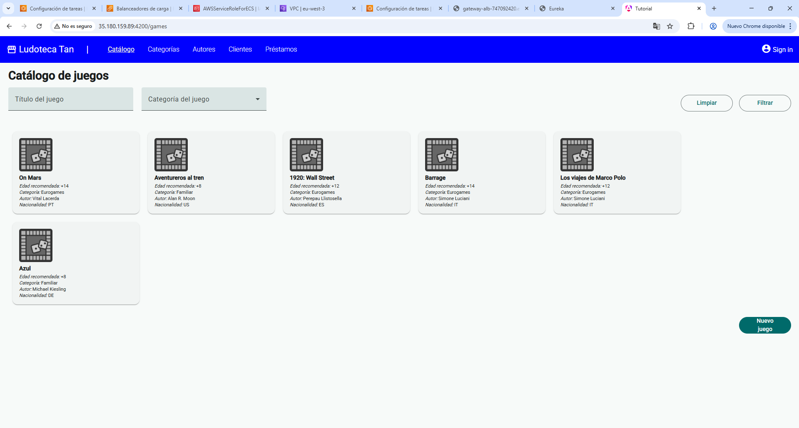
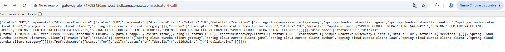
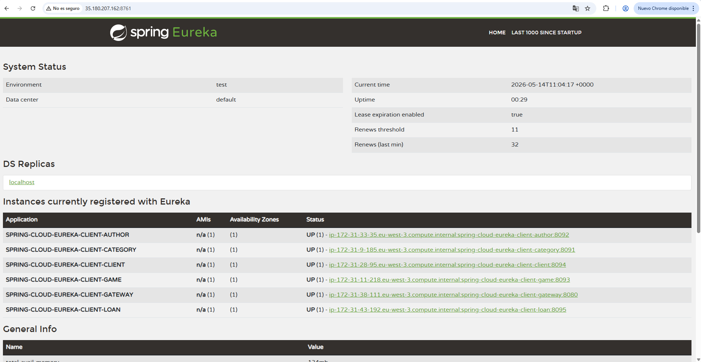

# Despligue en la nube
Para desplegar la aplicacion haremos uso de los servicios de AWS Elastic Cluster Registry (AWS ECR) y Elastic Cluster Service (AWS ECS).

## Que es Elastic Cluster Registry
Amazon Elastic Container Registry (Amazon ECR) es un registro de contenedores completamente administrado que ofrece alojamiento de alto rendimiento, lo que permite utilizar imágenes de aplicaciones y artefactos de forma confiable en cualquier lugar.

ECR nos permite tanto hacer repositorios privados como publicos para poder almacenar las imagenes, en este caso haremos uso de los repositorios privados para almacenar las imagenes de nuestros micro servicios

## Que es Elastic Cluster Service
Amazon ECS es un servicio de orquestación de contenedores completamente administrado que ayuda a implementar, administrar y escalar fácilmente las aplicaciones en contenedores. Se integra profundamente al resto de la plataforma de AWS para proporcionar una solución segura y fácil de utilizar que ejecuta cargas de trabajo con contenedores en la nube.

## Pre-requisitos
En este tutorial, partiremos de la aplicacion con [micro servicios](../springcloud/intro.md), [dockerizada](../docker/installdocker.md) y de [AWS CLI](./cli.md)

## Crear repositorios ECR
Para poder desplegar la aplicacion, primero necesitaremos crear los repositorios en AWS.

El primer paso de todos es autenticar nuestro docker para que pueda acceder a los repositorios para ello ejecutaremos el siguiente comando
```bash
aws ecr get-login-password --region <region> | sudo docker login --username AWS --password-stdin <aws_account_id>.dkr.ecr.<region>.amazonaws.com
```

Ahora, para cada microservicio que queramos almacenar en ECR ejecutaremos los siguientes comandos.

1. Crear la imagen de docker.
```bash
sudo docker build -t image:tag .
``` 

2. Etiquetar la imagen para poder enviarla al repositorio
```bash
sudo docker tag image:tag <aws_account_id>.dkr.ecr.<region>.amazonaws.com/remote-repository:tag
``` 

3. Enviar la imagen al repositorio de AWS.
```bash
sudo docker push <aws_account_id>.dkr.ecr.<region>.amazonaws.com/remote-repository:tag
```

## Despligue de la aplicacion

Para el despliegue de la aplicacion, vamos a crear los ocho servicios en ECS y dos ALB (Application Load Balancer) para el eureka y el gateway.

Antes de crear los servicios necestiamos crear los ALB y el grupo de seguridad, vamos con ello

### Crear grupo de seguridad compartido.

1. Crear el grupo de seguridad que tendrán los ECS
```bash
aws ec2 create-security-group --group-name ecs-microservices-sg --description "Shared SG for ECS microservices communication" --vpc-id <VPC_ID> --region <REGION>
```

2. Autorizar todas las peticiones a cualquier puerto entre los ECS del grupo de seguridad
```bash
aws ec2 authorize-security-group-ingress --group-id <SG_SHARED> --protocol tcp --port 0-65535 --source-group <SG_SHARED> --region <REGION>
```

3. Exponer a internter el puerto del frontend para poder visitar la pagina
```bash
aws ec2 authorize-security-group-ingress --group-id <SG_SHARED> --protocol tcp --port 4200 --cidr 0.0.0.0/0 --region <REGION>
```

4. Exponer a internter el puerto de eureka para debug
```bash
aws ec2 authorize-security-group-ingress --group-id <SG_SHARED> --protocol tcp --port 8761 --cidr 0.0.0.0/0 --region <REGION>
```

### Crear ALB para eureka.

Se crea un ALB para eureka que permitirá a los microservicios acceder a eureka

1. Crear el load balancer
```bash
aws elbv2 create-load-balancer --name eureka-internal-alb --subnets <SUBNET_1> <SUBNET_2> <SUBNET_3> --security-groups <SG_SHARED>
 --scheme internal --type application --ip-address-type ipv4 --region <REGION>
```

2. Crear un target group para detectar si eureka está disponible
```bash
aws elbv2 create-target-group --name eureka-tg --protocol HTTP --port 8761 --vpc-id <VPC_ID> --target-type ip 
--health-check-path "/actuator/health" --health-check-interval-seconds 30 
--health-check-timeout-seconds 5 --healthy-threshold-count 2 --unhealthy-threshold-count 3 --region <REGION>
```

3. Permitir al ALB recibir trafico en el puerto de eureka y redigirilo al target group
```bash
aws elbv2 create-listener --load-balancer-arn <EUREKA_ALB_ARN> --protocol HTTP --port 8761 --default-actions Type=forward,TargetGroupArn=<EUREKA_TG_ARN> --region <REGION>
```

### Crear ALB para gateway.

Se crea un ALB para que el gateway sea accesible desde internet y poder hacer las peticiones desde el frontend al backend

1. Crear un grupo de seguridad
```bash
aws ec2 create-security-group --group-name alb-sg --description "ALB security group" --vpc-id <VPC_ID>
```

2. Permitir el trafico http al puerto 80 desde internet
```bash
aws ec2 authorize-security-group-ingress --group-id <SG_ALB> --protocol tcp --port 80 --cidr 0.0.0.0/0
```

3. Autorizar las peticiones entre el grupo de seguridad del ALB de gateway y entre el grupo de seguridad compartido
```bash
aws ec2 authorize-security-group-ingress --group-id <SG_SHARED> --protocol tcp --port 8080 --source-group <SG_ALB> --region <REGION>
```

4. Crear el load balancer
```bash
aws elbv2 create-load-balancer --name gateway-alb --subnets <SUBNET_1> <SUBNET_2> <SUBNET_3> --security-groups <SG_ALB> --scheme internet-facing --type application --ip-address-type ipv4
```

5. Crear el target group para detectar si el servicio esta funcionando
```bash
aws elbv2 create-target-group --name gateway-tg --protocol HTTP --port 8080 --target-type ip --vpc-id <VPC_ID> --health-check-path /actuator/health --health-check-interval-seconds 30 
--health-check-timeout-seconds 5 --healthy-threshold-count 2 --unhealthy-threshold-count 3 --matcher HttpCode=200 --region <REGION>
```

6. Permitir el acceso publico y enrutar al gateway
```bash
aws elbv2 create-listener --load-balancer-arn <GATEWAY_ALB_ARN> --protocol HTTP --port 80 --default-actions Type=forward,TargetGroupArn=<GATEWAY_TG_ARN>
```

### Crear las tareas y los servicios

Por ultimo, ya solo queda crear las tareas que seran las que se ejecutaran en el ECS

1. Crear el cluster que contendrá todos los servicios de ECS
```bash
aws ecs create-cluster --cluster-name docker-deploy --region <REGION>
```

2. Crear el rol de IAM que ejecutará los ECS
```bash
aws iam create-role --role-name ecs-service-role --assume-role-policy-document '{
  "Version": "2012-10-17",
  "Statement": [
    {
      "Effect": "Allow",
      "Principal": {
        "Service": "ecs.amazonaws.com"
      },
      "Action": "sts:AssumeRole"
    }
  ]
}'

```

3. Asignar el permiso
```bash
aws iam attach-role-policy --role-name ecs-service-role --policy-arn arn:aws:iam::aws:policy/service-role/AmazonECSServiceRolePolicy
```

Ahora para crear cada servicio tendremos que ejecutar estos mismos pasos.

1. Crear el grupo de logs para almacenar en CloudWatch
```bash
aws logs create-log-group --log-group-name /ecs/docker-deploy-<SERVICE> --region <REGION>
```

2. Crear el JSON con la tarea
```json
{
  "family": "docker-deploy-<SERVICE>",
  "containerDefinitions": [
    {
      "name": "Main",
      "image": "<AWS_ACCOUNT_ID>.dkr.ecr.<REGION>.amazonaws.com/<REPOSITORY>:<TAG>",
      "cpu": 2048,
      "memory": 4096,
      "portMappings": [
        {
          "containerPort": <SERVICE_PORT>,
          "protocol": "tcp"
        }
      ],
      "essential": true,
      "environment": [
        {
          "name": "EUREKA_CLIENT_SERVICEURL_DEFAULTZONE",
          "value": "http://<EUREKA_ALB_DNS>:8761/eureka/"
        }
      ],
      "logConfiguration": {
        "logDriver": "awslogs",
        "options": {
          "awslogs-group": "/ecs/docker-deploy-<SERVICE>",
          "awslogs-region": "<REGION>",
          "awslogs-stream-prefix": "ecs"
        }
      },
      "healthCheck": {
        "command": [
          "CMD-SHELL",
          "curl -f http://localhost:<SERVICE_PORT>/actuator/health || exit 1"
        ],
        "interval": 30,
        "timeout": 5,
        "retries": 3,
        "startPeriod": 60
      }
    }
  ],
  "requiresCompatibilities": [
    "FARGATE"
  ],
  "cpu": "2048",
  "memory": "4096",
  "networkMode": "awsvpc",
  "executionRoleArn": "arn:aws:iam::<AWS_ACCOUNT_ID>:role/<EXECUTION_ROLE_NAME>",
  "runtimePlatform": {
    "cpuArchitecture": "X86_64",
    "operatingSystemFamily": "LINUX"
  }
}
```

3. Crear la tarea que ejecutará el servicio
```bash
aws ecs register-task-definition --cli-input-json file://task-ecs.json
```

4. Crear el servicio

    4.1 Para los microservicios
    ```bash
    aws ecs create-service --cluster docker-deploy --service-name <SERVICE> --task-definition <TASK_NAME> --desired-count 1 --launch-type FARGATE 
    --network-configuration "awsvpcConfiguration={subnets=[<SUBNET_1>,<SUBNET_2>,<SUBNET_3>],securityGroups=[<SG_SHARED>],assignPublicIp=ENABLED}"
    ```

    4.2 Para eureka añadir al comando el siguiente flag
    ```bash
    --load-balancers "targetGroupArn=<EUREKA_TG_ARN>,containerName=Main,containerPort=8761"
    ```

    4.3 Para gateway añadir al comando el siguiente flag
    ```bash
    --load-balancers "targetGroupArn=<GATEWAY_TG_ARN>,containerName=Main,containerPort=8080"
    ```

## Demostracion

Una vez realizados todos los pasos podremos acceder tanto al frontend como al gateway como al eureka si asi lo hemos configurado

Frontend: 


Gateway:


Eureka:
