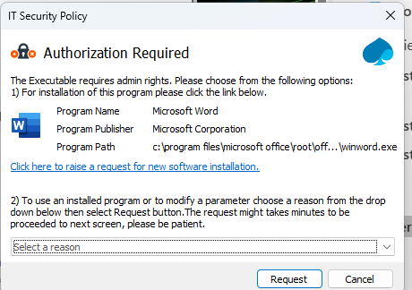
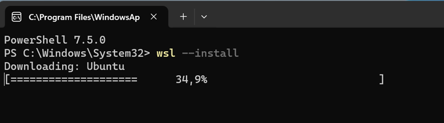
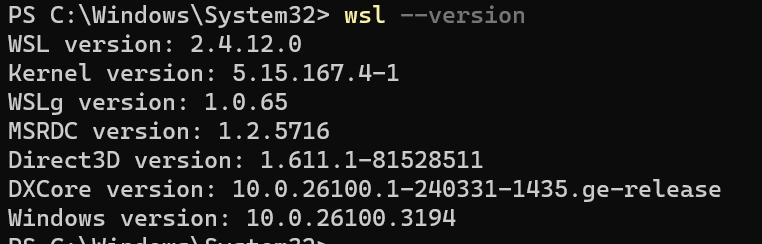
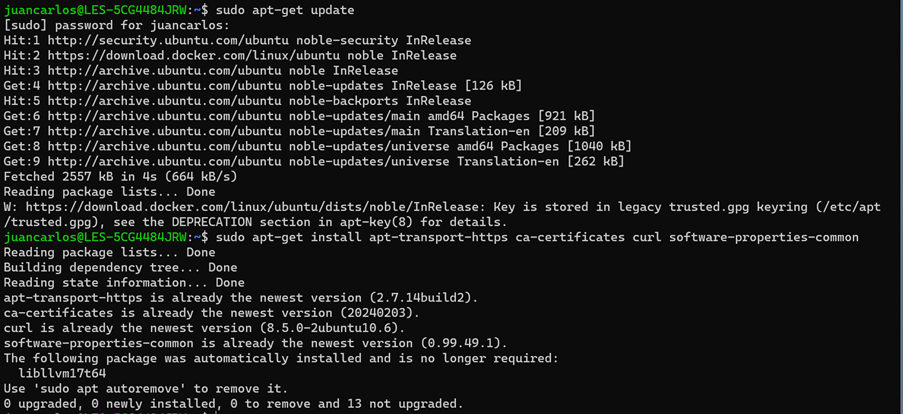
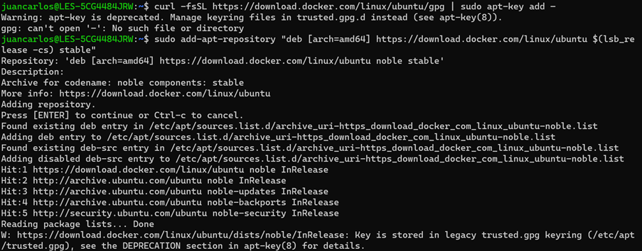
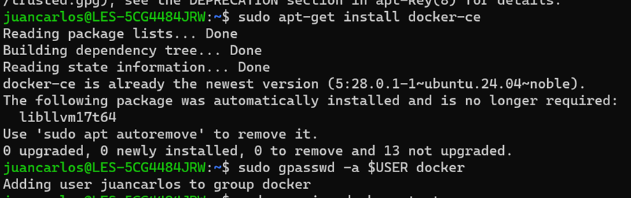
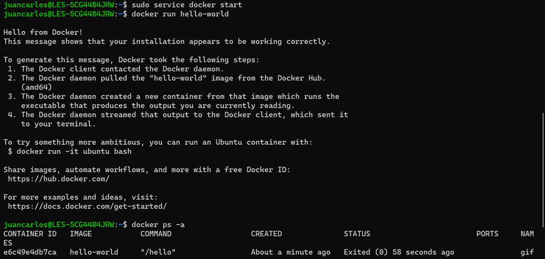

# MÓDULO 1: INSTALACIÓN DOCKER EN WINDOWS

Para instalar la versión gratuita y open source de Docker Community Edition (CE) siga estos pasos:  

1. Instalar Ubuntu 24.04.1 LTS desde Microsoft Store:  
Como no está el WSL, al ejecutar, no funcionará y saldrá un error, pero se solucionará en los pasos siguientes.  

2. Instalar PowerShell desde Microsoft Store.  

3. Instalar el Subsistema de Linux para Windows:  
· Ejecuta el comando `wsl --install`  
· Manda una petición para que te lo instalen. Cuando sea aprobada, debería dejarte continuar.  

  
Ejemplo de lo que os sale, se elige la primera opción  

· Después  
  

4.	Verificar la instalación:  
• Para ver si está instalado, ejecuta `wsl –version`  
  

• Prueba `wsl --status`. Aquí debería indicar que "Windows subsystem for Linux has no installed distributions".  
• Cuando abras Ubuntu, seguramente no funcione. De manera que tienes que reiniciar el PC y comprobar que ahora Ubuntu sí funciona.  

5.	Introducir los siguientes comandos en Ubuntu.  
Si pide un usuario y contraseña, poner la que sea.  

• Más adelante damos unas capturas  
• `sudo apt-get update`  
• `sudo apt-get install apt-transport-https ca-certificates curl software-properties-common`  
• `curl -fsSL https://download.docker.com/linux/ubuntu/gpg | sudo apt-key add –`  
• `sudo add-apt-repository "deb [arch=amd64] https://download.docker.com/linux/ubuntu $(lsb_release -cs) stable”`  
• `sudo apt-get install docker-ce`  
• `sudo gpasswd -a $USER docker`  

En este o en el siguiente paso, te dará error por falta de permisos, no hay problema:  
• Abrir Ubuntu y darle a ejecutar como administrador.  
• Después, tendréis que pedir una solicitud para los permisos.  
• `sudo service docker start`  
• `docker run hello-world`  
  
  
  

6.	Entrar en Ubuntu como administrador:  
• Vuelve a ejecutar en Ubuntu `sudo service docker start`  
• Ejecuta `docker run hello-world`  
  

7.	Verificar Docker:  
• Cuando ejecutes el comando anterior, debería funcionar.  
• Prueba `docker ps -a` para ver un listado de contenedores.  

# MÓDULO 2: ¿QUÉ ES DOCKER?

[Docker](https://www.docker.com/) es una plataforma de contenedorización de código abierto que simplifica el despliegue de aplicaciones empaquetando el software y sus dependencias en una unidad estandarizada llamada contenedor. [A diferencia de las máquinas virtuales tradicionales](https://www.datacamp.com/es/blog/containers-vs-virtual-machines) , los contenedores Docker comparten el núcleo del sistema operativo anfitrión, lo que los hace más eficientes y ligeros.  
Los contenedores garantizan que una aplicación se ejecute de la misma forma en entornos de desarrollo, pruebas y producción. Esto reduce los problemas de compatibilidad y mejora la portabilidad entre varias plataformas. Debido a su flexibilidad y escalabilidad, Docker se ha convertido en una herramienta crucial en los flujos de trabajo modernos de DevOps y desarrollo nativo en la nube.  

# MÓDULO 3: ARQUITECTURA DOCKER

Docker opera en un modelo cliente-servidor, consistiendo en varios componentes clave que trabajan juntos sin problemas.  

### Motor de Docker

En el núcleo de Docker está el Motor de Docker, que incluye:  

**Daemon de Docker**: El servicio de fondo que se ejecuta en el host y gestiona la construcción, ejecución y distribución de contenedores Docker.  
**CLI de Docker**: La interfaz de línea de comandos utilizada para interactuar con el daemon de Docker.  
**API REST**: Permite que aplicaciones remotas interactúen con el daemon de Docker.  

### Componentes de Docker

Docker utiliza varios objetos para construir y ejecutar aplicaciones:  

**Imágenes**: Plantillas de solo lectura utilizadas para crear contenedores.  
**Contenedores**: Instancias ejecutables de imágenes.  
**Networks**: Redes que facilitan la comunicación entre contenedores y el mundo exterior.  
**Volúmenes**: Almacenamiento de datos persistente para contenedores.  

Entender esta arquitectura permite visualizar cómo interactúan los diferentes componentes y ayuda en la resolución de problemas potenciales.  

### Beneficios de la Arquitectura de Docker

**Aislamiento**: Los contenedores se ejecutan en entornos aislados, asegurando consistencia en diferentes sistemas.  
**Portabilidad**: Las imágenes de Docker pueden ejecutarse en cualquier sistema que soporte Docker, independientemente del SO subyacente.  
**Eficiencia**: Los contenedores comparten el kernel del SO host, haciéndolos ligeros en comparación con las VMs tradicionales.  

### Docker Hub

Docker Hub es un servicio de registro basado en la nube donde puedes encontrar y compartir imágenes de contenedores. Es un excelente recurso para principiantes para explorar varias imágenes pre-construidas.

# MÓDULO 4: DOCKER vs VM

<table><tbody>
<tr>
<td><h3 style="text-align:justify" _msttexthash="114777" _msthash="252">Factores</h3></td>
<td><h3 style="text-align:center" _msttexthash="133939" _msthash="253">Docker</h3></td>
<td><h3 style="text-align:center" _msttexthash="278122" _msthash="254">Máquina virtual</h3></td>
</tr>
<tr>
<td><h4 style="text-align:justify" _msttexthash="115232" _msthash="255">Arranque</h4></td>
<td><p style="text-align:justify" _msttexthash="293124" _msthash="256">En segundos</p></td>
<td><p style="text-align:justify" _msttexthash="268034" _msthash="257">En minutos</p></td>
</tr>
<tr>
<td><h4 style="text-align:justify" _msttexthash="253240" _msthash="258">Disponibilidad</h4></td>
<td><p style="text-align:justify" _msttexthash="3301896" _msthash="259">Los contenedores docker preconstruidos están fácilmente disponibles</p></td>
<td><p style="text-align:justify" _msttexthash="2881788" _msthash="260">Las máquinas virtuales listas para usar son difíciles de encontrar</p></td>
</tr>
<tr>
<td><h4 style="text-align:justify" _msttexthash="97760" _msthash="261">Recursos</h4></td>
<td><p style="text-align:justify" _msttexthash="396292" _msthash="262">Menor uso de recursos</p></td>
<td><p style="text-align:justify" _msttexthash="341861" _msthash="263">Más uso de recursos</p></td>
</tr>
<tr><td><h4 style="text-align:justify" _msttexthash="257335" _msthash="264">Almacenamiento</h4></td>
<td><p style="text-align:justify" _msttexthash="970242" _msthash="265">Los contenedores son algo más ligeros (KBs/MBs)</p></td>
<td><p style="text-align:justify" _msttexthash="1286155" _msthash="266">Las máquinas virtuales tienen unos pocos GB</p></td>
</tr>
<tr><td><h4 style="text-align:justify" _msttexthash="325702" _msthash="267">Sistema operativo</h4></td>
<td><p style="text-align:justify" _msttexthash="1901952" _msthash="268">Cada contenedor puede compartir el sistema operativo</p></td>
<td><p style="text-align:justify" _msttexthash="2542735" _msthash="269">Cada máquina virtual tiene un sistema operativo independiente</p></td>
</tr>
<tr>
<td><h4 style="text-align:justify" _msttexthash="131885" _msthash="270">Movilidad</h4></td>
<td><p style="text-align:justify" _msttexthash="2890849" _msthash="271">Los contenedores se destruyen y se vuelven a crear en lugar de moverse</p></td>
<td><p style="text-align:justify" _msttexthash="2735499" _msthash="272">Las máquinas virtuales pueden moverse a nuevos hosts fácilmente</p></td>
</tr>
<tr>
<td><h4 style="text-align:justify" _msttexthash="178659" _msthash="273">Se ejecuta en</h4></td>
<td><p style="text-align:justify" _msttexthash="1379053" _msthash="274">Los dockers hacen uso del motor de ejecución.</p></td>
<td><p style="text-align:justify" _msttexthash="1604668" _msthash="275">Las máquinas virtuales hacen uso del hipervisor.</p></td>
</tr>
<tr>
<td><h4 style="text-align:justify" _msttexthash="32682" _msthash="276">Uso</h4></td>
<td><p style="text-align:justify" _msttexthash="7361263" _msthash="277">Docker tiene un medio de operación complejo que se compone de herramientas de terceros y administradas por Docker.</p></td>
<td><p style="text-align:justify" _msttexthash="2657720" _msthash="278">Las herramientas son más sencillas de trabajar y fáciles de usar.</p></td>
</tr>
<tr>
<td><h4 style="text-align:justify" _msttexthash="130247" _msthash="279">Gestión</h4></td>
<td><p style="text-align:justify" _msttexthash="3090880" _msthash="280">Los contenedores dejan de funcionar con la ejecución del "comando stop"</p></td>
<td><p style="text-align:justify" _msttexthash="4096976" _msthash="281">Las máquinas virtuales siempre están en el estado de ejecución de funcionamiento</p></td>
</tr>
<tr>
<td><h4 style="text-align:justify" _msttexthash="137345" _msthash="282">Control</h4></td>
<td><p style="text-align:justify" _msttexthash="6379035" _msthash="283">Las imágenes pueden ser interpretation controlled; tienen un registro original llamado Docker Hub.</p></td>
<td><p style="text-align:justify" _msttexthash="5691816" _msthash="284">La VM no tiene un hub central; no están controlados</p></td>
</tr>
<tr>
<td><h4><strong _msttexthash="338871" _msthash="285">Gestión de memoria</strong></h4></td>
<td _msttexthash="684879" _msthash="286">Es más eficiente en la memoria.</td>
<td _msttexthash="760643" _msthash="287">Es menos eficiente en la memoria.</td>
</tr>
<tr>
<td><h4><strong _msttexthash="181441" _msthash="288">Aislamiento</strong></h4></td>
<td _msttexthash="3902236" _msthash="289">No dispone de un sistema de aislamiento, por lo que es muy propenso a los problemas.</td>
<td _msttexthash="1621035" _msthash="290">Cuenta con un eficiente mecanismo de aislamiento.</td>
</tr>
<tr>
<td><h4><strong _msttexthash="44044" _msthash="291">Tiempo</strong></h4></td>
<td _msttexthash="4661605" _msthash="292">Es fácil de implementar y lleva menos tiempo en comparación con las máquinas virtuales.</td>
<td _msttexthash="4053491" _msthash="293">Es un proceso largo. Por lo tanto, se necesita mucho tiempo para la implementación.</td>
</tr>
<tr>
<td><h4><strong _msttexthash="255333" _msthash="294">Facilidad de uso</strong></h4></td>
<td _msttexthash="2320656" _msthash="295">Es un poco difícil de usar debido al complejo mecanismo de uso.</td>
<td _msttexthash="258674" _msthash="296">Es fácil de usar.</td>
</tr>
</tbody>
</table>

# MÓDULO 5: IMÁGENES DOCKER, DOCKERFILE

Las imágenes Docker son los bloques de construcción fundamentales de los contenedores. Son plantillas inmutables, de sólo lectura, que contienen todo lo necesario para ejecutar una aplicación, incluido el sistema operativo, el código de la aplicación, el tiempo de ejecución y las dependencias.  

Las imágenes se construyen utilizando un Dockerfile, que define las instrucciones para crear una imagen capa a capa.  

Las imágenes pueden almacenarse y recuperarse de registros de contenedores como Docker Hub.  

Aquí tienes algunos comandos de ejemplo para trabajar con imágenes:  

`docker build -t tu-nombre-de-imagen .`: Genera una imagen y le da un nombre.  
`docker image ls`: Lista todas las imágenes disponibles en la máquina local.  
`docker pull nginx`: Obtén la última imagen de Nginx de Docker Hub.  
`docker rmi -f nginx`: Eliminar una imagen de la máquina local (forzado).  

# MÓDULO 6: CONTENEDORES DOCKER

Un contenedor Docker es una instancia en ejecución de una imagen Docker. Cada contenedor tiene su propio sistema de archivos, red y espacio de procesos, pero comparte el núcleo anfitrión.  

Los contenedores siguen un ciclo de vida sencillo que incluye su creación, inicio, parada y eliminación. Aquí tienes un desglose de los comandos comunes de gestión de contenedores:  

`docker create` o `docker run`: Crear un contenedor.  
`docker start`: Poner en marcha un contenedor.  
`docker stop`: Detener un contenedor.  
`docker restart`: Reiniciar un contenedor.  
`docker rm`: Borrar un contenedor.  
`docker ps -a`: Listar todos los contenedores.  

# MÓDULO 7:  HANDS-ON. ¡AHORA HAZLO TÚ!

Ahora vamos a construir imágenes de servicios y sobre estas imágenes lanzaremos contenedores en el entorno local del desarrollador.  

Teniendo ya instalados WSL, Docker Community y Docker Compose nos centramos en la parte práctica.  

### Construir imágenes con un Dockerfile

Empezamos creando una imágen por cada servicio de nuestra aplicación básica en microservicios basada en un backend con Spring Boot.  

Cada servicio requiere un fichero propio de nombre Dockerfile sin extensión, que queda situado en el directorio raíz del módulo y al mismo nivel que el fichero POM.  

Para el proyecto `server-springboot-micros` y módulo `server-springboot-eureka` un posible Dockerfile sería:  

```
# Use the official Ubuntu 22.04 LTS base image
FROM ubuntu:22.04

# Install necessary packages
RUN apt-get update && apt-get install -y \
openjdk-19-jdk \
maven \
wget \
curl \
gnupg \
&& rm -rf /var/lib/apt/lists/*

# Set the working directory
WORKDIR /app

# Copy the project files to the container
COPY . .

# Build the project using Maven
RUN mvn clean package

# Expose the application port
EXPOSE 8761

# Run the Spring Boot application
CMD ["java", "-jar", "target/tutorial-eureka-0.0.1-SNAPSHOT.jar"]
```
Es un script básico para el service discovery de ejemplo, donde los comentarios de código nos dan las explicaciones debidas.  

Para un módulo de reglas de negocio del mismo proyecto, su correspondiente Dockerfile básico podría ser:  

```
# Use the official Ubuntu 22.04 LTS base image
FROM ubuntu:22.04

# Install necessary packages
RUN apt-get update && apt-get install -y \
    openjdk-19-jdk \
    maven \
    wget \
    curl \
    gnupg \
    && rm -rf /var/lib/apt/lists/*

# Set the working directory
WORKDIR /app

# Copy the project files to the container
COPY . .

# Build the project using Maven
RUN mvn clean package

# Expose the application port
EXPOSE 8092

# Run the Spring Boot application
CMD ["java", "-jar", "target/tutorial-author-0.0.1-SNAPSHOT.jar"]
```
Y de forma parecida el resto de los módulos del backend.  

Para el frontend, tomar en esta práctica el módulo `client-angular17` cuyo Dockerfile básico podría ser:  

```
# Use the official Node.js image as the base image
FROM node:18

# Set the working directory inside the container
WORKDIR /usr/src/app

# Install Angular CLI globally
RUN npm install -g @angular/cli@17

# Copy package.json and package-lock.json to the working directory
COPY package*.json ./

# Install project dependencies
RUN npm install

# Copy the rest of the application code to the working directory
COPY . .

# Expose the port the app runs on
EXPOSE 4200

# Command to run the application in development mode
CMD ["ng", "serve", "--host", "0.0.0.0"]
```

### Desplegar una imagen dentro de un contenedor

Teniendo en local las instalaciones hechas, no representa problema alguno, por ejemplo, para el caso del servicio eureka:  

```
docker build -t i-tutorial-eureka .
docker run -d -p 8761:8761 --name c-tutorial-eureka i-tutorial-eureka

docker logs cca-c-tutorial-eureka
docker stop cca-c-tutorial-eureka
docker start cca-c-tutorial-eureka
docker rm cca-c-tutorial-eureka
```

que hace lo siguiente:
1. desde terminal situado en la raíz del módulo junto al Dockerfile del servicio, primero creamos la imagen `i-tutorial-eureka`,
2. lanzamos la creación de su correspondiente contenedor de nombre `c-tutorial-eureka` y su ejecución detached.  
3. Por último, damos unos comandos para inspeccionar su log, pararlo, arrancarlo, eliminarlo cuando dejemos de necesitarlo.  

En el laptop corporativo, puede ocurrir que el build se detenga por timeout cuando descargue la imagen del SO. En tal caso revise el estado de su VPN.  

Las imágenes y contenedores son ligeros para un servidor, pero no para un laptop corporativo, elimine los recursos que no esté usando para no saturar su equipo.  

### Desplegar un conjunto de contenedores que se comunican


