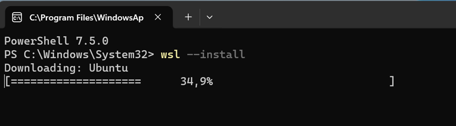
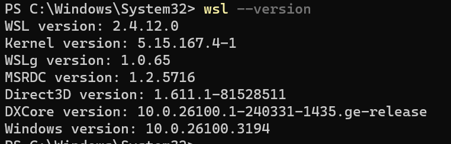
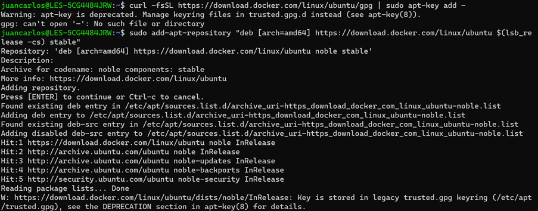
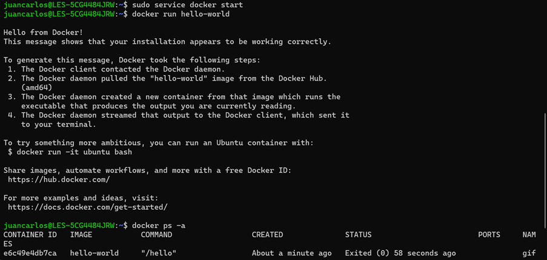

# MÓDULO 1: INSTALACIÓN DOCKER EN WINDOWS

Para instalar la versión gratuita y open source de Docker Community Edition (CE) siga estos pasos:  

1. Instalar Ubuntu 24.04.1 LTS desde Microsoft Store:  
Como no está el WSL, al ejecutar, no funcionará y saldrá un error, pero se solucionará en los pasos siguientes.
2. Instalar PowerShell desde Microsoft Store.
3. Instalar el Subsistema de Linux para Windows:  
* Ejecuta el comando `wsl --install`  
* Manda una petición para que te lo instalen. Cuando sea aprobada, debería dejarte continuar.  
  
Ejemplo de lo que os sale, se elige la primera opción
* Después  
  

4.	Verificar la instalación:  
* Para ver si está instalado, ejecuta `wsl –version` (es posible que necesites reiniciar el ordenador)
  

* Prueba `wsl --status`. Aquí debería indicar que "Windows subsystem for Linux has no installed distributions".  
* Cuando abras Ubuntu, seguramente no funcione. De manera que tienes que reiniciar el PC y comprobar que ahora Ubuntu sí funciona.  

5.	Introducir los siguientes comandos en Ubuntu.  
* Si pide un usuario y contraseña, poner la vuestra propia.  

* Podéis continuar con estos comandos:  
```
sudo apt update
sudo apt install curl apt-transport-https ca-certificates software-properties-common
sudo apt install docker.io -y
curl -fsSL https://download.docker.com/linux/ubuntu/gpg | sudo gpg --dearmor -o /usr/share/keyrings/docker-archive-keyring.gpg
echo "deb [arch=$(dpkg --print-architecture) signed-by=/usr/share/keyrings/docker-archive-keyring.gpg] https://download.docker.com/linux/ubuntu $(lsb_release -cs) stable" | sudo tee /etc/apt/sources.list.d/docker.list > /dev/null
sudo apt update
sudo apt-get install docker-ce docker-ce-cli containerd.io docker-buildx-plugin docker-compose-plugin
sudo systemctl start docker  
##? gpasswd -a $USER docker  
sudo docker run hello-world
```

* En este o en el siguiente paso, te dará error por falta de permisos, no hay problema.  
* Abrir Ubuntu y darle a ejecutar como administrador.  
* Después, tendréis que pedir una solicitud para los permisos.  
`sudo systemctl start docker`  
`sudo docker run hello-world`  
  
  
  

6.	Entrar en Ubuntu como administrador:  
* Vuelve a ejecutar en Ubuntu `sudo service docker start`  
* Ejecuta `docker run hello-world`  
  

7.	Verificar Docker:  
* Cuando ejecutes el comando anterior, debería funcionar.  
* Prueba `docker ps -a` para ver un listado de contenedores.  