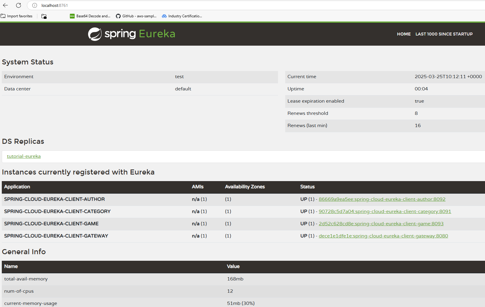
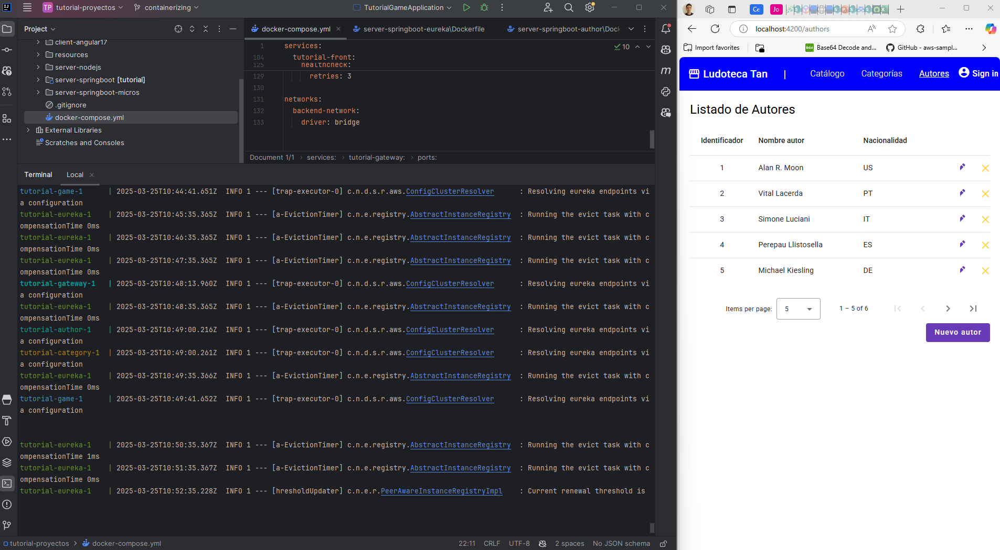

# MÓDULO 7:  HANDS-ON. ¡AHORA HAZLO TÚ!

Ahora vamos a construir imágenes de servicios y sobre estas imágenes lanzaremos contenedores en el entorno local del desarrollador.  

Teniendo ya instalados WSL, Docker Community y Docker Compose nos centramos en la parte práctica.  

### Construir imágenes con un Dockerfile

Empezamos creando una imágen por cada servicio de nuestra aplicación básica en microservicios basada en un backend con Spring Boot.  

Cada servicio requiere un fichero propio de nombre Dockerfile sin extensión, que queda situado en el directorio raíz del módulo y al mismo nivel que el fichero POM.  

Para el proyecto `server-springboot-micros` y módulo `server-springboot-eureka` un posible Dockerfile sería:  

```
# Use the official Ubuntu 22.04 LTS base image
FROM ubuntu:22.04

# Install necessary packages
RUN apt-get update && apt-get install -y \
openjdk-19-jdk \
maven \
wget \
curl \
gnupg \
&& rm -rf /var/lib/apt/lists/*

# Set the working directory
WORKDIR /app

# Copy the project files to the container
COPY . .

# Build the project using Maven
RUN mvn clean package

# Expose the application port
EXPOSE 8761

# Run the Spring Boot application
CMD ["java", "-jar", "target/tutorial-eureka-0.0.1-SNAPSHOT.jar"]
```
Es un script básico para el service discovery de ejemplo, donde los comentarios de código nos dan las explicaciones debidas.  

Para un módulo de reglas de negocio del mismo proyecto, su correspondiente Dockerfile básico podría ser:  

```
# Use the official Ubuntu 22.04 LTS base image
FROM ubuntu:22.04

# Install necessary packages
RUN apt-get update && apt-get install -y \
    openjdk-19-jdk \
    maven \
    wget \
    curl \
    gnupg \
    && rm -rf /var/lib/apt/lists/*

# Set the working directory
WORKDIR /app

# Copy the project files to the container
COPY . .

# Build the project using Maven
RUN mvn clean package

# Expose the application port
EXPOSE 8092

# Run the Spring Boot application
CMD ["java", "-jar", "target/tutorial-author-0.0.1-SNAPSHOT.jar"]
```
Y de forma parecida el resto de los módulos del backend.  

Para el frontend, tomar en esta práctica el módulo `client-angular17` cuyo Dockerfile básico podría ser:  

```
# Use the official Node.js image as the base image
FROM node:18

# Set the working directory inside the container
WORKDIR /usr/src/app

# Install Angular CLI globally
RUN npm install -g @angular/cli@17

# Copy package.json and package-lock.json to the working directory
COPY package*.json ./

# Install project dependencies
RUN npm install

# Copy the rest of the application code to the working directory
COPY . .

# Expose the port the app runs on
EXPOSE 4200

# Command to run the application in development mode
CMD ["ng", "serve", "--host", "0.0.0.0"]
```

### Desplegar una imagen dentro de un contenedor

Teniendo en local las instalaciones hechas, no representa problema alguno, por ejemplo, para el caso del servicio eureka:  

```
docker build -t i-tutorial-eureka .
docker run -d -p 8761:8761 --name c-tutorial-eureka i-tutorial-eureka

docker logs cca-c-tutorial-eureka
docker stop cca-c-tutorial-eureka
docker start cca-c-tutorial-eureka
docker rm cca-c-tutorial-eureka
```

que hace lo siguiente:  
1. desde terminal situado en la raíz del módulo junto al Dockerfile del servicio, primero creamos la imagen `i-tutorial-eureka`,
2. lanzamos la creación de su correspondiente contenedor de nombre `c-tutorial-eureka` y su ejecución detached.  
3. Por último, damos unos comandos para inspeccionar su log, pararlo, arrancarlo, eliminarlo cuando dejemos de necesitarlo.  

En el laptop corporativo, puede ocurrir que el build se detenga por timeout cuando descargue la imagen del SO. En tal caso, revise el estado de su VPN.  

Las imágenes y contenedores son ligeros para un servidor, pero no para un laptop corporativo, elimine los recursos que no esté usando para no saturar su equipo.  

  

### Desplegar un conjunto de contenedores que se comunican

En lo sucesivo notar que en este tutorial estamos usando Version: 28.0.2 de Docker Community y Docker Compose version v2.34.0  

Básicamente, si solo utilizamos módulos de negocio, cada uno en su Dockerfile correspondiente, no tenemos garantizado que todos ellos puedan comunicarse entre sí en la forma deseada.  

Además de querer tener componentes separados que sean escalables, queremos asegurarnos de que los módulos puedan hablarse entre ellos, si deben hacerlo.  

Otro requerimiento que tenemos en este proyecto simple, es la necesidad de arrancar unos servicios antes que otros, por ejemplo: el service discovery debe iniciar primero, segundo el gateway, y luego el resto de los módulos con lógica de negocio. Por último, si todos han arrancado bien y están perfectamente up, arrancamos el frontend.  

Para lograr estas necesidades, por otra parte, muy comunes en los proyectos basados en microservicios, tenemos disponible la herramienta docker-compose.  

docker-compose permite lanzar en un solo script todos los servicios/contenedores estableciendo el orden deseado de arranque y ejecución, así como, la configuración de un network donde declarar qué módulos pueden hablar entre sí.  

Para el caso de nuestro proyecto:  
```
docker network create backend-network
docker compose up --build

docker network ls
docker compose ps
docker compose down
```
Primero creamos una red donde puedan comunicarse los contenedores que deben comunicarse entre sí.  
Luego, en un comando ordenamos la interpretación del script docker-compose.yml situado en la raíz del proyecto general, seguido del build de todas las imágenes declaradas, seguido del arranque en el orden dado, seguido del establecimiento de las comunicaciones declaradas, seguido del respaldo de los latidos solicitados.  
El resto son sencillos comandos para ver el estado de la red, de los contenedores, y para desarmar todos los contenedores pertenecientes al compose cuando dejemos de necesitarlos.  

A continuación damos un posible docker-compose.yml de ejemplo, sigue siendo básico (aunque ya no tanto):  
```
services:
  tutorial-eureka:
    build:
      context: ./server-springboot-micros/server-springboot-eureka
      dockerfile: Dockerfile
    ports:
      - "8761:8761"
    networks:
      - backend-network
    environment:
      eureka.client.serviceUrl.defaultZone: http://tutorial-eureka:8761/eureka/
    healthcheck:
      test: "curl -f http://tutorial-eureka:8761/actuator/health || exit 1"
      interval: 40s
      timeout: 10s
      retries: 3

  tutorial-gateway:
    build:
      context: ./server-springboot-micros/server-springbbot-gateway
      dockerfile: Dockerfile
    ports:
      - "8080:8080"
    networks:
      - backend-network
    depends_on:
      tutorial-eureka:
        condition: service_healthy
    environment:
      eureka.client.serviceUrl.defaultZone: http://tutorial-eureka:8761/eureka/
    healthcheck:
      test: "curl -f http://tutorial-gateway:8080/actuator/health || exit 1"
      interval: 40s
      timeout: 10s
      retries: 3

  tutorial-category:
    build:
      context: ./server-springboot-micros/server-springboot-category
      dockerfile: Dockerfile
    ports:
      - "8091:8091"
    networks:
      - backend-network
    depends_on:
      tutorial-eureka:
        condition: service_healthy
      tutorial-gateway:
        condition: service_healthy
    environment:
      eureka.client.serviceUrl.defaultZone: http://tutorial-eureka:8761/eureka/
    healthcheck:
      test: "curl -f http://tutorial-category:8091/actuator/health || exit 1"
      interval: 40s
      timeout: 10s
      retries: 3

  tutorial-author:
    build:
      context: ./server-springboot-micros/server-springboot-author
      dockerfile: Dockerfile
    ports:
      - "8092:8092"
    networks:
      - backend-network
    depends_on:
      tutorial-eureka:
        condition: service_healthy
      tutorial-gateway:
        condition: service_healthy
    environment:
      eureka.client.serviceUrl.defaultZone: http://tutorial-eureka:8761/eureka/
    healthcheck:
      test: "curl -f http://tutorial-author:8092/actuator/health || exit 1"
      interval: 40s
      timeout: 10s
      retries: 3

  tutorial-game:
    build:
      context: ./server-springboot-micros/server-springboot-game
      dockerfile: Dockerfile
    ports:
      - "8093:8093"
    networks:
      - backend-network
    depends_on:
      tutorial-eureka:
        condition: service_healthy
      tutorial-gateway:
        condition: service_healthy
      tutorial-category:
        condition: service_healthy
      tutorial-author:
        condition: service_healthy
    environment:
      eureka.client.serviceUrl.defaultZone: http://tutorial-eureka:8761/eureka/
    healthcheck:
      test: "curl -f http://tutorial-game:8093/actuator/health || exit 1"
      interval: 40s
      timeout: 10s
      retries: 3

  tutorial-front:
    build:
      context: ./client-angular17
      dockerfile: Dockerfile
    ports:
      - "4200:4200"
    networks:
      - backend-network
    depends_on:
      tutorial-eureka:
        condition: service_healthy
      tutorial-gateway:
        condition: service_healthy
      tutorial-category:
        condition: service_healthy
      tutorial-author:
        condition: service_healthy
      tutorial-game:
        condition: service_healthy
    environment:
      eureka.client.serviceUrl.defaultZone: http://tutorial-eureka:8761/eureka/
    healthcheck:
      test: "curl -f http://tutorial-front:4200/actuator/health || exit 1"
      interval: 40s
      timeout: 10s
      retries: 3

networks:
  backend-network:
    driver: bridge
```
Para lograr la orquestación/sincronización/comunicación deseada es mejor que todo esté en su sitio con el orden debido.  

  

### TODO y practicar

Como práctica, queremos duplicar nuestro frontend básico de manera que tengamos dos portales muy similares pero distintos.  

Es decir, que el Front1 ejecute en un contenedor y el Front2 ejecute en otro contenedor.  

Además, ambos frontales se comunican con el mismo backend, el nuestro.  

Crea agentes "cliente" que solo accedan a uno de los frontales, crea un agente "admin" que acceda a la network que agrupa al resto de networks.  

Sugerencia: crea tres networks, una para los frontales, otra para el backend, y una tercera que agrupe las dos anteriores.  
