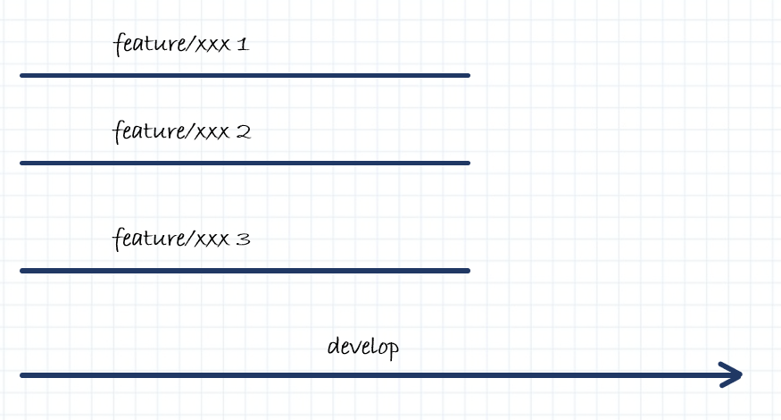
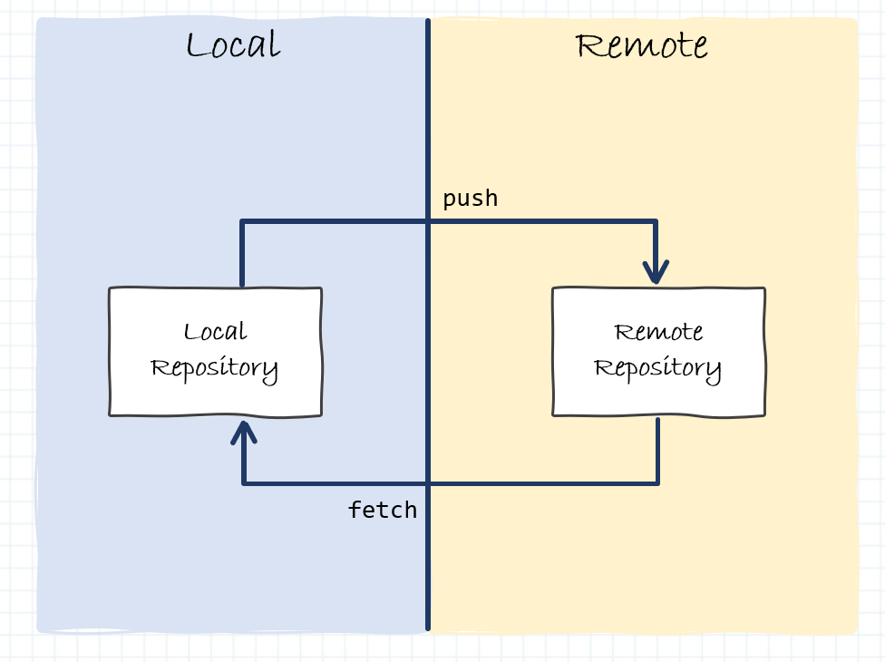

# Tutorial básico de Git

Cada vez se tiende más a utilizar repositorios de código Git y, aunque no sea objeto de este tutorial Springboot-Angular, queremos hacer un resumen muy básico y sencillo de como utilizar Git.

En el mercado existen multitud de herramientas para gestionar repositorios Git, podemos utilizar cualquiera de ellas, aunque desde devonfw se recomienda utilizar [Git SCM](https://git-scm.com/download/win).
Además, existen también multitud de servidores de código que implementan repositorios Git, como podrían ser GitHub, GitLab, Bitbucket, etc. Todos ellos trabajan de la misma forma, así que este resumen servirá para todos ellos.

!!!tip "Info"
    Este anexo muestra un resumen muy sencillo y básico de los comandos más comunes que se utilizan en Git. Para ver detalles más avanzados o un tutorial completo te recomiendo que leas la guia de [Atlassian](https://www.atlassian.com/es/git).


## Funcionamiento básico

Existen dos conceptos en Git que debes tener muy claros: las ramas y los repositorios. Vamos a ver como funciona cada uno de ellos.

### Ramas

Por un lado tenemos las `ramas` de Git. El repositorio puede tener tantas ramas como se quiera, pero por lo general debe existir una rama maestra a menudo llamada **develop** o **master**, y luego muchas ramas con cada una de las funcionalidades desarrolladas.



Las ramas **siempre** se deben crear a partir de una rama (en el ejemplo llamaremos *develop*), con una foto concreta y determinada de esa rama. Esta rama deberá tener un nombre que describa lo que va a contener esa rama (en el ejemplo *feature/xxx*). Y por lo general, esa rama se `mergeará` con otra rama del repositorio, que puede ser la rama de origen o cualquier otra (en el ejemplo será con la rama origen *develop*).

Así pues, podemos tener algo así:


Las acciones de crear ramas y mergear ramas están explicadas más abajo. En este punto solo es necesario que seas conocedor de:

* existen ramas maestras --> que contienen el código completo de la aplicación
* existen ramas de desarrollo --> que generalmente se crean de una rama maestra en un punto temporal concreto
* en algún momento esas ramas de desarrollo se deben mergear en una rama maestra
* **ojo cuidado**, cuando hay varias personas en el equipo trabajando, habrán varias ramas de desarrollo que nazcan de diferentes puntos temporales y que habrá que tener en cuenta para posibles conflictos. Recuerda que no estás solo programando, hay más gente modificando el código.


### Repositorios

El otro concepto que debe queda claro, es el de repositorios. Por defecto, en Git, se trabaja con el repositorio local, en el que puedes crear ramas, modificar código, mergear, etc. pero todos esos cambios que se hagan, serán todos en local, nadie más tendrá acceso.

También existe el repositorio remoto, también llamado `origin`. Este repositorio es el que todos los integrantes del equipo utilizan como referencia. Existen acciones de Git que permite sincronizar los repositorios.



En este punto solo es necesario que seas conocedor de:

* Los cambios que realices en local (en tu repositorio local) solo serán visibles por ti. Puedes crear ramas y borrarlas, pero solo tu las verás.
* Los cambios que se suban al repositorio remoto serán visibles para todos. Pueden haber ramas protegidas para que no se puedan modificar desde el equipo, típicamente las ramas maestras. Estas ramas solo pueden modificarse previa validación y `pull request` o `merge request` (depende de la aplicación usada para Git).
* Existen acciones que permiten subir tus cambios de local a remoto. Recuerda que pueden existir ramas protegidas.
* Existen acciones que permiten actualizar tus ramas locales con los cambios remotos.
* Recuerda que no trabajas solo, es posible que tu repositorio local **no** esté sincronizado, tus compañeros han podido subir código y deberías sincronizarte frecuentemente.


### Acciones más típicas

En la [Guía rápida](./git.md#guia-rapida) puedes ver más detalle de estas acciones pero por lo general:

* Lo primero es descargarse una copia del repositorio con todas sus ramas. Se descargaría de remoto a local. A partir de este momento se trabaja en local.
* Cada nueva funcionalidad debería tener su rama asociada, por tanto, lo lógico es crear una rama de desarrollo (típicamente *feature/xxx*) a partir de una rama maestra (típicamente *develop* o *master*).
* Se trabajaría de forma local con esa rama. Es buena práctica que si llevas mucho tiempo con la rama creada, de vez en cuando, sincronices tu repositorio local con lo que exista en el repositorio remoto. Además, como es posible que la rama maestra de la que partía haya cambiado, esos cambios deberías llevarlos también a tu rama en desarrollo. Con esto consigues que tu punto temporal sea más moderno y tengas menos conflictos. Recuerda que no estás solo trabajando.
* Cuando lo tengas listo y antes de subir nada, deberías realizar una última sincronización de remoto a local. Después deberías hacer un merge de tus ramas locales de desarrollo con las ramas maestras locales de las que partieron, por los posibles cambios que alguien hubiera podido subir.
* Por último, una vez tengas todo actualizado, ya puedes subir el código al repositorio remoto (tu rama de desarrollo), y solicitar un `pull request` o `merge request` contra la rama maestra que quieras modificar.
* Alguien, diferente a ti, debe revisar esa solicitud y aprobarla antes de que se realice todo el merge correcto en remoto. Y vuelta a empezar.


## Funcionamiento avanzado

A continuación vamos a describir estos mismos conceptos y acciones que hemos visto, pero más en profundidad para que veas como trabaja internamente Git. No es necesario que leas este punto, aunque es recomendable.


### Estructuras y flujo de trabajo

Lo primero que debes conocer de Git es su funcionamiento básico de flujo de trabajo. Tu repositorio local está compuesto por tres "estructuras" que contienen los archivos y los cambios de los ficheros del repositorio. 


- **Working directory** - Contiene los archivos con los que estás trabajando localmente.
- **Staging Area** - Es un área intermedia donde vamos añadiendo ficheros para ir agrupando modificaciones.
- **Local Repository** - Es el repositorio local donde tendrémos el registro de todos los commits que hemos realizado. Por defecto apunta a HEAD que es el último commit registrado.

Existen operaciones que nos permiten añadir o borrar ficheros dentro de cada una de las estructuras desde otra estructura.


Así pues, los comandos básicos dentro de nuestro repositorio local son los siguientes.

#### **add y commmit**

Puedes registrar los cambios realizados en tu `working directory` y añadirlos al `staging area` usando el comando

```
git add <filename>
```
    o si quieres añadir todos los ficheros modificados
```
git add .
```

Este es el primer paso en el flujo de trabajo básico. Una vez tenemos los cambios registrados en el `staging area` podemos hacer un commit y persistirlos dentro del `local repository` mediante el comando

```
git commit -m "<Commit message>"
```

A partir de ese momento, los ficheros modificados y añadidos al `local repository` se han persistido y se han añadido a tu `HEAD`, aunque todavía siguen estando el local, no lo has enviado a ningún repositorio remoto.


#### **reset**

De la misma manera que se han añadido ficheros a `staging area` o a `local repository`, podemos retirarlos de estas estructuras y volver a recuperar los ficheros que teníamos anteriormente en el `working directory`. Por ejemplo, si nos hemos equivocado al incluir ficheros en un commit o simplemente queremos deshacer los cambios que hemos realizado bastaría con lanzar el comando

```
git reset --hard
```
    o si queremos volver a un commit concreto
```
git reset <COMMIT>
```


### Trabajo con ramas

Para complicarlo todo un poco más, el trabajo con git siempre se realiza mediante ramas. Estas ramas nos sirven para desarrollar funcionalidades aisladas unas de otras y poder hacer mezclas de código de unas ramas a otras. Las ramas más comunes dentro de git suelen ser:

- **master** Esta será la rama que contenga el código fuente que tenemos en **`producción`**.
- **release** Esta será la rama que contenga el código fuente de cada una de las entregas parciales, no tiene porqué coincidir con la rama `master`.
- **develop** Esta será la rama que contenga el código fuente estable que está actualmente en desarrollo.
- **feature/xxxx** Estas seránn la rama que contengan el código fuente de desarrollo de cada una de las funcionalidades. Generalmente estas ramas las crea cada desarrollador, las mantiene en local, hasta que las sube a remoto para realizar un `merge` a la rama `develop`.

Siempre que trabajes con ramas debes tener en cuenta que al empezar tu desarrollo debes partir de una versión actualizada de la rama `develop`, y al terminar tu desarrollo debes solicitar un `merge` contra `develop`, para que tu funcionalidad esté incorporada en la rama de desarrollo.


#### Crear ramas

Crear ramas en local es tan sencillo como ejecutar este comando:
    
```
git checkout -b <NOMBRE_RAMA>
```

Eso nos creará una rama con el nombre que le hayamos dicho y moverá el `Working Directory` a dicha rama.


#### Cambiar de rama

Para cambiar de una rama a otra en local tan solo debemos ejecutar el comando:
    
```
git checkout <NOMBRE_RAMA>
```

La rama debe existir, sino se quejará de que no encuentra la rama. Este comando nos moverá el `Working Directory` a la rama que le hayamos indicado. Si tenemos cambios en el `Staging Area` que no hayan sido movidos al `Local Repository` **NO** nos permitirá movernos a la rama ya que perderíamos los cambios. Antes de poder movernos debemos `resetear` los cambios o bien `commitearlos`.


### Remote repository

Hasta aquí es todo más o menos sencillo, trabajamos con nuestro repositorio local, creamos ramas, commiteamos o reseteamos cambios de código, pero todo esto lo hacemos en local. Ahora necesitamos que esos cambios se distribuyan y puedan leerlos el resto de integrantes de nuestro equipo.

Aquí es donde entra en juego los repositorios remotos.


Aquí debemos tener MUY en cuenta que el código que vamos a publicar en remoto **SOLO** es posible publicarlo desde el `Local Repository`. Es decir que para poder subir código a remote antes debemos añadirlo a `Staging Area` y hacer un commit para persistirlo en el `Local Repository`.


#### clone

Antes de empezar a tocar código del proyecto podemos crear un `Local Repository` vacío o bien bajarnos un proyecto que ya exista en un `Remote Repository`. Esta última opción es la más normal.

Para bajarnos un proyecto desde remoto tan solo hay que ejecutar el comando:

```
git clone <REMOTE_URL>
```

Esto te creará una carpeta con el nombre del proyecto y dentro se descargará la estructura completa del repositorio y te moverá al `Working Directory` todo el código de la rama por defecto para ese repositorio.

#### envío de cambios

El envío de datos a un `Remote Repository` tan solo es posible realizarlo desde `Local Repository` (por lo que antes deberás commitear cambios allí), y se debe ejecutar el comando:

```
git push origin
```

#### actualizar y fusionar

En ocasiones (bastante habitual) será necesario descargarse los cambios de un `Remote Repository` para poder trabajar con la última versión. Para ello debemos ejecutar el comando:

```
git pull
```

El propio `git` realizará la fusión local del código remoto con el código de tu `Working Directory`. Pero en ocasiones, si se ha modificado el mismo fichero en remoto y en local, se puede producir un **Conflicto**. No pasa nada, tan solo tendrás que abrir dicho fichero en conflicto y resolverlo manualmente dejando el código mezclado correcto.

También es posible que el código que queramos actualizar esté en otra rama, si lo que necesitamos es fusionar el código de otra rama con la rama actual, nos situaremos en la rama destino y ejecutaremos el comando:

```
git merge <RAMA_ORIGEN>
```

Esto hará lo mismo que un pull en local y fusionará el código de una rama en otra. También es posible que se produzcan conflictos que deberás resolver de forma manual.


#### Merge Request

Ya por último, como estamos trabajando con ramas, lo único que hacemos es subir y bajar ramas, pero en algún momento alguien debe fusionar el contenido de una rama en la rama `develop`, `release` o `master`, que son las ramas principales.

Se podría directamente usar el comando merge para eso, pero en la mayoría de los repositorios no esta permitido subir el código de una rama principal, por lo que no podrás hacer un merge y subirlo. Para eso existe otra opción que es la de `Merge Request`.

Esta opción permite a un usuario solicitar que otro usuario verifique y valide que el código de su rama es correcto y lo puede fusionar en `Remote Repository` con una rama principal. Al ser una operación delicada, tan solo es posible ejecutarla a través de la web del repositorio git. 


Por lo general existirá una opción / botón que permitirá hacer un `Merge Request` con una rama origen y una rama destino (generalmente una de las principales). A esa petición se le asignará un validador y se enviará. El usuario validador verificará si es correcto o no y validará o rechazará la petición. En caso de validarla se fusionará automáticamente en remoto y todos los usuarios podrán descargar los nuevos cambios desde la rama.


!!! tip "¡Cuidado!"
    Siempre antes de solicitar un `Merge Request` debes comprobar que tienes actualizada la rama comparandola con la rama remota que queremos mergear, en nuestro ejemplo será `develop`. 
    
Para actualizarla tu rama hay que seguir tres pasos muy sencillos:

- Cambias a la rama `develop` y descargarnos los cambios del repositorio remoto (git pull)
- Cambias a tu rama y ejecutar un merge desde `develop` hacia nuestra rama (git merge develop)
- Subes tus cambios a remoto (git add, git commit y git push) y ya puedes solcitar el `Merge Request`


## Guía rápida

Los pasos básicos de utilización de git son sencillos.


- Primero nos bajamos el repositorio o lo creamos en local mediante los comandos
```
git clone
    o 
git init
```
- Una vez estamos trabajando con nuestro repositorio local, cada vez que vayamos a comenzar una funcionalidad nueva, debemos crear una rama nueva siempre partiendo desde una rama maestra mediante el comando: (en nuestro ejemplo la rama maestra será `develop`)
```
git checkout -b <rama>
```
- Cuando tengamos implementados los cambios que queremos realizar, hay que subirlos al staging y luego persistirlos en nuestro repositorio local. Esto lo hacemos con el comando
```
git add .
git commit -m "<Commit message>"
```
- Siempre antes de subir los cambios al repositorio remoto, hay que comprobar que tenemos actualizada nuestra rama comparandola con la rama remota que queremos mergear, en nuestro ejemplo será `develop`. Por tanto tenemos que cambiar a la rama `develop`, descargarnos los cambios del repositorio remoto, volver a cambiar a nuestra rama y ejecutar un merge desde `develop` hacia nuestra rama, ejecutando estos comandos
```
git checkout develop
git pull
git checkout <rama>
git merge develop
```
- Ahora que ya tenemos actualizadas las ramas, tan solo nos basta subir nuestra rama a remoto, con el comando
```
git push --set-upstream origin <rama>
```
- Por último accedemos al cliente web del repositorio y solicitamos un `merge request` contra `develop`. Para que sea validado y aprobado por otro compañero del equipo.
- Si en algún momento necesitamos modificar nuestro código del `merge request` antes de que haya sido aprobado, nos basta con repetir los pasos anteriores
```
git add .
git commit -m "<Commit message>"
git push origin
```
- Una vez hayamos terminado el desarrollo y vayamos a empezar una nueva funcionalidad, volveremos al punto 2 de este listado y comenzaremos de nuevo los comando. Debemos recordad que tenemos que partir siempre de la rama `develop` y además debe estar actualizada `git pull`.

