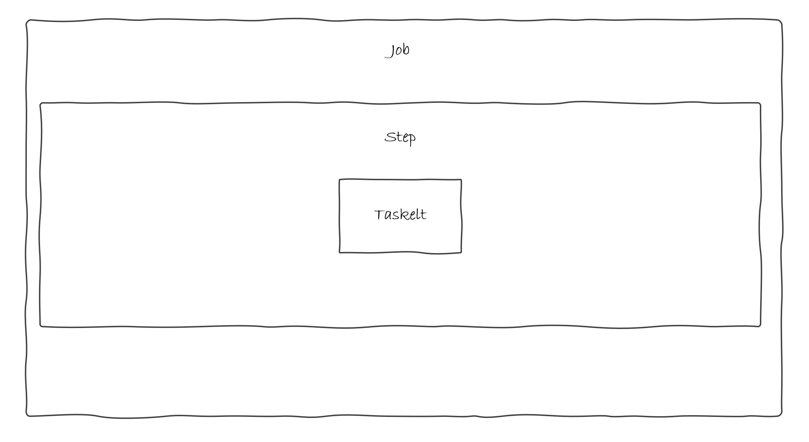

# Limpieza - Spring Batch

Ya tenemos todo configurado de los pasos anteriores asi que proseguimos con el último ejemplo.


## Caso de Uso

Este es un caso de uso nuevo para poner en práctica el uso de `Tasklet`.

### ¿Qué vamos a hacer?

Vamos a implementar un batch que limpie de ficheros un determinado directorio. Esta vez y dado que no necesitamos realizar ningún tipo de lectura ni trasformación ni escritura y queremos hacerlo todo al mismo tiempo, es buen momento para utilizar un `Tasklet`.


### ¿Cómo lo vamos a hacer?

A diferencia de los casos anteriores seguiremos el esquema de funcionamiento de tasklet de un proceso batch que hemos visto en la parte de introducción:



* **Tasklet**: Eliminará todos los ficheros del directorio.
* **Step**: El paso que contiene el tasklet que van a realizar la funcionalidad.
* **Job**: La tarea que contiene los pasos definidos.


## Código

### Tasklet

En primer lugar, vamos a crear `CleanTasklet` dentro del package `com.ccsw.tutorialbatch.tasklet`.

=== "CleanTasklet.java"
    ``` Java
    import java.io.File;
    
    public class CleanTasklet implements Tasklet, InitializingBean {
    
        private Resource directory;
    
        public RepeatStatus execute(StepContribution contribution, ChunkContext chunkContext) throws Exception {
            File dir = directory.getFile();
    
            File[] files = dir.listFiles();
    
            for (File file : files) {
                boolean deleted = file.delete();
                if (!deleted) {
                    throw new UnexpectedJobExecutionException("Could not delete file " + file.getPath());
                }
            }
            return RepeatStatus.FINISHED;
        }
    
        public void setDirectoryResource(Resource directory) {
    
            this.directory = directory;
        }
    
        public void afterPropertiesSet() throws Exception {
    
            if (directory == null) {
                throw new UnexpectedJobExecutionException("Directory must be set");
            }
        }
    }
    ```

La implementación de la interface `Tasklet` consiste en sobreescribir el método `execute` de forma muy similar como lo hacíamos en los `Processors`. En este método emplazamos nuestra lógica de negocio que básicamente consiste en borrar todos los ficheros que se encuentren en el directorio proporcionado como atributo.


### Step y Job

Posteriormente, como en el caso anterior, emplazamos la configuración junto al resto de beans dentro del package `com.ccsw.tutorialbatch.config`.

=== "CleanBatchConfiguration.java"
    ``` Java
    package com.ccsw.tutorialbatch.config;
    
    import com.ccsw.tutorialbatch.tasklet.CleanTasklet;
    import org.springframework.batch.core.Job;
    import org.springframework.batch.core.Step;
    import org.springframework.batch.core.job.builder.JobBuilder;
    import org.springframework.batch.core.launch.support.RunIdIncrementer;
    import org.springframework.batch.core.repository.JobRepository;
    import org.springframework.batch.core.step.builder.StepBuilder;
    import org.springframework.batch.core.step.tasklet.Tasklet;
    import org.springframework.context.annotation.Bean;
    import org.springframework.context.annotation.Configuration;
    import org.springframework.core.io.FileSystemResource;
    import org.springframework.transaction.PlatformTransactionManager;
    
    @Configuration
    public class CleanBatchConfiguration {
    
        @Bean
        public Tasklet taskletClean() {
            CleanTasklet tasklet = new CleanTasklet();
    
            tasklet.setDirectoryResource(new FileSystemResource("target/test-outputs"));
    
            return tasklet;
        }
    
        @Bean
        public Step step1Clean(JobRepository jobRepository, PlatformTransactionManager transactionManager, Tasklet taskletClean) {
            return new StepBuilder("step1Clean", jobRepository)
                    .tasklet(taskletClean, transactionManager)
                    .build();
        }
    
        @Bean
        public Job jobClean(JobRepository jobRepository, Step step1Clean) {
            return new JobBuilder("jobClean", jobRepository)
                    .incrementer(new RunIdIncrementer())
                    .start(step1Clean)
                    .build();
        }
    
    }
    ```

* **Tasklet**: El bean del `Tasklet` que hemos creado anteriormente.
* **Step**: La creación del `Step` se realiza mediante él `StepBuilder` al que únicamente le añadimos el `Tasklet` que se va a ejecutar de forma atómica.
* **Job**: Finalmente, debemos definir él `Job` que será lo que se ejecute al lanzar nuestro proceso. La creación se hace mediante el builder correspondiente como en los casos anteriores.


### Pruebas

Ahora ya tenemos varios `Jobs` en nuestro batch por lo que debemos especificar en el arranque cuál queremos ejecutar.

Como en el caso anterior pasamos como `VM option` la siguiente propiedad en el arranque de la aplicación:
```
-Dspring.batch.job.name=jobClean
```

Hecho esto y ejecutado el batch, podremos ver la traza de la ejecución en nuestro `log` y que el fichero generado en el `target` del proyecto de la ejecución del batch de autores ya no está.

```
Job: [SimpleJob: [name=jobClean]] launched with the following parameters: [{'run.id':'{value=1, type=class java.lang.Long, identifying=true}'}]
Executing step: [step1Clean]
Step: [step1Clean] executed in 9ms
Job: [SimpleJob: [name=jobClean]] completed with the following parameters: [{'run.id':'{value=1, type=class java.lang.Long, identifying=true}'}] and the following status: [COMPLETED] in 23ms
```