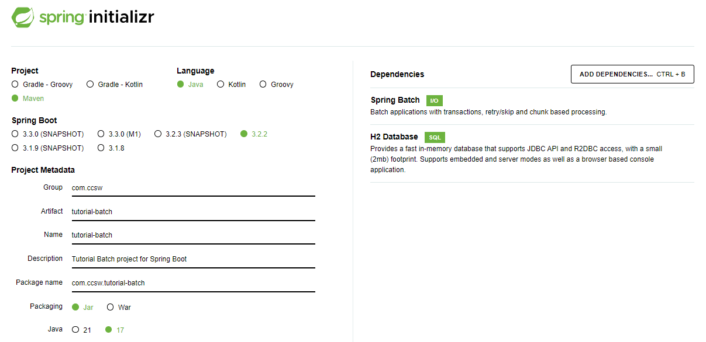
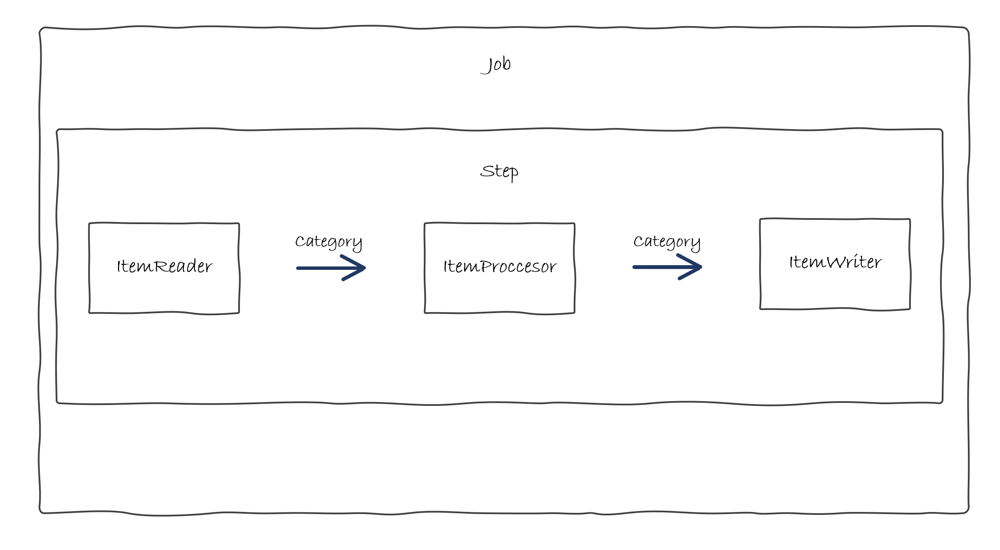

# Categoría - Spring Batch

Al igual que el tutorial básico de Spring Boot, debemos configurar el entorno y crear el proyecto.

Para la configuración del entorno nos remitimos a la guía de instalación donde se detalla el proceso de configuración del [Entorno de desarrollo](../../install/springboot.md)

Todos los pasos son exactamente iguales, lo único que va a variar es la creación del proyecto desde [Spring Initializr](https://start.spring.io/):

* Tipo de proyecto: Maven
* Lenguage: Java
* Versión Spring boot: 3.2.2 (o alguna similar)
* Group: com.ccsw
* ArtifactId: tutorial-batch
* Versión Java: 17 (o similar)
* Dependencias: Spring Batch, H2 Database




Esto nos generará un proyecto que ya vendrá configurado con Spring Batch y H2 para crear una BBDD en memoria de ejemplo con la que trabajaremos durante el tutorial.

Esta parte de tutorial es una ampliación de la parte de backend con Spring Boot, por tanto, no se ve a enfocar en las partes básicas aprendidas previamente, sino que se va a explicar el funcionamiento de los procesos batch.


## Caso de Uso

En este ejemplo no podemos seguir los mismos casos de uso que de los ejemplos del tutorial de `Spring Boot`, ya que sus requisitos no son válidos para implementarse como un proceso batch por lo que vamos a mantener las mismas entidades pero imaginar casos de uso diferentes.


### ¿Qué vamos a hacer?

Vamos a implementar un batch para leer un fichero de `Categorias` e insertar los registros leídos en Base de Datos.


### ¿Cómo lo vamos a hacer?

Seguiremos el esquema de funcionamiento habitual de un proceso batch que hemos visto en la parte de introducción:



* **ItemReader**: Se va a leer de un fichero y convertir los registros leídos al modelo de `Category`.
* **ItemProcessor**: Va a procesar todos los registros convirtiendo los textos a mayúsculas.
* **ItemWriter**: Va a insertar los registros en la BBDD.
* **Step**: El paso que contiene los elementos que van a realizar la funcionalidad.
* **Job**: La tarea que contiene los pasos definidos.


## Código

### Modelo

En primer lugar, vamos a crear el modelo dentro del package `com.ccsw.tutorialbatch.model`. En este caso no trabajamos con entidades, ya que ahora son simples estructuras de datos.

=== "Category.java"
    ``` Java
    package com.ccsw.tutorialbatch.model;
    
    public class Category {
    
        private String name;
        private String type;
        private String characteristics;
    
        public Category() {
        }
    
        public Category(String name, String type, String characteristics) {
            this.name = name;
            this.type = type;
            this.characteristics = characteristics;
        }
    
        public String getName() {
            return name;
        }
    
        public void setName(String name) {
            this.name = name;
        }
    
        public String getType() {
            return type;
        }
    
        public void setType(String type) {
            this.type = type;
        }
    
        public String getCharacteristics() {
            return characteristics;
        }
    
        public void setCharacteristics(String characteristics) {
            this.characteristics = characteristics;
        }
    
        @Override
        public String toString() {
            return "Category [name=" + getName() + ", type=" + getType() + ", characteristics=" + getCharacteristics() + "]";
        }
    
    }
    ```


### Reader

Ahora, emplazamos él `Reader` en la clase donde posteriormente añadiremos la configuración junto al resto de beans, dentro del package `com.ccsw.tutorialbatch.config`.

=== "CategoryBatchConfiguration.java"
    ``` Java
    package com.ccsw.tutorialbatch.config;

    ...
    
    @Configuration
    public class CategoryBatchConfiguration {
    
        @Bean
        public ItemReader<Category> readerCategory() {
            return new FlatFileItemReaderBuilder<Category>().name("categoryItemReader")
                    .resource(new ClassPathResource("category-list.csv"))
                    .delimited()
                    .names(new String[] { "name", "type", "characteristics" })
                    .fieldSetMapper(new BeanWrapperFieldSetMapper<>() {{
                        setTargetType(Category.class);
                    }})
                    .build();
        }
    
    }
    ```

Para la ingesta de datos vamos a hacer uso de `FlatFileItemReader` que nos proporciona Spring Batch. Como se puede observar se le proporciona el fichero a leer y el mapeo a la clase que deseamos. [Aquí](https://docs.spring.io/spring-batch/reference/readers-and-writers/item-reader-writer-implementations.html) el catálogo de Readers que proporciona `Spring Batch`.


### Processor

Posteriormente, emplazamos él `Processor` dentro del package `com.ccsw.tutorialbatch.processor`.

=== "CategoryItemProcessor.java"
    ``` Java
    package com.ccsw.tutorialbatch.processor;
    
    import com.ccsw.tutorialbatch.model.Category;
    import org.slf4j.Logger;
    import org.slf4j.LoggerFactory;
    import org.springframework.batch.item.ItemProcessor;
    
    public class CategoryItemProcessor implements ItemProcessor<Category, Category> {
    
        private static final Logger LOGGER = LoggerFactory.getLogger(CategoryItemProcessor.class);
    
        @Override
        public Category process(final Category category) {
            String name = category.getName().toUpperCase();
            String type = category.getType().toUpperCase();
            String characteristics = category.getCharacteristics().toUpperCase();
    
            Category transformedCategory = new Category(name, type, characteristics);
            LOGGER.info("Converting ( {} ) into ( {} )", category, transformedCategory);
    
            return transformedCategory;
        }
    }
    ```

Hemos implementado un `Processor` personalizado, esta clase implementa `ItemProcessor` donde especificamos de qué clase a qué clase se va a realizar la trasformación. 

En nuestro caso, va a ser de `Category` a `Category` donde únicamente vamos a realizar una trasformación de pasar los datos leídos a mayúsculas, ya que el `Reader` que veremos más adelante ya nos habrá trasformado los datos del fichero al modelo deseado. Las trasformaciones en sí se especifican sobreescribiendo el método `process`.


### Writer

Posteriormente, añadimos el writer a la clase de configuración `CategoryBatchConfiguration` donde ya habíamos añadido `Reader`.

=== "CategoryBatchConfiguration.java"
    ``` Java
    package com.ccsw.tutorialbatch.config;

    ...
    
    @Configuration
    public class CategoryBatchConfiguration {
    
        ...
    
        @Bean
        public ItemWriter<Category> writerCategory(DataSource dataSource) {
            return new JdbcBatchItemWriterBuilder<Category>()
                    .itemSqlParameterSourceProvider(new BeanPropertyItemSqlParameterSourceProvider<>())
                    .sql("INSERT INTO category (name, type, characteristics) VALUES (:name, :type, :characteristics)")
                    .dataSource(dataSource)
                    .build();
        }

    }
    ```


Para la parte de escritura usaremos `JdbcBatchItemWriter` que nos ayuda a lanzar inserciones en la base de datos de forma sencilla. Él `DataSource` se inicializa automáticamente con la instancia de H2 que se carga al arrancar el Batch. [Aquí](https://docs.spring.io/spring-batch/reference/readers-and-writers/item-reader-writer-implementations.html) el catálogo de Writers que proporciona `Spring Batch`.


### Step y Job

Ahora ya podemos añadir la configuración del `Step` y del `Job` dentro de la clase de configuración. La clase completa debería quedar de esta forma:

=== "CategoryBatchConfiguration.java"
    ``` Java
    package com.ccsw.tutorialbatch.config;
    
    
    import com.ccsw.tutorialbatch.model.Category;
    import com.ccsw.tutorialbatch.processor.CategoryItemProcessor;
    import com.ccsw.tutorialbatch.listener.JobCategoryCompletionNotificationListener;
    import org.springframework.batch.core.Job;
    import org.springframework.batch.core.Step;
    import org.springframework.batch.core.job.builder.JobBuilder;
    import org.springframework.batch.core.launch.support.RunIdIncrementer;
    import org.springframework.batch.core.repository.JobRepository;
    import org.springframework.batch.core.step.builder.StepBuilder;
    import org.springframework.batch.item.ItemProcessor;
    import org.springframework.batch.item.ItemReader;
    import org.springframework.batch.item.ItemWriter;
    import org.springframework.batch.item.database.BeanPropertyItemSqlParameterSourceProvider;
    import org.springframework.batch.item.database.builder.JdbcBatchItemWriterBuilder;
    import org.springframework.batch.item.file.builder.FlatFileItemReaderBuilder;
    import org.springframework.batch.item.file.mapping.BeanWrapperFieldSetMapper;
    import org.springframework.context.annotation.Bean;
    import org.springframework.context.annotation.Configuration;
    import org.springframework.core.io.ClassPathResource;
    import org.springframework.transaction.PlatformTransactionManager;
    
    import javax.sql.DataSource;
    
    @Configuration
    public class CategoryBatchConfiguration {
    
        @Bean
        public ItemReader<Category> readerCategory() {
            return new FlatFileItemReaderBuilder<Category>().name("categoryItemReader")
                    .resource(new ClassPathResource("category-list.csv"))
                    .delimited()
                    .names(new String[] { "name", "type", "characteristics" })
                    .fieldSetMapper(new BeanWrapperFieldSetMapper<>() {{
                        setTargetType(Category.class);
                    }})
                    .build();
        }
    
        @Bean
        public ItemProcessor<Category, Category> processorCategory() {
    
            return new CategoryItemProcessor();
        }
    
        @Bean
        public ItemWriter<Category> writerCategory(DataSource dataSource) {
            return new JdbcBatchItemWriterBuilder<Category>()
                    .itemSqlParameterSourceProvider(new BeanPropertyItemSqlParameterSourceProvider<>())
                    .sql("INSERT INTO category (name, type, characteristics) VALUES (:name, :type, :characteristics)")
                    .dataSource(dataSource)
                    .build();
        }
    
        @Bean
        public Step step1Category(JobRepository jobRepository, PlatformTransactionManager transactionManager, ItemReader<Category> readerCategory, ItemProcessor<Category, Category> processorCategory, ItemWriter<Category> writerCategory) {
            return new StepBuilder("step1Category", jobRepository)
                    .<Category, Category> chunk(10, transactionManager)
                    .reader(readerCategory)
                    .processor(processorCategory)
                    .writer(writerCategory)
                    .build();
        }
    
        @Bean
        public Job jobCategory(JobRepository jobRepository, JobCategoryCompletionNotificationListener listener, Step step1Category) {
            return new JobBuilder("jobCategory", jobRepository)
                    .incrementer(new RunIdIncrementer())
                    .listener(listener)
                    .flow(step1Category)
                    .end()
                    .build();
        }
    
    }
    ```

* **ItemReader**: El bean del `Reader` que hemos creado anteriormente.
* **ItemProcessor**: El bean del `Processor` que hemos creado anteriormente.
* **ItemWriter**: El bean del `Writer` que hemos creado anteriormente.
* **Step**: La creación del `Step` se realiza mediante él `StepBuilder` al que le definimos el tamaño del `chunk` que es el número de elementos procesados por lote y le asignamos los tres beans creados previamente. En este caso solo vamos a tener un único `Step` pero podríamos tener todos los que quisiéramos.
* **Job**: Finalmente, debemos definir él `Job` que será lo que se ejecute al lanzar nuestro proceso. La creación se hace mediante el builder correspondiente como en el caso anterior. Se asigna el identificador de `Job`, el conjunto de steps, en este caso solo tenemos uno y finalmente el listener que es opcional y se crea en el siguiente paso.


### Listener

Ahora, para verificar que nuestro proceso se ha ejecutado correctamente vamos a añadir un `Listener` que al final de la ejecución consultará que los datos se han insertado correctamente. Emplazamos él `Listener` dentro del package `com.ccsw.tutorialbatch.listener`.

=== "JobCategoryCompletionNotificationListener.java"
    ``` Java
    package com.ccsw.tutorialbatch.listener;
    
    
    import com.ccsw.tutorialbatch.model.Category;
    import org.slf4j.Logger;
    import org.slf4j.LoggerFactory;
    import org.springframework.batch.core.BatchStatus;
    import org.springframework.batch.core.JobExecution;
    import org.springframework.batch.core.JobExecutionListener;
    import org.springframework.beans.factory.annotation.Autowired;
    import org.springframework.jdbc.core.JdbcTemplate;
    import org.springframework.stereotype.Component;
    
    @Component
    public class JobCategoryCompletionNotificationListener implements JobExecutionListener {
    
        private static final Logger LOGGER = LoggerFactory.getLogger(JobCategoryCompletionNotificationListener.class);
    
        private final JdbcTemplate jdbcTemplate;
    
        @Autowired
        public JobCategoryCompletionNotificationListener(JdbcTemplate jdbcTemplate) {
            this.jdbcTemplate = jdbcTemplate;
        }
    
        @Override
        public void afterJob(JobExecution jobExecution) {
            if (jobExecution.getStatus() == BatchStatus.COMPLETED) {
                LOGGER.info("!!! JOB FINISHED! Time to verify the results");
    
                String query = "SELECT name, type, characteristics FROM category";
                jdbcTemplate.query(query, (rs, row) -> new Category(rs.getString(1), rs.getString(2), rs.getString(3)))
                    .forEach(category -> LOGGER.info("Found < {} > in the database.", category));
            }
        }
    }
    ```

Para el listener implementamos la interface `JobExecutionListener` y sobreescribimos el método `afterJob` que se ejecutara justo al terminar nuestro `Job` lanzando una consulta y mostrando el resultado.


### Base de Datos y Fichero Carga

Finalmente, debemos crear el fichero de inicialización de base de datos con la tabla de categorías y crear el fichero que leeremos con los datos de las categorías que deseamos insertar.

=== "schema-all.sql"
    ``` SQL
    DROP TABLE category IF EXISTS;
    
    CREATE TABLE category  (
    category_id BIGINT GENERATED ALWAYS AS IDENTITY PRIMARY KEY,
    name VARCHAR(20),
    type VARCHAR(20),
    characteristics VARCHAR(30)
    );
    ```
=== "category-list.csv"
    ``` CSV
    Eurogames,Mechanics,Hard
    Ameritrash,Thematic,Mid
    Familiar,Fillers,Easy
    ```


### Pruebas

Ahora si arrancamos la aplicación como cualquier aplicación `Spring Boot`, podremos observar la traza de la ejecución en nuestro `log` y comprobar que la ejecución ha sido correcta y los registros se han insertado.

```
Job: [FlowJob: [name=jobCategory]] launched with the following parameters: [{'run.id':'{value=1, type=class java.lang.Long, identifying=true}'}]
Executing step: [step1Category]
Converting ( Category [name=Eurogames, type=Mechanics, characteristics=Hard] ) into ( Category [name=EUROGAMES, type=MECHANICS, characteristics=HARD] )
Converting ( Category [name=Ameritrash, type=Thematic, characteristics=Mid] ) into ( Category [name=AMERITRASH, type=THEMATIC, characteristics=MID] )
Converting ( Category [name=Familiar, type=Fillers, characteristics=Easy] ) into ( Category [name=FAMILIAR, type=FILLERS, characteristics=EASY] )
Step: [step1Category] executed in 55ms
!!! JOB FINISHED! Time to verify the results
Found < Category [name=EUROGAMES, type=MECHANICS, characteristics=HARD] > in the database.
Found < Category [name=AMERITRASH, type=THEMATIC, characteristics=MID] > in the database.
Found < Category [name=FAMILIAR, type=FILLERS, characteristics=EASY] > in the database.
Job: [FlowJob: [name=jobCategory]] completed with the following parameters: [{'run.id':'{value=1, type=class java.lang.Long, identifying=true}'}] and the following status: [COMPLETED] in 73ms
```