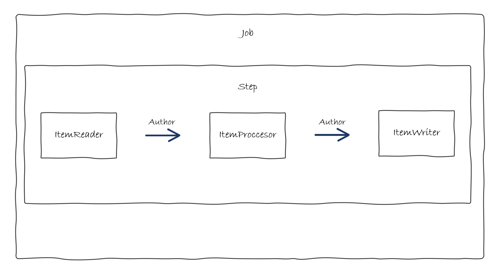

# Autor - Spring Batch

Ya tenemos todo configurado del paso anterior asi que proseguimos con el siguiente ejemplo.


## Caso de Uso

En este caso también debemos plantear requisitos diferentes para la parte de Autores.

### ¿Qué vamos a hacer?

Vamos a implementar un batch para leer un fichero de `Autores` trasformar la nacionalidad del autor a código de region y general un fichero con los datos trasformados.


### ¿Cómo lo vamos a hacer?

Al igual que en el caso anterior seguiremos el esquema de funcionamiento habitual de un proceso batch que hemos visto en la parte de introducción:



* **ItemReader**: Se va a leer de un fichero y convertir los registros leídos al modelo de `Author`.
* **ItemProcessor**: Va a procesar todos los registros convirtiendo el código de nacionalidad al formato xx_XX.
* **ItemWriter**: Va a escribir los registros en un fichero.
* **Step**: El paso que contiene los elementos que van a realizar la funcionalidad.
* **Job**: La tarea que contiene los pasos definidos.


## Código

### Modelo

En primer lugar, vamos a crear el modelo dentro del package `com.ccsw.tutorialbatch.model` de la misma forma que en el ejemplo anterior.

=== "Author.java"
    ``` Java
    package com.ccsw.tutorialbatch.model;
    
    public class Author {
    
        private String name;
        private String nationality;
    
        public Author() {
        }
    
        public Author(String name, String nationality) {
            this.name = name;
            this.nationality = nationality;
        }
    
        public String getName() {
            return name;
        }
    
        public void setName(String name) {
            this.name = name;
        }
    
        public String getNationality() {
            return nationality;
        }
    
        public void setNationality(String nationality) {
            this.nationality = nationality;
        }
    
        @Override
        public String toString() {
            return "Author [name=" + getName() + ", nationality=" + getNationality() + "]";
        }
    
    }
    ```


### Reader

Ahora, como en el caso anterior, emplazamos él `Reader` en la clase donde posteriormente añadiremos la configuración junto al resto de beans, dentro del package `com.ccsw.tutorialbatch.config`.

=== "AuthorBatchConfiguration.java"
    ``` Java
    package com.ccsw.tutorialbatch.config;

    ...
    
    @Configuration
    public class AuthorBatchConfiguration {
    
        @Bean
        public ItemReader<Author> readerAuthor() {
            return new FlatFileItemReaderBuilder<Author>().name("authorItemReader")
                    .resource(new ClassPathResource("author-list.csv"))
                    .delimited()
                    .names(new String[] { "name", "nationality" })
                    .fieldSetMapper(new BeanWrapperFieldSetMapper<>() {{
                        setTargetType(Author.class);
                    }})
                    .build();
        }

    ```

Para la ingesta de datos vamos a hacer uso de este `FlatFileItemReader` que nos proporciona Spring Batch. Como se puede observar se le proporciona el fichero a leer y el mapeo a la clase que deseamos. [Aquí](https://docs.spring.io/spring-batch/reference/readers-and-writers/item-reader-writer-implementations.html) el catálogo de Readers que proporciona `Spring Batch`.


### Processor

Posteriormente, emplazamos él `Processor` dentro del package `com.ccsw.tutorialbatch.processor`.

=== "AuthorItemProcessor.java"
    ``` Java
    package com.ccsw.tutorialbatch.processor;
    
    
    import com.ccsw.tutorialbatch.model.Author;
    import org.slf4j.Logger;
    import org.slf4j.LoggerFactory;
    import org.springframework.batch.item.ItemProcessor;
    
    
    public class AuthorItemProcessor implements ItemProcessor<Author, Author> {
    
        private static final Logger LOGGER = LoggerFactory.getLogger(AuthorItemProcessor.class);
    
        @Override
        public Author process(final Author author) {
            String name = author.getName();
            String nationality = author.getNationality().toLowerCase() + "_" + author.getNationality().toUpperCase();
    
            Author transformedAuthor = new Author(name, nationality);
            LOGGER.info("Converting ( {} ) into ( {} )", author, transformedAuthor);
    
            return transformedAuthor;
        }
    }
    ```

De la misma forma que en el caso anterior hemos implementado un `Processor` personalizado, esta clase implementa `ItemProcessor` donde especificamos de qué clase a qué clase se va a realizar la trasformación. 

En nuestro caso, va a ser de `Author` a `Author` donde vamos a implementar la lógica requerida para este caso de uso.


### Writer

Posteriormente, añadimos el writer a la clase de configuración `AuthorBatchConfiguration` donde ya habíamos añadido `Reader`.

=== "AuthorBatchConfiguration.java"
    ``` Java
    package com.ccsw.tutorialbatch.config;

    ...
    
    @Configuration
    public class AuthorBatchConfiguration {

        ...
    
        @Bean
        public ItemWriter<Author> writerAuthor() {
            return  new FlatFileItemWriterBuilder<Author>().name("writerAuthor")
                    .resource(new FileSystemResource("target/test-outputs/author-output.txt"))
                    .lineAggregator(new PassThroughLineAggregator<>())
                    .build();
        }
    
    }
    ```

A diferencia del ejemplo anterior utilizamos `FlatFileItemWriter` diferente que en este caso nos ayuda a crear un fichero con los datos deseados. [Aquí](https://docs.spring.io/spring-batch/reference/readers-and-writers/item-reader-writer-implementations.html) el catálogo de Writers que proporciona `Spring Batch`.


### Step y Job

Ahora ya podemos añadir la configuración del `Step` y del `Job` dentro de la clase de configuración. La clase completa debería quedar de esta forma:

=== "AuthorBatchConfiguration.java"
    ``` Java
    package com.ccsw.tutorialbatch.config;
    
    
    import com.ccsw.tutorialbatch.model.Author;
    import com.ccsw.tutorialbatch.processor.AuthorItemProcessor;
    import org.springframework.batch.core.Job;
    import org.springframework.batch.core.Step;
    import org.springframework.batch.core.job.builder.JobBuilder;
    import org.springframework.batch.core.launch.support.RunIdIncrementer;
    import org.springframework.batch.core.repository.JobRepository;
    import org.springframework.batch.core.step.builder.StepBuilder;
    import org.springframework.batch.item.ItemProcessor;
    import org.springframework.batch.item.ItemReader;
    import org.springframework.batch.item.ItemWriter;
    import org.springframework.batch.item.file.FlatFileItemReader;
    import org.springframework.batch.item.file.FlatFileItemWriter;
    import org.springframework.batch.item.file.builder.FlatFileItemReaderBuilder;
    import org.springframework.batch.item.file.builder.FlatFileItemWriterBuilder;
    import org.springframework.batch.item.file.mapping.BeanWrapperFieldSetMapper;
    import org.springframework.batch.item.file.transform.PassThroughLineAggregator;
    import org.springframework.context.annotation.Bean;
    import org.springframework.context.annotation.Configuration;
    import org.springframework.core.io.ClassPathResource;
    import org.springframework.core.io.FileSystemResource;
    import org.springframework.transaction.PlatformTransactionManager;
    
    @Configuration
    public class AuthorBatchConfiguration {
    
        @Bean
        public ItemReader<Author> readerAuthor() {
            return new FlatFileItemReaderBuilder<Author>().name("authorItemReader")
                    .resource(new ClassPathResource("author-list.csv"))
                    .delimited()
                    .names(new String[] { "name", "nationality" })
                    .fieldSetMapper(new BeanWrapperFieldSetMapper<>() {{
                        setTargetType(Author.class);
                    }})
                    .build();
        }
    
        @Bean
        public ItemProcessor<Author, Author> processorAuthor() {
    
            return new AuthorItemProcessor();
        }
    
        @Bean
        public ItemWriter<Author> writerAuthor() {
            return  new FlatFileItemWriterBuilder<Author>().name("writerAuthor")
                    .resource(new FileSystemResource("target/test-outputs/author-output.txt"))
                    .lineAggregator(new PassThroughLineAggregator<>())
                    .build();
        }
    
        @Bean
        public Step step1Author(JobRepository jobRepository, PlatformTransactionManager transactionManager, ItemReader<Author> readerAuthor, ItemProcessor<Author, Author> processorAuthor, ItemWriter<Author> writerAuthor) {
            return new StepBuilder("step1Author", jobRepository)
                    .<Author, Author> chunk(10, transactionManager)
                    .reader(readerAuthor)
                    .processor(processorAuthor)
                    .writer(writerAuthor)
                    .build();
        }
    
        @Bean
        public Job jobAuthor(JobRepository jobRepository, Step step1Author) {
            return new JobBuilder("jobAuthor", jobRepository)
                    .incrementer(new RunIdIncrementer())
                    .flow(step1Author)
                    .end()
                    .build();
        }
    
    }
    ```

* **ItemReader**: El bean del `Reader` que hemos creado anteriormente.
* **ItemProcessor**: El bean del `Processor` que hemos creado anteriormente.
* **ItemWriter**: El bean del `Writer` que hemos creado anteriormente.
* **Step**: La creación del `Step` se realiza mediante él `StepBuilder` al que le definimos el tamaño del `chunk` que es el número de elementos procesados por lote y le asignamos los tres beans creados previamente. En este caso solo vamos a tener un único `Step` pero podríamos tener todos los que quisiéramos.
* **Job**: Finalmente, debemos definir él `Job` que será lo que se ejecute al lanzar nuestro proceso. La creación se hace mediante el builder correspondiente como en el caso anterior. Se asigna el identificador de `Job`, el conjunto de steps, en este caso solo tenemos uno. En este caso no necesitamos un listener, ya que para verificar el resultado podemos ver el archivo generado.


### Fichero Carga

Finalmente, debemos crear el fichero que leeremos con los datos de los autores que deseamos procesar.

=== "author-list.csv"
    ``` CSV
    Alan R. Moon,US
    Vital Lacerda,PT
    Simone Luciani,IT
    Perepau Llistosella,ES
    Michael Kiesling,DE
    Phil Walker-Harding,US
    ```


### Pruebas

Ahora ya tenemos dos `Jobs` en nuestro batch por lo que debemos especificar en el arranque cual queremos ejecutar.

Esto se realiza pasando una `VM option` en el arranque de la aplicación:
```
-Dspring.batch.job.name=jobAuthor
```
ó
```
-Dspring.batch.job.name=jobCtegory
```

Hecho esto y ejecutado el batch, podremos ver la traza de la ejecución en nuestro `log` y el fichero generado en el `target` del proyecto:

```
Job: [FlowJob: [name=jobAuthor]] launched with the following parameters: [{'run.id':'{value=1, type=class java.lang.Long, identifying=true}'}]
Executing step: [step1Author]
Converting ( Author [name=Alan R. Moon, nationality=US] ) into ( Author [name=Alan R. Moon, nationality=us_US] )
Converting ( Author [name=Vital Lacerda, nationality=PT] ) into ( Author [name=Vital Lacerda, nationality=pt_PT] )
Converting ( Author [name=Simone Luciani, nationality=IT] ) into ( Author [name=Simone Luciani, nationality=it_IT] )
Converting ( Author [name=Perepau Llistosella, nationality=ES] ) into ( Author [name=Perepau Llistosella, nationality=es_ES] )
Converting ( Author [name=Michael Kiesling, nationality=DE] ) into ( Author [name=Michael Kiesling, nationality=de_DE] )
Converting ( Author [name=Phil Walker-Harding, nationality=US] ) into ( Author [name=Phil Walker-Harding, nationality=us_US] )
Step: [step1Author] executed in 50ms
Job: [FlowJob: [name=jobAuthor]] completed with the following parameters: [{'run.id':'{value=1, type=class java.lang.Long, identifying=true}'}] and the following status: [COMPLETED] in 67ms
```

=== "author-output.txt"
    ``` txt
    Author [name=Alan R. Moon, nationality=us_US]
    Author [name=Vital Lacerda, nationality=pt_PT]
    Author [name=Simone Luciani, nationality=it_IT]
    Author [name=Perepau Llistosella, nationality=es_ES]
    Author [name=Michael Kiesling, nationality=de_DE]
    Author [name=Phil Walker-Harding, nationality=us_US]
    ```