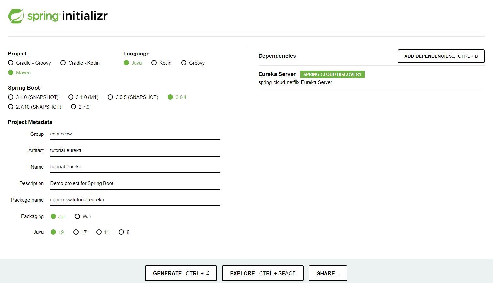
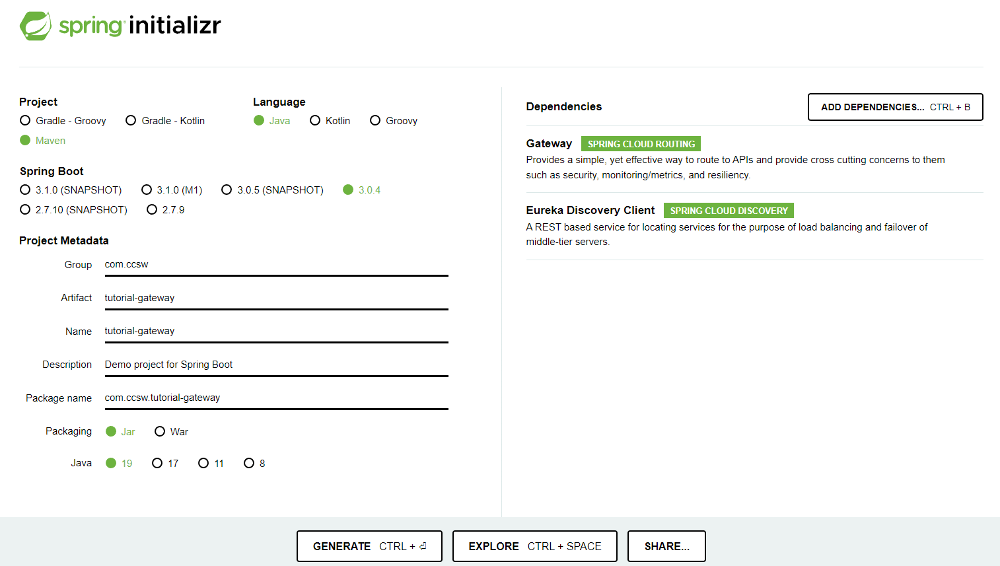

# Infraestructura - Spring Cloud

Creados los tres micro servicios que compondrán nuestro aplicativo, ya podemos empezar con la creación de las piezas de infraestructura que serán las encargadas de realizar la orquestación.

## Service Discovery - Eureka

Para esta pieza hay muchas aplicaciones de mercado, incluso los propios proveedores de cloud tiene la suya propia, pero en este caso, vamos a utilizar la que ofrece Spring Cloud, así que vamos a crear un proyecto de una forma similar a la que estamos acostumbrados.

### Crear el servicio

Volviendo una vez más a [Spring Initializr](https://start.spring.io/) seleccionaremos los siguientes datos:

* Tipo de proyecto: Maven
* Lenguage: Java
* Versión Spring boot: 3.0.4 (o alguna similar)
* Group: com.ccsw
* ArtifactId: tutorial-eureka
* Versión Java: 19
* **Dependencias: Eureka Server**




Es importante que añadamos la dependencia de `Eureka Server` para que sea capaz de ejecutar el proyecto como si fuera un servidor Eureka.

### Configurar el servicio

Importamos el proyecto dentro del IDE y ya solo nos queda activar el servidor y configurarlo.

En primer lugar, añadimos la anotación que habilita el servidor de Eureka.

=== "TutorialEurekaApplication.java"
    ``` Java hl_lines="8"
    package com.ccsw.tutorialeureka;
    
    import org.springframework.boot.SpringApplication;
    import org.springframework.boot.autoconfigure.SpringBootApplication;
    import org.springframework.cloud.netflix.eureka.server.EnableEurekaServer;
    
    @SpringBootApplication
    @EnableEurekaServer
    public class TutorialEurekaApplication {
    
        public static void main(String[] args) {
            SpringApplication.run(TutorialEurekaApplication.class, args);
        }
    
    }
    ```

Ahora debemos añadir las configuraciones necesarias. En primer lugar para facilitar la visualización de las propiedades vamos a renombrar nuestro fichero `application.properties` a `application.yml`. 
Hecho esto, añadimos la configuración de puerto que ya conocemos y añadimos directivas sobre que Eureka no se registre a sí mismo dentro del catálogo de servicios.

=== "application.yml"
    ``` yml
    server:
      port: 8761
    eureka:
      client:
        registerWithEureka: false
        fetchRegistry: false
    ```
    
### Probar el servicio

Hechas estas sencillas configuraciones y arrancando el proyecto, nos dirigimos a la `http://localhost/8761` donde podemos ver la interfaz de Eureka y si miramos con detenimiento, vemos que el catálogo de servicios aparece vacío, ya que aún no se ha registrado ninguno de ellos.


## Micro servicios

Ahora que ya tenemos disponible Eureka, ya podemos proceder a registrar nuestros micro servicios dentro del catálogo. Para ello vamos a realizar las mismas modificaciones sobre los tres micro servicios. Recuerda que hay que realizarlo sobre los tres para que se registren todos.

### Configurar micro servicios

Para este fin debemos añadir una nueva dependencia dentro del `pom.xml` y modificar la configuración del proyecto.

=== "pom.xml"
    ``` xml hl_lines="18 48-51 64-74"
    <?xml version="1.0" encoding="UTF-8"?>
    <project xmlns="http://maven.apache.org/POM/4.0.0" xmlns:xsi="http://www.w3.org/2001/XMLSchema-instance"
    xsi:schemaLocation="http://maven.apache.org/POM/4.0.0 https://maven.apache.org/xsd/maven-4.0.0.xsd">
        <modelVersion>4.0.0</modelVersion>
        <parent>
            <groupId>org.springframework.boot</groupId>
            <artifactId>spring-boot-starter-parent</artifactId>
            <version>3.0.4</version>
            <relativePath/> <!-- lookup parent from repository -->
        </parent>
        <groupId>com.ccsw</groupId>
        <artifactId>tutorial-XXX</artifactId> <!-- Cada proyecto tiene su configación propia, NO modificar -->
        <version>0.0.1-SNAPSHOT</version>
        <name>tutorial-XXX</name> <!-- Cada proyecto tiene su configación propia, NO modificar -->
        <description>Demo project for Spring Boot</description>
        <properties>
            <java.version>19</java.version>
            <spring-cloud.version>2022.0.1</spring-cloud.version>
        </properties>
        <dependencies>
            <dependency>
                <groupId>org.springframework.boot</groupId>
                <artifactId>spring-boot-starter-data-jpa</artifactId>
            </dependency>
            <dependency>
                <groupId>org.springframework.boot</groupId>
                <artifactId>spring-boot-starter-web</artifactId>
            </dependency>
    
            <dependency>
                <groupId>org.springdoc</groupId>
                <artifactId>springdoc-openapi-starter-webmvc-ui</artifactId>
                <version>2.0.3</version>
            </dependency>
    
            <dependency>
                <groupId>org.hibernate</groupId>
                <artifactId>hibernate-validator</artifactId>
                <version>8.0.0.Final</version>
            </dependency>
    
            <dependency>
                <groupId>net.sf.dozer</groupId>
                <artifactId>dozer</artifactId>
                <version>5.5.1</version>
            </dependency>
    
            <dependency>
                <groupId>org.springframework.cloud</groupId>
                <artifactId>spring-cloud-starter-netflix-eureka-client</artifactId>
            </dependency>
    
            <dependency>
                <groupId>com.h2database</groupId>
                <artifactId>h2</artifactId>
                <scope>runtime</scope>
            </dependency>
            <dependency>
                <groupId>org.springframework.boot</groupId>
                <artifactId>spring-boot-starter-test</artifactId>
                <scope>test</scope>
            </dependency>
        </dependencies>
        <dependencyManagement>
            <dependencies>
                <dependency>
                    <groupId>org.springframework.cloud</groupId>
                    <artifactId>spring-cloud-dependencies</artifactId>
                    <version>${spring-cloud.version}</version>
                    <type>pom</type>
                    <scope>import</scope>
                </dependency>
            </dependencies>
        </dependencyManagement>
    
        <build>
            <plugins>
                <plugin>
                    <groupId>org.springframework.boot</groupId>
                    <artifactId>spring-boot-maven-plugin</artifactId>
                </plugin>
            </plugins>
        </build>
    
    </project>
    ```
=== "application.properties"
    ``` properties hl_lines="1 16-18"
    spring.application.name=spring-cloud-eureka-client-XXX
    server.port=809X
    
    #Database
    spring.datasource.url=jdbc:h2:mem:testdb
    spring.datasource.username=sa
    spring.datasource.password=sa
    spring.datasource.driver-class-name=org.h2.Driver
    
    spring.jpa.database-platform=org.hibernate.dialect.H2Dialect
    spring.jpa.defer-datasource-initialization=true
    spring.jpa.show-sql=true
    
    spring.h2.console.enabled=true
    
    #Eureka
    eureka.client.serviceUrl.defaultZone=${EUREKA_URI:http://localhost:8761/eureka}
    eureka.instance.preferIpAddress=true
    ```

Como podemos observar, lo que hemos hecho, es añadir la dependencia de Eureka Client y le hemos comunicado a cada micro servicio donde tenemos arrancado Eureka. De este modo al arrancar cada micro servicio, este se registrará automáticamente dentro de Eureka.

Para poder diferenciar cada micro servicio, estos tienen su configuración de nombre y puerto (mantenemos el puerto que habíamos configurado en pasos previos):

* Categorías: `spring.application.name=spring-cloud-eureka-client-category`
* Autores: `spring.application.name=spring-cloud-eureka-client-author`
* Juegos: `spring.application.name=spring-cloud-eureka-client-game`

!!! tip "Nombres en vez de rutas"
    Estos nombres serán por los que vamos a identificar cada micro servicio dentro de Eureka que será quien conozca las rutas de los mismos, asi cuando queramos realizar redirecciones a estos no necesitaremos conocerlas rutas ni los puertos de los mismos, con proporcionar los nombres tendremos la información completa de como llegar a ellos.

### Probar micro servicios

Hechas esto y arrancados los micro servicios, volvemos a dirigirnos a Eureka en `http://localhost/8761` donde podemos ver que estos aparecen en el listado de servicios registrados.


## Gateway

Para esta pieza, de nuevo, hay muchas implementaciones y aplicaciones de mercado, pero nosotros vamos a utilizar la de Spring Cloud, así que vamos a crear un nuevo proyecto de una forma similar a la de Eureka.

### Crear el servicio

Volviendo una vez más a [Spring Initializr](https://start.spring.io/) seleccionaremos los siguientes datos:

* Tipo de proyecto: Maven
* Lenguage: Java
* Versión Spring boot: 3.0.4 (o alguna similar)
* Group: com.ccsw
* ArtifactId: tutorial-gateway
* Versión Java: 19
* **Dependencias: Gateway, Eureka Client**




Ojo con las dependencias de `Gateway` y de `Eureka Client` que debemos añadir.

### Configurar el servicio

De nuevo lo importamos en nuestro IDE y pasamos a añadir las configuraciones pertinentes.

Al igual que en el caso de Eureka vamos a renombrar nuestro fichero `application.properties` a `application.yml`.

=== "application.yml"
    ``` yml
    server:
      port: 8080
    eureka:
      client:
        serviceUrl:
          defaultZone: http://localhost:8761/eureka
    spring:
      application:
        name: spring-cloud-eureka-client-gateway
      cloud:
        gateway:
          default-filters:
            - DedupeResponseHeader=Access-Control-Allow-Credentials Access-Control-Allow-Origin
          globalcors:
            corsConfigurations:
              '[/**]':
                 allowedOrigins: "*"
                 allowedMethods: "*"
                 allowedHeaders: "*"
          routes:
            - id: category
              uri: lb://SPRING-CLOUD-EUREKA-CLIENT-CATEGORY
              predicates:
                - Path=/category/**
            - id: author
              uri: lb://SPRING-CLOUD-EUREKA-CLIENT-AUTHOR
              predicates:
                - Path=/author/**
            - id: game
              uri: lb://SPRING-CLOUD-EUREKA-CLIENT-GAME
              predicates:
                - Path=/game/**
    ```

Lo que hemos hecho aquí es configurar el puerto como `8080` ya que el `Gateway` va a ser nuestro punto de acceso y el encargado de redirigir cada petición al micro servicio correcto.

Posteriormente hemos configurado el cliente de Eureka para que el Gateway establezca comunicación con Eureka que hemos configurado previamente para, en primer lugar, registrarse como un cliente y seguidamente obtener información del catálogo de servicios existentes.

El paso siguiente es darle un nombre a la aplicación para que se registre en Eureka y añadir configuración de CORS para que cuando realicemos las llamadas desde navegador pueda realizar la redirección correctamente.

Finalmente añadimos las directrices de redirección al Gateway indicándole los nombres de los micro servicios con los que estos se han registrado en Eureka junto a los predicados que incluyen las rutas parciales que queremos que sean redirigidas a cada micro servicio.

Con esto nos queda la siguiente configuración:

* Las rutas que incluyan en su path `category` redirigirán al micro servicio de `Categorias`
* Las rutas que incluyan en su path `author` redirigirán al micro servicio de `Autores`
* Las rutas que incluyan en su path `game` redirigirán al micro servicio de `Juegos`

### Probar el servicio

Hechas esto y arrancado el proyecto, volvemos a dirigirnos a Eureka en `http://localhost/8761` donde podemos ver que el Gateway se ha registrado correctamente junto al resto de clientes.


## Feign Client

El último paso es la implementación de la comunicación entre los micro servicios, en este caso necesitamos que nuestro micro servicio de `Game` obtenga datos de `Category` y `Author` para poder servir información completa de los `Game` ya que en su modelo solo posee los identificadores. Si recordáis, estábamos respondiendo solamente con los `id`.

### Configurar el servicio

Para la comunicación entre los distintos servicios, Spring Cloud nos prove de `Feign Clients` que ofrecen una interfaz muy sencilla de comunicación y que utiliza a la perfección la infraestructura que ya hemos construido.

En primer lugar debemos añadir la dependencia necesaria dentro de nuestro pom.xml del micro servicio de `Game`.

=== "pom.xml"
    ``` xml hl_lines="7-10"
    ...
            <dependency>
                <groupId>org.springframework.cloud</groupId>
                <artifactId>spring-cloud-starter-netflix-eureka-client</artifactId>
            </dependency>

            <dependency>
                <groupId>org.springframework.cloud</groupId>
                <artifactId>spring-cloud-starter-openfeign</artifactId>
            </dependency>
    
            <dependency>
                <groupId>com.h2database</groupId>
                <artifactId>h2</artifactId>
                <scope>runtime</scope>
            </dependency>
    ...
    ```

El siguiente paso es habilitar el uso de los `Feign Clients` mediante la anotación de SpringCloud.

=== "TutorialGameApplication.java"
    ``` Java hl_lines="8"
    package com.ccsw.tutorialgame;
    
    import org.springframework.boot.SpringApplication;
    import org.springframework.boot.autoconfigure.SpringBootApplication;
    import org.springframework.cloud.openfeign.EnableFeignClients;
    
    @SpringBootApplication
    @EnableFeignClients
    public class TutorialGameApplication {
    
        public static void main(String[] args) {
            SpringApplication.run(TutorialGameApplication.class, args);
        }
    
    }
    ```

### Configurar los clientes

Realizadas las configuraciones ya podemos realizar los cambios necesarios en nuestro código para implementar la comunicación. En primer lugar vamos a crear los clientes de `Categorías` y `Autores`.

=== "CategoryClient.java"
    ``` Java
    package com.ccsw.tutorialgame.category;

    import com.ccsw.tutorialgame.category.model.CategoryDto;
    import org.springframework.cloud.openfeign.FeignClient;
    import org.springframework.web.bind.annotation.GetMapping;
    
    import java.util.List;
    
    @FeignClient(value = "SPRING-CLOUD-EUREKA-CLIENT-CATEGORY", url = "http://localhost:8080")
    public interface CategoryClient {
    
        @GetMapping(value = "/category")
        List<CategoryDto> findAll();
    }
    ```
=== "AuthorClient.java"
    ``` Java
    package com.ccsw.tutorialgame.author;

    import com.ccsw.tutorialgame.author.model.AuthorDto;
    import org.springframework.cloud.openfeign.FeignClient;
    import org.springframework.web.bind.annotation.GetMapping;
    
    import java.util.List;
    
    @FeignClient(value = "SPRING-CLOUD-EUREKA-CLIENT-AUTHOR", url = "http://localhost:8080")
    public interface AuthorClient {
    
        @GetMapping(value = "/author")
        List<AuthorDto> findAll();
    }
    ```

Lo que hacemos aquí es crear una simple interfaz donde añadimos la configuración del `Feign Client` con la url del Gateway a través del cual vamos a realizar todas las comunicaciones y creamos un método abstracto con la anotación pertinente para hacer referencia al endpoint de obtención del listado.

### Invocar los clientes 

Con esto ya podemos inyectar estas interfaces dentro de nuestro controlador para obtener todos los datos necesarios que completaran la información de la `Category` y `Author` de cada `Game`.

Además, vamos a cambiar el Dto de respuesta, para que en vez de devolver ids, devuelva los objetos correspondientes, que son los que está esperando nuestro frontend. Para ello, primero crearemos los Dtos que necesitamos. Los crearemos en:

* `com.ccsw.tutorialgame.category.model`
* `com.ccsw.tutorialgame.author.model`


=== "CategoryDto.java"
    ``` Java
    package com.ccsw.tutorialgame.category.model;

    /**
     * @author ccsw
     *
     */
    public class CategoryDto {
    
        private Long id;
    
        private String name;
    
        /**
         * @return id
         */
        public Long getId() {
    
            return this.id;
        }
    
        /**
         * @param id new value of {@link #getId}.
         */
        public void setId(Long id) {
    
            this.id = id;
        }
    
        /**
         * @return name
         */
        public String getName() {
    
            return this.name;
        }
    
        /**
         * @param name new value of {@link #getName}.
         */
        public void setName(String name) {
    
            this.name = name;
        }
    
    }
    ```
=== "AuthorDto.java"
    ``` Java
    package com.ccsw.tutorialgame.author.model;

    /**
     * @author ccsw
     *
     */
    public class AuthorDto {
    
        private Long id;
    
        private String name;
    
        private String nationality;
    
        /**
         * @return id
         */
        public Long getId() {
    
            return this.id;
        }
    
        /**
         * @param id new value of {@link #getId}.
         */
        public void setId(Long id) {
    
            this.id = id;
        }
    
        /**
         * @return name
         */
        public String getName() {
    
            return this.name;
        }
    
        /**
         * @param name new value of {@link #getName}.
         */
        public void setName(String name) {
    
            this.name = name;
        }
    
        /**
         * @return nationality
         */
        public String getNationality() {
    
            return this.nationality;
        }
    
        /**
         * @param nationality new value of {@link #getNationality}.
         */
        public void setNationality(String nationality) {
    
            this.nationality = nationality;
        }
    
    }
    ```

Además, modificaremos nuestro `GameDto` para hacer uso de esos objetos.

=== "GameDto.java"
    ``` Java
    package com.ccsw.tutorialgame.game.model;
    
    
    import com.ccsw.tutorialgame.author.model.AuthorDto;
    import com.ccsw.tutorialgame.category.model.CategoryDto;
    
    /**
     * @author ccsw
     *
     */
    public class GameDto {
    
        private Long id;
    
        private String title;
    
        private String age;
    
        private CategoryDto category;
    
        private AuthorDto author;
    
        /**
         * @return id
         */
        public Long getId() {
    
            return this.id;
        }
    
        /**
         * @param id new value of {@link #getId}.
         */
        public void setId(Long id) {
    
            this.id = id;
        }
    
        /**
         * @return title
         */
        public String getTitle() {
    
            return this.title;
        }
    
        /**
         * @param title new value of {@link #getTitle}.
         */
        public void setTitle(String title) {
    
            this.title = title;
        }
    
        /**
         * @return age
         */
        public String getAge() {
    
            return this.age;
        }
    
        /**
         * @param age new value of {@link #getAge}.
         */
        public void setAge(String age) {
    
            this.age = age;
        }
    
        /**
         * @return category
         */
        public CategoryDto getCategory() {
    
            return this.category;
        }
    
        /**
         * @param category new value of {@link #getCategory}.
         */
        public void setCategory(CategoryDto category) {
    
            this.category = category;
        }
    
        /**
         * @return author
         */
        public AuthorDto getAuthor() {
    
            return this.author;
        }
    
        /**
         * @param author new value of {@link #getAuthor}.
         */
        public void setAuthor(AuthorDto author) {
    
            this.author = author;
        }
    
    }
    ```

Y por último implementaremos el código necesario para transformar los `ids` en objetos dto. 
Aquí lo que haremos será recuperar todos los autores y categorías, haciendo uso de los `Feign Client`, y cuando ejecutemos el mapeo de los juegos, ir sustituyendo sus valores por los dtos correspondientes.

=== "GameController.java"
    ``` Java hl_lines="30-31 33-34 48-61"
    package com.ccsw.tutorialgame.game;
    
    import com.ccsw.tutorialgame.author.AuthorClient;
    import com.ccsw.tutorialgame.author.model.AuthorDto;
    import com.ccsw.tutorialgame.category.CategoryClient;
    import com.ccsw.tutorialgame.category.model.CategoryDto;
    import com.ccsw.tutorialgame.game.model.Game;
    import com.ccsw.tutorialgame.game.model.GameDto;
    import io.swagger.v3.oas.annotations.Operation;
    import io.swagger.v3.oas.annotations.tags.Tag;
    import org.springframework.beans.factory.annotation.Autowired;
    import org.springframework.web.bind.annotation.*;
    
    import java.util.List;
    import java.util.stream.Collectors;
    
    /**
     * @author ccsw
     *
     */
    @Tag(name = "Game", description = "API of Game")
    @RequestMapping(value = "/game")
    @RestController
    @CrossOrigin(origins = "*")
    public class GameController {
    
        @Autowired
        GameService gameService;
    
        @Autowired
        CategoryClient categoryClient;
    
        @Autowired
        AuthorClient authorClient;
    
        /**
         * Método para recuperar una lista de {@link Game}
         *
         * @param title título del juego
         * @param idCategory PK de la categoría
         * @return {@link List} de {@link GameDto}
         */
        @Operation(summary = "Find", description = "Method that return a filtered list of Games")
        @RequestMapping(path = "", method = RequestMethod.GET)
        public List<GameDto> find(@RequestParam(value = "title", required = false) String title,
                                  @RequestParam(value = "idCategory", required = false) Long idCategory) {
    
            List<CategoryDto> categories = categoryClient.findAll();
            List<AuthorDto> authors = authorClient.findAll();
    
            return gameService.find(title, idCategory).stream().map(game -> {
                GameDto gameDto = new GameDto();
    
                gameDto.setId(game.getId());
                gameDto.setTitle(game.getTitle());
                gameDto.setAge(game.getAge());
                gameDto.setCategory(categories.stream().filter(category -> category.getId().equals(game.getIdCategory())).findFirst().orElse(null));
                gameDto.setAuthor(authors.stream().filter(author -> author.getId().equals(game.getIdAuthor())).findFirst().orElse(null));
    
                return gameDto;
            }).collect(Collectors.toList());
        }
    
        /**
         * Método para crear o actualizar un {@link Game}
         *
         * @param id PK de la entidad
         * @param dto datos de la entidad
         */
        @Operation(summary = "Save or Update", description = "Method that saves or updates a Game")
        @RequestMapping(path = { "", "/{id}" }, method = RequestMethod.PUT)
        public void save(@PathVariable(name = "id", required = false) Long id, @RequestBody GameDto dto) {
    
            gameService.save(id, dto);
        }
    
    }
    ```

Con todo esto, ya tenemos construido nuestro aplicativo de micro servicios con la arquitectura Spring Cloud. Podemos proceder a realizar las mismas pruebas tanto manuales como a través de los frontales.

!!! tip "Escalado"
    Una de las principales ventajas de las arquitecturas de micro servicios, es la posibilidad de escalar partes de los aplicativos sin tener que escalar el sistema completo. Para confirmar que esto es asi, podemos levantar multiples instancias de cada servicio en puertos diferentes y veremos que esto se refleja en Eureka y el Gateway balanceará automáticamente entre las distintas instancias.