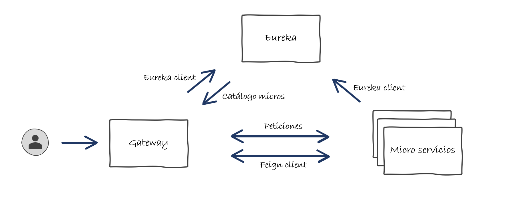

# Introducción Micro Servicios - Spring Cloud

## Que son los micro servicios?

Pues como su nombre indica, son servicios pequeñitos :)

Y ahora la descripción de ChatGPT:

Los micro servicios son una arquitectura de software en la que una aplicación está compuesta por pequeños servicios independientes que se comunican entre sí a través de interfaces bien definidas. Cada servicio se enfoca en realizar una tarea específica dentro de la aplicación y se ejecuta de manera autónoma.

Cada micro servicio es responsable de un dominio del negocio y puede ser desarrollado, probado, implementado y escalado de manera independiente. Esto permite una mayor flexibilidad y agilidad en el desarrollo y la implementación de aplicaciones, ya que los cambios en un servicio no afectan a otros servicios.

Además, los micro servicios son escalables y resistentes a fallos, ya que si un servicio falla, los demás servicios pueden seguir funcionando. También permiten la utilización de diferentes tecnologías para cada servicio, lo que ayuda a optimizar el rendimiento y la eficiencia en la aplicación en general.

## Spring Cloud

Existente multiples soluciones de micro servicios, en nuestro caso vamos a utilizar la solución que nos ofrece Spring que está incluido dentro del módulo [Spring Cloud](https://spring.io/projects/spring-cloud). 

Esta solución nace en Netflix para dar solución a sus propias necesidades, que con el tiempo, se ha incluido dentro de Spring y se ha evolucionado en paralelo para nutrirla con un amplio catálogo de funcionalidades.

## Infraestructura

A diferencia de una aplicación monolítica, en un enfoque de micro servicios, ya no basta únicamente con la aplicación, serán necesarios varios actores que se responsabilizarán de darle consistencia al sistema.

Las piezas que vamos a utilizar para la implementación de nuestra infraestructura, serán:

* **Discovery Service / Eureka Server**: Se trata del catálogo de todos los servicios que componen el sistema al cual cada servicio debe informar de su localización y disponibilidad.
* **Gateway**: Se trata de un servicio de redirección y balanceado que obtendrá de Eureka todos los servicios disponibles, su estado, número de instancias y en función de la configuración que le demos, gestionará las redirecciones a cada uno de ellos.
* **Micro Servicios / Eureka Client**: Son los micro servicios en sí, que ofrecen la funcionalidad del aplicativo. Estos Micro servicios informan periódicamente a Eureka de su estado para que en caso de perdida de servicio, el Gateway no redireccione a una determinada instancia que no se encuentra operativa.
* **Feign Client**: Mecanismo que utilizamos para la intercomunicación de los distintos micro servicios entre sí.

## Contexto de la aplicación

Vamos a proceder a realizar la misma aplicación que hemos implementado en la parte de Spring Boot pero esta vez aplicado un enfoque de micro servicios.

Con las piezas identificadas anteriormente y con el [Contexto de la aplicación](../../usecases.md) en mente, podemos obtener el siguiente diagrama:

Ya deberíamos tener claros los conceptos y los actores que compondrán nuestro sistema. podemos empezar!!!