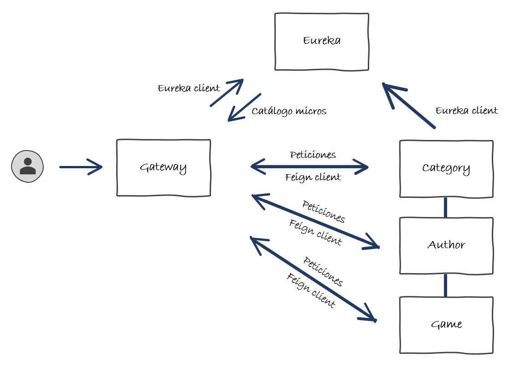

# Resumen Micro Servicios - Spring Cloud

## ¿Qué hemos hecho?

Llegados a este punto, ya has podido comprobar que implementar una aplicación orientada a micro servicios es bastante similar a una aplicación monolítica, con la salvedad de que tienes que tener en cuenta la distribución de estos, y por tanto su gestión y coordinación.

En definitiva, lo que hemos implementado ha sido:

* **Service Discovery**: Que ayudará a tener un catálogo de todos las piezas de mi infraestructura, su IP, su puerto y ciertas métricas que ayuden luego en la elección de servicio.

* **Gateway**: Que centraliza las peticiones en un único punto y permite hacer de balanceo de carga, seguridad, etc. Será el punto de entrada a nuestro ecosistema.

* **Micro servicio Category**: Contiene las operaciones sobre el ámbito funcional de categorías, guarda y recupera información de ese ámbito funcional.

* **Micro servicio Author**: Contiene las operaciones sobre el ámbito funcional de autores, guarda y recupera información de ese ámbito funcional.

* **Micro servicio Game**: Contiene las operaciones sobre el ámbito funcional de autores, guarda y recupera información de ese ámbito funcional. Además, realiza llamadas entre los otros dos micro servicios para nutrir de más información sus endpoints.

El diagrama de nuestra aplicación ahora es así:

## Siguientes pasos

Bueno, el siguiente paso más evidente, será ver que si conectas el frontend sigue funcionando exactamente igual que lo estaba haciendo antes.

Ahora te propongo hacer el mismo ejercicio con los otros dos módulos `Cliente` y `Préstamo` que has tenido que implementar en el punto [Ahora hazlo tu!](../../exercise.md).

Ten en cuenta que `Cliente` no depende de nadie, pero `Préstamo` si que depende de `Cliente` y de `Game`. A ver como solucionas los cruces y sobre todo los filtros :smile:

## Más formación, más información

Pues ya estaría todo, ahora solo te puedo dar la enhorabuena y pasar algo de información extra / cursos / formaciones por si quieres seguir aprendiendo.

Por un lado tienes el itinerario avanzado de [Springboot](https://degreed.com/pathway/08gxl0e7pw?orgsso=capgemini#section-4) donde se puede más detalle de micro servicios.

Por otro lado también tienes los itinerarios de [Cloud](https://degreed.com/pathway/3pmxr00g9n/pathway?orgsso=capgemini#section-1) ya que no todo va a ser micro servicios con Spring Cloud, también existen micro servicios con otras tecnologías, aunque el concepto es muy similar.
