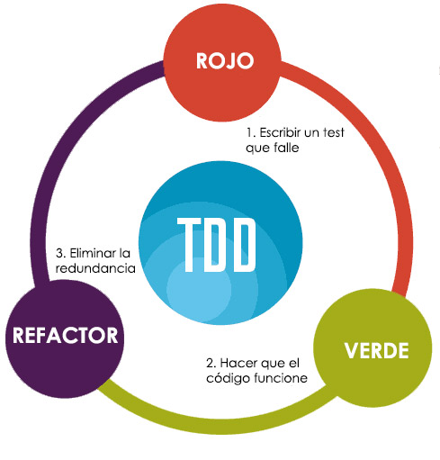

# TDD (Test Driven Development)

Se trata de una práctica de programación que consiste en escribir primero las pruebas (generalmente unitarias), después escribir el código fuente que pase la prueba satisfactoriamente y, por último, refactorizar el código escrito.

Este ciclo se suele representar con la siguiente imagen:

Con esta práctica se consigue entre otras cosas: un código más robusto, más seguro, más mantenible y una mayor rapidez en el desarrollo.

Los pasos que se siguen son:

1. Primero hay que escribir el test o los tests que cubran la funcionalidad que voy a implementar. Los test no solo deben probar los casos correctos, sino que deben probar los casos erróneos e incluso los casos en los que se provoca una excepción. Cuantos más test hagas, mejor probada y más robusta será tu aplicación.

	Además, como efecto colateral, al escribir el test estás pensando el diseño de cómo va a funcionar la aplicación. En vez de liarte a programar como loco, te estás forzando a pensar primero y ver cual es la mejor solución. Por ejemplo para implementar una operación de calculadora primero piensas en qué es lo que necesitarás: una clase Calculadora con un método que se llame Suma y que tenga dos parámetros.

2. El segundo paso una vez tengo definido el test, que evidentemente fallará (e incluso a menudo ni siquiera compilará), es implementar el código necesario para que los tests funcionen. Aquí muchas veces pecamos de querer implementar demasiadas cosas o pensando en que en un futuro necesitaremos modificar ciertas partes y lo dejamos ya preparado para ello. Hay que ir con mucho cuidado con las `optimizaciones prematuras`, a menudo no son necesarias y solo hacen que dificultar nuestro código.

	Piensa en construir el mínimo código que haga que tus tests funcionen correctamente. Además, no es necesario que sea un código demasiado purista y limpio.

3. El último paso y a menudo el más olvidado es el `Refactor`. Una vez te has asegurado que tu código funciona y que los tests funcionan correctamente (ojo no solo los tuyos sino todos los que ya existan en la aplicación) llega el paso de sacarle brillo a tu código.

	En este paso tienes que intentar mejorar tu código, evitar duplicidades, evitar malos olores de programación, eliminar posibles malos usos del lenguaje, etc. En definitiva que tu código se lea y se entienda mejor.

Si seguimos estos pasos a la hora de programar, nuestra aplicación estará muy bien testada. Cada vez que hagamos un cambio tendremos una certeza muy elevada, de forma rápida y sencilla, de si la aplicación sigue funcionando o hemos roto algo.
Y lo mejor de todo, las implementaciones que hagamos estarán bien pensadas y diseñadas y acotadas realmente a lo que necesitamos.