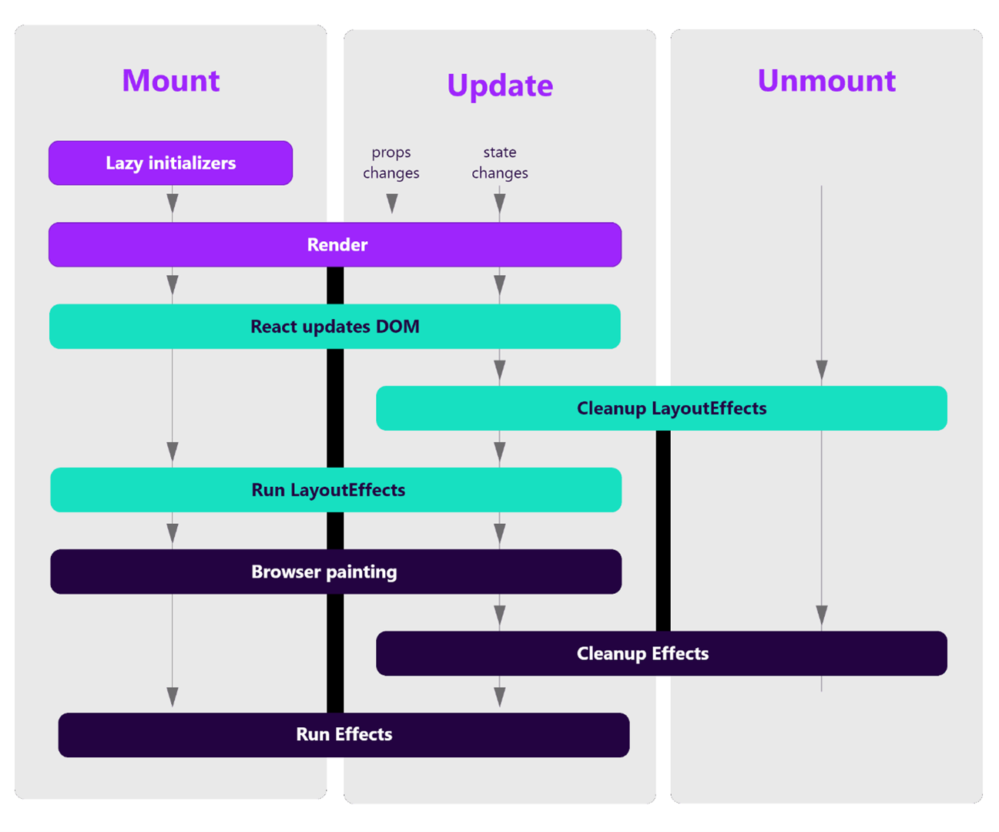

# Estructura y Buenas prácticas - React

!!! info "Nota"
    Antes de empezar y para puntualizar, React se considera un framework SPA Single-page application.

Aquí tenemos que puntualizar que React por sí mismo es una librería y no un framework, puesto que se ocupa de las interfaces de usuario. Sin embargo, diversos añadidos pueden convertir a React en un producto equiparable en características a un framework.

En esta parte vamos a explicar los fundamentos de un proyecto en React y las recomendaciones existentes.

## Estructura y funcionamiento

### Como funciona React

React es una herramienta para crear interfaces de usuario de una manera ágil y versátil, en lugar de manipular el DOM del navegador directamente, React crea un DOM virtual en la memoria, dónde realiza toda la manipulación necesaria antes de realizar los cambios en el DOM del navegador. 
Estas interfaces de usuario denominadas componentes pueden definirse como clases o funciones independiente y reutilizables con unos parámetros de entrada que devuelven elementos de react.
En ese tutorial solo utilizaremos componentes de tipo función.

!!! info "Nota"
    Desde la versión 16.8 se introdujo en React el concepto de hooks. Esto permitió usar el estado y otras características de React sin necesidad de escribir una clase.

### Ciclo de vida de un componente en React

El comportamiento de ciclo de vida de un componente React pasa por diferentes etapas que podemos ver en el esquema que mostramos a continuación:



Es importante tenerlo claro para saber que métodos podemos utilizar para realizar operaciones con el componente.

### Carpetas creadas por React

Al crear una aplicación React, tendremos los siguientes directorios:

- node_modules: *Todos los módulos de librerías usadas por el proyecto.*
-	\src\app: *Contiene todo el código asociado al proyecto.*
    -	\src\assets: *Normalmente la carpeta usada para los recursos.*

**Otros ficheros importantes de un proyecto de React**

Otros archivos que debemos tener en cuenta dentro del proyecto son:

- package.json: Dependencias de librerías y scripts


### Estructura de nuestro proyecto
Existe múltiples consensos al respecto de cómo estructurar un proyecto en React, pero al final, depende de los requisitos del proyecto.
Una sugerencia de cómo hacerlo es la siguiente:

```
- src\
	- components         /* Componentes comunes */ 
  - context            /* Carpeta para almacenar el contexto de la aplicación */ 
  - pages              /* Carpeta para componentes asociados a rutas del navegador */
      - components 	   /* Componentes propios de cada página */ 
  - redux              /* Para todo aquello relacionado con el estado de nuestra aplicación */
  - types              /* Carpeta para los tipos de datos de typescript */
```

Recordad, que ésto es una sugerencia para una estructura de carpetas y componentes. No existe un estándar.


## Buenas prácticas
A continuación, veremos un listado de buenas prácticas de React y de código limpio que deberíamos intentar seguir en nuestro desarrollo.

### Estructura de archivos
Antes de empezar con un proyecto lo ideal, es pararse y pensar en los requerimientos de una buena estructura, en un futuro lo agradecerás.

### Nombres claros
Utilizar la S de los principios S.O.L.I.D para los nombres de variables, métodos y demás código.

El efecto que produce este principio son clases con nombres muy descriptivos y por tanto largos.

### Organiza tu código
Intenta organizar tu código fuente:

-   Lo más importante debe ir arriba.
-   Primero propiedades, después métodos.
-   **Un Item para un archivo**: cada archivo debería contener solamente un componente, al igual que los servicios.
-   **Solo una responsabilidad**: Cada clase o modulo debería tener solamente una responsabilidad.
-   **El nombre correcto**: las propiedades y métodos deberían usar el sistema de camel case *(ej: getUserByName)*, al contrario, las clases (componentes, servicios, etc) deben usar upper camel case *(ej: UserComponent)*.
-   Los componentes y servicios deben tener su respectivo sufijo: UserComponent, UserService.
-   **Imports**: los archivos externos van primero.


### Usar linters Prettier & ESLint
Un linter es una herramienta que nos ayuda a seguir las buenas prácticas o guías de estilo de nuestro código fuente. En este caso, para JavaScript, proveeremos de unos muy famosos.
Recordar que añadir este tipo de configuración es opcional, pero necesaria para tener un buen código de calidad.

### Usa el estado correctamente
La primera regla del hook useState es usarlo solo localmente. El estado global de nuestra aplicación debe de entrar a nuestro componente a través de las props así como las mutaciones de este solo deben realizarse mediante alguna herramienta de gestión de estados como redux.
Por otro lado, es preferible no abusar de los hooks y solo usarlos cuando sea realmente necesario ya que pueden reducir el rendimiento de nuestra aplicación.

### Reutiliza código y componentes
Siempre que sea posible deberemos de reutilizar código mediante funciones compartidas o bien si este código implica almacenamiento de estado u otras características similares mediante custom Hooks.

### Usa TS en lugar de JS
Ya hemos creado nuestro proyecto incluyendo typescript pero esto no viene por defecto en un proyecto React como si pasa con Angular. Nuestra recomendación es que siempre que puedas añadas typescript a tus proyectos React, no solo se gana calidad en el código, sino que eliminamos la probabilidad de usar un componente incorrectamente y ganamos tiempo de desarrollo.
