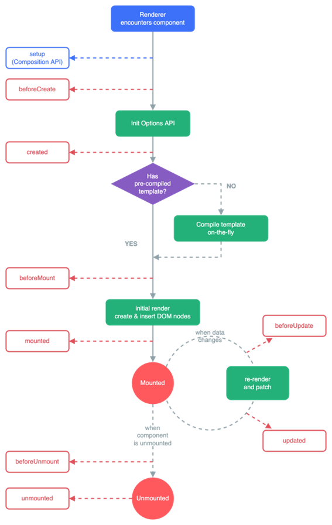

# Estructura y Buenas prácticas - Vue.js

!!! info "Nota"
    Antes de empezar y para puntualizar, Vue.js es un framework progresivo para construir interfaces de usuario. A diferencia de otros frameworks monolíticos, Vue.js está diseñado desde cero para ser utilizado incrementalmente. La librería central está enfocada solo en la capa de visualización, y es fácil de utilizar e integrar con otras librerías o proyectos existentes. Por otro lado, Vue.js también es perfectamente capaz de impulsar sofisticadas *Single-Page Applications* cuando se utiliza en combinación con herramientas modernas y librerías de apoyo.

En esta parte vamos a explicar los fundamentos de un proyecto en Vue.js y las recomendaciones existentes.

## Estructura y funcionamiento

### Ciclos de vida de un componente

Vue.js cuenta con un conjunto de ciclos de vida que permiten a los desarrolladores controlar y personalizar el comportamiento de sus componentes en diferentes momentos. Estos ciclos de vida se pueden agrupar en tres fases principales: creación, actualización y eliminación.

A continuación, te explicaré cada uno de los ciclos de vida disponibles en Vue.js junto con la Options API:

1.	beforeCreate: Este ciclo de vida se ejecuta inmediatamente después de que se haya creado una instancia de componente, pero antes de que se haya creado su DOM. En este punto, aún no es posible acceder a las propiedades del componente y aún no se han establecido las observaciones reactivas.

2.	created: Este ciclo de vida se ejecuta después de que se haya creado una instancia de componente y se hayan establecido las observaciones reactivas. En este punto, el componente ya puede acceder a sus propiedades y métodos.

3.	beforeMount: Este ciclo de vida se ejecuta justo antes de que el componente se monte en el DOM. En este punto, el componente ya está preparado para ser renderizado, pero aún no se ha agregado al árbol de elementos del DOM.

4.	mounted: Este ciclo de vida se ejecuta después de que el componente se ha montado en el DOM. En este punto, el componente ya está en el árbol de elementos del DOM y se puede acceder a sus elementos hijos y a los elementos del DOM que lo rodean.

5.	beforeUpdate: Este ciclo de vida se ejecuta justo antes de que el componente se actualice en respuesta a un cambio en sus propiedades o estado. En este punto, el componente aún no se ha actualizado en el DOM.

6.	updated: Este ciclo de vida se ejecuta después de que el componente se haya actualizado en el DOM en respuesta a un cambio en sus propiedades o estado. En este punto, el componente ya se ha actualizado en el DOM y se puede acceder a sus elementos hijos y a los elementos del DOM que lo rodean.

7.	beforeUnmount: Este ciclo de vida se ejecuta justo antes de que el componente se elimine del DOM. En este punto, el componente aún está en el árbol de elementos del DOM.

8.	unmounted: Este ciclo de vida se ejecuta después de que el componente se haya eliminado del DOM. En este punto, el componente ya no está en el árbol de elementos del DOM y no se puede acceder a sus elementos hijos.

9.	errorCaptured: Este ciclo de vida se ejecuta cuando se produce un error en cualquier descendiente del componente y se captura en el componente actual. Esto permite que el componente maneje el error de forma personalizada en lugar de propagarse hacia arriba en la cadena de componentes.

10.	activated: Este ciclo de vida se ejecuta cuando un componente que se encuentra en un árbol de componentes inactivo (por ejemplo, un componente en una pestaña inactiva) se activa.

11.	deactivated: Este ciclo de vida se ejecuta cuando un componente que se encuentra en un árbol de componentes activo (por ejemplo, un componente en una pestaña activa) se desactiva y se vuelve inactivo.

12.	renderTracked: Este ciclo de vida se ejecuta cuando se observa una dependencia en el proceso de renderizado del componente. Esto se utiliza principalmente para fines de depuración. 

13.	renderTriggered: Este ciclo de vida se ejecuta cuando se desencadena un nuevo renderizado del componente. Esto se utiliza principalmente para fines de depuración. 

14.	serverPrefetch: Este ciclo de vida se utiliza en el contexto de renderizado del lado del servidor (SSR). Se ejecuta cuando el componente se preprocesa en el servidor antes de enviarse al cliente. En este punto, el componente aún no se ha montado en el DOM y no se pueden realizar operaciones que dependan del DOM. Esto se utiliza principalmente para cargar datos de forma asíncrona antes de que se renderice el componente en el servidor. 

Os dejo un pequeño esquema de los ciclos de vida mas importantes y en que momento se ejecutan:

Es importante tenerlo claro para saber que métodos podemos utilizar para realizar operaciones con el componente.

### Carpetas creadas por Vue.js

- node_modules: *Todos los módulos de librerías usado por el proyecto.*
- public: *Contiene iconos y archivos accesibles por todos los usuarios.*
- .quasar: *Contiene configuración propia de Quasar.*
-	\src: *Contiene todo el código asociado al proyecto.*
    -	\src\assets: *Normalmente la carpeta usada para los recursos.*
    -	\src\components: *Aquí irán los diferentes componentes que iremos creando para la aplicación.*
    -	\src\router: *Es la carpeta donde el scafolding nos mete el router con sus diferentes rutas.*
    -	\src\layouts: *Aquí iran las diferentes vistas de la aplicación.*

**Otros ficheros importantes de un proyecto de Vue.js**

Otros archivos que debemos tener en cuenta dentro del proyecto son:

-	quasar.d.ts: Configurador de la conexión entre la librería y Vue
- package.json: Dependencias de librerías y scripts
- quasar.config.js: Configurador del CLI de Quasar
- \src\App.vue: Punto de entrada a nuestra aplicación

## Buenas prácticas

A continuación veremos un listado de buenas prácticas de Vue.js y de código limpio que deberíamos intentar seguir en nuestro desarrollo.

### Estructura de archivos
Antes de empezar con un proyecto lo ideal, es pararse y pensar en los requerimientos de una buena estructura, en un futuro lo agradecerás.

### Nombres claros

Determinar una manera de nombrar a los componentes (*UpperCamelCase*, *lowerCamelCase*, *kebab-case*, *snake_case*, ...) y continuarla para todos los archivos, nombres descriptivos de los componentes y en una ruta acorde (si es un componente que forma parte de una pantalla, se ubicará dentro de la carpeta de esa pantalla pero si se usa en más de una pantalla, se ubicará en una carpeta externa a cualquier pantalla llamada *common*), componentes de máximo 350 líneas y componentes con finalidad única (recibe los datos necesarios para realizar las tareas básicas de ese componente).

### Organiza tu código

El código debe estar ordenado dentro de los componente siguiendo un orden de importancia similar a este:

1.	**Importaciones** de las diferentes **librerías** o componentes usados.
2.	**Importaciones de funciones** de otros archivos (como *utils*).
3.	**Variables o constantes** usadas para almacenar la información necesaria en este componente.
4.	**Funciones** necesarias para el resto del código.
5.	**Variables computadas**, watchers, etc.
6.	**Código HTML** del componente.

### Consejos varios

!!! tip "Modificaciones entre componentes"
    A la hora de crear un componente básico (como un input propio) que necesite modificar su propio valor (algo que un componente hijo no debe hacer, ya que la variable estará en el padre), saber diferenciar entre v-model y modelValue (esta última sí que permite modificar el valor en el padre mediante el evento update:modelValue sin tener que hacer nada más en el padre que pasarle el valor).

!!! tip "Utiliza formateo y corrección de código"
    Si has seguido nuestro tutorial se habrá instalado ESLint y Prettier. Si no, deberías instalarlo para generar código de buena calidad. Además de instalar alguna extensión en Visual Studio Code que te ayude a gestionar esas herramientas.

!!! tip "Nomenclatura de funciones y variables"
    El nombre de las funciones, al igual que los path de una API, deberían ser autoexplicativos y no tener que seguir la traza del código para saber qué hace. Con un buen nombre para cada función o variables de estado, evitas tener que añadir comentarios para explicar qué hace o qué almacena cada una de ellas.       

