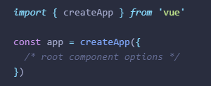
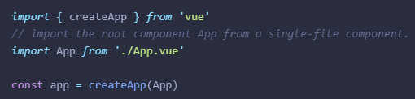

# Estructura y Buenas prácticas - Vue.js

!!! info "Nota"
    Antes de empezar y para puntualizar, Vue.js es un framework progresivo para construir interfaces de usuario. A diferencia de otros frameworks monolíticos, Vue.js está diseñado desde cero para ser utilizado incrementalmente. La librería central está enfocada solo en la capa de visualización, y es fácil de utilizar e integrar con otras librerías o proyectos existentes. Por otro lado, Vue.js también es perfectamente capaz de impulsar sofisticadas *Single-Page Applications* cuando se utiliza en combinación con herramientas modernas y librerías de apoyo.

En esta parte vamos a explicar los fundamentos de un proyecto en Vue.js y las recomendaciones existentes.

## Estructura y funcionamiento

### Instancia de la Aplicación

Cada aplicación de Vue.js se comienza creando una nueva **Instancia de Vue** con la función **createApp()**



### Componente raíz

El componente raíz es el objeto que pasamos a la función createApp. Toda aplicación requiere un "componente raíz" que pueda contener otros componentes como sus hijos.
Si estás usando Single-File Components, normalmente importamos el componente raíz desde otro archivo.




### Ciclos de vida de Vue.js

Vue.js 3 cuenta con un conjunto de ciclos de vida que permiten a los desarrolladores controlar y personalizar el comportamiento de sus componentes en diferentes momentos. Estos ciclos de vida se pueden agrupar en tres fases principales: creación, actualización y eliminación.

A continuación, te explicaré cada uno de los ciclos de vida disponibles en Vue.js 3 junto con la Options API:

1.	beforeCreate: Este ciclo de vida se ejecuta inmediatamente después de que se haya creado una instancia de componente, pero antes de que se haya creado su DOM. En este punto, aún no es posible acceder a las propiedades del componente y aún no se han establecido las observaciones reactivas.

2.	created: Este ciclo de vida se ejecuta después de que se haya creado una instancia de componente y se hayan establecido las observaciones reactivas. En este punto, el componente ya puede acceder a sus propiedades y métodos.

3.	beforeMount: Este ciclo de vida se ejecuta justo antes de que el componente se monte en el DOM. En este punto, el componente ya está preparado para ser renderizado, pero aún no se ha agregado al árbol de elementos del DOM.

4.	mounted: Este ciclo de vida se ejecuta después de que el componente se ha montado en el DOM. En este punto, el componente ya está en el árbol de elementos del DOM y se puede acceder a sus elementos hijos y a los elementos del DOM que lo rodean.

5.	beforeUpdate: Este ciclo de vida se ejecuta justo antes de que el componente se actualice en respuesta a un cambio en sus propiedades o estado. En este punto, el componente aún no se ha actualizado en el DOM.

6.	updated: Este ciclo de vida se ejecuta después de que el componente se haya actualizado en el DOM en respuesta a un cambio en sus propiedades o estado. En este punto, el componente ya se ha actualizado en el DOM y se puede acceder a sus elementos hijos y a los elementos del DOM que lo rodean.

7.	beforeUnmount: Este ciclo de vida se ejecuta justo antes de que el componente se elimine del DOM. En este punto, el componente aún está en el árbol de elementos del DOM.

8.	unmounted: Este ciclo de vida se ejecuta después de que el componente se haya eliminado del DOM. En este punto, el componente ya no está en el árbol de elementos del DOM y no se puede acceder a sus elementos hijos.

9.	errorCaptured: Este ciclo de vida se ejecuta cuando se produce un error en cualquier descendiente del componente y se captura en el componente actual. Esto permite que el componente maneje el error de forma personalizada en lugar de propagarse hacia arriba en la cadena de componentes.

10.	activated: Este ciclo de vida se ejecuta cuando un componente que se encuentra en un árbol de componentes inactivo (por ejemplo, un componente en una pestaña inactiva) se activa.

11.	deactivated: Este ciclo de vida se ejecuta cuando un componente que se encuentra en un árbol de componentes activo (por ejemplo, un componente en una pestaña activa) se desactiva y se vuelve inactivo.

12.	renderTracked: Este ciclo de vida se ejecuta cuando se observa una dependencia en el proceso de renderizado del componente. Esto se utiliza principalmente para fines de depuración. 

13.	renderTriggered: Este ciclo de vida se ejecuta cuando se desencadena un nuevo renderizado del componente. Esto se utiliza principalmente para fines de depuración. 

14.	serverPrefetch: Este ciclo de vida se utiliza en el contexto de renderizado del lado del servidor (SSR). Se ejecuta cuando el componente se preprocesa en el servidor antes de enviarse al cliente. En este punto, el componente aún no se ha montado en el DOM y no se pueden realizar operaciones que dependan del DOM. Esto se utiliza principalmente para cargar datos de forma asíncrona antes de que se renderice el componente en el servidor. 


Os dejo un pequeño esquema de los ciclos de vida mas importantes y en que momento se ejecutan:


Es importante tenerlo claro para saber que métodos podemos utilizar para realizar operaciones con el componente.

### Carpetas creadas por Vue.js

- node_modules: *Todos los módulos de librarías usado por el proyecto.*
-	\src: *Contiene todo el código asociado al proyecto.*
    -	\src\assets: *Normalmente la carpeta usada para los recursos.*
    -	\src\components: *Aquí irán los diferentes componentes que iremos creando para la aplicación.*
    -	\src\router: *Es la carpeta donde el scafolding nos mete el router con sus diferentes rutas.*
    -	\src\views: *Aquí iran las diferentes vistas de la aplicación.*


**Otros ficheros importantes de un proyecto de Vue.js**

Otros archivos que debemos tener en cuenta dentro del proyecto son:

-	main.ts: Es la puerta de entrada a la aplicación
- package.json: Dependencias de librerías y scripts


### Estructura de módulos

Existe múltiples consensos al respecto de como estructurar un proyecto en VUE, pero al final, depende de los requisitos del proyecto y de la gente que este trabajando en el. Lo que si seria muy importante es que todos usemos la misma estructura, por internet podemos encontrar diferentes sugerencias y quedarnos con la que nos guste mas, nosotros siempre recomendamos intentar desacoplar todo al máximo y a medida de lo posible seguir los principios de la Clean Architecture del `TIO BOB`.

!!! tip "ATENCIÓN: Componentes genéricos"
    Debemos tener en cuenta que a la hora de programar un componente `core`, lo ideal es pensar que sea un componente plug & play, es decir que si lo copias y lo llevas a otro proyecto funcione sin la necesidad de adaptarlo.

## Buenas prácticas

A continuación veremos un listado de buenas prácticas de Vue.js y de código limpio que deberíamos intentar seguir en nuestro desarrollo.

### Estructura de archivos
Antes de empezar con un proyecto lo ideal, es pararse y pensar en los requerimientos de una buena estructura, en un futuro lo agradecerás.

### Nombres claros
Utilizar la S de los principios S.O.L.I.D para los nombres de variables, métodos y demás código.

El efecto que produce este principio son clases con nombres muy descriptivos y por tanto largos.

### Organiza tu código

Intenta organizar tu código fuente:

-   Lo más importante debe ir arriba.
-   Primero propiedades, después métodos.
-   **Un Item para un archivo**: cada archivo debería contener solamente un componente, al igual que los servicios.
-   **Solo una responsabilidad**: Cada clase o modulo debería tener solamente una responsabilidad.
-   **El nombre correcto**: las propiedades y métodos deberían usar el sistema de camel case *(ej: getUserByName)*, al contrario, las clases (componentes, servicios, etc) deben usar upper camel case *(ej: UserComponent)*.
-   Los componentes y servicios deben tener su respectivo sufijo: UserComponent, UserService.
-   **Imports**: los archivos externos van primero.


### Usar linters Prettier & ESLint
Un linter es una herramienta que nos ayuda a seguir las buenas prácticas o guías de estilo de nuestro código fuente. En este caso, para JavaScript, proveeremos de unos muy famosos. Una de las más famosas es la combinación de **ESLint with Prettier**. Recordad que añadir este tipo de configuración es opcional, pero necesaria para tener un buen código de calidad.

### Git Hooks
Los Git Hooks son scripts de shell que se ejecutan automáticamente antes o después de que Git ejecute un comando importante como Commit o Push.
Para hacer uso de el es tan sencillo como:

npm install husky --save-dev

Y añadir en el fichero lo siguiente:

```js
// package.json
{
  "husky": {
    "hooks": {
      "pre-commit": "npm test",
      "pre-push": "npm test",
      "...": "..."
    }
  }
}
```

!!! tip "Usar husky para el preformateo de código antes de subirlo"
    Es una buena práctica que todo el equipo use el mismo estándar de formateo de codigo, con husky se puede solucionar.


### Lazy Load
Lazy Load es un patrón de diseño que consiste en retrasar la carga o inicialización.

Desde el router añadiremos un codigo parecido a este para hacer que la carga de rutas sea lazy:

```js
{
  path: '/about',
  name: 'about',
  // route level code-splitting
  // this generates a separate chunk (About.[hash].js) for this route
  // which is lazy-loaded when the route is visited.
  component: () => import('../views/AboutView.vue')
},
```

Con esto veremos que el módulo se cargará según se necesite.