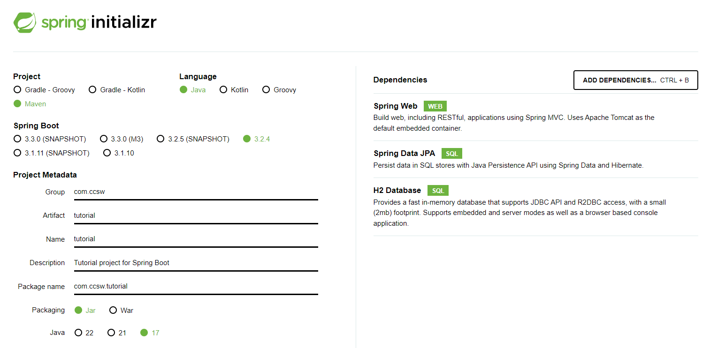

# Creación de proyecto

Por lo general necesitaremos un mínimo de dos proyectos para desarrollar una aplicación:

* Por un lado tendremos un proyecto Springboot que se ejecutará en un servidor de aplicaciones, tipo Tomcat. Este proyecto tendrá la lógica de negocio de las operaciones, el acceso a los datos de la BBDD y cualquier integración con servicios de terceros. La forma de exponer estas operaciones de negocio será mediante endpoints de acceso, en concreto llamadas tipo REST.
* Por otro lado tendremos un proyecto Angular que se ejecutará en un servidor web de ficheros estáticos, tipo Apache. Este proyecto será código javascript, css y html, que se ejecutará en el navegador Web y que realizará ciertas operaciones sencillas y validaciones en local y llamadas a nuestro servidor Springboot para ejecutar las operaciones de negocio.

Puede haber otro tipo de proyectos dentro de la aplicación, sobretodo si están basados en microservicios o tienen componentes batch, pero estos proyectos no vamos a verlos en el tutorial.

!!! tip "Consejo"
    Como norma cada uno de los proyectos que componen la aplicación, debería estar conectado a un repositorio de código diferente para poder evolucionar y trabajar con cada uno de ellos de forma aislada sin afectar a los demás. Así además podemos tener equipos aislados que trabajen con cada uno de los proyectos por separado.

!!! info "Info"
    Durante todo el tutorial, voy a intentar separar la construcción del proyecto Angular de la construcción del proyecto Springboot, para terminar haciendo una integración entre los dos. De esta forma podrás comprobar como se puede desarrollar por separado cada uno de los dos proyectos sin ningún problema.

## ** Creación de proyecto Angular **

La mayoría de los proyectos con Angular en los que trabajamos normalmente, suelen ser proyectos web usando las librerías mas comunes de angular, como angular material.

Para crear un proyecto de Angular, es necesario tener instalado el CLI de Angular. Si no lo tienes instalado, por favor, acude a la sección `Entorno de desarrollo` y verifica que tienes instalado todo lo necesario.

### Nuevo proyecto

Lo primero es crear un proyecto desde la consola mediante la herramienta Angular CLI.
Para ello abrimos una consola de msdos donde tengamos instalado y enlazado Angular CLI, nos situamos en el directorio donde vamos a crear el proyecto y ejecutamos:

    ng new tutorial

Nos realizará varias preguntas.

> Would you like to add Angular routing? (y/N)

>  `Preferiblemente: y`

> Which stylesheet format would you like to use?

>  `Preferiblemente: SCSS`

En el caso del tutorial como vamos a tener dos proyectos para nuestra aplicación (front y back), para poder seguir correctamente las explicaciones, voy a renombrar la carpeta para poder diferenciarla del otro proyecto. A partir de ahora se llamará `client`.

!!! info "Info"
    Si durante el desarrollo del proyecto necesitas añadir nuevos módulos al proyecto Angular, será necesario resolver las dependencias antes de arrancar el servidor. Esto se puede realizar mediante el gestor yarn (que es más eficiente que el propio gestio de npm), directamente en consola ejecuta el comando `yarn` y descargará e instalará las nuevas dependencias.


### Arrancar el proyecto

Para arrancar el proyecto, tan solo necesitamos ejecutar en consola el siguiente comando siempre dentro del directorio creado por Angular CLI:

    ng serve

Angular compilará el código fuente, levantará un servidor local al que podremos acceder por defecto mediante la URL: [http://localhost:4200/](http://localhost:4200/)

Y ya podemos empezar a trabajar con Angular.

!!! tip "Comandos de Angular CLI"
    Si necesitas más información sobre los comandos que ofrece Angular CLI para poder crear aplicaciones, componentes, servicios, etc. los tienes disponibles en:
    [https://angular.io/cli#command-overview](https://angular.io/cli#command-overview)


### Configurar el proyecto

!!! tip "Strict mode off"
    Este tutorial está creado y probado con una versión anterior al Angular actual, donde por defecto no estaba activado el modo estricto de TypeScript. Si sigues tal cual las instrucciones de las siguientes secciones te dará fallo por no estar codificado en modo estricto. Lo recomendable para poder hacer el tutorial sin problemas es desactivar este modo, siguiendo las instrucciones que se indican en [este enlace](https://stackoverflow.com/a/64344186/7475335).


## ** Creación de proyecto Springboot **

La mayoría de los proyectos Springboot en los que trabajamos normalmente, suelen ser proyectos web sencillos con pocas dependencias de terceros o incluso proyectos basados en microservicios que ejecutan pocas acciones. Ahora tienes dos formas de preparar el proyecto Springboot, descritas a continuación. Escoge una de ellas, la que más te guste.

### (Rápido) - Uso de plantilla base

Puedes descargarte una [plantilla ya construida](./assets/project-template.7z), con un proyecto generado a partir de Sprint Initializr y configurada con los pasos detallados en los puntos siguientes y así te ahorras tiempo.

#### Importar en eclipse

El siguiente paso, ovbiamente es descomprimir el proyecto generado e importarlo como proyecto Maven. Abrimos el eclipse, pulsamos en File → Import y seleccionamos `Existing Maven Projects`. Buscamos el proyecto y le damos a importar. Con esto ya tendríamos todo configurado.

### (Detallado) - Crear con Initilizr

Si has hecho el punto anterior, no es necesario que leas esto. Salta directamente al último punto de `Arrancar el proyecto`.
Si sigues leyendo verás como configurar paso a paso un proyecto de cero, con las librerías que vamos a utilizar en el tutorial.

#### ¿Como usarlo?

Spring ha creado una página interactiva que permite crear y configurar proyectos en diferentes lenguajes, con diferentes versiones de Spring Boot y añadiendole los módulos que nosotros queramos.

Esta página está disponible desde [Spring Initializr](https://start.spring.io/). Para seguir el ejemplo del tutorial, entraremos en la web y seleccionaremos los siguientes datos:

* Tipo de proyecto: Maven
* Lenguage: Java
* Versión Spring boot: 2.4.4
* Group: com.capgemini.ccsw
* ArtifactId: tutorial
* Versión Java: 8
* Dependencias: Spring Web, H2 Database




Esto nos generará un proyecto que ya vendrá configurado con Spring Web y H2 para crear una BBDD en memoria de ejemplo con la que trabajaremos durante el tutorial.


#### Importar en eclipse

El siguiente paso, ovbiamente es descomprimir el proyecto generado e importarlo como proyecto Maven. Abrimos el eclipse, pulsamos en File → Import y seleccionamos `Existing Maven Projects`. Buscamos el proyecto y le damos a importar.

#### Configurar las dependencias

Lo primero que vamos a hacer es añadir las dependencias a librerías de devonfw. Abriremos el fichero `pom.xml` que nos ha generado el Spring Initilizr y añadiremos las siguientes líneas:

=== "pom.xml"
    ``` xml hl_lines="21 24 25 26 27 28 29 30 31 32 33 34 35 38 39 40 41 42 44 45 46 47 48 50 51 52 53 54"
    <?xml version="1.0" encoding="UTF-8"?>
    <project xmlns="http://maven.apache.org/POM/4.0.0" xmlns:xsi="http://www.w3.org/2001/XMLSchema-instance"
      xsi:schemaLocation="http://maven.apache.org/POM/4.0.0 https://maven.apache.org/xsd/maven-4.0.0.xsd">
      <modelVersion>4.0.0</modelVersion>

      <parent>
        <groupId>org.springframework.boot</groupId>
        <artifactId>spring-boot-starter-parent</artifactId>
        <version>2.4.4</version>
        <relativePath/> <!-- lookup parent from repository -->
      </parent>

      <groupId>com.capgemini.ccsw</groupId>
      <artifactId>tutorial</artifactId>
      <version>0.0.1-SNAPSHOT</version>
      <name>tutorial</name>
      <description>Demo project for Spring Boot</description>

      <properties>
        <java.version>1.8</java.version>
        <devon4j.version>2021.04.003</devon4j.version>
      </properties>

      <dependencyManagement>
        <dependencies>
          <!-- BOM of devon4j -->
          <dependency>
            <groupId>com.devonfw.java.boms</groupId>
            <artifactId>devon4j-bom</artifactId>
            <version>${devon4j.version}</version>
            <type>pom</type>
            <scope>import</scope>
          </dependency>
        </dependencies>
      </dependencyManagement>

      <dependencies>
        <!-- Bean-Mapping for conversion from TO to Entity and vice versa -->
        <dependency>
          <groupId>com.devonfw.java.modules</groupId>
          <artifactId>devon4j-beanmapping-orika</artifactId>
        </dependency>
      
        <!-- Rest Mappers -->
        <dependency>
          <groupId>com.devonfw.java.modules</groupId>
          <artifactId>devon4j-rest</artifactId>
        </dependency>
        
        <!-- JPA -->
        <dependency>
          <groupId>com.devonfw.java.starters</groupId>
          <artifactId>devon4j-starter-spring-data-jpa</artifactId>
        </dependency>

        <dependency>
          <groupId>org.springframework.boot</groupId>
          <artifactId>spring-boot-starter-web</artifactId>
        </dependency>

        <dependency>
          <groupId>com.h2database</groupId>
          <artifactId>h2</artifactId>
          <scope>runtime</scope>
        </dependency>

        <dependency>
          <groupId>org.springframework.boot</groupId>
          <artifactId>spring-boot-starter-test</artifactId>
          <scope>test</scope>
          <exclusions>
            <exclusion>
              <groupId>org.junit.vintage</groupId>
              <artifactId>junit-vintage-engine</artifactId>
            </exclusion>
          </exclusions>
        </dependency>
      </dependencies>

      <build>
        <plugins>
          <plugin>
            <groupId>org.springframework.boot</groupId>
            <artifactId>spring-boot-maven-plugin</artifactId>
          </plugin>
        </plugins>
      </build>

    </project>
    ```

Hemos añadido las dependencias de Devonfw-JPA ya que nos permite utilizar más funcionalidades extendidas sobre repositorios JPA. Además de esa dependencia, hemos añadido una utilidad para hacer mapeos entre objetos y para configurar los servicios Rest.

!!! tip "Uso de defonfw"
    Vamos a utilizar algunas librerías de devonfw (fwk Opensource desarrollado por Capgemini, entre otros) que nos facilitan la vida a la hora de desarrollar una aplicación. Podríamos hacerlo directamente con los módulos de Spring pero hay ciertas utilidades que nos interesa usar de devonfw. Para más información puedes consultar su [Web Oficial](https://devonfw.com/)


#### Configurar librerias devonfw

El siguiente punto es crear las clases de configuración para las librerías que hemos añadido. Para ello vamos a crear un package de configuración general de la aplicación `com.capgemini.ccsw.tutorial.config` donde crearemos tres clases (dos de ellas dentro del subpaquete `mapper`).

=== "BeansOrikaConfig.java"
    ``` Java
    package com.capgemini.ccsw.tutorial.config;

    import org.springframework.context.annotation.Bean;
    import org.springframework.context.annotation.Configuration;

    import com.capgemini.ccsw.tutorial.config.mapper.BeanMapper;
    import com.capgemini.ccsw.tutorial.config.mapper.BeanMapperImpl;
    import com.devonfw.module.beanmapping.common.base.BaseOrikaConfig;
    import com.devonfw.module.json.common.base.ObjectMapperFactory;
    import com.fasterxml.jackson.databind.Module;

    import ma.glasnost.orika.MapperFactory;

    /**
    * Java bean configuration for Orika. The method {@link #configureCustomMapping(MapperFactory)} from
    * {@link BaseOrikaConfig} can be overridden as per requirements.
    * @author ccsw
    */
    @Configuration
    public class BeansOrikaConfig extends BaseOrikaConfig {

      /**
      * @return the {@link BeanMapper} implementation.
      */
      @Override
      @Bean
      public BeanMapper getBeanMapper() {

        return new BeanMapperImpl();
      }

      @Bean
      public Module configureObjectMapper() {

        ObjectMapperFactory objectMapper = new ObjectMapperFactory();
        return objectMapper.getExtensionModule();

      }

    }
    ```
=== "mapper/BeanMapper.java"
    ``` Java
    package com.capgemini.ccsw.tutorial.config.mapper;

    import org.springframework.data.domain.Page;

    /**
    * @author ccsw
    */
    public interface BeanMapper extends com.devonfw.module.beanmapping.common.api.BeanMapper {

      /**
      * Mapea el genérico de un Page en otro tipo de genérico
      * @param <T>
      * @param source
      * @param targetClass
      * @return
      */
      <T> Page<T> mapPage(Page<T> source, Class<T> targetClass);

    }
    ```
=== "mapper/BeanMapperImpl.java"
    ``` Java
    package com.capgemini.ccsw.tutorial.config.mapper;

    import java.util.List;

    import org.springframework.data.domain.Page;
    import org.springframework.data.domain.PageImpl;

    import com.devonfw.module.beanmapping.common.impl.orika.BeanMapperImplOrika;

    /**
    * @author ccsw
    */
    public class BeanMapperImpl extends BeanMapperImplOrika implements BeanMapper {

      /**
      * {@inheritDoc}
      */
      public <T> Page<T> mapPage(Page<T> source, Class<T> targetClass) {

        if (source == null) {
          return null;
        }

        List<T> list = mapList(source.getContent(), targetClass);

        return new PageImpl<>(list, source.getPageable(), source.getTotalElements());
      }

    }
    ```

Listo, ya podemos empezar a desarrollar nuestros servicios.

#### Configurar la BBDD

Por último, vamos a dejar configurada la BBDD en memoria. Para ello crearemos dos ficheros, de momento en blanco, dentro de `src/main/resources/`:

* schema.sql → Será el fichero que utilizaremos para crear el esquema de BBDD
* data.sql → Será el fichero que utilizaremos para rellenar con datos iniciales el esquema de BBDD


### Arrancar el proyecto

Por último ya solo nos queda arrancar el proyecto creado. Para ello buscaremos la clase `TutorialApplication.java` (o la clase principal del proyecto) y con el botón derecho seleccionaremos Run As → Java Application. La aplicación al estar basada en Springboot arrancará internamente un Tomcat embebido donde se despliegará el proyecto. Si habéis seguido el tutorial la aplicación estará disponible en [http://localhost:8080](http://localhost:8080), aunque de momento aun no tenemos nada accesible.