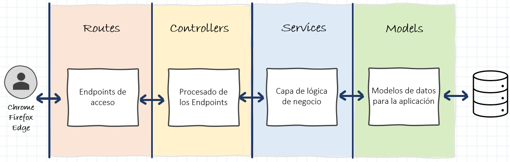
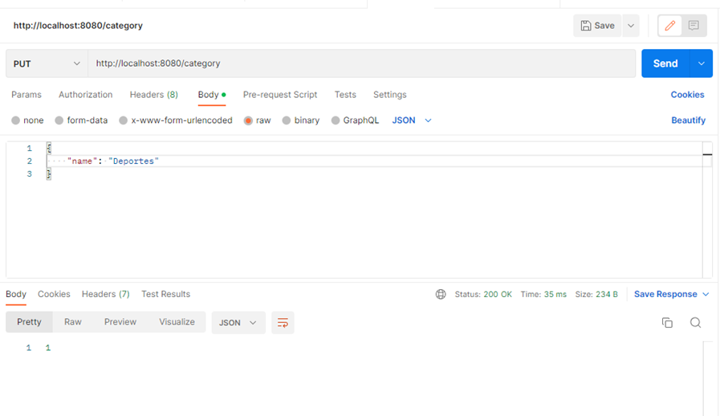
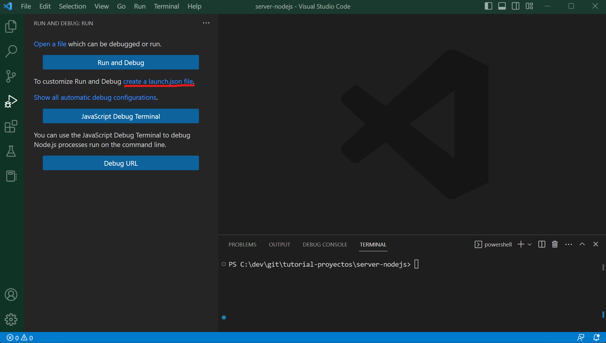
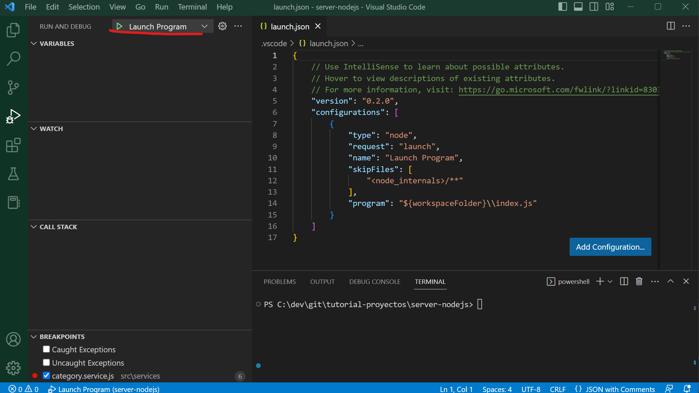
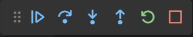

# Listado simple - Nodejs

Ahora que ya tenemos listo el proyecto backend de nodejs (en el puerto 8080) ya podemos empezar a codificar la solución.


## Primeros pasos

!!! success "Antes de empezar"
    Quiero hacer hincapié en Node tiene una documentación muy extensa y completa, así que te recomiendo que hagas uso de ella cuando tengas cualquier duda. Tanto en la web de [node](https://nodejs.org/en/) como de [express](https://expressjs.com/) encontrarás información detallada del proceso que vamos a seguir.

## Estructurar el código

La estructura de nuestro proyecto será la siguiente:



Vamos a aplicar una separación por capas. En primer lugar, tendremos una capa de rutas para reenviar las solicitudes admitidas y cualquier información codificada en las urls de solicitud a la siguiente capa de controladores. La capa de control procesará las peticiones de las rutas y se comunicará con la capa de servicios devolviendo la respuesta de esta mediante respuestas http. En la capa de servicio se ejecutará toda la lógica de la petición y se comunicará con los modelos de base de datos

En nuestro caso una ruta es una sección de código Express que asocia un verbo HTTP (GET, POST, PUT, DELETE, etc.), una ruta/patrón de URL y una función que se llama para manejar ese patrón.

¡Ahora sí, vamos a programar!

## Capa de Routes

Lo primero de vamos a crear es la carpeta principal de nuestra aplicación donde estarán contenidos los distintos elementos de la misma. Para ello creamos una carpeta llamada `src` en la raíz de nuestra aplicación.

El primero elemento que vamos a crear va a ser el fichero de rutas para la categoría. Para ello creamos una carpeta llamada `routes` en la carpeta `src` y dentro de esta carpeta crearemos un archivo llamado `category.routes.js`:

=== "category.routes.js"
``` Javascript
import { Router } from 'express';
import { createCategory } from '../controllers/category.controller.js';

const categoryRouter = Router();
categoryRouter.put('/', createCategory);

export default categoryRouter;
```

En este archivo estamos creando una ruta de tipo PUT que llamara al método `createCategory` de nuestro futuro controlador de categorías (aunque todavía no lo hemos creado y por tanto fallará).

Ahora en nuestro archivo `index.js` vamos a añadir lo siguiente justo después de declarar la constante app:

=== "index.js"
``` Javascript
...
import categoryRouter from './src/routes/category.routes.js';
...

...
app.use(cors({
    origin: '*'
}));

app.use(express.json());
app.use('/category', categoryRouter);

...
```

De este modo estamos asociando la url `http://localhost:8080/category` a nuestro router. También usaremos `express.json()` para parsear las peticiones entrantes a formato json.


## Capa de Controller

Lo siguiente será crear el método createCategory en nuestro controller. Para ello lo primero será crear una carpeta `controllers` en la carpeta `src` de nuestro proyecto y dentro de esta un archivo llamado `category.controller.js`:

=== "category.controller.js"
``` Javascript
export const createCategory = async (req, res) => {
    console.log(req.body);
    res.status(200).json(1);
}
```

Hemos creado la función `createCategory` que recibirá una request y una response. Estos parámetros vienen de la ruta de express y son la request y response de la petición HTTP. De momento simplemente vamos a hacer un `console.log` de `req.body` para ver el body de la petición y vamos a hacer una response 200 para indicar que todo ha ido correctamente.

Si arrancamos el servidor y hacemos una petición `PUT` con Postman a `http://localhost:8080/category` con un body que pongamos formado correctamente podremos ver la salida que hemos programado en nuestro controller y en la consola de node podemos ver el contenido de `req.body`.




## Capa de Modelo

Ahora para que los datos que pasemos en el body los podamos guardar en BBDD necesitaremos un modelo y un esquema para la entidad `Category`. Vamos a crear una carpeta llamada `schemas` en la carpeta `src` de nuestro proyecto. Un schema no es más que un modelo de BBDD que especifica que campos estarán presentes y cuáles serán sus tipos.
Dentro de la carpeta de schemas creamos un archivo con el nombre `category.schema.js`:

=== "category.schema.js"
``` Javascript
import mongoose from "mongoose";
const { Schema, model } = mongoose;
import normalize from 'normalize-mongoose';

const categorySchema = new Schema({
    name: {
        type: String,
        require: true
    }
});
categorySchema.plugin(normalize);
const CategoryModel = model('Category', categorySchema);

export default CategoryModel;
```

En este archivo estamos definiendo nuestro schema indicando sus propiedades y tipos, en nuestro caso únicamente `name`. Además del tipo también indicaremos que el campo es obligatorio con la validation require para indicar que ese campo es obligatorio.
Si quieres conocer otras validaciones [aquí tienes más info](https://mongoosejs.com/docs/validation.html).
Aparte de definir nuestro schema también lo estamos transformado en un modelo para poder trabajar con él. En el constructor de model le pasamos el nombre del modelo y el schema que vamos a utilizar.

## Capa de Servicio

Como hemos visto en nuestra estructura la capa controller no puede comunicarse con la capa modelo, debe de haber una capa intermedia, para ello vamos a crear una carpeta `services` en la carpeta `src` de nuestro proyecto y dentro un archivo `category.service.js`:

=== "category.service.js"
``` Javascript
import CategoryModel from '../schemas/category.schema.js';

export const createCategory = async function(name) {
    try {
        const category = new CategoryModel({ name });
        return await category.save();
    } catch (e) {
        throw Error('Error creating category');
    }
}
```

Hemos importado el modelo de categoría para poder realizar acciones sobre la BBDD y hemos creado una función que recogerá el nombre de la categoría y creará una nueva categoría con él. Llamamos al método save para guardar nuestra categoría y devolvemos el resultado.
Ahora en nuestro método del controller solo tenemos que llamar al servicio pasándole los parámetros que nos llegan en la petición:

=== "category.controller.js"
``` Javascript
import * as CategoryService from '../services/category.service.js';

export const createCategory = async (req, res) => {
    const { name } = req.body;
    try {
        const category = await CategoryService.createCategory(name);
        res.status(200).json({
            category
        });
    } catch (err) {
        res.status(400).json({
            msg: err.toString()
        });
    }
}
```

Si todo ha ido correctamente llamaremos al método de respuesta con el código 200 y la categoría creada. En caso contrario mandaremos un código de error.
Si ahora de nuevo vamos a postman y volvemos a lanzar nuestra petición podemos ver como nos devuelve una nueva categoría:


## Resto de Operaciones

### Recuperación categorías

Ahora que ya podemos crear categorías lo siguiente será crear un endpoint para recuperar las categorías creadas en nuestra base de datos. Podemos empezar añadiendo un nuevo método en nuestro servicio:

=== "category.service.js"
``` Javascript
export const getCategories = async function () {
    try {
        return await CategoryModel.find().sort('name');
    } catch (e) {
        throw Error('Error fetching categories');
    }
}
```

Al igual que en el anterior método haremos uso del modelo, pero esta vez para hacer un `find` y ordenando los resultados por el campo `name`.
Al método find se le pueden pasar `queries`, `projections` y `options`. Te dejo por aquí más info. En nuestro caso simplemente queremos que nos devuelva todas las categorías por lo que no le pasaremos nada.

Creamos también un método en el controlador para recuperar las categorías y que hará uso del servicio:

=== "category.controller.js"
``` Javascript
export const getCategories = async (req, res) => {
    try {
        const categories = await CategoryService.getCategories();
        res.status(200).json(
            categories
        );
    } catch (err) {
        res.status(400).json({
            msg: err.toString()
        });
    }
}
```

Y ahora que ya tenemos el método creado en el controlador lo siguiente será relacionar este método con una ruta. Para ello en nuestro archivo `category.routes.js` tendremos que añadir una nueva línea:

=== "category.routes.js"
``` Javascript
import { Router } from 'express';
import { createCategory, getCategories } from '../controllers/category.controller.js';

const categoryRouter = Router();
categoryRouter.put('/', createCategory);
categoryRouter.get('/', getCategories);

export default categoryRouter;
```

De este modo cuando hagamos una petición GET a `http://localhost:8080/category` nos devolverá el listado de categorías existentes: 


### Actualizar categoría

Ahora vamos a por el método para actualizar nuestras categorías. En el servicio creamos el siguiente método:

=== "category.service.js"
``` Javascript
export const updateCategory = async (id, name) => {
    try {
        const category = await CategoryModel.findById(id);
        if (!category) {
            throw Error('There is no category with that Id');
        }    
        return await CategoryModel.findByIdAndUpdate(id, {name});
    } catch (e) {
        throw Error(e);
    }
}
```

A este método le pasaremos de entrada el `id` y el `nombre`. Con ese `id` realizaremos una búsqueda para asegurarnos que esa categoría existe en nuestra base de datos. Si existe la categoría haremos una petición con `findByIdAndUpdate` donde el primer parámetro es el `id` y el segundo es el resto de los campos de nuestra entidad. 

En el controlador creamos el método correspondiente:


=== "category.controller.js"
``` Javascript

export const updateCategory = async (req, res) => {
    const categoryId = req.params.id;
    const { name } = req.body;
    try {
        await CategoryService.updateCategory(categoryId, name);
        res.status(200).json(1);
    } catch (err) {
        res.status(400).json({
            msg: err.toString()
        });
    }
}
```

Aquí recogeremos el parámetro `id` que nos vendrá en la url, por ejemplo: `http://localhost:8080/category/1`. Esto lo hacemos con `req.params.id`. El `id` es el nombre de la variable que le daremos en el router como veremos más adelante. 
Y una vez creado el método en el controlador tendremos que añadir la ruta en nuestro fichero de rutas correspondiente, pero como ya hemos dicho tendremos que indicar que nuestra ruta espera un parámetro id, lo haremos de la siguiente forma:


=== "category.routes.js"
``` Javascript
import { Router } from 'express';
import { createCategory, getCategories, updateCategory } from '../controllers/category.controller.js';

const categoryRouter = Router();
categoryRouter.put('/', createCategory);
categoryRouter.get('/', getCategories);
categoryRouter.put('/:id', updateCategory);

export default categoryRouter;
```

Y volvemos a probar en Postman:


Y si hacemos de nuevo un `GET` vemos como la categoría se ha modificado correctamente:


### Borrado categoría

Ya solo nos faltaría la operación de `delete` para completar nuestro CRUD, en el servicio añadimos un nuevo método:

=== "category.service.js"
``` Javascript
export const deleteCategory = async (id) => {
    try {
        const category = await CategoryModel.findById(id);
        if (!category) {
            throw Error('There is no category with that Id');
        }
        return await CategoryModel.findByIdAndDelete(id);
    } catch (e) {
        throw Error('Error deleting category');
    }
}
```

Como vemos es muy parecido al update, recuperamos el `id` de los parámetros de la ruta y en este caso llamaremos al método `findByIdAndDelete`.
En nuestro controlador creamos el método correspondiente:


=== "category.controller.js"
``` Javascript
export const deleteCategory = async (req, res) => {
    const categoryId = req.params.id;
    try {
        const deletedCategory = await CategoryService.deleteCategory(categoryId);
        res.status(200).json({
            category: deletedCategory
        });
    } catch (err) {
        res.status(400).json({
            msg: err.toString()
        });
    }
}
```

Y de nuevo añadimos la ruta correspondiente al archivo de rutas:

=== "category.routes.js"
``` Javascript
import { Router } from 'express';
import { createCategory, getCategories, updateCategory, deleteCategory } from '../controllers/category.controller.js';

const categoryRouter = Router();
categoryRouter.put('/', createCategory);
categoryRouter.get('/', getCategories);
categoryRouter.put('/:id', updateCategory);
categoryRouter.delete('/:id', deleteCategory);

export default categoryRouter;
```

Y de nuevo, probamos en postman:


Hacemos un get para comprobar que se ha borrado de nuestra base de datos:


## Capa de Middleware (Validaciones)

Antes de pasar a nuestro siguiente CRUD vamos a ver en que consiste la `Capa de Middleware`. 
Un `middleware` es un código que se ejecuta antes de que una petición http llegue a nuestro manejador de rutas o antes de que el cliente reciba una respuesta. 

En nuestro caso vamos a crear un middleware para asegurarnos que todos los campos que necesitamos en nuestras entidades vienen en el body de la petición.
Vamos a crear una carpeta `middlewares` en la carpeta `src` de nuestro proyecto y dentro crearemos el fichero `validateFields.js`:

=== "validateFields.js"
``` Javascript
import { response } from 'express';
import { validationResult } from 'express-validator';

const validateFields = (req, res = response, next) => {
    const errors = validationResult(req);
    if (!errors.isEmpty()) {
        return res.status(400).json({
            errors: errors.mapped()
        });
    }
    next();
}

export default validateFields;
```

En este método nos ayudaremos de la librería `express-validator` para ver los errores que tenemos en nuestras rutas. Para ello llamaremos a la función `validationResult` que nos devolverá un array de errores que más tarde definiremos. Si el array no va vacío es porque se ha producido algún error en las validaciones y ejecutara la response con un código de error.

Ahora definiremos las validaciones en nuestro archivo de rutas, debería quedar de la siguiente manera:


=== "category.routes.js"
``` Javascript
import { Router } from 'express';
import { check } from 'express-validator';
import validateFields from '../middlewares/validateFields.js';
import { getCategories, createCategory, deleteCategory, updateCategory } from '../controllers/category.controller.js';
const categoryRouter = Router();

categoryRouter.put('/:id', [
    check('name').not().isEmpty(),
    validateFields
], updateCategory);

categoryRouter.put('/', [
    check('name').not().isEmpty(),
    validateFields
], createCategory);

categoryRouter.get('/', getCategories);
categoryRouter.delete('/:id', deleteCategory);

export default categoryRouter;
```

Aquí nos ayudamos de nuevo de `express-validator` y de su método `check`. Para las rutas en las que necesitemos validaciones, añadimos un array como segundo parámetro. En este array vamos añadiendo todas las validaciones que necesitemos. En nuestro caso solo queremos que el campo name no sea vacío, pero existen muchas más validaciones que puedes encontrar en la documentación de [express-validator](https://express-validator.github.io/docs/). Importamos nuestro middleware y lo añadimos en la última posición de este array. 

De este modo no se realizarán las peticiones que no pasen las validaciones:


Y con esto habremos terminado nuestro primer CRUD.

##Depuración

Una parte muy importante del desarrollo es tener la capacidad de depurar nuestro código, en este apartado vamos a explicar como se realiza `debug` en Backend.

Esta parte se realiza con las herramientas incluidas dentro de nuestro IDE favorito, en este caso vamos a utilizar el Visual Estudio.

Lo primero que debemos hacer es configurar el modo `Debug` de nuestro proyecto.

Para ello nos dirigimos a la opción `Run and Debug` y creamos el fichero de launch necesario:



Esto nos creará el fichero necesario y ya podremos arrancar la aplicación mediante esta herramienta presionando el botón `Launch Program` (seleccionamos tipo de aplicación Node y el script de arranque que será el que hemos utilizado en el desarrollo):



Arrancada la aplicación de este modo, vamos a depurar la operación de crear categoría.

Para ello vamos a abrir nuestro fichero donde tenemos la implementación del servicio de creación de la capa de la lógica de negocio `category.service.js`.

Dentro del fichero ya podemos añadir puntos de ruptura (breakpoint), en nuestro caso queremos comprobar que el nombre introducido se recibe correctamente.

Colocamos el breakpoint en la primera línea del método (click sobre el número de la línea) y desde la interfaz/postman creamos una nueva categoría.

Hecho esto, podemos observar que a nivel de interfaz/postman, la petición se queda esperando y el IDE mostrará un panel de manejo de los puntos de interrupción:



El IDE nos lleva al punto exacto donde hemos añadido el breakpoint y se para en este punto ofreciéndonos la posibilidad de explorar el contenido de las variables del código:


Aquí podemos comprobar que efectivamente la variable `name` tiene el valor que hemos introducido por pantalla/postman.

Para continuar con la ejecución basta con darle al botón de `play` del panel de manejo de los puntos de interrupción.