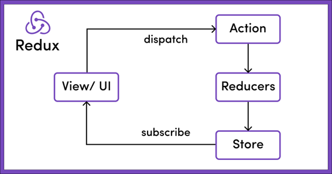

# Listado simple - React

Ahora que ya tenemos listo el proyecto frontend de React (en el puerto 5173), ya podemos empezar a codificar la solución.

## Primeros pasos

!!! success "Antes de empezar"
    Quiero hacer hincapié que React tiene una documentación muy extensa y completa, así que te recomiendo que hagas uso de ella cuando tengas cualquier duda. Tanto en la propia web de documentación de [React](https://es.react.dev/) como en la web de componentes [Mui](https://mui.com/) puedes buscar casi cualquier ejemplo que necesites.

Si abrimos el proyecto con el IDE que tengamos (Visual Studio Code en el caso del tutorial) podemos ver que en la carpeta `src` existen unos ficheros ya creados por defecto. Estos ficheros son:

* `main.tsx` → contiene el componente principal del proyecto.
* `index.css` → contiene los estilos CSS globales de la aplicación.
* `APP.tsx` → contiene el componente inicial del proyecto 
* `APP.css` → contiene los estilos para el componente APP.


Aunque `main.tsx` y `App.tsx` puedan parecer lo mismo `main.tsx` se suele dejar tal y como esta ya que lo único que hace es asociar el div con id “root” del archivo `index.html` de la raíz de nuestro proyecto para que sea el nodo principal de React. En el archivo `App.tsx` es donde realmente empezamos a desarrollar código.

Vamos a modificar este código inicial para ver cómo funciona. Abrimos el fichero `App.tsx` y vamos a dejarlo de esta manera:

``` Typescript
import { useState } from 'react'
import './App.css'

function App() {
  const [count, setCount] = useState(0)
  const probando = "probando 123";

  return (
    <>
      <p>{probando}</p>
      <div className="card">
        <button onClick={() => setCount((count) => count + 1)}>
          count is {count}
        </button>
      </div>
    </>
  )
}

export default App
```

Si ahora abrimos nuestro navegador veremos en pantalla el valor de la variable "probando" que hemos introducido mediante una expresión en un tag p de html y un botón que si pulsamos incrementará el valor de la cuenta en uno. Si refrescamos la pantalla el valor de la cuenta volverá automáticamente a 0. Es hora de explicar como funciona un componente React y el hook useState.

## JSX

JSX significa Javascript XML. JSX nos permite escribir elementos HTML en JavaScript y colocarlos en el DOM. Con JSX puedes escribir expresiones dentro de llaves “{}”. Estas expresiones pueden ser variables, propiedades o cualquier expresión Javascript valida. JSX ejecutará esta expresión y devolverá el resultado.

Por ejemplo, si queremos mostrar un elemento de forma condicional lo podemos hacer de la siguiente manera: 

``` Typescript
        {
          variableBooleana  && <p>El valor es true</p>
        }
```

También podemos usar el operador ternario para condiciones: 

``` Typescript
        {
          variableBooleana  ? <p>El valor es true</p> : <p>El valor es false</p>
        }
```

Y si lo que queremos es recorrer un array e ir representando los elementos lo podemos hacer de la siguiente manera:

``` Typescript
        {
          arrayNumerico.map(numero => <p>Mi valor es {numero}</p>)
        }
```

React solo puede devolver un elemento en su bloque return, es por eso por lo que algunas veces se rodea todo el código con un elemento llamado Fragment “<></>”. Estos fragment no soportan ni propiedades ni atributos y no tendrán visibilidad en el dom.

Dentro de una expresión podemos ver dos formas de llamar a una función:

``` Typescript
<Button onClick={callToCancelar}>Cancelar</Button>
<Button onClick={() => callToCancelar('param1')}>Cancelar</Button>
```

En la primera se pasa una función por referencia y Button es el responsable de los parámetros del evento. En la segunda tras hacer onClick se ejecuta la función callToCancelar con los parámetros que nosotros queramos quitando esa responsabilidad a Button. En términos de rendimiento es mejor la primera manera ya que en la segunda se vuelve a crear la función en cada renderizado, pero hay veces que es necesario hacerlo así para tomar control de los parámetros.

## useState hook

Todo componente en React tiene una serie de variables. Algunas de estas son propiedades de entrada como podrían serlo disabled en un botón y que se trasmiten de componentes padres a hijos. 

Luego tenemos variables y constantes declaradas dentro del componente como por ejemplo la constante probando de nuestro ejemplo. Y finalmente tenemos unas variables especiales dentro de nuestro componente que corresponden al estado de este.

Si modificamos el estado de un componente este automáticamente se volverá a renderizar y producirá una nueva representación en pantalla.

Como ya hemos comentado previamente los hooks aparecieron en la versión 16.8 de React. Antes de esto si queríamos acceder al estado de un componente solo podíamos acceder a este mediante componentes de clase, pero desde esta versión podemos hacer uso de estas funciones especiales para utilizar estas características de React.

Más tarde veremos otras, pero de momento vamos a ver useState. 

```
const [count, setCount] = useState(0)
```

En nuestro ejemplo tenemos una variable count que va mostrando su valor en el interior de un botón. Si pulsamos el botón ejecutara la función `setCount` que actualiza el valor de nuestro contador. A esta función se le puede pasar o bien el nuevo valor que tomará esta variable de estado o bien una función cuyo primer parámetro es el valor actual de la variable. Siempre que se actualice la variable del estado de producirá un nuevo renderizado del componente, eso lo podéis comprobar escribiendo un `console.log` antes del return. En nuestro caso hemos inicializado nuestra variable de estado con el valor 0, pero puede inicializarse con un valor de cualquier tipo javascript. No existe limite en el número de variables de estado por componente.

Debemos tener en cuenta que si modificamos el estado de un componente que renderiza otros componentes, estos también se volverán a renderizar al cambiar el estado del componente padre. Es por esto por lo que debemos tener cuidado a la hora de modificar estados y renderizar los hijos correctamente. 

!!! info "Nota"
    Para evitar el re-renderizado de los componentes hijos existe una función especial en React llamada `memo` que evita este comportamiento si las props de los hijos no se ven modificadas. En este curso no cubriremos esta funcionalidad.

!!! info "Nota"
    Por convención todos los hooks empiezan con `use`. Si en algún proyecto tienes que crear un custom hook es importante seguir esta nomenclatura.

## Librería de componentes y resto de dependencias

Antes de continuar con nuestro curso vamos a instalar las dependencias necesarias para empezar a construir la base de nuestra aplicación. Para ello ejecutamos lo siguiente en la consola en la raíz de nuestro proyecto:

```
npm i @mui/material @mui/icons-material react-router-dom react-redux @reduxjs/toolkit @emotion/react @emotion/styled
```

Como librería de componentes vamos a utilizar Mui, anteriormente conocido como Material ui, es una librería muy utilizada en los proyectos de React con una gran documentación. También necesitaremos las librerías de emotion necesarias para trabajar con Mui.

Vamos a utilizar la librería react router dom que nos permitirá definir y usar rutas de navegación en nuestra aplicación.

Vamos a instalar también react redux y redux toolkit para gestionar el estado global de nuestra aplicación.

## Layout general
### Crear componente

Lo primero que haremos será borrar el contenido del archivo `App.css` y vamos a modificar `index.css` con el siguiente contenido:

``` css
:root {
  font-family: Inter, system-ui, Avenir, Helvetica, Arial, sans-serif;
}

body {
  margin: 0;
}

@media (prefers-color-scheme: light) {
  :root {
    color: #213547;
    background-color: #ffffff;
  }
}

.container {
  margin: 20px;
}

.newButton {
  display: flex;
  justify-content: flex-end;
  margin-top: 20px;
}
```

Ahora vamos a crear los distintos componentes que compondrán nuestra aplicación. Para ello dentro de la carpeta src vamos a crear una nueva carpeta llamada pages y dentro de esta crearemos tres carpetas relativas a nuestras paginas navegables: “Author”, “Category” y “Game”. Dentro de estas a su vez crearemos un fichero llamado `Author.tsx`, `Category.tsx` y `Game.tsx` respectivamente, cuyo contenido será una función que tendrá por nombre el mismo nombre que el fichero y que devolverá un div cuyo contenido será también el nombre del fichero: 

``` Typescript
export const Game = () => {
  return (
    <div>Game</div>
  )
}
```

Ahora vamos a crear en la carpeta src otra carpeta cuyo nombre será “components” y dentro de esta un fichero llamado `Layout.tsx` cuyo contenido será el siguiente:

``` Typescript
import { useState } from "react";
import AppBar from "@mui/material/AppBar";
import Box from "@mui/material/Box";
import Toolbar from "@mui/material/Toolbar";
import IconButton from "@mui/material/IconButton";
import Typography from "@mui/material/Typography";
import Menu from "@mui/material/Menu";
import MenuIcon from "@mui/icons-material/Menu";
import Container from "@mui/material/Container";
import Button from "@mui/material/Button";
import MenuItem from "@mui/material/MenuItem";
import CasinoIcon from "@mui/icons-material/Casino";
import { useNavigate, Outlet } from "react-router-dom";

const pages = [
  { name: "Catalogo", link: "games" },
  { name: "Categorías", link: "categories" },
  { name: "Autores", link: "authors" },
];

export const Layout = () => {
  const navigate = useNavigate();

  const [anchorElNav, setAnchorElNav] = useState<null | HTMLElement>(
    null
  );

  const handleOpenNavMenu = (event: React.MouseEvent<HTMLElement>) => {
    setAnchorElNav(event.currentTarget);
  };

  const handleCloseNavMenu = (link: string) => {
    navigate(`/${link}`);
    setAnchorElNav(null);
  };

  return (
    <>
      <AppBar position="static">
        <Container maxWidth="xl">
          <Toolbar disableGutters>
            <CasinoIcon sx={{ display: { xs: "none", md: "flex" }, mr: 1 }} />
            <Typography
              variant="h6"
              noWrap
              component="a"
              href="/"
              sx={{
                mr: 2,
                display: { xs: "none", md: "flex" },
                fontFamily: "monospace",
                fontWeight: 700,
                letterSpacing: ".3rem",
                color: "inherit",
                textDecoration: "none",
              }}
            >
              Ludoteca Tan
            </Typography>

            <Box sx={{ flexGrow: 1, display: { xs: "flex", md: "none" } }}>
              <IconButton
                size="large"
                aria-label="account of current user"
                aria-controls="menu-appbar"
                aria-haspopup="true"
                onClick={handleOpenNavMenu}
                color="inherit"
              >
                <MenuIcon />
              </IconButton>
              <Menu
                id="menu-appbar"
                anchorEl={anchorElNav}
                anchorOrigin={{
                  vertical: "bottom",
                  horizontal: "left",
                }}
                keepMounted
                transformOrigin={{
                  vertical: "top",
                  horizontal: "left",
                }}
                open={Boolean(anchorElNav)}
                onClose={handleCloseNavMenu}
                sx={{
                  display: { xs: "block", md: "none" },
                }}
              >
                {pages.map((page) => (
                  <MenuItem
                    key={page.name}
                    onClick={() => handleCloseNavMenu(page.link)}
                  >
                    	<Typography textAlign="center">
                        {page.name}
                      </Typography>
                  </MenuItem>
                ))}
              </Menu>
            </Box>
            <CasinoIcon sx={{ display: { xs: "flex", md: "none" }, mr: 1 }} />
            <Typography
              variant="h5"
              noWrap
              component="a"
              href=""
              sx={{
                mr: 2,
                display: { xs: "flex", md: "none" },
                flexGrow: 1,
                fontFamily: "monospace",
                fontWeight: 700,
                letterSpacing: ".3rem",
                color: "inherit",
                textDecoration: "none",
              }}
            >
              Ludoteca Tan
            </Typography>
            <Box sx={{ flexGrow: 1, display: { xs: "none", md: "flex" } }}>
              {pages.map((page) => (
                <Button
                  key={page.name}
                  onClick={() => handleCloseNavMenu(page.link)}
                  sx={{ my: 2, color: "white", display: "block" }}
                >
                  {page.name}
                </Button>
              ))}
            </Box>
          </Toolbar>
        </Container>
      </AppBar>
      <Outlet />
    </>
  );
};
```

Aunque puede parecer complejo por su tamaño en realidad no es tanto, casi todo es código cogido directamente de un ejemplo de layout de navegación de un componente de MUI.

Lo más destacable es un nuevo hook (en realidad es un custom hook de react router dom) llamado `useNavigate` que como su propio nombre indica navegara a la ruta correspondiente según el valor pulsado.

Las etiquetas sx son para dar estilo a los componentes de MUI. También se puede sobrescribir el estilo mediante hojas css pero es más complejo y requiere una configuración inicial que no cubriremos en este tutorial.

Si nos fijamos en la línea 90 se introduce una expresión javascript en la cual se recorre el array de pages declarado al inicio del componente y para cada uno de los valores se llama a `MenuItem` que es otro componente React al que se le pasan las props key, onClick y aunque no lo veamos también la prop “children”.

La prop children estará presente cuando pasemos elementos entre los tags de un elemento:

``` Typescript
<MenuItem >     
<Typography>I’m a child</Typography>
 </MenuItem>
```
El uso de la prop children no es muy recomendado y se prefiere que se pasen los elementos como una prop más.

Siempre que rendericemos un array en react es recomendable usar una prop especial llamada “key”, de hecho, si no la usamos la consola de desarrollo se nos llenará de warnings por no usarla. 

Esta key lo que permite a React es identificar cada elemento de formar más eficiente, así si modificamos, añadimos o eliminamos un elemento de un array no será necesario volver a renderizar todo el array, solo se eliminará el elemento necesario.

En la parte final del archivo tenemos una llamada al elemento `Outlet`. Este elemento es el que albergara el componente asociado a la ruta seleccionada.

Por último, el archivo `App.tsx` se tiene que quedar de esta manera:

``` Typescript
import { BrowserRouter, Routes, Route, Navigate } from "react-router-dom";
import { Game } from "./pages/Game/Game";
import { Author } from "./pages/Author/Author";
import { Category } from "./pages/Category/Category";
import { Layout } from "./components/Layout";

function App() {
  return (
        <BrowserRouter>
          <Routes>
            <Route element={<Layout />}>
              <Route index path="games" element={<Game />} />
              <Route path="categories" element={<Category />} />
              <Route path="authors" element={<Author />} />
              <Route path="*" element={<Navigate to="/games" />} />
            </Route>
          </Routes>
        </BrowserRouter>
  );
}

export default App;
```
De esta manera definimos cada una de nuestras rutas y las asociamos a una página.

Vamos a arrancar el proyecto de nuevo con npm run dev y navegamos a http://localhost:5173/.

Ahora podemos ver como automáticamente nos lleva a http://localhost:5173/games debido al último route en el que redirigimos cualquier path que no coincida con los anteriores a `/games`. Si pulsamos sobre las distintas opciones del menú podemos ver cómo va cambiando el outlet de nuestra aplicación con los distintos div creados para cada uno de los componentes página.

## Creando un listado simple
### Página categorías

Ya tenemos la estructura principal, ahora vamos a crear nuestra primera pantalla. Vamos a empezar por la de categorías.

Lo primero que vamos a hacer es crear una carpeta llamada `types` dentro de `src/`. Aquí crearemos los tipos de typescript. Creamos un nuevo fichero llamado `Category.ts` cuyo contenido será el siguiente:

``` Typescript
export interface Category {
  id: string;
  name: string;
}
```

Ahora vamos a crear un archivo de estilos que será solo utilizado por el componente Category. Para ello dentro de la carpeta `src/pages/Category` vamos a crear un archivo llamado `Category.module.css`. Al llamar al archivo de esta manera React reconoce este archivo como un archivo único para un componente y hace que sus reglas css sean más prioritarias, aunque por ejemplo exista una clase con el mismo nombre en el archivo `index.css`.

El contenido de nuestro archivo css será el siguiente:

``` css
.tableActions {
    margin-right: 20px;
    display: flex;
    justify-content: flex-end;
    align-content: flex-start;
    gap: 19px;
}
```

Y por último el contenido de nuestro fichero `src/pages/Category.tsx` quedaría así:

``` Typescript
import { useState } from "react";
import Table from "@mui/material/Table";
import TableBody from "@mui/material/TableBody";
import TableCell from "@mui/material/TableCell";
import TableContainer from "@mui/material/TableContainer";
import TableHead from "@mui/material/TableHead";
import TableRow from "@mui/material/TableRow";
import Paper from "@mui/material/Paper";
import Button from "@mui/material/Button";
import EditIcon from "@mui/icons-material/Edit";
import ClearIcon from "@mui/icons-material/Clear";
import IconButton from "@mui/material/IconButton";
import styles from "./Category.module.css";
import { Category as CategoryModel } from "../../types/Category";

export const Category = () => {
  const data = [
    {
      id: "1",
      name: "Test 1",
    },
    {
      id: "2",
      name: "Test 2",
    },
  ];

  return (
    <div className="container">
      <h1>Listado de Categorías</h1>
      <TableContainer component={Paper}>
        <Table sx={{ minWidth: 650 }} aria-label="simple table">
          <TableHead
            sx={{
              "& th": {
                backgroundColor: "lightgrey",
              },
            }}
          >
            <TableRow>
              <TableCell>Identificador</TableCell>
              <TableCell>Nombre categoría</TableCell>
              <TableCell></TableCell>
            </TableRow>
          </TableHead>
          <TableBody>
            {data.map((category: CategoryModel) => (
              <TableRow
                key={category.id}
                sx={{ "&:last-child td, &:last-child th": { border: 0 } }}
              >
                <TableCell component="th" scope="row">
                  {category.id}
                </TableCell>
                <TableCell component="th" scope="row">
                  {category.name}
                </TableCell>
                <TableCell>
                  <div className={styles.tableActions}>
                    <IconButton aria-label="update" color="primary">
                      <EditIcon />
                    </IconButton>
                    <IconButton aria-label="delete" color="error">
                      <ClearIcon />
                    </IconButton>
                  </div>
                </TableCell>
              </TableRow>
            ))}
          </TableBody>
        </Table>
      </TableContainer>
      <div className="newButton">
        <Button variant="contained">Nueva categoría</Button>
      </div>
    </div>
  );
};
```
De momento vamos a usar un listado mockeado para mostrar nuestras categorias. El código JSX esta sacado prácticamente en su totalidad del ejemplo de una tabla de Mui y solo hemos modificado el nombre del array que tenemos que recorrer, sus atributos y hemos añadido unos botones de acción para editar y borrar autores que de momento no hacen nada.

Si abrimos un navegador (con el servidor arrancado npm run dev) y vamos a http://localhost:5173/categories podremos ver nuestro listado con los datos mockeados.

Ahora vamos a crear un componente que se mostrará cuando pulsemos el botón de nueva categoría. En la carpeta `src/pages/category` vamos a crear una nueva carpeta llamada `components` y dentro de esta crearemos un nuevo fichero llamado `CreateCategory.tsx` que tendrá el siguiente contenido:

``` Typescript
import { useState } from "react";
import Button from "@mui/material/Button";
import TextField from "@mui/material/TextField";
import Dialog from "@mui/material/Dialog";
import DialogActions from "@mui/material/DialogActions";
import DialogContent from "@mui/material/DialogContent";
import DialogTitle from "@mui/material/DialogTitle";
import { Category } from "../../../types/Category";

interface Props {
  category: Category | null;
  closeModal: () => void;
  create: (name: string) => void;
}

export default function CreateCategory(props: Props) {
  const [name, setName] = useState(props?.category?.name || "");

  return (
    <div>
      <Dialog open={true} onClose={props.closeModal}>
        <DialogTitle>
          {props.category ? "Actualizar Categoría" : "Crear Categoría"}
        </DialogTitle>
        <DialogContent>
          {props.category && (
            <TextField
              margin="dense"
              disabled
              id="id"
              label="Id"
              fullWidth
              value={props.category.id}
              variant="standard"
            />
          )}
          <TextField
            margin="dense"
            id="name"
            label="Nombre"
            fullWidth
            variant="standard"
            onChange={(event) => setName(event.target.value)}
            value={name}
          />
        </DialogContent>
        <DialogActions>
          <Button onClick={props.closeModal}>Cancelar</Button>
          <Button onClick={() => props.create(name)} disabled={!name}>
            {props.category ? "Actualizar" : "Crear"}
          </Button>
        </DialogActions>
      </Dialog>
    </div>
  );
}
```  

Para este componente hemos definido una categoría como parámetro de entrada para poder reutilizar el componente en el caso de una edición y poder pasar la categoría a editar, en nuestro caso inicial al ser un alta esta categoría tendrá el valor `null`. También hemos definido dos funciones en los parámetros de entrada para controlar o bien el cerrado del modal o bien la creación de un autor.

Esta es la forma directa que tienen de comunicación los componentes padre/hijo en React, el padre puede pasar datos de lectura o funciones a sus componentes hijos a las que estos llamaran para comunicarse con él.

Así en nuestro ejemplo el componente `CreateCategory` llamará a la función `create` a la que pasará un nuevo objecto `Category` y será el padre (nuestra página `Category`) el que decidirá qué hacer con esos datos al igual que ocurre con los eventos en los tags de html.

En el estado de nuestro componente solo vamos a almacenar los datos introducidos en el formulario, en el caso de una edición el valor inicial del nombre de la categoría será el que venga de entrada. 

Además introducido unas expresiones que modificarán la visualización del componente (titulo, id, texto de los botones, …) dependiendo de si tenemos un autor de entrada o no.

Ahora tenemos que añadir nuestro nuevo componente en nuestra página Category:

Importamos el componente:

``` Typescript
import CreateCategory from "./components/CreateCategory";
``` 

Creamos las funciones que le pasaremos al componente, dejándolas de momento vacías:

``` Typescript
const createCategory = () => {

  }

  const handleCloseCreate = () => {
    
  }
```

Y añadimos en el código JSX lo siguiente tras nuestro `button`:

``` Typescript
      <CreateCategory
          create={createCategory}
          category={null}
          closeModal={handleCloseCreate}
        />
```

Si ahora vamos a nuestro navegador, a la página de categorías, podremos ver el formulario para crear una categoría, pero ésta fijo y no hay manera de cerrarlo. Vamos a cambiar este comportamiento mediante una variable booleana en el estado del componente que decidirá cuando se muestra este. Además, añadiremos a nuestro botón el código necesario para mostrar el componente y añadiremos a la función `handleCloseCreate` el código para ocultarlo.

Añadimos un nuevo estado:

``` Typescript
const [openCreate, setOpenCreate] = useState(false);
```

Modificamos la function `handleCloseCreate`:

``` Typescript
const handleCloseCreate = () => {
    setOpenCreate(false);
  };
```

Y por último modificamos el código del return de la siguiente manera:

``` Typescript
      <div className="newButton">
        <Button variant="contained" onClick={() => setOpenCreate(true)}>
          Nueva categoría
        </Button>
      </div>
      {openCreate && (
        <CreateCategory
          create={createCategory}
          category={null}
          closeModal={handleCloseCreate}
        />
      )}
```

Si probamos ahora vemos que ya se realiza la funcionalidad de abrir y cerrar nuestro formulario de manera correcta.

Ahora vamos a añadir la funcionalidad para que al pulsar el botón de edición pasemos la categoría a editar a nuestro formulario. Para esto vamos a necesitar una nueva variable en nuestro estado donde almacenaremos la categoría a editar:

``` Typescript
const [categoryToUpdate, setCategoryToUpdate] =
    useState<CategoryModel | null>(null);
```

Modificamos el código de nuestro botón: 

``` Typescript
                    <IconButton
                      aria-label="update"
                      color="primary"
                      onClick={() => {
                        setCategoryToUpdate(category);
                        setOpenCreate(true);
                      }}
                    >
                      <EditIcon />
                    </IconButton>
```

Y la entrada a nuestro componente:

``` Typescript
      {openCreate && (
        <CreateCategory
          create={createCategory}
          category={categoryToUpdate}
          closeModal={handleCloseCreate}
        />
      )}
```

Si ahora hacemos una prueba en nuestro navegador y pulsamos el botón de editar vemos como nuestro formulario ya se carga correctamente pero hay un problema, si pulsamos el botón de editar, cerramos el formulario y le damos al boton de nueva categoría vemos que el formulario mantiene los datos anteriores. Vamos a solucionar este problema volviendo a dejar vacia la variable `categoryToUpdate` cuando se cierre el componente:

Modificamos la función `handleCloseCreate`:

``` Typescript
const handleCloseCreate = () => {
    setOpenCreate(false);
    setCategoryToUpdate(null);
  };
```

Y vemos que el funcionamiento ya es el correcto.

Ahora vamos a darle funcionalidad al botón de borrado. Cuando pulsemos sobre este botón se nos debe mostrar un mensaje de alerta para confirmar nuestra decisión. Como este es un mensaje que vamos a reutilizar en el resto de la aplicación vamos a crear un componente en la carpeta `src/components` llamado `ConfirmDialog.tsx` con el siguiente contenido: 

``` Typescript
import Button from "@mui/material/Button";
import DialogContentText from "@mui/material/DialogContentText";
import Dialog from "@mui/material/Dialog";
import DialogActions from "@mui/material/DialogActions";
import DialogContent from "@mui/material/DialogContent";
import DialogTitle from "@mui/material/DialogTitle";

interface Props {
  closeModal: () => void;
  confirm: () => void;
  title: string;
  text: string;
}

export const ConfirmDialog = (props: Props) => {
  return (
    <div>
      <Dialog open={true} onClose={props.closeModal}>
        <DialogTitle>{props.title}</DialogTitle>
        <DialogContent>
          <DialogContentText>{props.text}</DialogContentText>
        </DialogContent>
        <DialogActions>
          <Button onClick={props.closeModal}>Cancelar</Button>
          <Button onClick={() => props.confirm()}>Confirmar</Button>
        </DialogActions>
      </Dialog>
    </div>
  );
};
```

Y vamos a añadirlo a nuestra página de categorias, pero al igual que paso con nuestro formulario de altas no queremos que este componente se muestre siempre, sino que estará condicionado al valor de una nueva variable en nuestro estado. En este caso vamos a almacenar el id de la categoría a borrar. 

Importamos nuestro nuevo componente:

``` Typescript
import { ConfirmDialog } from "../../components/ConfirmDialog";
```

Creamos una nueva variable en el estado:

``` Typescript
const [idToDelete, setIdToDelete] = useState("");
``` 

Creamos una nueva función:

``` Typescript
const deleteCategory = () => {};
``` 

Modificamos el botón de borrado:

``` Typescript
                      <IconButton
                        aria-label="delete"
                        color="error"
                        onClick={() => {
                          setIdToDelete(category.id);
                        }}
                      >
                        <ClearIcon />
                      </IconButton>
``` 

Y añadimos el código necesario en nuestro return para incluir el nuevo componente:

``` Typescript
      {!!idToDelete && (
        <ConfirmDialog
          title="Eliminar categoría"
          text="Atención si borra la categoría se perderán sus datos. ¿Desea eliminar la categoría?"
          confirm={deleteCategory}
          closeModal={() => setIdToDelete('')}
        />
      )}
``` 

## Recuperando datos

Ya estamos preparados para llamar a nuestro back. Hay muchas maneras de recuperar datos del back en React. Si no queremos usar ninguna librería externa podemos hacer uso del método fetch, pero tendríamos que repetir mucho código o bien construir interceptores, para el manejo de errores, construcción de middlewares,… además, no es lo mas utilizado. Hoy en día se opta por librerías como `Axios` o `Redux Toolkit query` que facilitan el uso de este método.

Nosotros vamos a utilizar una herramienta de redux llamada `Redux Toolkit Query`, pero primero vamos a explicar que es redux.

# Redux

Redux es una librería que implementa el patrón de diseño Flux y que nos permite crear un estado global. 

Nuestros componentes pueden realizar acciones asociadas a un reducer que modificarán este estado global llamado generalmente `store` y a su vez estarán subscritos a variables de este estado para estar atentos a posibles cambios.



Antes se solían construir ficheros de actions, de reducers y un fichero de store, pero con redux toolkit se ha simplificado todo. Por un lado, podemos tener slices, que son ficheros que agrupan acciones, reducers y parte del estado y por otro lado podemos tener servicios donde declaramos llamadas a nuestra api y redux guarda las llamadas en nuestro estado global para que sean accesibles desde cualquier parte de nuestra aplicación.

Vamos a crear una carpeta llamada `redux` dentro de la carpeta `src` y a su vez dentro de `src/redux` vamos a crear dos carpetas: `features` donde crearemos nuestros slices y `services` donde crearemos las llamadas al api.

Dentro de la carpeta `services` vamos a crear un fichero llamado `ludotecaApi.ts` con el siguiente contenido:

``` Typescript
import { createApi, fetchBaseQuery } from "@reduxjs/toolkit/query/react";
import { Category } from "../../types/Category";

export const ludotecaAPI = createApi({
  reducerPath: "ludotecaApi",
  baseQuery: fetchBaseQuery({
    baseUrl: "http://localhost:8080",
  }),
  tagTypes: ["Category"],
  endpoints: (builder) => ({
    getCategories: builder.query<Category[], null>({
      query: () => "category",
      providesTags: ["Category"],
    }),
    createCategory: builder.mutation({
      query: (payload) => ({
        url: "/category",
        method: "PUT",
        body: payload,
        headers: {
          "Content-type": "application/json; charset=UTF-8",
        },
      }),
      invalidatesTags: ["Category"],
    }),
    deleteCategory: builder.mutation({
      query: (id: string) => ({
        url: `/category/${id}`,
        method: "DELETE",
      }),
      invalidatesTags: ["Category"],
    }),
    updateCategory: builder.mutation({
      query: (payload: Category) => ({
        url: `category/${payload.id}`,
        method: "PUT",
        body: payload,
      }),
      invalidatesTags: ["Category"],
    }),
  }),
});
```

Con esto ya habríamos creado las acciones que llaman al back y almacenan el resultado en nuestro estado. Para configurar nuestra api le tenemos que dar un nombre, una url base, una series de tags y nuestros endpoints que pueden ser de tipo query para realizar consultas o `mutation`. También exportamos los hooks que nos van a permitir hacer uso de estos endpoints. Si los endpoints los creamos de tipo `query`, cuando hacemos uso de estos hooks se realizará una consulta al back y recibiremos los datos de la consulta en nuestros parámetros del hook entre otras cosas. Si los creamos de tipo `mutation` lo que nos devolverá el hook será la acción que tenemos que llamar para realizar esta llamada.

Los tags sirven para cachear el resultado, pero cuando llamamos a una `mutation` y pasamos información en `invalidateTags`, esto va a hacer que se vuelva a lanzar la query afectada por estos tags para actualizar su resultado, por eso hemos añadido el `providesTags` en la query, para que desde nuestras páginas usemos los hooks exportados.

Ahora vamos a crear dentro de la carpeta `src/redux` un fichero llamado `store.ts` con el siguiente contenido:

``` Typescript
import { configureStore } from "@reduxjs/toolkit";
import { setupListeners } from "@reduxjs/toolkit/dist/query";
import { ludotecaAPI } from "./services/ludotecaApi";

export const store = configureStore({
  reducer: {
    [ludotecaAPI.reducerPath]: ludotecaAPI.reducer,
  },
  middleware: (getDefaultMiddleware) =>
    getDefaultMiddleware().concat([ludotecaAPI.middleware]),
});

setupListeners(store.dispatch);

// Infer the `RootState` and `AppDispatch` types from the store itself
export type RootState = ReturnType<typeof store.getState>;
// Inferred type: {posts: PostsState, comments: CommentsState, users: UsersState}
export type AppDispatch = typeof store.dispatch;
```

Aquí básicamente creamos el store con nuestro `reducer`. Cabe destacar que podemos crear tantos `reducers` como queramos siempre que les demos distintos nombres.

Ahora ya podríamos hacer uso de los hooks que vienen con redux llamados `useDispatch` para llamar a nuestras actions y `useSelect` para suscribirnos a los cambios en el estado, pero como estamos usando typescript tendríamos que tipar todos estos métodos y variables que usamos en todos nuestros componentes resultando un código un tanto sucio y repetitivo. También podemos simplemente ignorar a typescript y deshabilitar las reglas para estos ficheros, pero vamos a hacerlo bien.

Vamos a crear un fichero llamado `hooks.ts` dentro de la carpeta de redux y su contenido será el siguiente:

``` Typescript
import {  useDispatch, useSelector } from 'react-redux'
import type { TypedUseSelectorHook } from 'react-redux'
import type { RootState, AppDispatch } from './store'

// Use throughout your app instead of plain `useDispatch` and `useSelector`
type DispatchFunc = () => AppDispatch
export const useAppDispatch: DispatchFunc = useDispatch
export const useAppSelector: TypedUseSelectorHook<RootState> = useSelector
```

Estos serán los métodos que usaremos en lugar de `useDispatch` y `useSelector`.

Ahora vamos a modificar nuestro fichero `App.tsx` añadiendo los imports necesarios y rodeando nuestro código con el tag `provider`:

``` Typescript
import { Provider } from "react-redux";

import { store } from "./redux/store";

    <Provider store={store}>
      <BrowserRouter>
        <Routes>
          <Route element={<Layout />}>
            <Route index path="games" element={<Game />} />
            <Route path="categories" element={<Category />} />
            <Route path="authors" element={<Author />} />
            <Route path="*" element={<Navigate to="/games" />} />
          </Route>
        </Routes>
      </BrowserRouter>
    </Provider>
```

Ahora ya podemos hacer uso de los métodos de `redux` para modificar y leer el estado global de nuestra aplicación.

Volvemos a nuestro componente `Category` y vamos a importar los hooks de nuestra api para hacer uso de ellos:

``` Typescript
import { useAppDispatch } from "../../redux/hooks";
import {
  useCreateCategoryMutation,
  useDeleteCategoryMutation,
  useGetCategoriesQuery,
  useUpdateCategoryMutation,
} from "../../redux/services/ludotecaApi";
```

Eliminamos la variable mockeada data y añadimos en su lugar lo siguiente:
``` Typescript
const dispatch = useAppDispatch();
  const { data, error, isLoading } = useGetCategoriesQuery(null);

  const [
    deleteCategoryApi,
    { isLoading: isLoadingDelete, error: errorDelete },
  ] = useDeleteCategoryMutation();
  const [createCategoryApi, { isLoading: isLoadingCreate }] =
    useCreateCategoryMutation();

  const [updateCategoryApi, { isLoading: isLoadingUpdate }] =
    useUpdateCategoryMutation();
```

Como ya hemos dicho anteriormente, los `hooks` de la api de tipo query nos devolverán datos mientras que los `hooks` de tipo `mutation` nos devuelven acciones que podemos lanzar con el método `dispatch`. El resto de los parámetros nos dan información para saber el estado de la llamada, por ejemplo, para saber si esta cargando, si se ha producido un error, etc…

Tenemos que modificar el código que recorre data ya que este valor ahora puede estar sin definir:

``` Typescript
        <TableBody>
            {data &&
              data.map((category: CategoryModel) => (
```

Y ahora si tenemos datos en la base de datos y vamos a nuestro navegador podemos ver que ya se están representando estos datos en la tabla de categorías.

Modificamos el método `createCategory`:

``` Typescript
const createCategory = (category: string) => {
    setOpenCreate(false);
    if (categoryToUpdate) {
      updateCategoryApi({ id: categoryToUpdate.id, name: category })
        .then(() => {
          setCategoryToUpdate(null);
        })
        .catch((err) => console.log(err));
    } else {
      createCategoryApi({ name: category })
        .then(() => {
          setCategoryToUpdate(null);
        })
        .catch((err) => console.log(err));
    }
  };
```

Si tenemos almacenada alguna categoría para actualizar llamaremos a la acción para actualizar la categoría que recuperamos del hook y si no tenemos categoría almacenada llamaremos al método para crear una categoría nueva. Estos métodos nos devuelven una promesa que cuando resolvemos volvemos a poner el valor de la categoría a actualizar a `null`.

Implementamos el método para borrar categorías:

``` Typescript
const deleteCategory = () => {
    deleteCategoryApi(idToDelete)
      .then(() => 
      setIdToDelete(''))
      .catch((err) => console.log(err));
  };
```

Ahora si probamos en nuestro navegador ya podremos realizar todas las funciones de la página: listar, crear, actualizar y borrar, pero aun vamos a darle más funcionalidad. 

Vamos a crear una variable en el estado global de nuestra aplicación para mostrar alertas de información o de error. Para ello creamos un nuevo fichero en la carpeta `src/redux/features` llamado `messageSlice.ts` cuyo contenido será el siguiente:

``` Typescript
import { createSlice } from '@reduxjs/toolkit'
import type {PayloadAction} from "@reduxjs/toolkit"

export const messageSlice = createSlice({
  name: 'message',
  initialState: {
    text: '',
    type: ''
  },
  reducers: {
    deleteMessage: (state) => {
        state.text = ''
        state.type = ''
    },
    setMessage: (state, action : PayloadAction<{text: string; type: string}>) => {
        state.text = action.payload.text;
        state.type = action.payload.type;
    },
  },
})

export const { deleteMessage, setMessage } = messageSlice.actions;
export default messageSlice.reducer;
```

Como ya hemos dicho anteriormente los `slices` son un concepto introducido en `Redux Toolkit` y no es ni más ni menos que un fichero que agrupa `reducers`, `actions` y `selectors`.

En este fichero declaramos el nombre del selector (`message`) para después poder recuperar los datos en un componente, declaramos el estado inicial de nuestro `slice`, creamos las funciones de los `reducers` y declaramos dos acciones.

Los `reducers` son funciones puras que modifican el estado, en nuestro caso utilizamos un `reducer` para resetear el estado y otro para setear el texto y el tipo de mensaje. Con `Redux Toolkit` podemos acceder directamente al estado dentro de nuestros `reducers`. En los `reducers` que no usan esta herramienta lo que se hace es devolver un objeto que será el nuevo estado.

Las acciones son las que invocan a los `reducers`. Estas solo dicen que hacer, pero no como hacerlo. Con `Redux Toolkit` las acciones se generan automáticamente y solo tenemos que hacer un destructuring del objecto actions de nuestro `slice` para recuperarlas y exportarlas.

Ahora vamos a modificar el fichero `src/redux/store.ts` para añadir el nuevo `reducer`:

``` Typescript
import { configureStore } from "@reduxjs/toolkit";
import { setupListeners } from "@reduxjs/toolkit/dist/query";
import { ludotecaAPI } from "./services/ludotecaApi";
import messageReducer from "./features/messageSlice";

export const store = configureStore({
  reducer: {
    messageReducer,
    [ludotecaAPI.reducerPath]: ludotecaAPI.reducer,
  },
  middleware: (getDefaultMiddleware) =>
    getDefaultMiddleware().concat([ludotecaAPI.middleware]),
});

setupListeners(store.dispatch);

// Infer the `RootState` and `AppDispatch` types from the store itself
export type RootState = ReturnType<typeof store.getState>;
// Inferred type: {posts: PostsState, comments: CommentsState, users: UsersState}
export type AppDispatch = typeof store.dispatch;
```

Con esto ya podemos hacer uso de esta funcionalidad. Vamos a modificar el componente Layout para que pueda recibir mensajes y mostrarlos por pantalla.

``` Typescript
import Alert from "@mui/material/Alert";
import { useAppDispatch, useAppSelector } from "../redux/hooks";

  const dispatch = useAppDispatch();
  const { text, type } = useAppSelector((state) => state.messageReducer);

  useEffect(() => {
    setTimeout(() => {
      dispatch(deleteMessage());
    }, 3000);
  }, [text, type]);

      {text && (
        <Alert severity={type === "error" ? "error" : "success"}>{text}</Alert>
      )}
```

Hemos añadido código para que el componente `layout` este subscrito a las variables `text` y `type` de nuestro contexto global. Si tenemos `text` se mostrará la alerta y además hemos incluido un nuevo `hook` `useEffect` gracias al cual cuando el componente reciba un text llamará a una función que pasados 3 segundos borrará el mensaje de nuestro estado ocultando así el `Alert`.

Pero antes de seguir adelante vamos a explicar que hace `useEffect` exactamente ya que es un `hook` de React muy utilizado.

# useEffect

El ciclo de vida de los componentes en React permitía en los componentes de tipo clase poder ejecutar código en diferentes fases de montaje, actualización y desmontaje. De esta forma, podíamos añadir cierta funcionalidad en las distintas etapas de nuestro componente.

Con los `hooks` también podremos acceder a ese ciclo de vida en nuestros componentes funcionales, aunque de una forma más clara y sencilla. Para ello usaremos `useEffect`, un `hook` que recibe como parámetro una función que se ejecutará cada vez que se modifique el valor de las las dependencias que pasemos como segundo parámetro.

Hay otros casos especiales de `useEffect`, por ejemplo, si hubiésemos dejado el array de dependencias de `useEffect` vacío, solo se llamaría a la función la primera vez que se renderiza el componente. 

``` Typescript
useEffect(() => {
console.log(‘Solo me muestro en el primer render’);
  }, []);
```

Y si queremos que solo se llame a la función cuando se desmonta el componente lo que tenemos que hacer es devolver de `useEffect` una función con el código que queremos que se ejecute una vez que se desmonte:

``` Typescript
useEffect(() => {
return () => {
		console.log(‘Me desmonto!!’)
}
  }, []);
``` 

Dentro de la carpeta `src/types` vamos a crear un fichero llamado `appTypes.ts` que contendrá todos aquellos tipos o interfaces auxiliares para construir nuestra aplicación:

``` Typescript
export interface BackError {
  msg: string;
}
``` 

Ahora ya podemos incluir en nuestra página de categorías el código para guardar los mensajes de información y error en el estado global, importamos lo necesario:

``` Typescript
import { setMessage } from "../../redux/features/messageSlice";
import { BackError } from "../../types/appTypes";
``` 

Añadimos:

``` Typescript
useEffect(() => {
    if (errorDelete) {
      if ("status" in errorDelete) {
        dispatch(
          setMessage({
            text: (errorDelete?.data as BackError).msg,
            type: "error",
          })
        );
      }
    }
  }, [errorDelete, dispatch]);

  useEffect(() => {
    if (error) {
      dispatch(setMessage({ text: "Se ha producido un error", type: "error" }));
    }
  }, [error]);
``` 

Y modificamos:

``` Typescript
const createCategory = (category: string) => {
    setOpenCreate(false);
    if (categoryToUpdate) {
      updateCategoryApi({ id: categoryToUpdate.id, name: category })
        .then(() => {
          dispatch(
            setMessage({
              text: "Categoría actualizada correctamente",
              type: "ok",
            })
          );
          setCategoryToUpdate(null);
        })
        .catch((err) => console.log(err));
    } else {
      createCategoryApi({ name: category })
        .then(() => {
          dispatch(
            setMessage({ text: "Categoría creada correctamente", type: "ok" })
          );
          setCategoryToUpdate(null);
        })
        .catch((err) => console.log(err));
    }
  };

  const deleteCategory = () => {
    deleteCategoryApi(idToDelete)
      .then(() => {
        dispatch(
          setMessage({
            text: "Categoría borrada correctamente",
            type: "ok",
          })
        );
        setIdToDelete("");
      })
      .catch((err) => console.log(err));
  };
``` 

Si ahora probamos nuestra aplicación al borrar, actualizar o crear una categoría nos debería de mostrar un mensaje de información.

Ya casi estamos terminando con nuestra página de categorías, pero vamos a añadir también un `loader` para cuando nuestra acciones estén en estado de `loading`. Para esto vamos a hacer uso de otra de las maneras que tiene React de almacenar información global, el contexto.

# Context API

Una de las características que llegaron en las últimas versiones de React fue el contexto, una forma de pasar datos que pueden considerarse globales a un árbol de componentes sin la necesidad de utilizar `Redux`. El uso de contextos mediante la `Context API` es una solución más ligera y sencilla que redux y que no está mal para aplicaciones que no son excesivamente grandes.

En general cuando queramos usar estados globales que no sean demasiado grandes y no se haga demasiada escritura sobre ellos será preferible usar `Context API` en lugar de `redux`.

Vamos a crear un contexto para utilizar un `loader` en nuestra aplicación. 

Lo primero será crear una carpeta llamada `context` dentro de la carpeta `src` de nuestro proyecto y dentro de esta crearemos un nuevo fichero llamado `LoaderProvider.tsx` con el siguiente contenido:

``` Typescript
import { createContext, useState } from "react";
import Backdrop from "@mui/material/Backdrop";
import CircularProgress from "@mui/material/CircularProgress";

export const LoaderContext = createContext({
  loading: false,
  showLoading: (_show: boolean) => {},
});

type Props = {
  children: JSX.Element;
};

export const LoaderProvider = ({ children }: Props) => {
  const showLoading = (show: boolean) => {
    setState((prev) => ({
      ...prev,
      loading: show,
    }));
  };

  const [state, setState] = useState({
    loading: false,
    showLoading,
  });

  return (
    <LoaderContext.Provider value={state}>
      <Backdrop
        sx={{ color: "#fff", zIndex: (theme) => theme.zIndex.drawer + 1 }}
        open={state.loading}
      >
        <CircularProgress color="inherit" />
      </Backdrop>

      {children}
    </LoaderContext.Provider>
  );
};
```

Y ahora modificamos nuestro fichero `App.tsx` de la siguiente manera:

``` Typescript
import { LoaderProvider } from "./context/LoaderProvider";
    <LoaderProvider>
      <Provider store={store}>
        <BrowserRouter>
          <Routes>
            <Route element={<Layout />}>
              <Route index path="games" element={<Game />} />
              <Route path="categories" element={<Category />} />
              <Route path="authors" element={<Author />} />
              <Route path="*" element={<Navigate to="/games" />} />
            </Route>
          </Routes>
        </BrowserRouter>
      </Provider>
    </LoaderProvider>
```

Lo que hemos hecho ha sido envolver toda nuestra aplicación dentro de nuestro `provider` de tal modo que esta el `children` en el fichero `LoaderProvider`, pero ahora y gracias a la funcionalidad de `createContext` la variable `loading` y el método `showLoading` estarán disponibles en todos los sitios de nuestra aplicación.

Ahora para hacer uso de esta funcionalidad nos vamos a nuestra pagina de `Categorias` e importamos lo siguiente:

``` Typescript
import { useState, useEffect, useContext  } from "react";

import { LoaderContext } from "../../context/LoaderProvider";
``` 

Declaramos una nueva constante:

``` Typescript
const loader = useContext(LoaderContext);
``` 

Podemos hace uso del método `showLoading` donde queramos, en nuestro caso vamos a crear otro `useEffect` que estará pendiente de los cambios en cualquiera de los `loadings`:

``` Typescript
useEffect(() => {
    loader.showLoading(
      isLoadingCreate || isLoading || isLoadingDelete || isLoadingUpdate
    );
  }, [isLoadingCreate, isLoading, isLoadingDelete, isLoadingUpdate]);
``` 

Probamos la aplicación y vemos que cuando se carga el listado o realizamos cualquier llamada al back se muestra brevemente nuestro `loader`.
