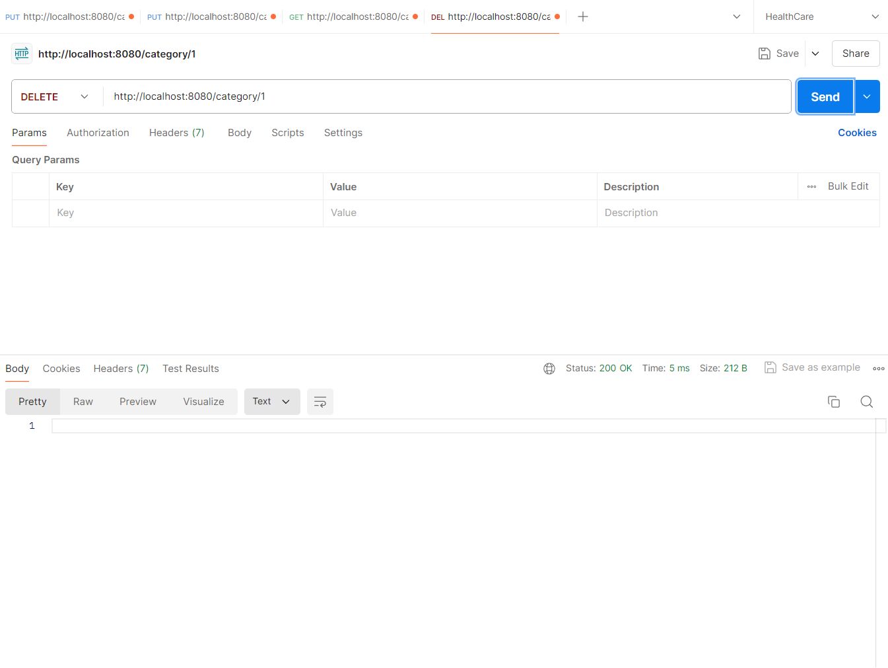
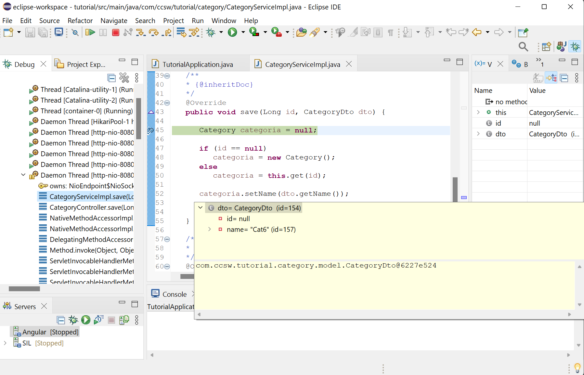

# Listado simple - Spring Boot

Ahora que ya tenemos listo el proyecto backend de Spring Boot (en el puerto 8080) ya podemos empezar a codificar la solución.


## Primeros pasos

!!! success "Antes de empezar"
    Quiero hacer hincapié en Spring Boot tiene una documentación muy extensa y completa, así que te recomiendo que hagas uso de ella cuando tengas cualquier duda. Tanto la propia web de [Spring](https://spring.io/projects/spring-boot) como en el portal de tutoriales de [Baeldung](https://www.baeldung.com/spring-tutorial) puedes buscar casi cualquier ejemplo que necesites.


## Estructurar el código

Vamos a hacer un breve refresco de la estructura del código que ya se ha visto en puntos anteriores.

Las clases deben estar agrupadas por ámbito funcional, en nuestro caso como vamos a hacer la funcionalidad de `Categorías` pues debería estar todo dentro de un package del tipo `com.ccsw.tutorial.category`.

Además, deberíamos aplicar la separación por capas como ya se vió en el esquema:


La primera capa, la de `Controlador`, se encargará de procesar las peticiones y transformar datos. Esta capa llamará a la capa de `Lógica` de negocio que ejecutará las operaciones, ayudándose de otros objetos de esa misma capa de `Lógica` o bien de llamadas a datos a través de la capa de `Acceso a Datos`

Ahora sí, vamos a programar!.

## Capa de operaciones: Controller

En esta capa es donde se definen las operaciones que pueden ser consumidas por los clientes. Se caracterizan por estar anotadas con las anotaciones @Controller o @RestController y por las anotaciones @RequestMapping que nos permiten definir las rutas de acceso.

!!! tip "Recomendación: Breve detalle REST"
    Antes de continuar te recomiendo encarecidamente que leas el [Anexo: Detalle REST](../../appendix/rest.md) donde se explica brevemente como estructurar los servicios REST que veremos a continuación.


### Controller de ejemplo

Vamos a crear una clase `CategoryController.java` dentro del package `com.ccsw.tutorial.category` para definir las rutas de las operaciones.

=== "CategoryController.java"
    ``` Java
    package com.ccsw.tutorial.category;

    import java.util.List;

    import org.springframework.web.bind.annotation.CrossOrigin;
    import org.springframework.web.bind.annotation.RequestMapping;
    import org.springframework.web.bind.annotation.RequestMethod;
    import org.springframework.web.bind.annotation.RestController;

    import io.swagger.v3.oas.annotations.tags.Tag;

    /**
     * @author ccsw
     * 
     */
    @Tag(name = "Category", description = "API of Category")
    @RequestMapping(value = "/category")
    @RestController
    @CrossOrigin(origins = "*")
    public class CategoryController {

        /**
         * Método para probar el servicio
         * 
         */
        @RequestMapping(path = "", method = RequestMethod.GET)
        public String prueba() {

            return "Probando el Controller";
        }

    }
    ```

Ahora si arrancamos la aplicación server, abrimos el [Postman](https://www.postman.com/) y creamos una petición GET a la url http://localhost:8080/category nos responderá con el mensaje que hemos programado.


### Implementar operaciones

Ahora que ya tenemos un controlador y una operación de negocio ficticia, vamos a borrarla y añadir las operaciones reales que consumirá nuestra pantalla. Deberemos añadir una operación para listar, una para actualizar, una para guardar y una para borrar. Aunque para hacerlo más cómodo, utilizaremos la misma operación para guardar y para actualizar. Además, no vamos a trabajar directamente con datos simples, sino que usaremos objetos para recibir información y para enviar información.

Estos objetos típicamente se denominan DTO (Data Transfer Object) y nos sirven justamente para encapsular información que queremos transportar. En realidad no son más que clases *pojo* sencillas con propiedades, getters y setters. 

Para nuestro ejemplo crearemos una clase `CategoryDto` dentro del package `com.ccsw.tutorial.category.model` con el siguiente contenido:

=== "CategoryDto.java"
    ``` Java
    package com.ccsw.tutorial.category.model;

    /**
     * @author ccsw
     * 
     */
    public class CategoryDto {
    
        private Long id;
    
        private String name;
    
        /**
         * @return id
         */
        public Long getId() {
    
            return this.id;
        }
    
        /**
         * @param id new value of {@link #getId}.
         */
        public void setId(Long id) {
    
            this.id = id;
        }
    
        /**
         * @return name
         */
        public String getName() {
    
            return this.name;
        }
    
        /**
         * @param name new value of {@link #getName}.
         */
        public void setName(String name) {
    
            this.name = name;
        }
    
    }
    ```

A continuación utilizaremos esta clase en nuestro Controller para implementar las tres operaciones de negocio.

=== "CategoryController.java"
    ``` Java
    package com.ccsw.tutorial.category;
    
    import java.util.ArrayList;
    import java.util.HashMap;
    import java.util.List;
    import java.util.Map;
    
    import org.springframework.web.bind.annotation.CrossOrigin;
    import org.springframework.web.bind.annotation.PathVariable;
    import org.springframework.web.bind.annotation.RequestBody;
    import org.springframework.web.bind.annotation.RequestMapping;
    import org.springframework.web.bind.annotation.RequestMethod;
    import org.springframework.web.bind.annotation.RestController;
    
    import com.ccsw.tutorial.category.model.CategoryDto;
    
    import io.swagger.v3.oas.annotations.Operation;
    import io.swagger.v3.oas.annotations.tags.Tag;

    /**
     * @author ccsw
     * 
     */
    @Tag(name = "Category", description = "API of Category")
    @RequestMapping(value = "/category")
    @RestController
    @CrossOrigin(origins = "*")
    public class CategoryController {
    
        private long SEQUENCE = 1;
        private Map<Long, CategoryDto> categories = new HashMap<Long, CategoryDto>();
    
        /**
         * Método para recuperar todas las categorias
         *
         * @return {@link List} de {@link CategoryDto}
         */
        @Operation(summary = "Find", description = "Method that return a list of Categories")
        @RequestMapping(path = "", method = RequestMethod.GET)
        public List<CategoryDto> findAll() {
    
            return new ArrayList<CategoryDto>(this.categories.values());
        }
    
        /**
         * Método para crear o actualizar una categoria
         *
         * @param id PK de la entidad
         * @param dto datos de la entidad
         */
        @Operation(summary = "Save or Update", description = "Method that saves or updates a Category")
        @RequestMapping(path = { "", "/{id}" }, method = RequestMethod.PUT)
        public void save(@PathVariable(name = "id", required = false) Long id, @RequestBody CategoryDto dto) {
    
            CategoryDto category;
    
            if (id == null) {
                category = new CategoryDto();
                category.setId(this.SEQUENCE++);
                this.categories.put(category.getId(), category);
            } else {
                category = this.categories.get(id);
            }
    
            category.setName(dto.getName());
        }
    
        /**
         * Método para borrar una categoria
         *
         * @param id PK de la entidad
         */
        @Operation(summary = "Delete", description = "Method that deletes a Category")
        @RequestMapping(path = "/{id}", method = RequestMethod.DELETE)
        public void delete(@PathVariable("id") Long id) {
    
            this.categories.remove(id);
        }
    }
    ```

Como todavía no tenemos acceso a BD, hemos creado una variable tipo HashMap y una variable Long, que simularán una BD y una secuencia. También hemos implementado tres operaciones GET, PUT y DELETE que realizan las acciones necesarias por nuestra pantalla. Ahora podríamos probarlo desde el Postman con cuatro ejemplo sencillos.

Fíjate que el método `save` tiene dos rutas. La ruta normal `category/` y la ruta informada `category/3`. Esto es porque hemos juntado la acción create y update en un mismo método para facilitar el desarrollo. Es totalmente válido y funcional.


!!! tip "Atención"
    Los datos que se reciben pueden venir informados como un parámetro en la URL Get, como una variable en el propio path o dentro del body de la petición. Cada uno de ellos se recupera con una anotación especial: `@RequestParam`, `@PathVariable` y `@RequestBody` respectivamente.

Como no tenemos ningún dato dado de alta, podemos probar en primer lugar a realizar una inserción de datos con el método PUT.

**PUT /category** nos sirve para insertar `Categorías` nuevas (si no tienen el id informado) o para actualizar `Categorías` (si tienen el id informado). Fíjate que los datos que se envían están en el body como formato JSON (parte izquierda de la imagen). Si no envías datos, te dará un error.


**GET /category** nos devuelve un listado de `Categorías`, siempre que hayamos insertado algo antes.


**DELETE /category** nos sirve eliminar `Categorías`. Fíjate que el dato del ID que se envía está en el path.




Prueba a jugar borrando categorías que no existen o modificando categorías que no existen. Tal y como está programado, el borrado no dará error, pero la modificación debería dar un NullPointerException al no existir el dato a modificar.

### Documentación (OpenAPI)

Si te acuerdas, en el punto de `Entorno de desarrollo`, añadimos el módulo de OpenAPI a nuestro proyecto, y en el desarrollo de nuestro `Controller` hemos anotado tanto la clase como los métodos con sus correspondientes etiquetas `@Tag` y `@Operation`. 

Esto nos va a ayudar a generar documentación automática de nuestras APIs haciendo que nuestro código sea más mantenible y nuestra documentación mucho más fiable.

Para ver el resultado, con el proyecto arrancado nos dirigimos a la ruta por defecto de OpenAPI: [http://localhost:8080/swagger-ui/index.html](http://localhost:8080/swagger-ui/index.html)

Aquí podemos observar el catálogo de endpoints generados, ver los tipos de entrada y salida e incluso realizar peticiones a los mismos. Este será el contrato de nuestros endpoints, que nos ayudará a integrarnos con el equipo frontend (en el caso del tutorial seguramente seremos nosotros mismos).

### Aspectos importantes

Los aspectos importantes de la capa `Controller` son:

* La clase debe estar anotada con `@Controller` o `@RestController`. Mejor usar la última anotación, ya que estás diciendo que las operaciones son de tipo Rest y no hará falta configurar nada
* La ruta general al controlador se define con el `@RequestMapping` global de la clase, aunque también se puede obviar esta anotación y añadir a cada una de las operaciones la ruta raíz.
* Los métodos que queramos exponer como operaciones deben ir anotados también con `@RequestMapping` con la info:
    * `path` → Que nos permite definir un path para la operación, siempre sumándole el path de la clase (si es que tuviera)
    * `method` → Que nos permite definir el verbo de http que vamos a atender. Podemos tener el mismo path con diferente method, sin problema. Por lo general utilizaremos:
        * *GET* → Generalmente se usa para recuperar información
        * *POST* → Se utiliza para hacer update y filtrados complejos de información
        * *PUT* → Se utiliza para hacer save de información
        * *DELETE* → Se utiliza para hacer borrados de información

## Capa de Servicio: Service

Pero en realidad la cosa no funciona así. Hemos implementado parte de la lógica de negocio (las operaciones/acciones de guardado, borrado y listado) dentro de lo que sería la capa de operaciones o servicios al cliente. Esta capa no debe ejecutar lógica de negocio, tan solo debe hacer transformaciones de datos y enrutar peticiones, toda la lógica debería ir en la capa de servicio.

### Implementar servicios

Pues vamos a arreglarlo. Vamos a crear un servicio y vamos a mover la lógica de negocio al servicio.

=== "CategoryService.java"
    ``` Java
    package com.ccsw.tutorial.category;

    import com.ccsw.tutorial.category.model.CategoryDto;
    
    import java.util.List;

    /**
     * @author ccsw
     * 
     */
    public interface CategoryService {
    
        /**
         * Método para recuperar todas las categorías
         *
         * @return {@link List} de {@link Category}
         */
        List<CategoryDto> findAll();
    
        /**
         * Método para crear o actualizar una categoría
         *
         * @param id PK de la entidad
         * @param dto datos de la entidad
         */
        void save(Long id, CategoryDto dto);
    
        /**
         * Método para borrar una categoría
         *
         * @param id PK de la entidad
         */
        void delete(Long id);
    
    }
    ```
=== "CategoryServiceImpl.java"
    ``` Java
    package com.ccsw.tutorial.category;

    import java.util.ArrayList;
    import java.util.HashMap;
    import java.util.List;
    import java.util.Map;

    import org.springframework.stereotype.Service;

    import com.ccsw.tutorial.category.model.CategoryDto;

    /**
     * @author ccsw
     *
     */
    @Service
    public class CategoryServiceImpl implements CategoryService {

        private long SEQUENCE = 1;
        private Map<Long, CategoryDto> categories = new HashMap<Long, CategoryDto>();

        /**
         * {@inheritDoc}
         */
        public List<CategoryDto> findAll() {
    
            return new ArrayList<CategoryDto>(this.categories.values());
        }
    
        /**
         * {@inheritDoc}
         */
        public void save(Long id, CategoryDto dto) {
    
            CategoryDto category;
    
            if (id == null) {
                category = new CategoryDto();
                category.setId(this.SEQUENCE++);
                this.categories.put(category.getId(), category);
            } else {
                category = this.categories.get(id);
            }
    
            category.setName(dto.getName());
        }
    
        /**
         * {@inheritDoc}
         */
        public void delete(Long id) {
    
            this.categories.remove(id);
        }

    }
    ```
=== "CategoryController.java"
    ``` Java
    package com.ccsw.tutorial.category;

    import java.util.List;

    import org.springframework.beans.factory.annotation.Autowired;
    import org.springframework.web.bind.annotation.CrossOrigin;
    import org.springframework.web.bind.annotation.PathVariable;
    import org.springframework.web.bind.annotation.RequestBody;
    import org.springframework.web.bind.annotation.RequestMapping;
    import org.springframework.web.bind.annotation.RequestMethod;
    import org.springframework.web.bind.annotation.RestController;
    
    import com.ccsw.tutorial.category.model.CategoryDto;
    
    import io.swagger.v3.oas.annotations.Operation;
    import io.swagger.v3.oas.annotations.tags.Tag;

    /**
     * @author ccsw
     * 
     */
    @Tag(name = "Category", description = "API of Category")
    @RequestMapping(value = "/category")
    @RestController
    @CrossOrigin(origins = "*")
    public class CategoryController {

        @Autowired
        private CategoryService categoryService;
    
        /**
         * Método para recuperar todas las categorias
         *
         * @return {@link List} de {@link CategoryDto}
         */
        @Operation(summary = "Find", description = "Method that return a list of Categories")
        @RequestMapping(path = "", method = RequestMethod.GET)
        public List<CategoryDto> findAll() {
    
            return this.categoryService.findAll();
        }
    
        /**
         * Método para crear o actualizar una categoria
         *
         * @param id PK de la entidad
         * @param dto datos de la entidad
         */
        @Operation(summary = "Save or Update", description = "Method that saves or updates a Category")
        @RequestMapping(path = { "", "/{id}" }, method = RequestMethod.PUT)
        public void save(@PathVariable(name = "id", required = false) Long id, @RequestBody CategoryDto dto) {

            this.categoryService.save(id, dto);
        }
    
        /**
         * Método para borrar una categoria
         *
         * @param id PK de la entidad
         */
        @Operation(summary = "Delete", description = "Method that deletes a Category")
        @RequestMapping(path = "/{id}", method = RequestMethod.DELETE)
        public void delete(@PathVariable("id") Long id) {
    
            this.categoryService.delete(id);
        }
    }
    ```

Ahora ya tenemos bien estructurado nuestro proyecto. Ya tenemos las dos capas necesarias Controladores y Servicios y cada uno se encarga de llevar a cabo su cometido de forma correcta.


### Aspectos importantes

Los aspectos importantes de la capa `Service` son:

* Toda la lógica de negocio, operaciones y demás debe estar implementada en los servicios. Los controladores simplemente invocan servicios y transforman ciertos datos.
* Es buena práctica que la capa de servicios se implemente usando el patrón fachada, esto quiere decir que necesitamos tener una Interface y al menos una implementación de esa Interface. Y siempre debemos interactuar con la Interface. Esto nos permitirá a futuro poder sustituir la implementación por otra diferente sin que el resto del código se vea afectado. Especialmente útil cuando queremos mockear comportamientos en tests.
* La capa de servicio puede invocar a otros servicios en sus operaciones, pero **nunca** debe invocar a un controlador.
* Para crear un servicio se debe anotar mediante `@Service` y además debe implementar la Interface del servicio. Un error muy común al arrancar un proyecto y ver que no funcionan las llamadas, es porqué no existe la anotación `@Service` o porqué no se ha implementado la Interface.
* La forma de `inyectar` y utilizar componentes manejados por Spring Boot es mediante la anotación `@Autowired`. **NO** intentes crear un objeto de CategoryServiceImpl, ni hacer un `new`, ya que no estará manejado por Springboot y dará fallos de NullPointer. Lo mejor es dejar que Spring Boot lo gestione y utilizar las inyecciones de dependencias.


## Capa de Datos: Repository

Pero no siempre vamos a acceder a los datos mediante un HasMap en memoria. En algunas ocasiones queremos que nuestro proyecto acceda a un servicio de datos como puede ser una BBDD, un servicio externo, un acceso a disco, etc.
Estos accesos se deben hacer desde la capa de acceso a datos, y en concreto para nuestro ejemplo, lo haremos a través de un Repository para que acceda a una BBDD.

Para el tutorial no necesitamos configurar una BBDD externa ni complicarnos demasiado. Vamos a utilizar una librería muy útil llamada `H2` que nos permite levantar una BBDD en memoria persistiendo los datos en memoria o en disco, de hecho ya la configuramos en el apartado de `Entorno de desarrollo`.

### Implementar Entity

Lo primero que haremos será crear nuestra entity con la que vamos a persistir y recuperar información. Las entidades igual que los DTOs deberían estar agrupados dentro del package `model` de cada funcionalidad, así que vamos a crear una nueva clase java.

=== "Category.java"
    ``` Java
    package com.ccsw.tutorial.category.model;
    
    import jakarta.persistence.*;

    /**
     * @author ccsw
     * 
     */
    @Entity
    @Table(name = "category")
    public class Category {
    
        @Id
        @GeneratedValue(strategy = GenerationType.IDENTITY)
        @Column(name = "id", nullable = false)
        private Long id;
    
        @Column(name = "name", nullable = false)
        private String name;
    
        /**
         * @return id
         */
        public Long getId() {
    
            return this.id;
        }
    
        /**
         * @param id new value of {@link #getId}.
         */
        public void setId(Long id) {
    
            this.id = id;
        }
    
        /**
         * @return name
         */
        public String getName() {
    
            return this.name;
        }
    
        /**
         * @param name new value of {@link #getName}.
         */
        public void setName(String name) {
    
            this.name = name;
        }
    
    }
    ```

Si te fijas, la Entity suele ser muy similar a un DTO, tiene unas propiedades y sus getters y setters. Pero a diferencia de los DTOs, esta clase tiene una serie de anotaciones que permiten a JPA hacer su magia y generar consultas SQL a la BBDD. En este ejemplo vemos 4 anotaciones importantes:

* `@Entity` → Le indica a Springboot que se trata de una clase que implementa una Entidad de BBDD. Sin esta anotación no es posible hacer queries.
* `@Table` → Le indica a JPA el nombre y el schema de la tabla que representa esta clase. Por claridad se debería poner siempre, aunque si el nombre de la tabla es igual al nombre de la clase no es necesaria la anotación.
* `@Id` y `@GeneratedValue` → Le indica a JPA que esta propiedad es la que mapea una Primary Key y además que esta PK se genera con la estrategia que se le indique en la anotación `@GeneratedValue`, que puede ser:
    * Generación de PK por `Secuence`, la que utiliza Oracle, en este caso habrá que indicarle un nombre de secuencia.
    * Generación de PK por `Indentity`, la que utiliza MySql o SQLServer, el auto-incremental. 
    * Generación de PK por `Table`, en algunas BBDD se permite tener una tabla donde se almacenan como registros todas las secuencias.
    * Generación de PK `Auto`, elige la mejor estrategia en función de la BBDD que hemos seleccionado.
* `@Column` → Le indica a JPA que esta propiedad mapea una columna de la tabla y le especifica el nombre de la columna. Al igual que la anotaciónd de `Table`, esta anotación no es necesaria aunque si es muy recomendable. Por claridad se debería poner siempre, aunque si el nombre de la columna es igual al nombre de la propiedad no es necesaria la anotación.

Hay muchas otras anotaciones, pero estas son las básicas, ya irás aprendiendo otras.

!!! tip "Consejo"
    Para definir las PK de las tablas, intenta evitar una PK compuesta de más de una columna. La programación se hace muy compleja y las magias que hace JPA en la oscuridad se complican mucho. Mi recomendación es que siempre utilices una PK númerica, en la medida de lo posible, y si es necesario, crees índices compuestos de búsqueda o checks compuestos para evitar duplicidades.


### Juego de datos de BBDD

Spring Boot automáticamente cuando arranque el proyecto escanerá todas las `@Entity` y creará las estructuras de las tablas en la BBDD en memoria, gracias a las anotaciones que hemos puesto. 
Además de esto, lanzará los scripts de construcción de BBDD que tenemos en la carpeta `src/main/resources/`. Así que, teniendo clara la estructura de la `Entity` podemos configurar los ficheros con los juegos de datos que queramos, y para ello vamos a utilizar el fichero `data.sql` que creamos en su momento. 

Sabemos que la tabla se llamará `category` y que tendrá dos columnas, una columna `id`, que será la PK automática, y una columna `name`. Podemos escribir el siguiente script para rellenar datos:

=== "data.sql"
    ``` SQL
    INSERT INTO category(name) VALUES ('Eurogames');
    INSERT INTO category(name) VALUES ('Ameritrash');
    INSERT INTO category(name) VALUES ('Familiar');
    ```


### Implementar Repository

Ahora que ya tenemos el juego de datos y la entidad implementada, vamos a ver como acceder a BBDD desde Java. Esto lo haremos con un `Repository`. Existen varias formas de utilizar los repositories, desde el todo automático y magia de JPA hasta el repositorio manual en el que hay que codificar todo. En el tutorial voy a explicar varias formas de implementarlo para este CRUD y los siguientes CRUDs.

Como ya se dijo en puntos anteriores, el acceso a datos se debe hacer siempre a través de un `Repository`, así que vamos a implementar uno. En esta capa, al igual que pasaba con los services, es recomendable utilizar el patrón fachada, para poder sustituir implementaciones sin afectar al código.

=== "CategoryRepository.java"
    ``` Java
    package com.ccsw.tutorial.category;

    import com.ccsw.tutorial.category.model.Category;
    import org.springframework.data.repository.CrudRepository;
    
    /**
     * @author ccsw
     *
     */
    public interface CategoryRepository extends CrudRepository<Category, Long> {
    
    }
    ```

¿Qué te parece?, sencillo, ¿no?. Spring ya tiene una implementación por defecto de un CrudRepository, tan solo tenemos que crear una interface que extienda de la interface `CrudRepository` pasándole como tipos la `Entity` y el tipo de la Primary Key. Con eso Spring construye el resto y nos provee de los métodos típicos y necesarios para un CRUD.

Ahora vamos a utilizarla en él `Service`, pero hay un problema. Él `Repository` devuelve un objeto tipo `Category` y él `Service` y `Controller` devuelven un objeto tipo `CategoryDto`. Esto es porque en cada capa se debe con un ámbito de modelos diferente. Podríamos hacer que todo el back trabajara con `Category` que son entidades de persistencia, pero no es lo correcto y nos podría llevar a cometer errores, o modificar el objeto y que sin que nosotros lo ordenásemos se persistiera ese cambio en BBDD.

El ámbito de trabajo de las capas con el que solemos trabajar y está más extendido es el siguiente:


* Los datos que vienen y van al cliente, deberían ser en la mayoría de los casos datos en formato json
* Al entrar en un `Controller` esos datos json se transforman en un DTO. Al salir del `Controller` hacia el cliente, esos DTOs se transforman en formato json. Estas conversiones son automáticas, las hace Springboot (en realidad las hace la librería de jackson codehaus).
* Cuando un `Controller` ejecuta una llamada a un `Service`, generalmente le pasa sus datos en DTO, y el `Service` se encarga de transformar esto a una `Entity`. A la inversa, cuando un `Service` responde a un `Controller`, él responde con una `Entity` y el `Controller` ya se encargará de transformarlo a DTO.
* Por último, para los `Repository`, siempre se trabaja de entrada y salida con objetos tipo `Entity`

Parece un lío, pero ya verás como es muy sencillo ahora que veremos el ejemplo. Una última cosa, para hacer esas transformaciones, las podemos hacer a mano usando getters y setters o bien utilizar el objeto `DozerBeanMapper` que hemos configurado al principio.

El código debería quedar así:

=== "CategoryServiceImpl.java"
    ``` Java
    package com.ccsw.tutorial.category;
    
    import com.ccsw.tutorial.category.model.Category;
    import com.ccsw.tutorial.category.model.CategoryDto;
    import jakarta.transaction.Transactional;
    import org.springframework.beans.factory.annotation.Autowired;
    import org.springframework.stereotype.Service;
    
    import java.util.List;
    
    /**
     * @author ccsw
     *
     */
    @Service
    @Transactional
    public class CategoryServiceImpl implements CategoryService {
    
        @Autowired
        CategoryRepository categoryRepository;

        /**
         * {@inheritDoc}
         */
        @Override
        public List<Category> findAll() {
        
              return (List<Category>) this.categoryRepository.findAll();
        }

        /**
         * {@inheritDoc}
         */
        @Override
        public void save(Long id, CategoryDto dto) {
        
              Category category;
        
              if (id == null) {
                 category = new Category();
              } else {
                 category = this.categoryRepository.findById(id).orElse(null);
              }
        
              category.setName(dto.getName());
        
              this.categoryRepository.save(category);
        }
        
        /**
         * {@inheritDoc}
         */
        @Override
        public void delete(Long id) throws Exception {
        
              if(this.categoryRepository.findById(id).orElse(null) == null){
                 throw new Exception("Not exists");
              }
        
              this.categoryRepository.deleteById(id);
        }

    }
    ```
=== "CategoryService.java"
    ``` Java
    package com.ccsw.tutorial.category;
    
    import com.ccsw.tutorial.category.model.Category;
    import com.ccsw.tutorial.category.model.CategoryDto;
    
    import java.util.List;

    /**
     * @author ccsw
     * 
     */
    public interface CategoryService {
    
        /**
         * Método para recuperar todas las {@link Category}
         *
         * @return {@link List} de {@link Category}
         */
        List<Category> findAll();
    
        /**
         * Método para crear o actualizar una {@link Category}
         *
         * @param id PK de la entidad
         * @param dto datos de la entidad
         */
        void save(Long id, CategoryDto dto);
    
        /**
         * Método para borrar una {@link Category}
         *
         * @param id PK de la entidad
         */
        void delete(Long id) throws Exception;
    
    }
    ```
=== "CategoryController.java"
    ``` Java hl_lines="28 42"
    package com.ccsw.tutorial.category;
    
    import com.ccsw.tutorial.category.model.Category;
    import com.ccsw.tutorial.category.model.CategoryDto;
    import io.swagger.v3.oas.annotations.Operation;
    import io.swagger.v3.oas.annotations.tags.Tag;
    import org.dozer.DozerBeanMapper;
    import org.springframework.beans.factory.annotation.Autowired;
    import org.springframework.web.bind.annotation.*;
    
    import java.util.List;
    import java.util.stream.Collectors;
    
    /**
     * @author ccsw
     *
     */
    @Tag(name = "Category", description = "API of Category")
    @RequestMapping(value = "/category")
    @RestController
    @CrossOrigin(origins = "*")
    public class CategoryController {
    
        @Autowired
        CategoryService categoryService;
    
        @Autowired
        DozerBeanMapper mapper;
    
        /**
         * Método para recuperar todas las {@link Category}
         *
         * @return {@link List} de {@link CategoryDto}
         */
        @Operation(summary = "Find", description = "Method that return a list of Categories"
        )
        @RequestMapping(path = "", method = RequestMethod.GET)
        public List<CategoryDto> findAll() {
    
            List<Category> categories = this.categoryService.findAll();
    
            return categories.stream().map(e -> mapper.map(e, CategoryDto.class)).collect(Collectors.toList());
        }
    
        /**
         * Método para crear o actualizar una {@link Category}
         *
         * @param id PK de la entidad
         * @param dto datos de la entidad
         */
        @Operation(summary = "Save or Update", description = "Method that saves or updates a Category"
        )
        @RequestMapping(path = { "", "/{id}" }, method = RequestMethod.PUT)
        public void save(@PathVariable(name = "id", required = false) Long id, @RequestBody CategoryDto dto) {
    
            this.categoryService.save(id, dto);
        }
    
        /**
         * Método para borrar una {@link Category}
         *
         * @param id PK de la entidad
         */
        @Operation(summary = "Delete", description = "Method that deletes a Category")
        @RequestMapping(path = "/{id}", method = RequestMethod.DELETE)
        public void delete(@PathVariable("id") Long id) throws Exception {
    
            this.categoryService.delete(id);
        }
    
    }
    ```

El `Service` no tiene nada raro, simplemente accede al `Repository` (siempre anotado como `@Autowired`) y recupera datos o los guarda. Fíjate en el caso especial del save que la única diferencia es que en un caso tendrá `id != null` y por tanto internamente hará un update, y en otro caso tendrá `id == null` y por tanto internamente hará un save.

En cuanto a la interface, lo único que cambiamos fue los objetos de respuesta, que ahora pasan a ser de tipo `Category`. Los de entrada se mantienen como `CategoryDto`.

Por último, en él `Controller` se puede ver como se utiliza el conversor de `DozerBeanMapper` (siempre anotado como `@Autowired`), que permite traducir una lista a un tipo concreto, o un objeto único a un tipo concreto. La forma de hacer estas conversiones siempre es por nombre de propiedad. Las propiedades del objeto destino se deben llamar igual que las propiedades del objeto origen. En caso contrario se quedarán a null.

!!! warning "Ojo con el mapeo"
    Ojo a esta última frase, debe quedar meridianamente claro. La forma de mapear de un objeto origen a un objeto destino siempre es a través del nombre. Los getters del origen deben ser iguales a los getters del destino. Si hay una letra diferente o unas mayúsculas o minúsculas diferentes NO realizará el mapeo y se quedará la propiedad a null.


Para terminar, cuando queramos realizar un mapeo masivo de los diferentes registros, tenemos que itulizar la API Stream de Java, que nos proporciona una forma sencilla de realizar estas operativas, sobre colecciones de elementos, mediante el uso del método intermedio `map` y el reductor por defecto para listas. Te recomiendo echarle un ojo a la teoría de [Introducción a API Java Streams](https://www.baeldung.com/java-8-streams-introduction).

!!! info "BBDD"
    Si quires ver el contenido de la base de datos puedes acceder a un IDE web autopublicado por H2 en la ruta `http://localhost:8080/h2-console`


### Aspectos importantes

Los aspectos importantes de la capa `Repository` son:

* Al igual que los `Service`, se debe utilizar el patrón fachada, por lo que tendremos una Interface y posiblemente una implementación.
* A menudo la implementación la hace internamente Spring Boot, pero hay veces que podemos hacer una implementación manual. Lo veremos en siguientes puntos.
* Los `Repository` trabajan siempre con `Entity` que no son más que mapeos de una tabla o de una vista que existe en BBDD.
* Los `Repository` no contienen lógica de negocio, ni transformaciones, simplemente acceder a datos, persisten o devuelven información.
* Los `Repository` **JAMÁS** deben llamar a otros `Repository` ni `Service`.
* Intenta que tus clases `Entity` sean lo más sencillas posible, sobre todo en cuanto a Primary Keys, se simplificará mucho el desarrollo.

## Capa de Testing: TDD

Por último y aunque no debería ser lo último que se desarrolla sino todo lo contrario, debería ser lo primero en desarrollar, tenemos la batería de pruebas.
Con fines didácticos, he querido enseñarte un ciclo de desarrollo para ir recorriendo las diferentes capas de una aplicación, pero en realidad, para realizar el desarrollo debería aplicar [TDD (Test Driven Development)](../../appendix/tdd.md). Si quieres aprender las reglas básicas de como aplicar TDD al desarrollo diario, te recomiendo que leas el [Anexo. TDD](../../appendix/tdd.md).

En este caso, y sin que sirva de precedente, ya tenemos implementados los métodos de la aplicación, y ahora vamos a testearlos. Existen muchas formas de testing en función del componente o la capa que se quiera testear. En realidad, a medida que vayas programando irás aprendiendo todas ellas, de momento realizaremos dos tipos de test simples que prueben las casuísticas de los métodos.

El enfoque que seguiremos en este tutorial será realizar las pruebas mediante test unitarios y test de integración.

* **Test unitarios**: Se trata de pruebas estrictamente relativas a la calidad estática del código de una determinada operación de la capa de la lógica de negocio (Service). Estas pruebas no inicializan el contexto de Spring y deben simular todas las piezas ajenas a la funcionalidad testeada.
* **Test de integración**: Se tratan de pruebas completas de un determinado endpoint que conlleva inicializar el contexto de Spring (base de datos incluida) y realizar una llama REST para comprobar el flujo completo de la API.


Lo primero será conocer que queremos probar y para ello nos vamos a hacer una lista:


Test unitarios:

* Prueba de listado, debe probar la lógica dentro de la operación de negocio de consulta de `Categoría`
* Prueba de creación, debe probar la lógica dentro de la operación de negocio de creación una nueva `Categoría`
* Prueba de modificación, debe probar la lógica dentro de la operación de negocio de modificación una `Categoría` existente
* Prueba de borrado, debe probar la lógica dentro de la operación de negocio de borrado de una `Categoría` existente


Test de integración:

* Prueba de listado, debe recuperar los elementos de la tabla `Categoría`
* Prueba de creación, debe crear una nueva `Categoría`
* Prueba de modificación correcta, debe modificar una `Categoría` existente
* Prueba de modificación incorrecta, debe dar error al modificar una `Categoría` que no existe
* Prueba de borrado correcta, debe borrar una `Categoría` existente
* Prueba de borrado incorrecta, debe dar error al borrar una `Categoría` que no existe


Se podrían hacer muchos más tests, pero creo que con esos son suficientes para que entiendas como se comporta esta capa. Si te fijas, hay que probar tanto los resultados correctos como los resultados incorrectos. El usuario no siempre se va a comportar como nosotros pensamos.

Pues vamos a ello.

### Pruebas de listado

Vamos a empezar haciendo una clase de test dentro de la carpeta `src/test/java`. No queremos que los test formen parte del código productivo de la aplicación, por eso utilizamos esa ruta que queda fuera del package general de la aplicación.

Crearemos las clases (en la package `category`):

* Test unitarios: `com.ccsw.tutorial.category.CategoryTest`
* Test de integración: `com.ccsw.tutorial.category.CategoryIT` 

=== "CategoryTest.java"
    ``` Java
    package com.ccsw.tutorial.category;

    import org.junit.jupiter.api.extension.ExtendWith;
    import org.mockito.junit.jupiter.MockitoExtension;

    @ExtendWith(MockitoExtension.class)
    public class CategoryTest {

    }
    ```
=== "CategoryIT.java"
    ``` Java
    package com.ccsw.tutorial.category;

    import org.springframework.boot.test.context.SpringBootTest;
    import org.springframework.boot.test.web.client.TestRestTemplate;
    import org.springframework.boot.web.server.LocalServerPort;
    import org.springframework.test.annotation.DirtiesContext;

    @SpringBootTest(webEnvironment = SpringBootTest.WebEnvironment.RANDOM_PORT)
    @DirtiesContext(classMode = DirtiesContext.ClassMode.BEFORE_EACH_TEST_METHOD)
    public class CategoryIT {

        @LocalServerPort
        private int port;
        
        @Autowired
        private TestRestTemplate restTemplate;

    }
    ```

Estas clases son sencillas y tan solo tienen anotaciones específicas de Spring Boot para cada tipo de test:

* `@SpringBootTest`. Esta anotación lo que hace es inicializar el contexto de Spring cada vez que se inician los test de jUnit. Aunque el contexto tarda unos segundos en arrancar, lo bueno que tiene es que solo se inicializa una vez y se lanzan todos los jUnits en batería con el mismo contexto.
* `@DirtiesContext`. Esta anotación le indica a Spring que los test van a ser transaccionales, y por tanto cuando termine la ejecución de cada uno de los test, automáticamente por la anotación de arriba, Spring hará un rearranque parcial del contexto y dejará el estado de la BBDD como estaba inicialmente.
* `@ExtendWith`. Esta anotación le indica a Spring que no debe inicializar el contexto, ya que se trata de test estáticos que no lo requieren.

Para las pruebas de integración nos faltará configurar la aplicación de test, al igual que hicimos con la aplicación 'productiva'. Deberemos abrir el fichero `src/test/resources/application.properties` y añadir la configuración de la BBDD. Para este tutorial vamos a utilizar la misma BBDD que la aplicación productiva, pero de normal la aplicación se conectará a una BBDD, generalmente física, mientras que los test jUnit se conectarán a otra BBDD, generalmente en memoria.

=== "application.properties"
    ``` properties
    #Database
    spring.datasource.url=jdbc:h2:mem:testdb
    spring.datasource.username=sa
    spring.datasource.password=sa
    spring.datasource.driver-class-name=org.h2.Driver
    
    spring.jpa.database-platform=org.hibernate.dialect.H2Dialect
    spring.jpa.defer-datasource-initialization=true
    ```

Con todo esto ya podemos crear nuestro primer test. Iremos a las clases `CategoryIT` y `CategoryTest` donde añadiremos un método público. Los test siempre tienen que ser métodos públicos que devuelvan el tipo `void`.


=== "CategoryTest.java"
    ``` Java hl_lines="3-5 7 8 11 12 14 15 20 21 23 24 26-38"
    package com.ccsw.tutorial.category;
    
    import com.ccsw.tutorial.category.model.Category;
    import com.ccsw.tutorial.category.model.CategoryDto;
    import org.junit.jupiter.api.Test;
    import org.junit.jupiter.api.extension.ExtendWith;
    import org.mockito.InjectMocks;
    import org.mockito.Mock;
    import org.mockito.junit.jupiter.MockitoExtension;
    
    import java.util.ArrayList;
    import java.util.List;
    
    import static org.junit.jupiter.api.Assertions.*;
    import static org.mockito.Mockito.*;
    
    @ExtendWith(MockitoExtension.class)
    public class CategoryTest {
        
        @Mock
        private CategoryRepository categoryRepository;
        
        @InjectMocks
        private CategoryServiceImpl categoryService;
        
        @Test
        public void findAllShouldReturnAllCategories() {
        
              List<Category> list = new ArrayList<>();
              list.add(mock(Category.class));
        
              when(categoryRepository.findAll()).thenReturn(list);
        
              List<Category> categories = categoryService.findAll();
        
              assertNotNull(categories);
              assertEquals(1, categories.size());
        }
    }
    ```
=== "CategoryIT.java"
    ``` Java hl_lines="3-16 22 23 31 33-40"
    package com.ccsw.tutorial.category;
    
    import com.ccsw.tutorial.category.model.CategoryDto;
    import org.junit.jupiter.api.Test;
    import org.springframework.beans.factory.annotation.Autowired;
    import org.springframework.boot.test.context.SpringBootTest;    
    import org.springframework.boot.test.web.client.TestRestTemplate;
    import org.springframework.boot.web.server.LocalServerPort;
    import org.springframework.core.ParameterizedTypeReference;
    import org.springframework.http.HttpMethod;
    import org.springframework.http.ResponseEntity;
    import org.springframework.test.annotation.DirtiesContext;
    
    import java.util.List;
    
    import static org.junit.jupiter.api.Assertions.*;
    
    @SpringBootTest(webEnvironment = SpringBootTest.WebEnvironment.RANDOM_PORT)
    @DirtiesContext(classMode = DirtiesContext.ClassMode.BEFORE_EACH_TEST_METHOD)
    public class CategoryIT {
    
        public static final String LOCALHOST = "http://localhost:";
        public static final String SERVICE_PATH = "/category";
        
        @LocalServerPort
        private int port;
        
        @Autowired
        private TestRestTemplate restTemplate;
        
        ParameterizedTypeReference<List<CategoryDto>> responseType = new ParameterizedTypeReference<List<CategoryDto>>(){};
        
        @Test
        public void findAllShouldReturnAllCategories() {
        
              ResponseEntity<List<CategoryDto>> response = restTemplate.exchange(LOCALHOST + port + SERVICE_PATH, HttpMethod.GET, null, responseType);
        
              assertNotNull(response);
              assertEquals(3, response.getBody().size());
        }
    }
    ```    
    
Es muy importante marcar cada método de prueba con la anotación `@Test`, en caso contrario no se ejecutará. Lo que se debe hacer en cada método que implementemos es probar **una y solo una** acción. 

En los ejemplos anteriores `(CategoryTest)`, por un lado hemos comprobado el método `findAll()` el cual por debajo invoca una llamada al repository de categoría, la cual hemos simulado con una respuesta ficticia limitándonos únicamente a la lógica contenida en la operación de negocio.

Mientras que por otro lado `(CategoryIT)`, hemos probado la llamando al método `GET` del endpoint `http://localhost:XXXX/category` comprobando que realmente nos devuelve 3 resultados, que son los que hay en BBDD inicialmente.


!!! tip "Muy importante: Nomenclatura de los tests"
    La nomenclatura de los métodos de test debe sigue una estructura determinada. Hay muchas formas de nombrar a los métodos, pero nosotros solemos utilizar la estructura 'should', para indicar lo que va a hacer. En el ejemplo anterior el método 'findAll' debe devolver 'AllCategories'. De esta forma sabemos cuál es la intención del test, y si por cualquier motivo diera un fallo, sabemos que es lo que NO está funcionando de nuestra aplicación.

Para comprobar que el test funciona, podemos darle botón derecho sobre la clase de `CategoryIT` y pulsar en `Run as` -> `JUnit Test`. Si todo funciona correctamente, deberá aparecer una pantalla de ejecución y todos nuestros tests (en este caso solo uno) corriendo correctamente (en verde). El proceso es el mismo para la clase `CategoryTest`.


### Pruebas de creación

Vamos con los siguientes test, los que probarán una creación de una nueva `Categoría`. Añadimos el siguiente método a la clase de test:


=== "CategoryTest.java"
    ``` Java

    public static final String CATEGORY_NAME = "CAT1";

    @Test
    public void saveNotExistsCategoryIdShouldInsert() {
    
          CategoryDto categoryDto = new CategoryDto();
          categoryDto.setName(CATEGORY_NAME);
    
          ArgumentCaptor<Category> category = ArgumentCaptor.forClass(Category.class);
    
          categoryService.save(null, categoryDto);
    
          verify(categoryRepository).save(category.capture());
    
          assertEquals(CATEGORY_NAME, category.getValue().getName());
    }
    ```
=== "CategoryIT.java"
    ``` Java

    public static final Long NEW_CATEGORY_ID = 4L;
    public static final String NEW_CATEGORY_NAME = "CAT4";

    @Test
    public void saveWithoutIdShouldCreateNewCategory() {
    
          CategoryDto dto = new CategoryDto();
          dto.setName(NEW_CATEGORY_NAME);
    
          restTemplate.exchange(LOCALHOST + port + SERVICE_PATH, HttpMethod.PUT, new HttpEntity<>(dto), Void.class);
    
          ResponseEntity<List<CategoryDto>> response = restTemplate.exchange(LOCALHOST + port + SERVICE_PATH, HttpMethod.GET, null, responseType);
          assertNotNull(response);
          assertEquals(4, response.getBody().size());
    
          CategoryDto categorySearch = response.getBody().stream().filter(item -> item.getId().equals(NEW_CATEGORY_ID)).findFirst().orElse(null);
          assertNotNull(categorySearch);
          assertEquals(NEW_CATEGORY_NAME, categorySearch.getName());
    }
    ```    
    
En el primer caso, estamos construyendo un objeto `CategoryDto` para darle un nombre a la `Categoría` e invocamos a la operación `save` pasandole un ID a nulo. Para identificar que el funcionamiento es el esperado, capturamos la categoría que se proporciona al repository al intentar realizar la acción ficticia de guardado y comprobamos que el valor es el que se proporciona en la invocación.

De forma similar en el segundo caso, estamos construyendo un objeto `CategoryDto` para darle un nombre a la `Categoría` e invocamos al método `PUT` sin añadir en la ruta referencia al identificador.
Seguidamente, recuperamos de nuevo la lista de categorías y en este caso debería tener 4 resultados. Hacemos un filtrado buscando la nueva `Categoría` que debería tener un ID = 4 y debería ser la que acabamos de crear. 

Si ejecutamos, veremos que ambos test ahora aparecen en verde.


### Pruebas de modificación

Para este caso de prueba, vamos a realizar varios test, como hemos comentado anteriormente. Tenemos que probar que es lo que pasa cuando intentamos modificar un elemento que existe, pero también debemos probar que es lo que pasa cuando intentamos modificar un elemento que **no** existe.

Empezamos con el sencillo, un test que pruebe una modificación existente.

=== "CategoryTest.java"
    ``` Java

    public static final Long EXISTS_CATEGORY_ID = 1L;

    @Test
    public void saveExistsCategoryIdShouldUpdate() {
    
      CategoryDto categoryDto = new CategoryDto();
      categoryDto.setName(CATEGORY_NAME);
    
      Category category = mock(Category.class);
      when(categoryRepository.findById(EXISTS_CATEGORY_ID)).thenReturn(Optional.of(category));
    
      categoryService.save(EXISTS_CATEGORY_ID, categoryDto);
    
      verify(categoryRepository).save(category);
    }
    ```
=== "CategoryIT.java"
    ``` Java

    public static final Long MODIFY_CATEGORY_ID = 3L;

    @Test
    public void modifyWithExistIdShouldModifyCategory() {
    
          CategoryDto dto = new CategoryDto();
          dto.setName(NEW_CATEGORY_NAME);
    
          restTemplate.exchange(LOCALHOST + port + SERVICE_PATH + "/" + MODIFY_CATEGORY_ID, HttpMethod.PUT, new HttpEntity<>(dto), Void.class);
    
          ResponseEntity<List<CategoryDto>> response = restTemplate.exchange(LOCALHOST + port + SERVICE_PATH, HttpMethod.GET, null, responseType);
          assertNotNull(response);
          assertEquals(3, response.getBody().size());
    
          CategoryDto categorySearch = response.getBody().stream().filter(item -> item.getId().equals(MODIFY_CATEGORY_ID)).findFirst().orElse(null);
          assertNotNull(categorySearch);
          assertEquals(NEW_CATEGORY_NAME, categorySearch.getName());
    }
    ```

En el caso de los test unitarios, comprobamos la lógica de la modificación simulando que el repository nos devuelve una categoría que modificar y verificado que se invoca el guardado sobre la misma.

En el caso de los test de integración, la misma filosofía que en el test anterior, pero esta vez modificamos la `Categoría` de ID = 3. Luego la filtramos y vemos que realmente se ha modificado. Además comprobamos que el listado de todas los registros sigue siendo 3 y no se ha creado un nuevo registro.


En el siguiente test, probaremos un resultado erróneo.

=== "CategoryIT.java"
    ``` Java

    @Test
    public void modifyWithNotExistIdShouldInternalError() {
    
          CategoryDto dto = new CategoryDto();
          dto.setName(NEW_CATEGORY_NAME);
    
          ResponseEntity<?> response = restTemplate.exchange(LOCALHOST + port + SERVICE_PATH + "/" + NEW_CATEGORY_ID, HttpMethod.PUT, new HttpEntity<>(dto), Void.class);
    
          assertEquals(HttpStatus.INTERNAL_SERVER_ERROR, response.getStatusCode());
    }
    ```

Intentamos modificar el ID = 4, que no debería existir en BBDD y por tanto lo que se espera en el test es que lance un `500 Internal Server Error` al llamar al método `PUT`.


### Pruebas de borrado

Ya por último implementamos las pruebas de borrado.

=== "CategoryTest.java"
    ``` Java

    @Test
    public void deleteExistsCategoryIdShouldDelete() throws Exception {
    
          Category category = mock(Category.class);
          when(categoryRepository.findById(EXISTS_CATEGORY_ID)).thenReturn(Optional.of(category));
    
          categoryService.delete(EXISTS_CATEGORY_ID);
    
          verify(categoryRepository).deleteById(EXISTS_CATEGORY_ID);
    }
    ```
=== "CategoryIT.java"
    ``` Java
    
    public static final Long DELETE_CATEGORY_ID = 2L;

    @Test
    public void deleteWithExistsIdShouldDeleteCategory() {
    
          restTemplate.exchange(LOCALHOST + port + SERVICE_PATH + "/" + DELETE_CATEGORY_ID, HttpMethod.DELETE, null, Void.class);
    
          ResponseEntity<List<CategoryDto>> response = restTemplate.exchange(LOCALHOST + port + SERVICE_PATH, HttpMethod.GET, null, responseType);
          assertNotNull(response);
          assertEquals(2, response.getBody().size());
    }
    
    @Test
    public void deleteWithNotExistsIdShouldInternalError() {
    
          ResponseEntity<?> response = restTemplate.exchange(LOCALHOST + port + SERVICE_PATH + "/" + NEW_CATEGORY_ID, HttpMethod.DELETE, null, Void.class);
    
          assertEquals(HttpStatus.INTERNAL_SERVER_ERROR, response.getStatusCode());
    }
    ```

En cuanto al test unitario, se invoca a la operación `delete` y se verifica que la operación requerida del repository es invocado con el atributo correcto.    

En lo relativo a las pruebas de integración, en el primer test, se invoca el método `DELETE` y posteriormente se comprueba que el listado tiene un tamaño de 2 (uno menos que el original). Mientras que en el segundo test, se comprueba que con ID no válido, devuelve un `500 Internal Server Error`.

Con esto tendríamos más o menos probados los casos básicos de nuestra aplicación y tendríamos una pequeña red de seguridad que nos ayudaría por si a futuro necesitamos hacer algún cambio o evolutivo.


## ¿Qúe hemos aprendido?

Resumiendo un poco los pasos que hemos seguido:

* Hay que definir y agrupar por ámbito funcional, hemos creado el package `com.ccsw.tutorial.category` para aglutinar todas las clases.
* Lo primero que debemos empezar a construir **siempre** son los test, aunque en este capítulo del tutorial lo hemos hecho al revés solo con fines didácticos. En los siguientes capítulos lo haremos de forma correcta, y esto nos ayudará a pensar y diseñar que es lo que queremos implementar realmente.
* La implementación de la aplicación se debería separar por capas:
    * `Controller` → Maneja las peticiones de entrada del cliente y realiza transformaciones. No ejecuta directamente lógica de negocio, para eso utiliza llamadas a la siguiente capa.
    * `Service` → Ejecuta la lógica de negocio en sus métodos o llamando a otros objetos de la misma capa. No ejecuta directamente accesos a datos, para eso utiliza la siguiente capa.
    * `Repository` → Realiza los accesos a datos de lectura y escritura. **NUNCA** debe llamar a otros objetos de la misma capa ni de capas anteriores.
* Hay que tener en cuenta los objetos modelo que se mueven en cada capa. Generalmente son:
    * `Json` → Los datos que vienen y van del cliente al `Controller`.
    * `DTO` → Los datos se mueven dentro del `Controller` y sirven para invocar llamadas. También son los datos que devuelve un `Controller`.
    * `Entity` → Los datos que sirven para persistir y leer datos de una BBDD y que **NUNCA** deberían ir más allá del `Controller`.
    
##Depuración

Una parte muy importante del desarrollo es tener la capacidad de depurar nuestro código, en este apartado vamos a explicar como se realiza `debug` en Backend.

Esta parte se realiza con las herramientas incluidas dentro de nuestro IDE favorito, en este caso vamos a utilizar el Eclipse.

Lo primero que debemos hacer es arrancar la aplicación en modo `Debug`:


Arrancada la aplicación en este modo, vamos a depurar la operación de crear categoría.

Para ello vamos a abrir nuestro fichero donde tenemos la implementación del servicio de creación de la capa de la lógica de negocio `CategoryServiceImpl`.

Dentro del fichero ya podemos añadir puntos de ruptura (breakpoint), en nuestro caso queremos comprobar que el nombre introducido se recibe correctamente.

Colocamos el breakpoint en la primera línea del método (click sobre el número de la línea) y desde la interfaz/postman creamos una nueva categoría.

Hecho esto, podemos observar que a nivel de interfaz/postman, la petición se queda esperando y el IDE pasa modo `Debug` (la primera vez nos preguntará si queremos hacerlo, le decimos que si):


El IDE nos lleva al punto exacto donde hemos añadido el breakpoint y se para en este punto ofreciéndonos la posibilidad de explorar el contenido de las variables del código:



Aquí podemos comprobar que efectivamente el atributo `name` de la variable `dto` tiene el valor que hemos introducido por pantalla/postman.

Para continuar con la ejecución basta con darle al botón de `play` de la barra de herramientas superior.

Nota: para volver al modo `Java` de Eclipse, presionamos el botón que se sitúa a la izquierda del modo `Debug` en el que ha entrado el IDE automáticamente.