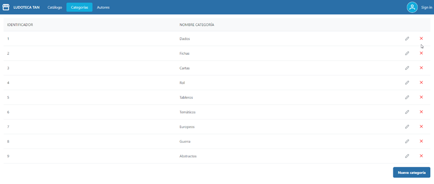
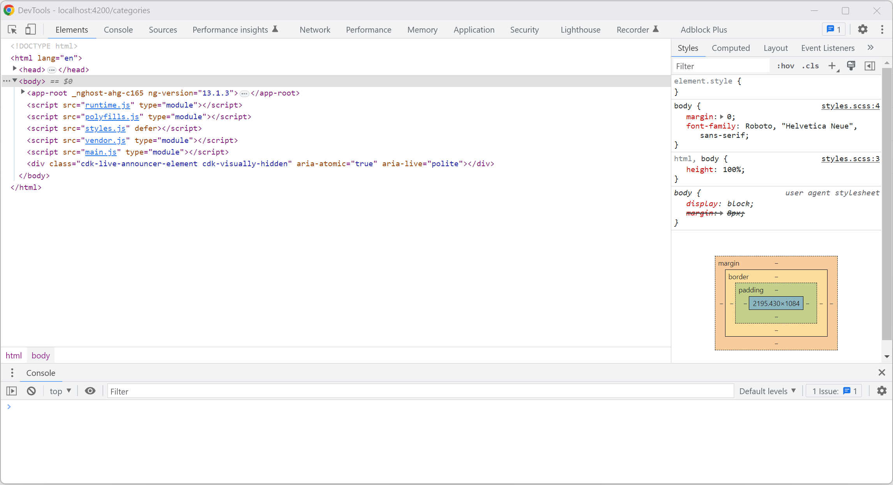
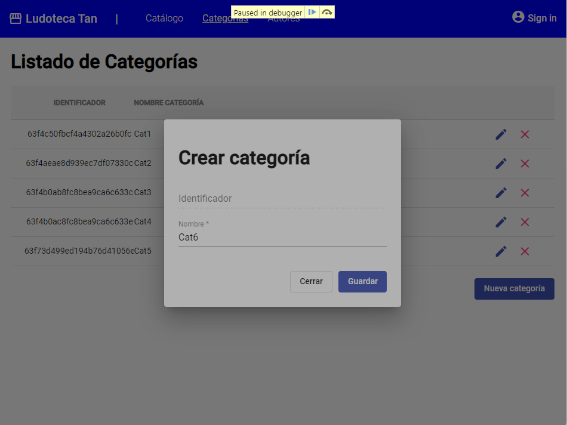
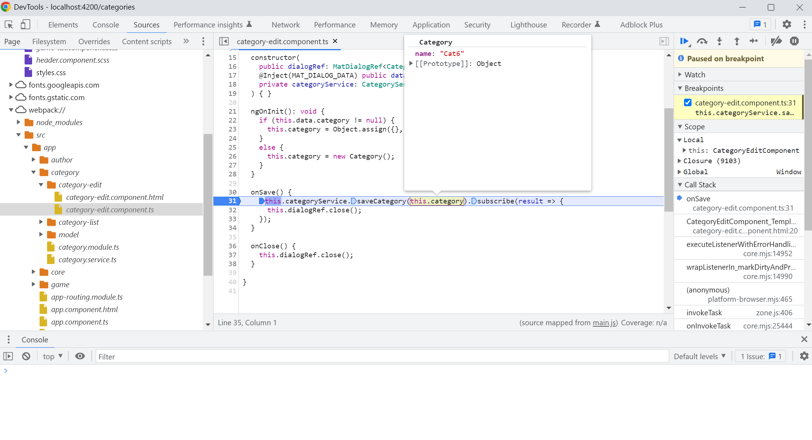
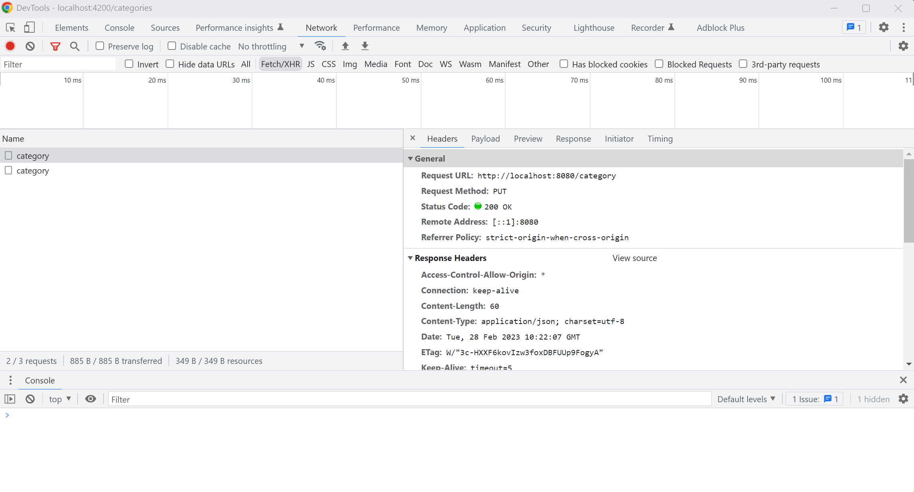

# Listado simple - VUE

Ahora que ya tenemos listo el proyecto frontend de VUE, ya podemos empezar a codificar la solución.

## Primeros pasos

!!! success "Antes de empezar"
    Quiero hacer hincapié que VUE tiene una documentación muy extensa y completa, así que te recomiendo que hagas uso de ella cuando tengas cualquier duda. En la propia web de documentación de [VUE](https://vuejs.org/guide/introduction.html) puedes buscar casi cualquier ejemplo que necesites.


Vamos a realizar una pantalla lo más parecida a la siguiente captura para empezar:



Lo primero que vamos a hacer es crear los componentes de las tres próximas pantallas mediante el siguiente comando: 


```
npx quasar new page CatalogPage CategoriesPage AuthorsPage
```

Y ahora vamos a crear las rutas que nos van a hacer llegar hasta ellos: 

```
import { RouteRecordRaw } from 'vue-router';
import MainLayout from 'layouts/MainLayout.vue';
import IndexPage from 'pages/IndexPage.vue';
import CatalogPage from 'pages/CatalogPage.vue';
import CategoriesPage from 'pages/CategoriesPage.vue';
import AuthorsPage from 'pages/AuthorsPage.vue';

const routes: RouteRecordRaw[] = [
  {
    path: '/',
    component: MainLayout,
    children: [
      { path: '', component: IndexPage },
      { path: 'games', component: CatalogPage },
      { path: 'categories', component: CategoriesPage },
      { path: 'authors', component: AuthorsPage },
    ],
  },

  // Always leave this as last one,
  // but you can also remove it
  // {
  //   path: '/:catchAll(.*)*',
  //   component: () => import('pages/ErrorNotFound.vue'),
  // },
];

export default routes;

```

Una vez realizado esto, vamos a ponerle dentro de cada uno de los archivos creados el nombre del archivo donde está el comentario para saber que lleva al lugar correcto:

```
<template>
  <q-page padding> CatalogPage </q-page>
</template>

<script lang="ts">
import { defineComponent } from 'vue';
export default defineComponent({
  name: 'CatalogPage',
});
</script>

```

Por último, modificaremos el menú lateral para que lleve las opciones correctas y nos enlace a dichas pantallas (para esto, iremos al archivo `MainLayout.vue`):

```
const linksList = [
  {
    title: 'Catálogo',
    icon: 'list',
    link: 'games',
  },
  {
    title: 'Categorías',
    icon: 'dashboard',
    link: 'categories',
  },
  {
    title: 'Autores',
    icon: 'face',
    link: 'authors',
  },
];

```

En caso de que no funcione correctamente, debería solucionarse cambiando en el archivo `EssentialLink.vue` el prop `“href”` por el prop `“to”`:

```
<template>
  <q-item clickable tag="a" :to="link">
    <q-item-section v-if="icon" avatar>
      <q-icon :name="icon" />
    </q-item-section>

    <q-item-section>
      <q-item-label>{{ title }}</q-item-label>
    </q-item-section>
  </q-item>
</template>

```

## Código de la pantalla

Para empezar, usaremos un componente de tabla de la librería de Quasar. Este componente nos ayudará a mostrar los datos de los juegos en un futuro.

```
<template>
  <q-page padding>
    <q-table
      :rows="catalogData"
      :columns="columns"
      title="Catálogo"
      row-key="id"
    />
  </q-page>
</template>

```

Así es como debería quedar nuestro componente de tabla con todas las supuestas variables que más adelante le settearemos:

```
<template>
  <q-page padding>
    <q-table
      hide-bottom
      :rows="catalogData"
      :columns="columns"
      v-model:pagination="pagination"
      title="Catálogo"
      class="my-sticky-header-table"
      no-data-label="No hay resultados"
      row-key="id"
    />
  </q-page>
</template>
```

Y así es como vamos a necesitar que esté, ya que no va a tener paginado. ¿Por qué?

* `hide-bottom` → hace que no se muestre la zona baja de la tabla que es donde está el paginado.
* `v-model:pagination` → hará que vengan los datos que vengan, se muestren todos de la misma manera.
* `class` → esta clase hará que, si haciendo scroll pierdes los header, estos te acompañen y siempre sepas qué columna es la que estás mirando.
* `no-data-label` → un mensaje por si algún día no hay datos o tiene un fallo el back.

Todo esto no hace falta aprendérselo, está en la documentación de este componente. Pero vamos a ir usando algunos props como estos para configurar correctamente la tabla.

## Mockeando datos

Y esto va a hacer que podamos mostrar datos:

```
<script lang="ts">
import { defineComponent } from 'vue';

const columns = [
  { name: 'id', align: 'left', label: 'ID', field: 'id', sortable: true },
  {
    name: 'name',
    align: 'left',
    label: 'Nombre',
    field: 'name',
    sortable: true,
  },
  { name: 'options', align: 'left', label: 'Options', field: 'options' },
];

const data = [
  { id: 1, name: 'Dados' },
  { id: 2, name: 'Fichas' },
  { id: 3, name: 'Cartas' },
  { id: 4, name: 'Rol' },
  { id: 5, name: 'Tableros' },
  { id: 6, name: 'Temáticos' },
  { id: 7, name: 'Europeos' },
  { id: 8, name: 'Guerra' },
  { id: 9, name: 'Abstractos' },
];

export default defineComponent({
  name: 'CatalogPage',

  setup() {
    const catalogData = ref(data);

    return {
      catalogData,
      columns: columns,
      pagination: {
        page: 1,
        rowsPerPage: 0, // 0 means all rows
      },
    };
  },
});
</script>

```
Lo que estamos haciendo es settear unos datos, los nombres y estilos de las columnas, y los ajustes de la paginación.

## Añadir, editar y eliminar filas

El código final para esto, que más adelante explicaremos, es el siguiente:

```
<template>
  <q-page padding>
    <q-table
      hide-bottom
      :rows="catalogData"
      :columns="columns"
      v-model:pagination="pagination"
      title="Catálogo"
      class="my-sticky-header-table"
      no-data-label="No hay resultados"
      row-key="id"
    >
      <template v-slot:top>
        <q-btn flat round color="primary" icon="add" @click="showAdd = true" />
      </template>
      <template v-slot:body="props">
        <q-tr :props="props">
          <q-td key="id" :props="props">{{ props.row.id }}</q-td>
          <q-td key="name" :props="props">
            {{ props.row.name }}
            <q-popup-edit
              v-model="props.row.name"
              title="Cambiar nombre"
              v-slot="scope"
            >
              <q-input
                v-model="scope.value"
                dense
                autofocus
                counter
                @keyup.enter="scope.set"
              >
                <template v-slot:append>
                  <q-icon name="edit" />
                </template>
              </q-input>
            </q-popup-edit>
          </q-td>
          <q-td key="options" :props="props">
            <q-btn
              flat
              round
              color="negative"
              icon="delete"
              @click="showDeleteDialog(props.row)"
            />
          </q-td>
        </q-tr>
      </template>
    </q-table>
    <q-dialog v-model="showDelete" persistent>
      <q-card>
        <q-card-section class="row items-center">
          <q-icon
            name="delete"
            size="sm"
            color="negative"
            @click="showDelete = true"
          />
          <span class="q-ml-sm">
            ¿Estás seguro de que quieres borrar este elemento?
          </span>
        </q-card-section>

        <q-card-actions align="right">
          <q-btn flat label="Cancelar" color="primary" v-close-popup />
          <q-btn
            flat
            label="Confirmar"
            color="primary"
            v-close-popup
            @click="deleteGame"
          />
        </q-card-actions>
      </q-card>
    </q-dialog>
    <q-dialog v-model="showAdd">
      <q-card style="min-width: 350px">
        <q-card-section>
          <div class="text-h6">Nombre del juego</div>
        </q-card-section>

        <q-card-section class="q-pt-none">
          <q-input dense v-model="nameToAdd" autofocus @keyup.enter="addGame" />
        </q-card-section>

        <q-card-actions align="right" class="text-primary">
          <q-btn flat label="Cancelar" v-close-popup />
          <q-btn flat label="Añadir juego" v-close-popup @click="addGame" />
        </q-card-actions>
      </q-card>
    </q-dialog>
  </q-page>
</template>

<script lang="ts">
import { ref } from 'vue';
import { defineComponent } from 'vue';

const columns = [
  { name: 'id', align: 'left', label: 'ID', field: 'id', sortable: true },
  {
    name: 'name',
    align: 'left',
    label: 'Nombre',
    field: 'name',
    sortable: true,
  },
  { name: 'options', align: 'left', label: 'Options', field: 'options' },
];

const data = [
  { id: 1, name: 'Dados' },
  { id: 2, name: 'Fichas' },
  { id: 3, name: 'Cartas' },
  { id: 4, name: 'Rol' },
  { id: 5, name: 'Tableros' },
  { id: 6, name: 'Temáticos' },
  { id: 7, name: 'Europeos' },
  { id: 8, name: 'Guerra' },
  { id: 9, name: 'Abstractos' },
];

export default defineComponent({
  name: 'CatalogPage',

  setup() {
    const catalogData = ref(data);
    const showDelete = ref(false);
    const showAdd = ref(false);
    const nameToAdd = ref('');
    const selectedRow = ref({});

    const deleteGame = () => {
      catalogData.value.splice(
        catalogData.value.findIndex((i) => i.id === selectedRow.value.id),
        1
      );
      showDelete.value = false;
    };

    const showDeleteDialog = (item: any) => {
      selectedRow.value = item;
      showDelete.value = true;
    };

    const addGame = () => {
      catalogData.value.push({
        id: Math.max(...catalogData.value.map((o) => o.id)) + 1,
        name: nameToAdd.value,
      });
      nameToAdd.value = '';
      showAdd.value = false;
    };

    return {
      catalogData,
      columns: columns,
      pagination: {
        page: 1,
        rowsPerPage: 0, // 0 means all rows
      },
      showDelete,
      showAdd,
      nameToAdd,
      showDeleteDialog,
      deleteGame,
      addGame,
    };
  },
});
</script>

```

### Añadir fila
Para esto hemos necesitado el primer template dentro del componente tabla para mostrar un botón que hará que se muestre un dialog para introducir el nombre del juego que es el último q-dialog mostrado en el componente. Tanto al pulsar en el botón como al pulsar Enter se ejecutará la función para añadirlo llamada addGame, que se encarga de añadirlo poniéndole un id superior a cualquiera de los ya creados, el nombre seleccionado almacenado en la variable nameToAdd y de dejar de mostrar el dialog una vez realizado el proceso.

### Editar fila
Para esto hemos necesitado el segundo template de dentro del componente (a excepción del último q-td). Este hace que cuando sea la columna id simplemente muestre su valor, pero en cambio cuando sea la del nombre, en caso de que se pulse sobre esa casilla se muestre un dialog con un campo de texto con el valor de la casilla pulsada.

### Borrar fila
Por último, para el borrado hemos necesitado el q-td con la key de options para mostrar un botón para ejecutar la función showDeleteDialog pasándole el item completo de la fila seleccionada, este hace que se muestre el dialog y se almacene el item seleccionado y por último el dialog se encarga de realizar la pregunta de confirmación para su posterior borrado. En caso de confirmarlo, la función deleteGame busca la posición del item seleccionado y lo borra. Una vez hecho eso, limpia el valor de fila seleccionada y deja de mostrar el dialog.

## Conexión con backend
Antes de nada, para poder realizar peticiones vamos a tener que instalar: `@vueuse/core`.

### Recuperación de datos
Vamos a proceder a modificar lo mínimo e indispensable para que los datos mostrados no sean los mockeados y vengan del back mediante esta petición:

```
const { data } = useFetch('http://localhost:8080/game').get().json();
whenever(data, () => (catalogData.value = data.value));
```

También tendremos que modificar los campos a mostrar, ya que ya no es name, si no title el nombre del juego. Y también habrá que mostrar la edad, la categoría y el autor.

### Edición de una fila
Solo modificaremos los campos referidos al juego (de momento) para que sea lo más sencillo posible, es decir, solo se modificará el título y la edad tal y como lo habíamos hecho antes con el `q-popup-edit`.

### Creación de una nueva fila
Ya que no tenemos en el back de Node realizado el back necesario para poder borrar una fila, terminaremos con el añadido de una nueva fila.

Para esto, tendremos que modificar la función para añadir, además de eliminar la variable `nameToAdd` y modificar el dialog. Así debería quedar la función:

```
const addGame = async () => {
  const response = await useFetch('http://localhost:8080/game', {
    method: 'PUT',
    redirect: 'manual',
    headers: {
      accept: '*/*',
      origin: window.origin,
      'Content-Type': 'application/json',
    },
    body: JSON.stringify(gameToAdd.value),
  })
    .put()
    .json();

  getGames();
  gameToAdd.value = newGame;
};

```

Y así el dialog:

```
<q-dialog v-model="showAdd">
      <q-card style="width: 300px" class="q-px-sm q-pb-md">
        <q-card-section>
          <div class="text-h6">Nuevo juego</div>
        </q-card-section>

        <q-item-label header>Título</q-item-label>
        <q-item dense>
          <q-item-section avatar>
            <q-icon name="sports_esports" />
          </q-item-section>
          <q-item-section>
            <q-input dense v-model="gameToAdd.title" autofocus />
          </q-item-section>
        </q-item>

        <q-item-label header>Edad</q-item-label>
        <q-item dense>
          <q-item-section avatar>
            <q-icon name="cake" />
          </q-item-section>
          <q-item-section>
            <q-slider
              color="teal"
              v-model="gameToAdd.age"
              :min="0"
              :max="100"
              :step="1"
              label
              label-always
            />
          </q-item-section>
        </q-item>

        <q-item-label header>Categoría</q-item-label>
        <q-item dense>
          <q-item-section avatar>
            <q-icon name="category" />
          </q-item-section>
          <q-item-section>
            <q-select
              name="category"
              v-model="gameToAdd.category.id"
              :options="categories"
              filled
              clearable
              emit-value
              map-options
              option-disable="inactive"
              option-value="id"
              option-label="name"
              color="primary"
              label="Category"
            />
          </q-item-section>
        </q-item>

        <q-item-label header>Autor</q-item-label>
        <q-item dense>
          <q-item-section avatar>
            <q-icon name="face" />
          </q-item-section>
          <q-item-section>
            <q-select
              name="author"
              v-model="gameToAdd.author.id"
              :options="authors"
              filled
              clearable
              emit-value
              map-options
              option-disable="inactive"
              option-value="id"
              option-label="name"
              color="primary"
              label="Author"
            />
          </q-item-section>
        </q-item>

        <q-card-actions align="right" class="text-primary">
          <q-btn flat label="Cancelar" v-close-popup />
          <q-btn flat label="Añadir juego" v-close-popup @click="addGame" />
        </q-card-actions>
      </q-card>
    </q-dialog>

```

## Último paso

Este resultado vamos a copiarlo y pegarlo en las pantallas de Categoría y Autor para que tengamos exactamente el mismo formato cambiando todo donde diga “juego” o “game” por su traducción a “categoría” o “autor”.

### Ejercicio

Al realizar el cambio descrito anteriormente podremos ver que no todo funciona, ya que el objeto que se envía para modificar no sería correcto además de que las tablas de Categoría y Autor sí que tienen una función para poder borrar esas filas.

El ejercicio se va a realizar en la pantalla de Categoría. Consta en, después de haber realizado todos los cambios, hacer que añada, edite y borre las filas según sea necesario.

El código resultante debería ser algo parecido al siguiente código:

```
<template>
  <q-page padding>
    <q-table
      hide-bottom
      :rows="categoriesData"
      :columns="columns"
      v-model:pagination="pagination"
      title="Catálogo"
      class="my-sticky-header-table"
      no-data-label="No hay resultados"
      row-key="id"
    >
      <template v-slot:top>
        <q-btn flat round color="primary" icon="add" @click="showAdd = true" />
      </template>
      <template v-slot:body="props">
        <q-tr :props="props">
          <q-td key="id" :props="props">{{ props.row.id }}</q-td>
          <q-td key="name" :props="props">
            {{ props.row.name }}
            <q-popup-edit
              v-model="props.row.name"
              title="Cambiar nombre"
              v-slot="scope"
            >
              <q-input
                v-model="scope.value"
                dense
                autofocus
                counter
                @keyup.enter="editRow(props, scope, 'name')"
              >
                <template v-slot:append>
                  <q-icon name="edit" />
                </template>
              </q-input>
            </q-popup-edit>
          </q-td>
          <q-td key="options" :props="props">
            <q-btn
              flat
              round
              color="negative"
              icon="delete"
              @click="showDeleteDialog(props.row)"
            />
          </q-td>
        </q-tr>
      </template>
    </q-table>
    <q-dialog v-model="showDelete" persistent>
      <q-card>
        <q-card-section class="row items-center">
          <q-icon
            name="delete"
            size="sm"
            color="negative"
            @click="showDelete = true"
          />
          <span class="q-ml-sm">
            ¿Estás seguro de que quieres borrar este elemento?
          </span>
        </q-card-section>

        <q-card-actions align="right">
          <q-btn flat label="Cancelar" color="primary" v-close-popup />
          <q-btn
            flat
            label="Confirmar"
            color="primary"
            v-close-popup
            @click="deleteCategory"
          />
        </q-card-actions>
      </q-card>
    </q-dialog>
    <q-dialog v-model="showAdd">
      <q-card style="width: 300px" class="q-px-sm q-pb-md">
        <q-card-section>
          <div class="text-h6">Nueva categoría</div>
        </q-card-section>

        <q-item-label header>Nombre</q-item-label>
        <q-item dense>
          <q-item-section avatar>
            <q-icon name="category" />
          </q-item-section>
          <q-item-section>
            <q-input
              dense
              v-model="categoryToAdd.name"
              autofocus
              @keyup.enter="addCategory"
            />
          </q-item-section>
        </q-item>
        <q-card-actions align="right" class="text-primary">
          <q-btn flat label="Cancelar" v-close-popup />
          <q-btn
            flat
            label="Añadir categoría"
            v-close-popup
            @click="addCategory"
          />
        </q-card-actions>
      </q-card>
    </q-dialog>
  </q-page>
</template>

<script setup lang="ts">
import { ref } from 'vue';
import { useFetch, whenever } from '@vueuse/core';

const columns = [
  { name: 'id', align: 'left', label: 'ID', field: 'id', sortable: true },
  {
    name: 'name',
    align: 'left',
    label: 'Nombre',
    field: 'name',
    sortable: true,
  },
  { name: 'options', align: 'left', label: 'Options', field: 'options' },
];
const pagination = {
  page: 1,
  rowsPerPage: 0,
};
const newCategory = {
  name: '',
  id: '',
};

const categoriesData = ref([]);
const showDelete = ref(false);
const showAdd = ref(false);
const selectedRow = ref({});
const categoryToAdd = ref({ ...newCategory });

const getCategories = () => {
  const { data } = useFetch('http://localhost:8080/category').get().json();
  whenever(data, () => (categoriesData.value = data.value));
};
getCategories();

const showDeleteDialog = (item: any) => {
  selectedRow.value = item;
  showDelete.value = true;
};

const addCategory = async () => {
  await useFetch('http://localhost:8080/category', {
    method: 'PUT',
    redirect: 'manual',
    headers: {
      accept: '*/*',
      origin: window.origin,
      'Content-Type': 'application/json',
    },
    body: JSON.stringify(categoryToAdd.value),
  })
    .put()
    .json();

  getCategories();
  categoryToAdd.value = newCategory;
  showAdd.value = false;
};

const editRow = (props: any, scope: any, field: any) => {
  const row = {
    name: props.row.name,
  };
  row[field] = scope.value;
  scope.set();
  editCategory(props.row.id, row);
};

const editCategory = async (id: string, reqBody: any) => {
  await useFetch(`http://localhost:8080/category/${id}`, {
    method: 'PUT',
    redirect: 'manual',
    headers: {
      accept: '*/*',
      origin: window.origin,
      'Content-Type': 'application/json',
    },
    body: JSON.stringify(reqBody),
  })
    .put()
    .json();

  getCategories();
};

const deleteCategory = async () => {
  await useFetch(`http://localhost:8080/category/${selectedRow.value.id}`, {
    method: 'DELETE',
    redirect: 'manual',
    headers: {
      accept: '*/*',
      origin: window.origin,
      'Content-Type': 'application/json',
    },
  })
    .delete()
    .json();

  getCategories();
};
</script>
```

## Depuración

Una parte muy importante del desarrollo es tener la capacidad de depurar nuestro código, en este apartado vamos a explicar como se realiza `debug` en Front.

Esta parte se puede realizar con nuestro navegador favorito, en este caso vamos a utilizar Chrome.

El primer paso es abrir las herramientas del desarrollador del navegador presionando `F12`.



En esta herramienta tenemos varias partes importantes:

- Elements: Inspector de los elementos del DOM de nuestra aplicación que nos ayuda identificar el código generado.
- Console: Consola donde podemos ver mensajes importantes que nos ayudan a identificar posibles problemas.
- Source: El navegador de ficheros que componen nuestra aplicación.
- Network: El registro de peticiones que realiza nuestra aplicación.

Identificados los elementos importantes, vamos a depurar la operación de crear categoría.

Para ello nos dirigimos a la pestaña de `Source`, en el árbol de carpetas nos dirigimos a la ruta donde está localizado el código de nuestra aplicación `webpack://src/app`.

Dentro de esta carpeta esté localizado todo el código fuente de la aplicación, en nuestro caso vamos a localizar componente `category-edit.component` que crea una nueva categoría.

Dentro del fichero ya podemos añadir puntos de ruptura (breakpoint), en nuestro caso queremos comprobar que el nombre introducido se captura bien y se envía al service correctamente.

Colocamos el breakpoint en la línea de invocación del service (click sobre el número de la línea) y desde la interfaz creamos una nueva categoría.

Hecho esto, podemos observar que a nivel de interfaz, la aplicación se detiene y aparece un panel de manejo de los puntos de interrupción:



En cuanto a la herramienta del desarrollador nos lleva al punto exacto donde hemos añadido el breakpoint y se para en este punto ofreciéndonos la posibilidad de explorar el contenido de las variables del código:



Aquí podemos comprobar que efectivamente la variable `category` tiene el valor que hemos introducido por pantalla y se propaga correctamente hacia el service.

Para continuar con la ejecución basta con darle al botón de `play` del panel de manejo de interrupción o al que aparece dentro de la herramienta de desarrollo (parte superior derecha).

Por último, vamos a revisar que la petición REST se ha realizado correctamente al backend, para ello nos dirigimos a la pestaña `Network` y comprobamos las peticiones realizadas:



Aquí podemos observar el registro de todas las peticiones y haciendo click sobre una de ellas, obtenemos el detalle de esta.

- Header: Información de las cabeceras enviadas (aquí podemos ver que se ha hecho un PUT a la ruta correcta).
- Payload: El cuerpo de la petición (vemos el cuerpo del mensaje con el nombre enviado).
- Preview: Respuesta de la petición normalizada (vemos la respuesta con el identificador creado para la nueva categoría).