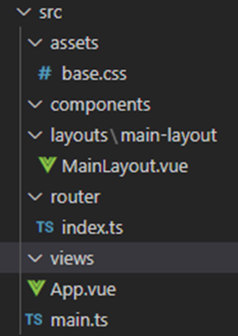

# Listado simple - VUE

Ahora que ya tenemos listo el proyecto frontend de VUE, ya podemos empezar a codificar la solución.

## Primeros pasos

!!! success "Antes de empezar"
    Quiero hacer hincapié que VUE tiene una documentación muy extensa y completa, así que te recomiendo que hagas uso de ella cuando tengas cualquier duda. En la propia web de documentación de [VUE](https://vuejs.org/guide/introduction.html) puedes buscar casi cualquier ejemplo que necesites.


Si abrimos el proyecto con el IDE que tengamos (Visual Studio Code en el caso del tutorial) podemos ver que en la carpeta `src/` existen unos ficheros ya creados por defecto. Estos ficheros son:

* `App.vue` → contiene el código inicial del proyecto.
* `main.ts` → es el punto de entrada a la aplicación.

Lo primero que vamos a hacer es instalar SASS para poder trabajar con este preprocesador CSS, para ello tendremos que irnos a la terminal, en la misma carpeta donde tenemos el proyecto y ejecutar el siguiente comando:

```
npm install -D sass
```

Con esto ya lo tendremos instalado y para usarlo es tan fácil como poner la etiqueta style de esta manera:

```
<style lang="scss"></style>  <--->  con Sass activado
<style></style>  <--->  sin Sass, css normal
```

En los estilos también veremos la propiedad **scoped** en VUE, el atributo scoped se utiliza para limitar el ámbito de los estilos de un componente a los elementos del propio componente y no a los elementos hijos o padres, lo que ayuda a evitar conflictos de estilo entre los diferentes componentes de una aplicación.

Esto significa que los estilos definidos en una etiqueta `<style scoped>` solo se aplicarán a los elementos dentro del componente actual, y no se propagarán a otros componentes en la jerarquía del DOM. De esta manera, se puede evitar que los estilos de un componente afecten a otros componentes en la aplicación.

```
<style scoped></style>  <--->  Estos estilos solo afectarán al componente donde se aplican
<style></style>  <--->  Estos estilos son generales y afectan a toda la aplicación.
```

Con estas cositas sobre los estilos en cabeza vamos lo primero a limpiar la aplicación para poder empezar a trabajar desde cero.

* Entraremos en la carpeta `assets` y borraremos todos los archivos excepto `base.css`.
* Entraremos en la carpeta `components` y borraremos todos los archivos dejando solo la carpeta que usaremos más adelante.
* La carpeta `router` la dejaremos tal cual esta, sin tocar nada.
* Entraremos en la carpeta `views` y borraremos todos los archivos dejando solo la carpeta que usaremos más adelante.
     
Con esto tenemos nuestra estructura preparada y quedaría tal que asi:


Vamos a añadir unas líneas al `tsconfig.json` para que el typescript deje de marcarnos lo como error, lo dejaremos asi:

=== "tsconfig.json"
    ``` Json
    {
      "extends": "@vue/tsconfig/tsconfig.web.json",
      "include": ["env.d.ts", "src/**/*", "src/**/*.vue"],
      "compilerOptions": {
        "preserveValueImports": false,
        "importsNotUsedAsValues": "remove",
        "verbatimModuleSyntax": true,
        "baseUrl": ".",
        "paths": {
          "@/*": ["./src/*"]
        }
      },
    
      "references": [
        {
          "path": "./tsconfig.node.json"
        }
      ]
    }
    ```

Para que la aplicación funcione de nuevo y poder empezar a trabajar faltaría hacer un par de cositas que os explico:

* En él `base.css` no hace falta cambiar nada para que funcione, pero tenemos muchas cosas que seguramente no vamos a usar, este archivo lo conservamos solamente para trabajar en variables css todo el tema de los colores de nuestra web o algunas otras cositas como el ancho del menu o del header, etc…
Lo primero vamos a eliminar todas las variables CSS y crearnos las nuestras propias con nuestro color primario y secundario tanto para botones y demás como para texto y también para el background principal. Tenemos que dejar nuestro archivo de esta manera:

=== "base.css"
    ``` CSS
    :root {
      --primary: #2a6fa8;
      --secondary: #12abdb;
      --text-ligth: #2c3e50;
      --text-dark: #fff;
      --background-color: #fff;
    }
    
    *,
    *::before,
    *::after {
      box-sizing: border-box;
      margin: 0;
      position: relative;
      font-weight: normal;
    }
    
    body {
      min-height: 100vh;
      color: var(--text-ligth);
      background: var(--background-color);
      line-height: 1.6;
      font-family: Inter, -apple-system, BlinkMacSystemFont, 'Segoe UI', Roboto, Oxygen, Ubuntu,
        Cantarell, 'Fira Sans', 'Droid Sans', 'Helvetica Neue', sans-serif;
      font-size: 16px;
      text-rendering: optimizeLegibility;
      -webkit-font-smoothing: antialiased;
      -moz-osx-font-smoothing: grayscale;
    }
    ```

* Después vamos a abrir el archivo `main.ts` y cambiaremos el import que hace del CSS por el base que es el que estamos usando, quedaría de esta manera:

=== "main.ts"
    ``` Typescript
    import { createApp } from 'vue'
    import App from './App.vue'
    import router from './router'
    
    import './assets/base.css'
    
    const app = createApp(App)
    
    app.use(router)
    
    app.mount('#app')
    ```

* Luego abriremos el archivo `App.vue` y lo dejaremos solo como la entrada a la aplicación, esto ya son maneras de trabajar de cada uno, pero a mí me gusta hacerlo asi para tener si hiciera falta diferentes layouts, uno con header y menú, otro sin header y menú, otro de la parte de admin, etc… Lo dejaremos exactamente asi:

=== "App.vue"
    ``` HTML
    <script setup lang="ts">
    import { RouterView } from 'vue-router'
    </script>
    
    <template>
        <RouterView />
    </template>
    ```

* Por último crearemos nuestro layout principal al que iremos añadiendo luego toda nuestra aplicación. Lo primero nos pondremos en `src` y crearemos una nueva carpeta llamada `layouts`, dentro de esta carpeta crearemos otra que se llamara `main-layout` (esto lo hacemos por si luego tenemos más de un layout que cada uno tenga su carpeta para tener sus propias cosas) y dentro de la carpeta `main-layout` crearemos el archivo `MainLayout.vue`, nos debería de quedar asi:




Una vez tenemos el archivo `MainLayout.vue` creado lo abriremos y escribiremos el siguiente código:

=== "MainLayout.vue"
    ``` HTML
    <script setup lang="ts">
        const helloWorld = 'Hola Mundo';
    </script>
    
    <template>
        <h1>{{ helloWorld }}</h1>
    </template>
    ```

Vamos a intentar explicar este código un poco:

* Dentro de las etiquetas `script` metemos todo el código Javascript, en este caso como vamos a trabajar con Typescript le ponemos la etiqueta `Lang=”ts”` para que el compilador sepa que estamos trabajando con Typescript.
* Ponemos la palabra `setup` porque estamos trabajando con la `composition api`, en VUE podemos trabajar con la `options api` y con la `composition api`, nosotros vamos a usar la `composition api` que aunque al principio cuesta un poco más, luego nos va a hacer la vida muchísimo más fácil, sobre todo en aplicaciones "reales".
* Dentro de las etiquetas `template` va el HTML y como estamos usando el método `setup` no necesitamos retornar nada para poder acceder a ello desde la plantilla.
     
Las llaves dobles permiten hacen un binding entre el código del componente y la plantilla. Es decir, en este caso irá al código TypeScript y buscará el valor de la variable helloWorld.

!!!tip "Consejo"
     El binding también nos sirve para ejecutar los métodos de TypeScript desde el código HTML. Además, si el valor que contiene la variable se modificará durante la ejecución de algún método, automáticamente el código HTML refrescaría el nuevo valor de la variable `helloWorld`.
     
Ponemos en marcha la aplicación con `npm run dev`.
     
Si abrimos el navegador y accedemos a `http://localhost:5173/` podremos ver el resultado del código.

## Layout general
### Crear componente

Lo primero que vamos a hacer es escoger un tema y una paleta de componentes para trabajar. VUE no tiene una librería de componentes oficial al igual que, por ejemplo, Angular tiene Material, por lo que podremos elegir entre las diferentes opciones y ver la que más se ajusta a las necesidades del proyecto o crearnos la nuestra propia, si entramos en proyectos ya comenzados, seguramente este paso ya habrá sido abordado y ya sabrás con qué librería de componentes trabajar, para este proyecto vamos a optar por [PrimeVue](https://primevue.org/), no tenemos ningún motivo especial para decidir esa en especial, pero la hemos usado en un curso anterior y optamos por seguir con la misma librería.

Para instalarla bastará con seguir los pasos de su [documentación](https://primevue.org/installation).

Vamos a hacerlo y la instalamos en nuestro proyecto:

* Lo primero ejecutaremos el comando npm o yarn para instalarla, en mi caso lo hare con npm:
* 
```
npm install primevue
```

* Después instalaremos PrimeVue con la función `use` en el `main.ts` que es donde tenemos nuestra configuración, quedando asi nuestro `main.ts`:


* Después añadiremos los estilos necesarios a nuestro `main.ts`:


* Por último en nuestro `base.css` cambiaremos la fuente del proyecto por la que trae el tema de PrimeVue, cambiando en el `body` la línea:

=== "base.css"
    ``` CSS
    ...
     font-family: Inter, -apple-system, BlinkMacSystemFont, 'Segoe UI', Roboto, Oxygen, Ubuntu,
     Cantarell, 'Fira Sans', 'Droid Sans', 'Helvetica Neue', sans-serif;
    ...
    ```
Por:

=== "base.css"
    ``` CSS
    ...
    font-family: (--font-family);
    ...
    ```

!!! info "Recuerda"
    Al añadir una nueva librería tenemos que parar el servidor y volver a arrancarlo para que compile y pre-cargue las nuevas dependencias.

Una vez añadida la dependencia, lo que queremos es crear una primera estructura inicial a la página. Si te acuerdas cual era la estructura (y si no te acuerdas, vuelve a la sección Contexto de la aplicación y lo revisas), teníamos una cabecera superior con un logo y título y unas opciones de menú.

Antes de empezar a crear y programar vamos a instalar unas extensiones en Visual Studio Code que nos harán la vida mucho mas fácil, en cada una de ellas podeis ver una descripción de que hacen y para que sirven, tu ya dices si la quieres instalar o no, nosotros vamos a trabajar con ellas y por eso te las recomendamos:

* [Vue Volar extension Pack](https://marketplace.visualstudio.com/items?itemName=MisterJ.vue-volar-extention-pack)
* [Vue Discovery](https://marketplace.visualstudio.com/items?itemName=Maantje.vue-discovery)
* [IntelliCode](https://marketplace.visualstudio.com/items?itemName=VisualStudioExptTeam.vscodeintellicode)
* [npm Intellisense](https://marketplace.visualstudio.com/items?itemName=christian-kohler.npm-intellisense)
* [Vue VSCode Snippets](https://marketplace.visualstudio.com/items?itemName=sdras.vue-vscode-snippets)


Para poder seguir trabajando con comodidad vamos a añadir una fuente de iconos para todos los iconitos que usemos en la aplicación, nosotros vamos a usar Material porque es la que estamos acostumbrados, para añadirla tenemos una [guía](https://developers.google.com/fonts/docs/material_symbols?hl=es-419#getting_material_symbols).

Lo haremos paso a paso:

* Lo primero añadimos al `index.html` la fuente a través de Google fonts, hay muchas otras maneras de hacerlo, como bajarla y servirla desde local, pero para este tutorial vamos a usar esta por ser la más fácil, para añadirla pegaremos en el `index.html` esta línea:

```
<link href="https://fonts.googleapis.com/css2?family=Material+Symbols+Outlined" rel="stylesheet" />
```

Quedando de esta manera:

=== "index.html"
    ``` HTML
    <!DOCTYPE html>
    <html lang="en">
      <head>
        <meta charset="UTF-8" />
        <link rel="icon" href="/favicon.ico" />
        <meta name="viewport" content="width=device-width, initial-scale=1.0" />
        <link
          href="https://fonts.googleapis.com/css2?family=Material+Symbols+Outlined"
          rel="stylesheet"
        />
        <title>Vite App</title>
      </head>
      <body>
        <div id="app"></div>
        <script type="module" src="/src/main.ts"></script>
      </body>
    </html>
    ```

Para que no nos salga el error de comments, añadiremos al `eslintrc.js` estas líneas:

=== "eslintrc.js"
    ``` Javascript
    ...
    rules: {
        'vue/comment-directive': 'off'
    }
    ...
    ```

Después nos iremos al fichero `base.css` y añadiremos esto al final del archivo:

=== "base.css"
    ``` CSS
    ...
    .material-symbols-outlined {
      font-family: "Material Symbols Outlined", sans-serif;
      font-weight: normal;
      font-style: normal;
      font-size: 24px;  /* Preferred icon size */
      display: inline-block;
      line-height: 1;
      text-transform: none;
      letter-spacing: normal;
      word-wrap: normal;
      white-space: nowrap;
      direction: ltr;
    }
    ```

Con esto ya tendremos añadida la fuente material-symbols y podremos usar todos los iconos [disponibles](https://fonts.google.com/icons).

* Después instalaremos también los iconos de PrimeVue para poder usarlos fácilmente en los componentes, lo primero pondremos:

```
npm install primeicons
```

Una vez instalados, importaremos los iconos en el `main.ts` poniendo este import debajo de todos los de css:

=== "main.ts"
    ``` Typescript
    ...
    import 'primeicons/primeicons.css';
    ...
    ```


Con esto ya lo tendríamos todo.


Pues vamos a ello, con las extensiones ya instaladas y la fuente para los iconos añadida crearemos esa estructura común para toda la aplicación.

Lo primero crearemos el componente header, dentro de la carpeta components al ser un módulo de la aplicación y no especifico de una vista o página. Para eso crearemos una nueva carpeta dentro de components que llamaremos header, nos situaremos encima de la carpeta header y crearemos el archivo `HeaderComponent.vue`, con el archivo vacío escribiremos, `vbase-3-ts-setup` y conforme lo escribimos nos aparecerá esto:


!!!tip "Consejo"
    Esto nos aparece gracias a las extensiones que hemos instalado, asegúrate de instalarlas para que aparezca o si no las quieres instalar lo puedes crear a mano. Si no te aparece y has instalado las extensiones, cierra vscode y vuélvelo a abrir.


Podemos seleccionar `vbase-3-ts-setup`, esto es un snippet que lo que hará es generarnos todo el código de un componente vacío y lo dejara asi:

=== "HeaderComponent.vue"
    ``` HTML
    <template>
        <div>
    
        </div>
    </template>
    
    <script setup lang="ts">
    
    </script>
    
    <style scoped>
    
    </style>
    ```

Con esto solo nos faltaría agregar a la etiqueta style que vamos a trabajar con Sass y la dejaríamos asi:

=== "HeaderComponent.vue"
    ``` HTML
    ...
    <style lang="scss" scoped>
    
    </style>
    ...
    ```

Si os dais cuenta hemos añadido `Lang=”scss”` y con esto ya estamos preparados para crear nuestro componente.

Para continuar cambiaremos el código del `HeaderComponent.vue` por este:

=== "HeaderComponent.vue"
    ``` HTML
    <template>
      <div class="card relative z-2">
        <Menubar :model="items">
          <template #start>
            <span class="material-symbols-outlined">storefront</span>
            <span class="title">LUDOTECA TAN</span>
          </template>
          <template #end>
            <Avatar icon="pi pi-user" class="mr-2 avatar-image" size="large" shape="circle" />
            <span class="sign-text">Sign in</span>
          </template>
        </Menubar>
      </div>
    </template>
    
    <script setup lang="ts">
    import { ref } from "vue";
    import Menubar from "primevue/menubar";
    import Avatar from "primevue/avatar";
    
    const items = ref([
      {
        label: "Catálogo",
      },
      {
        label: "Categorías",
      },
      {
        label: "Autores",
      },
    ]);
    </script>
    
    <style lang="scss" scoped>
    .p-menubar {
      padding: 0.5rem;
      background: var(--primary);
      color: var(--text-dark);
      border: none;
      border-radius: 0px;
    }
    
    .title {
      margin-left: 1rem;
      font-weight: 600;
    }
    
    .avatar-image {
      background-color: var(--secondary);
      color: var(--text-dark);
      border: 1px solid var(--text-dark);
      cursor: pointer;
    }
    
    .sign-text {
      color: var(--text-dark);
      margin-left: 1rem;
      cursor: pointer;
    }
    
    :deep(.p-menubar-start) {
      display: flex;
      flex-direction: row;
      align-items: center;
      justify-content: center;
      margin-right: 1rem;
    }
    
    :deep(.p-menubar-end) {
      display: flex;
      flex-direction: row;
      align-items: center;
      justify-content: center;
    }
    
    :deep(.p-menuitem-text) {
      color: var(--text-dark) !important;
    }
    
    :deep(.p-menuitem-content:hover) {
      background: var(--secondary) !important;
    }
    
    .material-symbols-outlined {
      font-size: 36px;
    }
    </style>
    ```

Intentaremos explicarlo un poco:

En el template estamos añadiendo el `Menubar` de la librería de componentes que estamos utilizando, si queremos saber como se añade podemos verlo en este [link](https://primevue.org/menubar/).

Veremos que lo primero que hacemos es el `import` dentro de las etiquetas `<script>` para poder tener el componente disponible y poder usarlo.

=== "HeaderComponent.vue"
    ``` HTML
    ...
    import Menubar from "primevue/menubar";
    ...
    ```

Luego, con el `import` ya hecho, podemos copiar el HTML que nos dan y ponerlo en nuestro componente:

=== "HeaderComponent.vue"
    ``` HTML
    ...
    <div class="card relative z-2">
        <Menubar :model="items">
            <template #start>
                <span class="material-symbols-outlined">storefront</span>
                <span class="title">LUDOTECA TAN</span>
            </template>
            <template #end>
                <Avatar icon="pi pi-user" class="mr-2 avatar-image" size="large" shape="circle" />
                <span class="sign-text">Sign in</span>
            </template>
        </Menubar>
    </div>
    ...
    ```

Si os dais cuenta es el código que ellos nos dan retocado para cubrir nuestras necesidades, primero hemos metido un icono de material dentro del template `#start` que es lo que se situara al principio pegado a la izquierda del `Menubar` y tras el icono metemos el título.

El template `#end` se situará al final pegado a la derecha y alli estamos metiendo otro componente de la librería de componentes, podéis ver la info de como usarlo en este [link](https://primevue.org/avatar/).

Este simplemente lo pegamos como esta y le añadimos detrás la frase `Sign in`.

En la parte del script metemos todo nuestro Javascript/Typescript:

=== "HeaderComponent.vue"
    ``` HTML
    ...
    <script setup lang="ts">
    import { ref } from "vue";
    import Menubar from "primevue/menubar";
    import Avatar from "primevue/avatar";
    
    const items = ref([
      {
        label: "Catálogo",
      },
      {
        label: "Categorías",
      },
      {
        label: "Autores",
      },
    ]);
    </script>
    ...
    ```

Si os dais cuenta, lo único que estamos haciendo son los imports necesarios para que todo funcione y creando una variable `ítems` que es la que luego estamos usando en el menú para pintar los diferentes menus. Si os dais cuenta envolvemos el valor de la variable dentro de `ref()`. En Vue 3, la función `ref()` se utiliza para crear una referencia reactiva a un valor. Una referencia reactiva es un objeto que puede ser pasado como prop, utilizado en una plantilla, y observado para detectar cambios en su valor.

La función `ref()` toma un valor como argumento y devuelve un objeto con una propiedad value que contiene el valor proporcionado. Por ejemplo, si queremos crear una referencia a un número entero, podemos hacer lo siguiente:

```
import { ref } from 'vue'
const myNumber = ref(42)
console.log(myNumber.value) // 42
```

La referencia `myNumber` es ahora un objeto con una propiedad value que contiene el valor `42`. Si cambiamos el valor de la propiedad `value`, la referencia notificará a cualquier componente que esté observando el valor que ha cambiado. Por ejemplo:

```
myNumber.value = 21
console.log(myNumber.value) // 21
```

Cualquier componente que esté utilizando myNumber se actualizará automáticamente para reflejar el nuevo valor. La función `ref()` es muy útil en Vue 3 para crear referencias reactivas a valores que pueden cambiar con el tiempo.

En los styles tenemos poco que explicar, simplemente estamos haciendo que se vea como nosotros queremos, que todos los colores y demás los traemos de las variables que hemos creado antes en el `base.css` y además me gustaría mencionar una cosa:


=== "HeaderComponent.vue"
    ``` HTML
    ...
    :deep(.p-menubar-start) {
        display: flex;
        flex-direction: row;
        align-items: center;
        justify-content: center;
        margin-right: 1rem;
    }
    ...
    ```

Si os dais cuenta algunos estilos llevan el :Deep delante, como seguro ya sabes, puedes utilizar el atributo `scoped` dentro de la etiqueta `<style>` para escribir CSS y así impedir que tus estilos afecten a posibles sub-componentes. Pero, ¿qué ocurre si necesitas que al menos una regla sí afecte a tu componente hijo?. Para ello puedes usar la pseudo-clase `:deep` de Vue 3.

En este ejemplo lo hemos creado asi para que sepas de su existencia y busques un poco de información sobre ella y las otras que existen, este CSS lo podríamos poner en el `styles.scss` principal y no tendríamos que poner el `:deep` que seria lo mas recomendado. Es importante tener en cuenta que la directiva `:deep` puede tener un impacto en el rendimiento, ya que Vue necesita buscar en todo el árbol de elementos para aplicar los estilos. Por lo tanto, se recomienda utilizar esta directiva con moderación y solo en casos en los que sea necesario seleccionar elementos anidados de forma dinámica. Tenerlo en cuenta y solo usarla cuando de verdad sea necesario.

Ya por último nos iremos a nuestro `MainLayout.vue` y añadiremos el header que acabamos de crearnos:

=== "MainLayout.vue"
    ``` HTML
    <script setup lang="ts">
        import HeaderComponent from '@/components/header/HeaderComponent.vue';
    
        const helloWorld = 'Hola Mundo';
    </script>
    
    <template>
        <HeaderComponent></HeaderComponent>
        <h1>{{ helloWorld }}</h1>
    </template>
    ```

Como antes, lo único que hacemos es importar el componente en el `script` y usarlo en el HTML.

Lo siguiente iremos a la carpeta `router`, al archivo `index.ts` y lo dejaremos asi:

=== "index.ts"
    ``` Typescript
    import { createRouter, createWebHistory } from 'vue-router'
    import MainLayout from '@/layouts/main-layout/MainLayout.vue'
    
    const router = createRouter({
        history: createWebHistory(import.meta.env.BASE_URL),
        routes: [
            {
                path: '/',
                name: 'home',
                component: MainLayout
            }
        ]
    })

    export default router
    ```

Hemos cambiado la ruta principal para que apunte a nuestro `layout` y nada más entrar en la aplicación lo carguemos gracias al router de VUE.

Si guardamos todo y ponemos en marcha el proyecto ya veremos algo como esto:


## Creando un listado básico

### Crear componente

Ya tenemos la estructura principal, ahora vamos a crear nuestra primera pantalla. Vamos a empezar por la de Categorías que es la más sencilla, ya que se trata de un listado, que muestra datos sin filtrar ni paginar.

Como categorías es un dominio funcional de la aplicación, vamos a crear una nueva carpeta dentro de la carpeta `views` llamada categories, todas las pantallas, componentes y servicios que creemos, referidos a este dominio funcional, deberán ir dentro del módulo categories. Dentro de esa carpeta crearemos un fichero que se llamara `CategoriesView.vue` y dentro nos crearemos el esqueleto de la misma manera que hicimos anteriormente.

Escribiremos `vbase-3-ts-setup`, le daremos al enter y nos generara toda la estructura a la que solo faltara agregar a la etiqueta `<style> Lang=”scss”` para decirle que vamos a trabajar con SASS. Con esto tenemos nuestra vista preparada para empezar a trabajar.

Lo primero vamos a conectar nuestro componente al `router` para que cuando hagamos click en el menú correspondiente podamos llegar hasta él y también para poder ver lo que vamos trabajando. Para ello lo primero que vamos a hacer en el template de nuestro componente es añadir cualquier cosa para saber que estamos donde toca, por ejemplo:

=== "CategoriesView.vue"
    ``` HTML
    <template>
      <div>SOY CATEGORIAS</div>
    </template>
    ```

Con esto cuando entremos en la ruta de categorías deberíamos ver `SOY CATEGORIAS`.

Lo siguiente crearemos en el `layout` un sitio para cargar todas nuestras rutas que van a ir dentro de ese layout, para ello iremos al archivo `MainLayout.vue` y añadiremos un `<RouterView />` que será el segundo de nuestra aplicación, el primero lo tenemos en el `App.vue` que servirá para cargar nuestras rutas principales (diferentes layouts, pagina 404, etc) y el segundo es este que acabamos de crear, podemos tener tantos como queramos en una aplicación y cada uno tendrá su cometido. Este que acabamos de crear será donde se cargaran todas las rutas que quieran estar dentro del `layout` principal.

Para crearlo importaremos él `RouterView` dentro de los `<script>` desde `vue-router`:

=== "MainLayout.vue"
    ``` HTML
    import { RouterView } from 'vue-router';
    ```

Lo añadiremos dentro de los `<template>` exactamente donde queramos cargar las rutas y si puede ser con un `div` padre que haga de contenedor asi podremos darle los estilos sin sufrir demasiado.

=== "MainLayout.vue"
    ``` HTML
    <div class="outlet-container">
        <RouterView />
    </div>
    ```

Y luego dentro de `<style>` le daremos estilo al contenedor padre de acuerdo a lo que necesitemos (grid, flex, etc…) en este ejemplo para hacerlo fácil lo haremos con flex, con todo esto quedaría asi:

=== "MainLayout.vue"
    ``` HTML
    <script setup lang="ts">
    import { RouterView } from 'vue-router';
    import HeaderComponent from "@/components/header/HeaderComponent.vue";
    </script>
    
    <template>
      <HeaderComponent></HeaderComponent>
      <div class="outlet-container">
        <RouterView />
      </div>
    </template>
    
    <style lang="scss" scoped>
    .outlet-container {
      display: flex;
      flex-direction: column;
      flex-grow: 1;
      width: 100%;
      min-height: calc(100vh - 65px);
      padding: 1rem;
    }
    </style>
    ```

Ahora vamos a añadirlo a nuestras rutas, para ello nos vamos a la carpeta `router` y dentro tendremos el `index.ts` con nuestras rutas actuales, vamos a añadir la nueva ruta como hija de `layout` para que siempre se muestre dentro del `layout` que hemos creado con él `header`:

=== "index.ts"
    ``` Typescript
    import { createRouter, createWebHistory } from 'vue-router'
    import MainLayout from '@/layouts/main-layout/MainLayout.vue'
    
    const router = createRouter({
        history: createWebHistory(import.meta.env.BASE_URL),
        routes: [
            {
                path: '/',
                name: 'home',
                component: MainLayout,
                children: [
                    {
                        path: '/categories',
                        name: 'categories',
                        component: () => import('../views/categories/CategoriesView.vue')
                    }
                ]
            }
        ]
    })
    
    export default router
    ```

Si os dais cuenta lo hemos añadido como hijo de `layout` y además lo hemos hecho con `lazy loading`, es decir, este componente solo se cargara cuando el usuario navegue a esa ruta, asi evitamos cargas muchísimo más grandes al inicio de la aplicación.

Posteriormente nos iremos al `HeaderComponent.vue` y añadiremos la ruta a los ítems del menú de esta manera:

=== "HeaderComponent.vue"
    ``` HTML
    const items = ref([
        {
            label: "Catálogo",
        },
        {
            label: "Categorías",
            to: { name: 'categories'}
        },
        {
            label: "Autores",
        },
    ]);
    ```

Si nos fijamos hemos añadido la navegación por el nombre de ruta en el menú categorías para que sepa cuando apretemos ese menú donde nos tiene que llevar.

Con todo esto si ponemos en marcha nuestra aplicación, ya podremos navegar haciendo click en el menú Categorías a esta nueva ruta que hemos creado y ya veríamos el `SOY CATEGORIAS` pero tenemos un problemilla en los menus, cuando apretamos un menú se pone el fondo gris, lo cual no nos gusta y además aunque estemos en categorías si apretamos en otro menú se pone el otro gris y se quita el categorías lo cual tampoco es lo deseado ya que queremos que se quede marcado el menú donde estamos actualmente para información del usuario. Para ello nos iremos al `base.css` y añadiremos al final estas líneas:

=== "base.css"
    ``` CSS
    ...
    .router-link-active {
        background: var(--secondary);
        border-radius: 5px;
    }
    
    .p-menuitem.p-focus > .p-menuitem-content:not(:hover) {
        background: transparent !important;
    }
    ```

En Vue 3, la directiva `router-link-active` se utiliza para establecer una clase CSS en un enlace de router activo, con esto ya tendremos resuelto el problema y todo estará funcionando como toca y poniendo en marcha la aplicación y haciendo click en el menú Categorías ya deberíamos ver esto:


### Código de la pantalla

Ahora vamos a construir la pantalla. Para manejar la información del listado, necesitamos tipar los datos para que Typescript no se queje. Para ello crearemos un fichero en `categories\models\category-interface.ts` donde implementaremos la interface necesaria. Esta interface será la que utilizaremos para tipar el código de nuestro componente.

=== "category-interface.ts"
    ``` Typescript
    export interface Category {
        id: number
        name: string
    }
    ```

También, escribiremos el código de `CategoriesView.vue`:

=== "CategoriesView.vue"
    ``` HTML
    <template>
      <div class="card">
        <DataTable
          v-model:editingRows="editingRows"
          :value="categories"
          tableStyle="min-width: 50rem"
          editMode="row"
          dataKey="id"
          @row-edit-save="onRowEditSave"
        >
          <Column field="id" header="IDENTIFICADOR">
            <template #editor="{ data, field }">
              <InputText v-model="data[field]" />
            </template>
          </Column>
          <Column field="name" header="NOMBRE CATEGORÍA">
            <template #editor="{ data, field }">
              <InputText v-model="data[field]" />
            </template>
          </Column>
          <Column
            :rowEditor="true"
            style="width: 110px"
            bodyStyle="text-align:center"
          ></Column>
          <Column
            style="width: 30px; padding: 0px 2rem 0px 0px; color: red"
            bodyStyle="text-align:center"
          >
            <template #body="{ data }">
              <i class="pi pi-times" @click="onRowDelete(data)"></i>
            </template>
          </Column>
        </DataTable>
      </div>
      <div class="actions">
        <Button label="Nueva categoría" />
      </div>
    </template>
    
    <script setup lang="ts">
    import { ref } from "vue";
    import DataTable, { type DataTableRowEditSaveEvent } from "primevue/datatable";
    import Column from "primevue/column";
    import InputText from "primevue/inputtext";
    import Button from 'primevue/button';
    import type { CategoryInterface } from "./model/category.interface";
    const categories = ref([]);
    const editingRows = ref([]);
    const onRowEditSave = (event: DataTableRowEditSaveEvent) => {
      console.log(event);
    };
    const onRowDelete = (data: CategoryInterface) => {
      console.log(data);
    }
    </script>
    
    <style lang="scss" scoped>
    .actions {
      display: flex;
      flex-direction: row;
      margin-top: 1rem;
      justify-content: flex-end;
    }
    
    .p-button {
      background: var(--primary);
      border: 1px solid var(--primary);
    
      &:enabled {
        &:hover {
          background: var(--secondary);
          border-color: var(--secondary);
        }
      }
    }
    </style>
    ```

Intentaremos explicar un poco el código:

Lo primero vamos a importar el componente DataTable desde la librería de componentes que estamos usando, para ello podemos ver algunos ejemplos de como hacerlo en la [documentación](https://primevue.org/datatable) oficial

Nosotros hemos puesto las importaciones que necesitamos en el `<script>`:

=== "CategoriesView.vue"
    ``` HTML
    import DataTable, { type DataTableRowEditSaveEvent } from "primevue/datatable";
    import Column from "primevue/column";
    ```

Hemos creado nuestra tabla con las exigencias de la aplicación, hemos puesto dos columnas, la columna identificador donde en él `header=””` le ponemos que nombre se muestra en la cabecera y le hemos dicho que debe mostrar en ella el dato id poniéndolo en él `field=””`.

=== "CategoriesView.vue"
    ``` HTML
    <Column field="id" header="IDENTIFICADOR"></Column>
    ```

Como a la tabla le hemos dicho que debe ser editable con:

=== "CategoriesView.vue"
    ``` HTML
    editMode="row"
    ```

Le decimos a esta columna que debe hacer cuando entremos en modo de edición, con el template le decimos que mostrara un `InputText` que es otro componente de la librería de componentes que viene a ser un input de toda la vida donde podemos escribir texto para editar el valor, quedando al final asi:

=== "CategoriesView.vue"
    ``` HTML
    <Column field="id" header="IDENTIFICADOR">
        <template #editor="{ data, field }">
            <InputText v-model="data[field]" />
        </template>
    </Column>
    ```

Luego hemos creado dos columnas, una que tiene el lápiz y activa el modo edición:

=== "CategoriesView.vue"
    ``` HTML
    <Column
        :rowEditor="true"
        style="width: 110px"
        bodyStyle="text-align:center">
    </Column>
    ```

Y otra que tiene la X y lo que hará será borrar la fila:

=== "CategoriesView.vue"
    ``` HTML
    <Column
        style="width: 30px; padding: 0px 2rem 0px 0px; color: red"
        bodyStyle="text-align:center"
    >
        <template #body="{ data }">
        <i class="pi pi-times" @click="onRowDelete(data)"></i>
        </template>
    </Column>
    ```

Al final añadimos otro contenedor que vale para alojar los botones como en nuestro caso el de crear nueva categoría, el botón es también un componente de la librería por lo que tendremos que hacer su import en la etiqueta `<script>`:

=== "CategoriesView.vue"
    ``` HTML
    <div class="actions">
        <Button label="Nueva categoría" />
    </div>
    ```

Si abrimos el navegador y accedemos a `http://localhost:5173/` y pulsamos en el menú de Categorías obtendremos una pantalla con un listado vacío (solo con cabeceras) y un botón de crear `Nueva Categoría` que aún no hace nada.

## Añadiendo datos

En este punto y para ver como responde el listado, vamos a añadir datos. Si tuviéramos el backend implementado podríamos consultar los datos directamente de una operación de negocio de backend, pero ahora mismo no lo tenemos implementado así que para no bloquear el desarrollo vamos a mockear los datos.

En Vue para conectar a APIS externas solemos usar una librería llamada Axios, lo primero que haremos será descargarla e instalarla como indica en su [documentación](https://axios-http.com/es/docs/intro) oficial.

Para instalarla simplemente nos iremos a la terminal dentro de la carpeta donde tenemos el proyecto y pondremos:

```
npm install axios
```

Con esto ya podremos ver que se ha añadido a nuestro `package.json`, luego crearemos una carpeta `api` dentro de la carpeta `src` y dentro de la carpeta `api` crearemos el archivo `app-api.ts`. Dentro de este archivo vamos a inicializar nuestra config de la API y guardaremos todos los parámetros iniciales conforme nos vayan haciendo falta, de momento pondremos solo este código:


=== "app-api.ts"
    ``` Typescript
    import axios from 'axios';
    
    export const appApi = axios.create({
        baseURL: 'http://localhost:8080',
    });
    ```

Si os dais cuenta lo único que hacemos es importar `axios` que acabamos de instalarlo y definir nuestra url base del api para no tener que escribirla cada vez y para sí algún día cambia, tener que cambiarla solo en un sitio y no en todos los servicios que la usen.

Para mockear los datos con `axios` usaremos una librería que se llama `axios-mock-adapter` y la podéis encontrar en este [link](https://github.com/ctimmerm/axios-mock-adapter).

Para instalarla lo haremos con npm como siempre, pondremos esta orden en el terminal y enter:

```
npm install axios-mock-adapter --save-dev
```

Si nos vamos al `package.json` veremos que ya la tenemos en las `devDependencies`, la diferencia entre estas y las dependencias es que las dependencias las necesitamos en el proyecto y estarán en nuestro `bundle` final que serviremos a la gente, las `devDependencies` se usan solo mientras programamos y no entraran en el `bundle` final. Los mocks los usaremos solo en el desarrollo y hasta que podamos conectar con la API real por eso los metemos en las devDependencies.

### Mockeando datos

Como hemos comentado anteriormente, el backend todavía no está implementado así que vamos a mockear datos. Nos crearemos un fichero `mock-categories.ts` dentro de `views/categories/mocks`, con datos ficticios y crearemos una llamada a la API que nos devuelva estos datos. De esta forma, cuando tengamos implementada la operación de negocio en backend, tan solo tenemos que sustituir el código que devuelve datos estáticos por una llamada HTTP.

Dentro de la carpeta `mocks` crearemos el archivo `mock-categories.ts` con el siguiente código:

=== "mock-categories.ts"
    ``` Typescript
    import type { Category } from "@/views/categories/models/category-interface";
    
    export const CATEGORY_DATA_MOCK: Category[] = [
        { id: 1, name: 'Dados' },
        { id: 2, name: 'Fichas' },
        { id: 3, name: 'Cartas' },
        { id: 4, name: 'Rol' },
        { id: 5, name: 'Tableros' },
        { id: 6, name: 'Temáticos' },
        { id: 7, name: 'Europeos' },
        { id: 8, name: 'Guerra' },
        { id: 9, name: 'Abstractos' },
    ]
    ```

Después nos crearemos un `composable` que usaremos para llamar a la API y poder reutilizarlo en otros componentes si hiciera falta. Dentro de la carpeta `categories` crearemos otra carpeta llamada `composables` y dentro crearemos un archivo llamado `categories-composable.ts`, en ese archivo escribiremos este código:

=== "categories-composable.ts"
    ``` Typescript
    import appApi from '@/api/app-api'
    import MockAdapter from 'axios-mock-adapter';
    import { CATEGORY_DATA_MOCK } from '@/views/categories/mocks/mock-categories'
    
    const mock = new MockAdapter(appApi);
    
    const useCategoriesApiComposable = () => {
    mock.onGet("/category").reply(200, CATEGORY_DATA_MOCK);
    
        const getCategories = async () => {
            const categories = await appApi.get("/category");
            return categories.data;
        };
    
        return {
            getCategories
        }
    }
    
    export default useCategoriesApiComposable
    ```

Añadiremos él `composable` a nuestro `CategoriesView.vue` dentro de las etiquetas `<script>`, lo primero en el `import` que ya tenemos desde Vue añadiremos el método `onMounted` dejándolo asi:

=== "CategoriesView.vue"
    ``` HTML
    import { onMounted, ref } from 'vue'
    ```

El método `onMounted` es un ciclo de vida que se dispara nada más montarse el componente, después añadiremos al final el `import` del `composable` para poder usarlo:

=== "CategoriesView.vue"
    ``` HTML
    import useCategoriesApiComposable from '@/views/categories/composables/categories-composable'
    ```

Nos traeremos el método del `composable` con la desestructuración del objeto:

=== "CategoriesView.vue"
    ``` HTML
    const { getCategories } = useCategoriesApiComposable()
    ```

Crearemos una función asíncrona para llamar al `composable` y llamaremos al `composable` en el `onMounted`:

=== "CategoriesView.vue"
    ``` HTML
    async function getInitCategories() {
        categories.value = await getCategories()
    }
    
    onMounted(() => {
        getInitCategories()
    })
    ```

El `CategoriesView.vue` quedaría asi:

=== "CategoriesView.vue"
    ``` HTML
    <template>
      <div class="card">
        <DataTable
          v-model:editingRows="editingRows"
          :value="categories"
          tableStyle="min-width: 50rem"
          editMode="row"
          dataKey="id"
          @row-edit-save="onRowEditSave"
        >
          <Column field="id" header="IDENTIFICADOR">
            <template #editor="{ data, field }">
              <InputText v-model="data[field]" />
            </template>
          </Column>
          <Column field="name" header="NOMBRE CATEGORÍA">
            <template #editor="{ data, field }">
              <InputText v-model="data[field]" />
            </template>
          </Column>
          <Column :rowEditor="true" style="width: 110px" bodyStyle="text-align:center"></Column>
          <Column
            style="width: 30px; padding: 0px 2rem 0px 0px; color: red"
            bodyStyle="text-align:center"
          >
            <template #body="{ data }">
              <i class="pi pi-times" @click="onRowDelete(data)"></i>
            </template>
          </Column>
        </DataTable>
      </div>
      <div class="actions">
        <Button label="Nueva categoría" />
      </div>
    </template>
    
    <script setup lang="ts">
    import { onMounted, ref } from 'vue'
    import DataTable, { type DataTableRowEditSaveEvent } from 'primevue/datatable'
    import Column from 'primevue/column'
    import InputText from 'primevue/inputtext'
    import Button from 'primevue/button'
    import type { CategoryInterface } from './model/category.interface'
    import useCategoriesApiComposable from '@/views/categories/composables/categories-composable'
    
    const categories = ref([])
    const editingRows = ref([])
    
    const { getCategories } = useCategoriesApiComposable()
    
    const onRowEditSave = (event: DataTableRowEditSaveEvent) => {
      console.log(event)
    }
    
    const onRowDelete = (data: CategoryInterface) => {
      console.log(data)
    }
    
    async function getInitCategories() {
      categories.value = await getCategories()
    }
    
    onMounted(() => {
      getInitCategories()
    })
    </script>
    
    <style lang="scss" scoped>
    .actions {
      display: flex;
      flex-direction: row;
      margin-top: 1rem;
      justify-content: flex-end;
    }
    
    .p-button {
      background: var(--primary);
      border: 1px solid var(--primary);
    
      &:enabled {
        &:hover {
          background: var(--secondary);
          border-color: var(--secondary);
        }
      }
    }
    </style>
    ```

Si ahora refrescamos la página web, veremos que el listado ya tiene datos con los que vamos a interactuar.


### Simulando las otras peticiones

Para terminar, vamos a simular las otras dos peticiones, la de editar y la de borrar para cuando tengamos que utilizarlas. Él `composable` debe quedar más o menos así:

=== "categories-composable.ts"
    ``` Typescript
    import appApi from '@/api/app-api'
    import MockAdapter from 'axios-mock-adapter'
    import type { Category } from '@/views/categories/models/category-interface'
    import { CATEGORY_DATA_MOCK } from '@/views/categories/mocks/mock-categories'
    
    const mock = new MockAdapter(appApi)
    
    const useCategoriesApiComposable = () => {
      mock.onAny('/category').reply(200, CATEGORY_DATA_MOCK)
    
      const getCategories = async () => {
        const categories = await appApi.get('/category')
        return categories.data
      }
    
      const saveCategory = async (category: Category) => {
        const categoryEdit = await appApi.post('/category', category)
        return categoryEdit.data
      }
    
      const editCategory = async (category: Category) => {
        const categoryEdit = await appApi.put('/category', category)
        return categoryEdit.data
      }
    
      const deleteCategory = async (categoryId: number) => {
        const categoryEdit = await appApi.delete(`/category/${categoryId}`)
        return categoryEdit.data
      }
    
      return {
        getCategories,
        saveCategory,
        editCategory,
        deleteCategory
      }
    }
    
    export default useCategoriesApiComposable
    ```