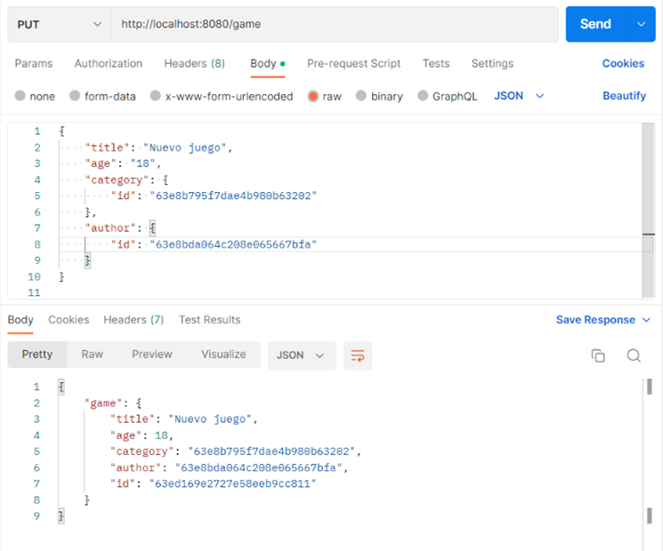
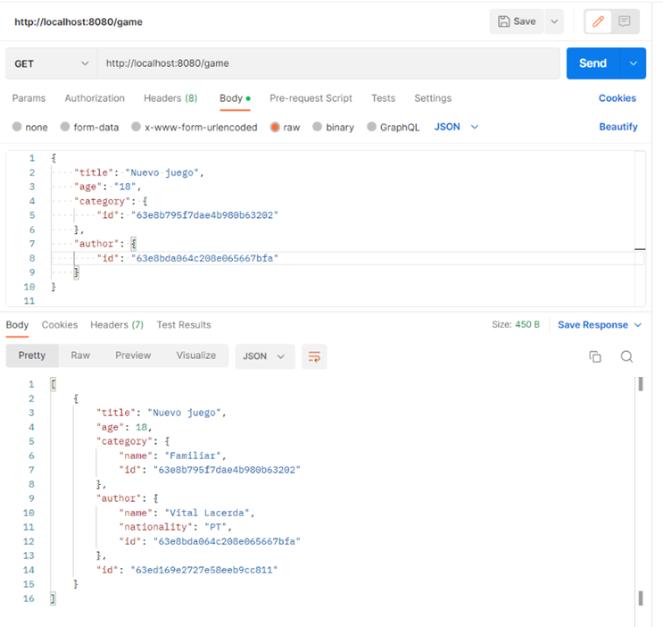
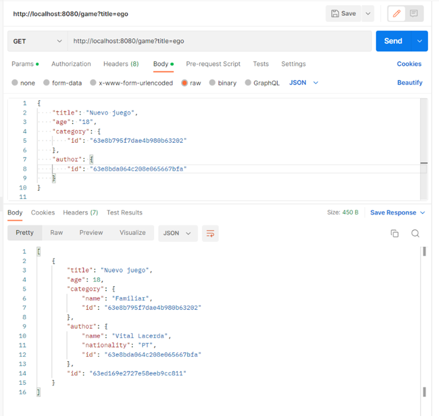

# Listado simple - Nodejs

En este punto ya tenemos dos listados, uno básico y otro paginado. Ahora vamos a implementar un listado un poco diferente, este listado va a tener filtros de búsqueda.

Como ya conocemos como se debe desarrollar, en este ejemplo vamos a ir más rápidos y nos vamos a centrar únicamente en las novedades.


## Crear Modelos

Lo primero que vamos a hacer es crear el modelo de author para trabajar con BBDD. En la carpeta schemas creamos el archivo `game.schema.js`:

=== "game.schema.js"
``` Javascript
import mongoose from "mongoose";
const { Schema, model } = mongoose;
import normalize from 'normalize-mongoose';

const gameSchema = new Schema({
    title: {
        type: String,
        require: true
    },
    age: {
        type: Number,
        require: true,
        max: 99,
        min: 0
    },
    category: {
        type: Schema.Types.ObjectId,
        ref: 'Category',
        required: true
    },
    author: {
        type: Schema.Types.ObjectId,
        ref: 'Author',
        required: true
    }
});

gameSchema.plugin(normalize);
const GameModel = model('Game', gameSchema);

export default GameModel;
```

Lo más novedoso aquí es que ahora cada juego va a tener una categoría y un autor asociados. Para ello simplemente en el tipo del dato `Category` y `Author` tenemos que hacer referencia al id del esquema deseado.


## Implementar el Service

Creamos el service correspondiente `game.service.js`:

=== "game.service.js"
``` Javascript
import GameModel from '../schemas/game.schema.js';

export const getGames = async (title, category) => {
    try {
        const regexTitle = new RegExp(title, 'i');
        const find = category? { $and: [{ title: regexTitle }, { category: category }] } : { title: regexTitle };
        return await GameModel.find(find).sort('id').populate('category').populate('author');
    } catch(e) {
        throw Error('Error fetching games');
    }
}

export const createGame = async (data) => {
    try {
        const game = new GameModel({
            ...data,
            category: data.category.id,
            author: data.author.id,
        });
        return await game.save();
    } catch (e) {
        throw Error('Error creating game');
    }
}

export const updateGame = async (id, data) => {
    try {
        const game = await GameModel.findById(id);
        if (!game) {
            throw Error('There is no game with that Id');
        }    
        const gameToUpdate = {
            ...data,
            category: data.category.id,
            author: data.author.id,
        };
        return await GameModel.findByIdAndUpdate(id, gameToUpdate, { new: false });
    } catch (e) {
        throw Error(e);
    }
}
```

En este caso recibimos en el método para recuperar juegos dos parámetros, el titulo del juego y la categoría. Aquí vamos a utilizar una expresión regular para que podamos encontrar cualquier juego que contenga el titulo que pasemos en su nombre. Con la categoría tiene que ser el valor exacto de su id. El método populate lo que hace es traernos toda la información de la categoría y del autor. Sino lo usásemos solo nos recuperaría el id.


## Implementar el Controller

Creamos el controlador `game.controller.js`:

=== "game.controller.js"
``` Javascript
import * as GameService from '../services/game.service.js';

export const getGames = async (req, res) => {
    try {
        const titleToFind = req.query?.title || '';
        const categoryToFind = req.query?.idCategory || null;
        const games = await GameService.getGames(titleToFind, categoryToFind);
        res.status(200).json(games);
    } catch(err) {
        res.status(400).json({
            msg: err.toString()
        });
    }
}

export const createGame = async (req, res) => {
    try {
        const game = await GameService.createGame(req.body);
        res.status(200).json({
            game
        });
    } catch (err) {
        res.status(400).json({
            msg: err.toString()
        });
    }
}

export const updateGame = async (req, res) => {
    const gameId = req.params.id;
    try {
        await GameService.updateGame(gameId, req.body);
        res.status(200).json(1);
    } catch (err) {
        res.status(400).json({
            msg: err.toString()
        });
    }
}
```

Los métodos son muy parecidos al resto de los controllers. En este caso para recuperar los datos del filtro tendremos que hacerlo con `req.query` para leer los datos que nos lleguen como query params en la url. Por ejemplo: `http://localhost:8080/game?title=trivial&category=1`


## Implementar las Rutas

Y por último creamos nuestro archivo de rutas `game.routes.js`:

=== "game.routes.js"
``` Javascript
import { Router } from 'express';
import { check } from 'express-validator';
import validateFields from '../middlewares/validateFields.js';
import { createGame, getGames, updateGame } from '../controllers/game.controller.js';
const gameRouter = Router();

gameRouter.put('/:id', [
    check('title').not().isEmpty(),
    check('age').not().isEmpty(),
    check('age').isNumeric(),
    check('category.id').not().isEmpty(),
    check('author.id').not().isEmpty(),
    validateFields
], updateGame);

gameRouter.put('/', [
    check('title').not().isEmpty(),
    check('age').not().isEmpty(),
    check('age').isNumeric(),
    check('category.id').not().isEmpty(),
    check('author.id').not().isEmpty(),
    validateFields
], createGame);

gameRouter.get('/', getGames);
gameRouter.get('/:query', getGames);

export default gameRouter;
```

En este caso hemos tenido que meter dos rutas para `get`, una para cuando se informen los filtros y otra para cuando no vayan informados. Si lo hiciéramos con una única ruta nos fallaría en el otro caso.

Finalmente en nuestro archivo `index.js` vamos a añadir el nuevo router:

=== "index.js"
``` Javascript
...

import gameRouter from './src/routes/game.routes.js';

...

app.use('/game', gameRouter);

...
```

## Probar las operaciones

Y ahora que tenemos todo creado, ya podemos probarlo con Postman:

Por un lado creamos juegos con:

** PUT /game **

** PUT /game/{id} **


``` JSON
{
    "title": "Nuevo juego",
    "age": "18",
    "category": {
        "id": "63e8b795f7dae4b980b63202"
 },
    "author": {
        "id": "63e8bda064c208e065667bfa"
    }
}
```





También podemos filtrar y recuperar información:

** GET /game **

** GET /game?title=xxx **

** GET /game?idCategory=xxx **






## Implementar validaciones

Ahora que ya tenemos todos nuestros CRUDs creados vamos a introducir unas pequeñas validaciones.

### Validación en borrado

La primera validación sera para que no podamos borrar categorías ni autores que tengan un juego asociado. Para ello primero tendremos que crear un método en el servicio de juegos para buscar los juegos que correspondan con un campo dado. En `game.service.js` añadimos:

=== "game.service.js"
``` Javascript
...
export const getGame = async (field) => {
    try {
        return await GameModel.find(field);
    } catch (e) {
        throw Error('Error fetching games');
    }
}
...
```

Y ahora en `category.service.js` importamos el método creado y modificamos el método para borrar categorías:

=== "category.service.js"
``` Javascript
...
import { getGame } from './game.service.js';
...

...
export const deleteCategory = async (id) => {
    try {
        const category = await CategoryModel.findById(id);
        if (!category) {
            throw 'There is no category with that Id';
        }
        const games = await getGame({category});
        if(games.length > 0) {
            throw 'There are games related to this category';
        }
        return await CategoryModel.findByIdAndDelete(id);
    } catch (e) {
        throw Error(e);
    }
}
...
```

De este modo si encontramos algún juego con esta categoría no nos dejará borrarla.

Por último, hacemos lo mismo en `author.service.js`:

=== "author.service.js"
``` Javascript
...
import { getGame } from './game.service.js';
...

...
export const deleteAuthor = async (id) => {
    try {
        const author = await AuthorModel.findById(id);
        if (!author) {
            throw 'There is no author with that Id';
        }
        const games = await getGame({author});
        if(games.length > 0) {
            throw 'There are games related to this author';
        }
        return await AuthorModel.findByIdAndDelete(id);
    } catch (e) {
        throw Error(e);
    }
}
...
```

### Validación en creación

En las creaciones es conveniente validad la existencia de las entidades relacionadas para garantizar la integridad de la BBDD.

Para esto vamos a introducir una validación en la creación y edición de los juegos para garantizar que la categoría y el autor proporcionados existen.

En primer lugar vamos a crear los servicios de consulta de categoría y autor:

=== "category.service.js"
``` Javascript
...
export const getCategory = async (id) => {
    try {
        return await CategoryModel.findById(id);
    } catch (e) {
        throw Error('There is no category with that Id');
    }
}
...
```

=== "author.service.js"
``` Javascript
...
export const getAuthor = async (id) => {
    try {
        return await AuthorModel.findById(id);
    } catch (e) {
        throw Error('There is no author with that Id');
    }
}
...
```

Teniendo los servicios ya disponibles, vamos a añadir las validaciones a los servicios de creación y edición:

=== "game.service.js"
``` Javascript
...
import { getCategory } from './category.service.js';
import { getAuthor } from './author.service.js';
...

...
export const createGame = async (data) => {
    try {
        const category = await getCategory(data.category.id);
        if (!category) {
            throw Error('There is no category with that Id');
        }

        const author = await getAuthor(data.author.id);
        if (!author) {
            throw Error('There is no author with that Id');
        }

        const game = new GameModel({
            ...data,
            category: data.category.id,
            author: data.author.id,
        });
        return await game.save();
    } catch (e) {
        throw Error(e);
    }
}
...

...
export const updateGame = async (id, data) => {
    try {
        const game = await GameModel.findById(id);
        if (!game) {
            throw Error('There is no game with that Id');
        }
        
        const category = await getCategory(data.category.id);
        if (!category) {
            throw Error('There is no category with that Id');
        }

        const author = await getAuthor(data.author.id);
        if (!author) {
            throw Error('There is no author with that Id');
        }
        
        const gameToUpdate = {
            ...data,
            category: data.category.id,
            author: data.author.id,
        };
        return await GameModel.findByIdAndUpdate(id, gameToUpdate, { new: false });
    } catch (e) {
        throw Error(e);
    }
}
...
```

Con esto ya tendríamos acabado nuestro CRUD.