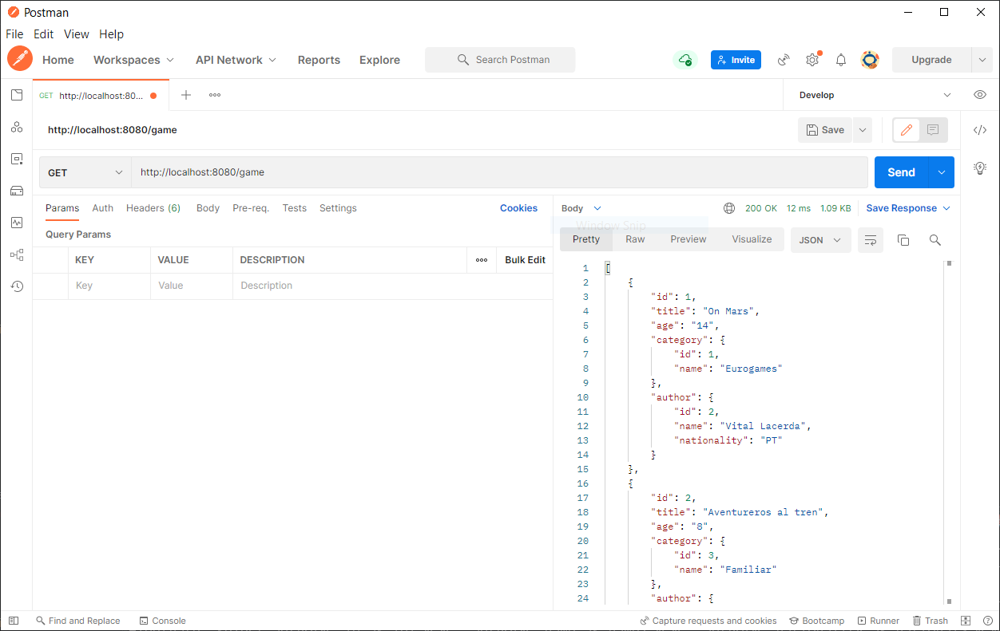

# Listado filtrado - Spring Boot

En este punto ya tenemos dos listados, uno básico y otro paginado. Ahora vamos a implementar un listado un poco diferente, este listado va a tener filtros de búsqueda.

Como ya conocemos como se debe desarrollar, en este ejemplo vamos a ir más rápidos y nos vamos a centrar únicamente en las novedades.

## Crear Modelos

Lo primero que vamos a hacer es crear los modelos para trabajar con BBDD y con peticiones hacia el front. Además, también tenemos que añadir datos al script de inicialización de BBDD.

=== "Game.java"
    ``` Java
    package com.ccsw.tutorial.game.model;
    
    import com.ccsw.tutorial.author.model.Author;
    import com.ccsw.tutorial.category.model.Category;
    
    import jakarta.persistence.*;
    
    
    /**
     * @author ccsw
     *
     */
    @Entity
    @Table(name = "game")
    public class Game {
    
        @Id
        @GeneratedValue(strategy = GenerationType.IDENTITY)
        @Column(name = "id", nullable = false)
        private Long id;
    
        @Column(name = "title", nullable = false)
        private String title;
    
        @Column(name = "age", nullable = false)
        private String age;
    
        @ManyToOne
        @JoinColumn(name = "category_id", nullable = false)
        private Category category;
    
        @ManyToOne
        @JoinColumn(name = "author_id", nullable = false)
        private Author author;
    
        /**
         * @return id
         */
        public Long getId() {
    
            return this.id;
        }
    
        /**
         * @param id new value of {@link #getId}.
         */
        public void setId(Long id) {
    
            this.id = id;
        }
    
        /**
         * @return title
         */
        public String getTitle() {
    
            return this.title;
        }
    
        /**
         * @param title new value of {@link #getTitle}.
         */
        public void setTitle(String title) {
    
            this.title = title;
        }
    
        /**
         * @return age
         */
        public String getAge() {
    
            return this.age;
        }
    
        /**
         * @param age new value of {@link #getAge}.
         */
        public void setAge(String age) {
    
            this.age = age;
        }
    
        /**
         * @return category
         */
        public Category getCategory() {
    
            return this.category;
        }
    
        /**
         * @param category new value of {@link #getCategory}.
         */
        public void setCategory(Category category) {
    
            this.category = category;
        }
    
        /**
         * @return author
         */
        public Author getAuthor() {
    
            return this.author;
        }
    
        /**
         * @param author new value of {@link #getAuthor}.
         */
        public void setAuthor(Author author) {
    
            this.author = author;
        }
    
    }
    ```
=== "GameDto.java"
    ``` Java
    package com.ccsw.tutorial.game.model;
    
    import com.ccsw.tutorial.author.model.AuthorDto;
    import com.ccsw.tutorial.category.model.CategoryDto;
    
    /**
     * @author ccsw
     *
     */
    public class GameDto {
    
        private Long id;
    
        private String title;
    
        private String age;
    
        private CategoryDto category;
    
        private AuthorDto author;
    
        /**
         * @return id
         */
        public Long getId() {
    
            return this.id;
        }
    
        /**
         * @param id new value of {@link #getId}.
         */
        public void setId(Long id) {
    
            this.id = id;
        }
    
        /**
         * @return title
         */
        public String getTitle() {
    
            return this.title;
        }
    
        /**
         * @param title new value of {@link #getTitle}.
         */
        public void setTitle(String title) {
    
            this.title = title;
        }
    
        /**
         * @return age
         */
        public String getAge() {
    
            return this.age;
        }
    
        /**
         * @param age new value of {@link #getAge}.
         */
        public void setAge(String age) {
    
            this.age = age;
        }
    
        /**
         * @return category
         */
        public CategoryDto getCategory() {
    
            return this.category;
        }
    
        /**
         * @param category new value of {@link #getCategory}.
         */
        public void setCategory(CategoryDto category) {
    
            this.category = category;
        }
    
        /**
         * @return author
         */
        public AuthorDto getAuthor() {
    
            return this.author;
        }
    
        /**
         * @param author new value of {@link #getAuthor}.
         */
        public void setAuthor(AuthorDto author) {
    
            this.author = author;
        }
    
    }
    ```
=== "data.sql"
    ``` SQL hl_lines="12 13 14 15 16 17 18"
    INSERT INTO category(name) VALUES ('Eurogames');
    INSERT INTO category(name) VALUES ('Ameritrash');
    INSERT INTO category(name) VALUES ('Familiar');
    
    INSERT INTO author(name, nationality) VALUES ('Alan R. Moon', 'US');
    INSERT INTO author(name, nationality) VALUES ('Vital Lacerda', 'PT');
    INSERT INTO author(name, nationality) VALUES ('Simone Luciani', 'IT');
    INSERT INTO author(name, nationality) VALUES ('Perepau Llistosella', 'ES');
    INSERT INTO author(name, nationality) VALUES ('Michael Kiesling', 'DE');
    INSERT INTO author(name, nationality) VALUES ('Phil Walker-Harding', 'US');
    
    INSERT INTO game(title, age, category_id, author_id) VALUES ('On Mars', '14', 1, 2);
    INSERT INTO game(title, age, category_id, author_id) VALUES ('Aventureros al tren', '8', 3, 1);
    INSERT INTO game(title, age, category_id, author_id) VALUES ('1920: Wall Street', '12', 1, 4);
    INSERT INTO game(title, age, category_id, author_id) VALUES ('Barrage', '14', 1, 3);
    INSERT INTO game(title, age, category_id, author_id) VALUES ('Los viajes de Marco Polo', '12', 1, 3);
    INSERT INTO game(title, age, category_id, author_id) VALUES ('Azul', '8', 3, 5);
    ```
    
!!! note "Relaciones anidadas"
    Fíjate que tanto la `Entity` como el `Dto` tienen relaciones con `Author` y `Category`. Gracias a Spring JPA se pueden resolver de esta forma y tener toda la información de las relaciones hijas dentro del objeto padre. Muy importante recordar que *en el mundo entity* las relaciones serán con objetos `Entity` mientras que *en el mundo dto* las relaciones deben ser siempre con objetos `Dto`. La utilidad beanMapper ya hará las conversiones necesarias, siempre que tengan el mismo nombre de propiedades.


## TDD - Pruebas

Para desarrollar todas las operaciones, empezaremos primero diseñando las pruebas y luego implementando el código necesario que haga funcionar correctamente esas pruebas. Para ir más rápido vamos a poner todas las pruebas de golpe, pero realmente se deberían crear una a una e ir implementando el código necesario para esa prueba. Para evitar tantas iteraciones en el tutorial las haremos todas de golpe.

Vamos a pararnos a pensar un poco que necesitamos en la pantalla. En este caso solo tenemos dos operaciones:

* Una consulta filtrada, que reciba datos de filtro opcionales (título e idCategoría) y devuelva los datos ya filtrados
* Una operación de guardado y modificación

De nuevo tendremos que desglosar esto en varios casos de prueba:

* Buscar un juego sin filtros
* Buscar un título que exista
* Buscar una categoría que exista
* Buscar un título y una categoría que existan
* Buscar un título que no exista
* Buscar una categoría que no exista
* Buscar un título y una categoría que no existan
* Crear un juego nuevo (en realidad deberíamos probar diferentes combinaciones y errores)
* Modificar un juego que exista
* Modificar un juego que no exista


También crearemos una clase `GameController` dentro del package de `com.ccsw.tutorial.game` con la implementación de los métodos vacíos, para que no falle la compilación.

¡Vamos a implementar test!


=== "GameController.java"
    ``` Java
    package com.ccsw.tutorial.game;
    
    import com.ccsw.tutorial.game.model.Game;
    import com.ccsw.tutorial.game.model.GameDto;
    import io.swagger.v3.oas.annotations.Operation;
    import io.swagger.v3.oas.annotations.tags.Tag;
    import org.springframework.web.bind.annotation.*;
    
    import java.util.List;
    
    /**
     * @author ccsw
     *
     */
    @Tag(name = "Game", description = "API of Game")
    @RequestMapping(value = "/game")
    @RestController
    @CrossOrigin(origins = "*")
    public class GameController {
    
        /**
         * Método para recuperar una lista de {@link Game}
         *
         * @param title título del juego
         * @param idCategory PK de la categoría
         * @return {@link List} de {@link GameDto}
         */
        @Operation(summary = "Find", description = "Method that return a filtered list of Games")
        @RequestMapping(path = "", method = RequestMethod.GET)
        public List<GameDto> find(@RequestParam(value = "title", required = false) String title,
                                  @RequestParam(value = "idCategory", required = false) Long idCategory) {
    
            return null;
        }
    
        /**
         * Método para crear o actualizar un {@link Game}
         *
         * @param id PK de la entidad
         * @param dto datos de la entidad
         */
        @Operation(summary = "Save or Update", description = "Method that saves or updates a Game")
        @RequestMapping(path = { "", "/{id}" }, method = RequestMethod.PUT)
        public void save(@PathVariable(name = "id", required = false) Long id, @RequestBody GameDto dto) {

        }
    
    }
    ```
=== "GameIT.java"
    ``` Java
    package com.ccsw.tutorial.game;
    
    import com.ccsw.tutorial.author.model.AuthorDto;
    import com.ccsw.tutorial.category.model.CategoryDto;
    import com.ccsw.tutorial.game.model.GameDto;
    import org.junit.jupiter.api.Test;
    import org.springframework.beans.factory.annotation.Autowired;
    import org.springframework.boot.test.context.SpringBootTest;
    import org.springframework.boot.test.web.client.TestRestTemplate;
    import org.springframework.boot.test.web.server.LocalServerPort;
    import org.springframework.core.ParameterizedTypeReference;
    import org.springframework.http.HttpEntity;
    import org.springframework.http.HttpMethod;
    import org.springframework.http.HttpStatus;
    import org.springframework.http.ResponseEntity;
    import org.springframework.test.annotation.DirtiesContext;
    import org.springframework.web.util.UriComponentsBuilder;
    
    import java.util.HashMap;
    import java.util.List;
    import java.util.Map;
    
    import static org.junit.jupiter.api.Assertions.assertEquals;
    import static org.junit.jupiter.api.Assertions.assertNotNull;
    
    @SpringBootTest(webEnvironment = SpringBootTest.WebEnvironment.RANDOM_PORT)
    @DirtiesContext(classMode = DirtiesContext.ClassMode.BEFORE_EACH_TEST_METHOD)
    public class GameIT {
    
        public static final String LOCALHOST = "http://localhost:";
        public static final String SERVICE_PATH = "/game";
        
        public static final Long EXISTS_GAME_ID = 1L;
        public static final Long NOT_EXISTS_GAME_ID = 0L;
        private static final String NOT_EXISTS_TITLE = "NotExists";
        private static final String EXISTS_TITLE = "Aventureros";
        private static final String NEW_TITLE = "Nuevo juego";
        private static final Long NOT_EXISTS_CATEGORY = 0L;
        private static final Long EXISTS_CATEGORY = 3L;
        
        private static final String TITLE_PARAM = "title";
        private static final String CATEGORY_ID_PARAM = "idCategory";
        
        @LocalServerPort
        private int port;
        
        @Autowired
        private TestRestTemplate restTemplate;
        
        ParameterizedTypeReference<List<GameDto>> responseType = new ParameterizedTypeReference<List<GameDto>>(){};
        
        private String getUrlWithParams(){
        return UriComponentsBuilder.fromHttpUrl(LOCALHOST + port + SERVICE_PATH)
        .queryParam(TITLE_PARAM, "{" + TITLE_PARAM +"}")
        .queryParam(CATEGORY_ID_PARAM, "{" + CATEGORY_ID_PARAM +"}")
        .encode()
        .toUriString();
        }
        
        @Test
        public void findWithoutFiltersShouldReturnAllGamesInDB() {
        
              int GAMES_WITH_FILTER = 6;
        
              Map<String, Object> params = new HashMap<>();
              params.put(TITLE_PARAM, null);
              params.put(CATEGORY_ID_PARAM, null);
        
              ResponseEntity<List<GameDto>> response = restTemplate.exchange(getUrlWithParams(), HttpMethod.GET, null, responseType, params);
        
              assertNotNull(response);
              assertEquals(GAMES_WITH_FILTER, response.getBody().size());
        }
        
        @Test
        public void findExistsTitleShouldReturnGames() {
        
              int GAMES_WITH_FILTER = 1;
        
              Map<String, Object> params = new HashMap<>();
              params.put(TITLE_PARAM, EXISTS_TITLE);
              params.put(CATEGORY_ID_PARAM, null);
        
              ResponseEntity<List<GameDto>> response = restTemplate.exchange(getUrlWithParams(), HttpMethod.GET, null, responseType, params);
        
              assertNotNull(response);
              assertEquals(GAMES_WITH_FILTER, response.getBody().size());
        }
        
        @Test
        public void findExistsCategoryShouldReturnGames() {
        
              int GAMES_WITH_FILTER = 2;
        
              Map<String, Object> params = new HashMap<>();
              params.put(TITLE_PARAM, null);
              params.put(CATEGORY_ID_PARAM, EXISTS_CATEGORY);
        
              ResponseEntity<List<GameDto>> response = restTemplate.exchange(getUrlWithParams(), HttpMethod.GET, null, responseType, params);
        
              assertNotNull(response);
              assertEquals(GAMES_WITH_FILTER, response.getBody().size());
        }
        
        @Test
        public void findExistsTitleAndCategoryShouldReturnGames() {
        
              int GAMES_WITH_FILTER = 1;
        
              Map<String, Object> params = new HashMap<>();
              params.put(TITLE_PARAM, EXISTS_TITLE);
              params.put(CATEGORY_ID_PARAM, EXISTS_CATEGORY);
        
              ResponseEntity<List<GameDto>> response = restTemplate.exchange(getUrlWithParams(), HttpMethod.GET, null, responseType, params);
        
              assertNotNull(response);
              assertEquals(GAMES_WITH_FILTER, response.getBody().size());
        }
        
        @Test
        public void findNotExistsTitleShouldReturnEmpty() {
        
              int GAMES_WITH_FILTER = 0;
        
              Map<String, Object> params = new HashMap<>();
              params.put(TITLE_PARAM, NOT_EXISTS_TITLE);
              params.put(CATEGORY_ID_PARAM, null);
        
              ResponseEntity<List<GameDto>> response = restTemplate.exchange(getUrlWithParams(), HttpMethod.GET, null, responseType, params);
        
              assertNotNull(response);
              assertEquals(GAMES_WITH_FILTER, response.getBody().size());
        }
        
        @Test
        public void findNotExistsCategoryShouldReturnEmpty() {
        
              int GAMES_WITH_FILTER = 0;
        
              Map<String, Object> params = new HashMap<>();
              params.put(TITLE_PARAM, null);
              params.put(CATEGORY_ID_PARAM, NOT_EXISTS_CATEGORY);
        
              ResponseEntity<List<GameDto>> response = restTemplate.exchange(getUrlWithParams(), HttpMethod.GET, null, responseType, params);
        
              assertNotNull(response);
              assertEquals(GAMES_WITH_FILTER, response.getBody().size());
        }
        
        @Test
        public void findNotExistsTitleOrCategoryShouldReturnEmpty() {
        
              int GAMES_WITH_FILTER = 0;
        
              Map<String, Object> params = new HashMap<>();
              params.put(TITLE_PARAM, NOT_EXISTS_TITLE);
              params.put(CATEGORY_ID_PARAM, NOT_EXISTS_CATEGORY);
        
              ResponseEntity<List<GameDto>> response = restTemplate.exchange(getUrlWithParams(), HttpMethod.GET, null, responseType, params);
              assertNotNull(response);
              assertEquals(GAMES_WITH_FILTER, response.getBody().size());
        
              params.put(TITLE_PARAM, NOT_EXISTS_TITLE);
              params.put(CATEGORY_ID_PARAM, EXISTS_CATEGORY);
        
              response = restTemplate.exchange(getUrlWithParams(), HttpMethod.GET, null, responseType, params);
              assertNotNull(response);
              assertEquals(GAMES_WITH_FILTER, response.getBody().size());
        
              params.put(TITLE_PARAM, EXISTS_TITLE);
              params.put(CATEGORY_ID_PARAM, NOT_EXISTS_CATEGORY);
        
              response = restTemplate.exchange(getUrlWithParams(), HttpMethod.GET, null, responseType, params);
              assertNotNull(response);
              assertEquals(GAMES_WITH_FILTER, response.getBody().size());
        }
        
        @Test
        public void saveWithoutIdShouldCreateNewGame() {
        
              GameDto dto = new GameDto();
              AuthorDto authorDto = new AuthorDto();
              authorDto.setId(1L);
        
              CategoryDto categoryDto = new CategoryDto();
              categoryDto.setId(1L);
        
              dto.setTitle(NEW_TITLE);
              dto.setAge("18");
              dto.setAuthor(authorDto);
              dto.setCategory(categoryDto);
        
              Map<String, Object> params = new HashMap<>();
              params.put(TITLE_PARAM, NEW_TITLE);
              params.put(CATEGORY_ID_PARAM, null);
        
              ResponseEntity<List<GameDto>> response = restTemplate.exchange(getUrlWithParams(), HttpMethod.GET, null, responseType, params);
        
              assertNotNull(response);
              assertEquals(0, response.getBody().size());
        
              restTemplate.exchange(LOCALHOST + port + SERVICE_PATH, HttpMethod.PUT, new HttpEntity<>(dto), Void.class);
        
              response = restTemplate.exchange(getUrlWithParams(), HttpMethod.GET, null, responseType, params);
        
              assertNotNull(response);
              assertEquals(1, response.getBody().size());
        }
        
        @Test
        public void modifyWithExistIdShouldModifyGame() {
        
              GameDto dto = new GameDto();
              AuthorDto authorDto = new AuthorDto();
              authorDto.setId(1L);
        
              CategoryDto categoryDto = new CategoryDto();
              categoryDto.setId(1L);
        
              dto.setTitle(NEW_TITLE);
              dto.setAge("18");
              dto.setAuthor(authorDto);
              dto.setCategory(categoryDto);
        
              Map<String, Object> params = new HashMap<>();
              params.put(TITLE_PARAM, NEW_TITLE);
              params.put(CATEGORY_ID_PARAM, null);
        
              ResponseEntity<List<GameDto>> response = restTemplate.exchange(getUrlWithParams(), HttpMethod.GET, null, responseType, params);
        
              assertNotNull(response);
              assertEquals(0, response.getBody().size());
        
              restTemplate.exchange(LOCALHOST + port + SERVICE_PATH + "/" + EXISTS_GAME_ID, HttpMethod.PUT, new HttpEntity<>(dto), Void.class);
        
              response = restTemplate.exchange(getUrlWithParams(), HttpMethod.GET, null, responseType, params);
        
              assertNotNull(response);
              assertEquals(1, response.getBody().size());
              assertEquals(EXISTS_GAME_ID, response.getBody().get(0).getId());
        }
        
        @Test
        public void modifyWithNotExistIdShouldThrowException() {
        
              GameDto dto = new GameDto();
              dto.setTitle(NEW_TITLE);
        
              ResponseEntity<?> response = restTemplate.exchange(LOCALHOST + port + SERVICE_PATH + "/" + NOT_EXISTS_GAME_ID, HttpMethod.PUT, new HttpEntity<>(dto), Void.class);
        
              assertEquals(HttpStatus.INTERNAL_SERVER_ERROR, response.getStatusCode());
        }
    
    }
    ```

!!! tip "Búsquedas en BBDD"
    Siempre deberíamos buscar a los hijos por primary keys, nunca hay que hacerlo por una descripción libre, ya que el usuario podría teclear el mismo nombre de diferentes formas y no habría manera de buscar correctamente el resultado. Así que siempre que haya un dropdown, se debe filtrar por su ID.


Si ahora ejecutas los jUnits, verás que en este caso hemos construido 10 pruebas, para cubrir los casos básicos del `Controller`, y todas ellas fallan la ejecución. Vamos a seguir implementando el resto de capas para hacer que los test funcionen.

## Controller

De nuevo para poder compilar esta capa, nos hace falta delegar sus operaciones de lógica de negocio en un `Service` así que lo crearemos al mismo tiempo que lo vamos necesitando.

=== "GameService.java"
    ``` Java
    package com.ccsw.tutorial.game;
    
    import com.ccsw.tutorial.game.model.Game;
    import com.ccsw.tutorial.game.model.GameDto;
    
    import java.util.List;
    
    /**
     * @author ccsw
     *
     */
    public interface GameService {
    
        /**
         * Recupera los juegos filtrando opcionalmente por título y/o categoría
         *
         * @param title título del juego
         * @param idCategory PK de la categoría
         * @return {@link List} de {@link Game}
         */
        List<Game> find(String title, Long idCategory);
    
        /**
         * Guarda o modifica un juego, dependiendo de si el identificador está o no informado
         *
         * @param id PK de la entidad
         * @param dto datos de la entidad
         */
        void save(Long id, GameDto dto);
    
    }
    ```
=== "GameController.java"
    ``` Java hl_lines="24-25 27-28 42-44 57"
    package com.ccsw.tutorial.game;
    
    import com.ccsw.tutorial.game.model.Game;
    import com.ccsw.tutorial.game.model.GameDto;
    import io.swagger.v3.oas.annotations.Operation;
    import io.swagger.v3.oas.annotations.tags.Tag;
    import org.dozer.DozerBeanMapper;
    import org.springframework.beans.factory.annotation.Autowired;
    import org.springframework.web.bind.annotation.*;
    
    import java.util.List;
    import java.util.stream.Collectors;
    
    /**
     * @author ccsw
     *
     */
    @Tag(name = "Game", description = "API of Game")
    @RequestMapping(value = "/game")
    @RestController
    @CrossOrigin(origins = "*")
    public class GameController {
    
        @Autowired
        GameService gameService;
    
        @Autowired
        DozerBeanMapper mapper;
    
        /**
         * Método para recuperar una lista de {@link Game}
         *
         * @param title título del juego
         * @param idCategory PK de la categoría
         * @return {@link List} de {@link GameDto}
         */
        @Operation(summary = "Find", description = "Method that return a filtered list of Games")
        @RequestMapping(path = "", method = RequestMethod.GET)
        public List<GameDto> find(@RequestParam(value = "title", required = false) String title,
                                  @RequestParam(value = "idCategory", required = false) Long idCategory) {
    
            List<Game> games = gameService.find(title, idCategory);
    
            return games.stream().map(e -> mapper.map(e, GameDto.class)).collect(Collectors.toList());
        }
    
        /**
         * Método para crear o actualizar un {@link Game}
         *
         * @param id PK de la entidad
         * @param dto datos de la entidad
         */
        @Operation(summary = "Save or Update", description = "Method that saves or updates a Game")
        @RequestMapping(path = { "", "/{id}" }, method = RequestMethod.PUT)
        public void save(@PathVariable(name = "id", required = false) Long id, @RequestBody GameDto dto) {
    
            gameService.save(id, dto);
        }
    
    }
    ```

En esta ocasión, para el método de búsqueda hemos decidido utilizar parámetros en la URL de tal forma que nos quedará algo así `http://localhost:8080/game/?title=xxx&idCategoria=yyy`. Queremos recuperar el recurso `Game` que es el raiz de la ruta, pero filtrado por cero o varios parámetros.


## Service

Siguiente paso, la capa de lógica de negocio, es decir el `Service`, que por tanto hará uso de un `Repository`.


=== "GameServiceImpl.java"
    ``` Java hl_lines="30 47"
    package com.ccsw.tutorial.game;

    import com.ccsw.tutorial.game.model.Game;
    import com.ccsw.tutorial.game.model.GameDto;
    import jakarta.transaction.Transactional;
    import org.springframework.beans.BeanUtils;
    import org.springframework.beans.factory.annotation.Autowired;
    import org.springframework.stereotype.Service;
    
    
    import java.util.List;
    
    /**
     * @author ccsw
     *
     */
    @Service
    @Transactional
    public class GameServiceImpl implements GameService {
    
        @Autowired
        GameRepository gameRepository;
    
        /**
         * {@inheritDoc}
         */
        @Override
        public List<Game> find(String title, Long idCategory) {
    
            return (List<Game>) this.gameRepository.findAll();
        }
    
        /**
         * {@inheritDoc}
         */
        @Override
        public void save(Long id, GameDto dto) {
    
            Game game;
    
            if (id == null) {
                game = new Game();
            } else {
                game = this.gameRepository.findById(id).orElse(null);
            }
    
            BeanUtils.copyProperties(dto, game, "id", "author", "category");
    
            this.gameRepository.save(game);
        }
    
    }
    ```
=== "GameRepository.java"
    ``` Java
    package com.ccsw.tutorial.game;
    
    import com.ccsw.tutorial.game.model.Game;
    import org.springframework.data.repository.CrudRepository;
    
    /**
     * @author ccsw
     *
     */
    public interface GameRepository extends CrudRepository<Game, Long> {
    
    }
    ```

Este servicio tiene dos peculiaridades, remarcadas en amarillo en la clase anterior. Por un lado tenemos la consulta, que no es un listado completo ni un listado paginado, sino que es un listado con filtros. Luego veremos como se hace eso, de momento lo dejaremos como un método que recibe los dos filtros.

La segunda peculiaridad es que de cliente nos está llegando un `GameDto`, que internamente tiene un `AuthorDto` y un `CategoryDto`, pero nosotros lo tenemos que traducir a entidades de BBDD. No sirve con copiar las propiedades tal cual, ya que entonces Spring lo que hará será crear un objeto nuevo y persistir ese objeto nuevo de `Author` y de `Category`. Además, de cliente generalmente tan solo nos llega el ID de esos objetos hijo, y no el resto de información de la entidad. Por esos motivos lo hemos *ignorado* del copyProperties.

Pero de alguna forma tendremos que asignarle esos valores a la entidad `Game`. Si conocemos sus ID que es lo que generalmente llega, podemos recuperar esos objetos de BBDD y asignarlos en el objeto `Game`. Si recuerdas las reglas básicas, un `Repository` debe pertenecer a un solo `Service`, por lo que en lugar de llamar a métodos de los `AuthorRepository` y `CategoryRepository` desde nuestro `GameServiceImpl`, debemos llamar a métodos expuestos en `AuthorService` y `CategoryService`, que son los que gestionan sus repositorios. Para ello necesitaremos crear esos métodos get en los otros `Services`. 

Y ya sabes, para implementar nuevos métodos, antes se deben hacer las pruebas jUnit, que en este caso, por variar, cubriremos con pruebas unitarias. Recuerda que los test van en `src/test/java`

=== "AuthorTest.java"
    ``` Java
    package com.ccsw.tutorial.author;
    
    import com.ccsw.tutorial.author.model.Author;
    import org.junit.jupiter.api.Test;
    import org.junit.jupiter.api.extension.ExtendWith;
    import org.mockito.InjectMocks;
    import org.mockito.Mock;
    import org.mockito.junit.jupiter.MockitoExtension;
    
    import java.util.Optional;
    
    import static org.junit.jupiter.api.Assertions.*;
    import static org.mockito.Mockito.mock;
    import static org.mockito.Mockito.when;
    
    @ExtendWith(MockitoExtension.class)
    public class AuthorTest {
    
        public static final Long EXISTS_AUTHOR_ID = 1L;
        public static final Long NOT_EXISTS_AUTHOR_ID = 0L;
        
        @Mock
        private AuthorRepository authorRepository;
        
        @InjectMocks
        private AuthorServiceImpl authorService;
        
        @Test
        public void getExistsAuthorIdShouldReturnAuthor() {
        
              Author author = mock(Author.class);
              when(author.getId()).thenReturn(EXISTS_AUTHOR_ID);
              when(authorRepository.findById(EXISTS_AUTHOR_ID)).thenReturn(Optional.of(author));
        
              Author authorResponse = authorService.get(EXISTS_AUTHOR_ID);
        
              assertNotNull(authorResponse);
        
              assertEquals(EXISTS_AUTHOR_ID, authorResponse.getId());
        }
        
        @Test
        public void getNotExistsAuthorIdShouldReturnNull() {
        
              when(authorRepository.findById(NOT_EXISTS_AUTHOR_ID)).thenReturn(Optional.empty());
        
              Author author = authorService.get(NOT_EXISTS_AUTHOR_ID);
        
              assertNull(author);
        }
    
    }
    ```
=== "AuthorService.java"
    ``` Java hl_lines="16-22"
    package com.ccsw.tutorial.author;
    
    import com.ccsw.tutorial.author.model.Author;
    import com.ccsw.tutorial.author.model.AuthorDto;
    import com.ccsw.tutorial.author.model.AuthorSearchDto;
    import org.springframework.data.domain.Page;
    
    import java.util.List;
    
    /**
     * @author ccsw
     *
     */
    public interface AuthorService {
    
        /**
         * Recupera un {@link Author} a través de su ID
         *
         * @param id PK de la entidad
         * @return {@link Author}
         */
        Author get(Long id);
    
        /**
         * Método para recuperar un listado paginado de {@link Author}
         *
         * @param dto dto de búsqueda
         * @return {@link Page} de {@link Author}
         */
        Page<Author> findPage(AuthorSearchDto dto);
    
        /**
         * Método para crear o actualizar un {@link Author}
         *
         * @param id PK de la entidad
         * @param dto datos de la entidad
         */
        void save(Long id, AuthorDto dto);
    
        /**
         * Método para crear o actualizar un {@link Author}
         *
         * @param id PK de la entidad
         */
        void delete(Long id) throws Exception;
    
    }
    ```
=== "AuthorServiceImpl.java"
    ``` Java hl_lines="25-32 54 68"
    package com.ccsw.tutorial.author;
    
    import com.ccsw.tutorial.author.model.Author;
    import com.ccsw.tutorial.author.model.AuthorDto;
    import com.ccsw.tutorial.author.model.AuthorSearchDto;
    import jakarta.transaction.Transactional;
    import org.springframework.beans.BeanUtils;
    import org.springframework.beans.factory.annotation.Autowired;
    import org.springframework.data.domain.Page;
    import org.springframework.stereotype.Service;
    
    import java.util.List;
    
    /**
     * @author ccsw
     *
     */
    @Service
    @Transactional
    public class AuthorServiceImpl implements AuthorService {
    
        @Autowired
        AuthorRepository authorRepository;
    
        /**
         * {@inheritDoc}
         */
        @Override
        public Author get(Long id) {
    
            return this.authorRepository.findById(id).orElse(null);
        }
    
        /**
         * {@inheritDoc}
         */
        @Override
        public Page<Author> findPage(AuthorSearchDto dto) {
    
            return this.authorRepository.findAll(dto.getPageable().getPageable());
        }
    
        /**
         * {@inheritDoc}
         */
        @Override
        public void save(Long id, AuthorDto data) {
    
            Author author;
    
            if (id == null) {
                author = new Author();
            } else {
                author = this.get(id);
            }
    
            BeanUtils.copyProperties(data, author, "id");
    
            this.authorRepository.save(author);
        }
    
        /**
         * {@inheritDoc}
         */
        @Override
        public void delete(Long id) throws Exception {
    
            if(this.get(id) == null){
                throw new Exception("Not exists");
            }
    
            this.authorRepository.deleteById(id);
        }
    
    }
    ```

Y lo mismo para categorías.


=== "CategoryTest.java"
    ``` Java
    public static final Long NOT_EXISTS_CATEGORY_ID = 0L;

    @Test
    public void getExistsCategoryIdShouldReturnCategory() {
    
          Category category = mock(Category.class);
          when(category.getId()).thenReturn(EXISTS_CATEGORY_ID);
          when(categoryRepository.findById(EXISTS_CATEGORY_ID)).thenReturn(Optional.of(category));
    
          Category categoryResponse = categoryService.get(EXISTS_CATEGORY_ID);
    
          assertNotNull(categoryResponse);
          assertEquals(EXISTS_CATEGORY_ID, category.getId());
    }
    
    @Test
    public void getNotExistsCategoryIdShouldReturnNull() {
    
          when(categoryRepository.findById(NOT_EXISTS_CATEGORY_ID)).thenReturn(Optional.empty());
    
          Category category = categoryService.get(NOT_EXISTS_CATEGORY_ID);
    
          assertNull(category);
    }
    ```
=== "CategoryService.java"
    ``` Java hl_lines="14-20"
    package com.ccsw.tutorial.category;
    
    import com.ccsw.tutorial.category.model.Category;
    import com.ccsw.tutorial.category.model.CategoryDto;
    
    import java.util.List;
    
    /**
     * @author ccsw
     *
     */
    public interface CategoryService {
    
        /**
         * Recupera una {@link Category} a partir de su ID
         *
         * @param id PK de la entidad
         * @return {@link Category}
         */
        Category get(Long id);
    
        /**
         * Método para recuperar todas las {@link Category}
         *
         * @return {@link List} de {@link Category}
         */
        List<Category> findAll();
    
        /**
         * Método para crear o actualizar una {@link Category}
         *
         * @param id PK de la entidad
         * @param dto datos de la entidad
         */
        void save(Long id, CategoryDto dto);
    
        /**
         * Método para borrar una {@link Category}
         *
         * @param id PK de la entidad
         */
        void delete(Long id) throws Exception;
    
    }
    ```
=== "CategoryServiceImpl.java"
    ``` Java hl_lines="22-29 51 65"
    package com.ccsw.tutorial.category;
    
    import com.ccsw.tutorial.category.model.Category;
    import com.ccsw.tutorial.category.model.CategoryDto;
    import jakarta.transaction.Transactional;
    import org.springframework.beans.factory.annotation.Autowired;
    import org.springframework.stereotype.Service;
    
    import java.util.List;
    
    /**
     * @author ccsw
     *
     */
    @Service
    @Transactional
    public class CategoryServiceImpl implements CategoryService {
    
        @Autowired
        CategoryRepository categoryRepository;
        
        /**
         * {@inheritDoc}
         */
        @Override
        public Category get(Long id) {
        
              return this.categoryRepository.findById(id).orElse(null);
        }

        /**
         * {@inheritDoc}
         */
        @Override
        public List<Category> findAll() {
        
              return (List<Category>) this.categoryRepository.findAll();
        }
        
        /**
         * {@inheritDoc}
         */
        @Override
        public void save(Long id, CategoryDto dto) {
        
              Category category;
        
              if (id == null) {
                 category = new Category();
              } else {
                 category = this.get(id);
              }
        
              category.setName(dto.getName());
        
              this.categoryRepository.save(category);
        }
        
        /**
         * {@inheritDoc}
         */
        @Override
        public void delete(Long id) throws Exception {
        
              if(this.get(id) == null){
                 throw new Exception("Not exists");
              }
        
              this.categoryRepository.deleteById(id);
        }
    
    }
    ```

!!! tip "Clean Code"
    A la hora de implementar métodos nuevos, ten siempre presente el `Clean Code`. ¡No dupliques código!, es muy importante de cara al futuro mantenimiento. Si en nuestro método `save` hacíamos uso de una operación `findById` y ahora hemos creado una nueva operación `get`, hagamos uso de esta nueva operación y no repitamos el código.


Y ahora que ya tenemos los métodos necesarios, ya podemos implementar correctamente nuestro `GameServiceImpl`.


=== "GameServiceImpl.java"
    ``` Java hl_lines="26-27 29-30 57-58"
    package com.ccsw.tutorial.game;
    
    import com.ccsw.tutorial.author.AuthorService;
    import com.ccsw.tutorial.category.CategoryService;
    import com.ccsw.tutorial.game.model.Game;
    import com.ccsw.tutorial.game.model.GameDto;
    import jakarta.transaction.Transactional;
    import org.springframework.beans.BeanUtils;
    import org.springframework.beans.factory.annotation.Autowired;
    import org.springframework.stereotype.Service;
    
    
    import java.util.List;
    
    /**
     * @author ccsw
     *
     */
    @Service
    @Transactional
    public class GameServiceImpl implements GameService {
    
        @Autowired
        GameRepository gameRepository;
    
        @Autowired
        AuthorService authorService;
    
        @Autowired
        CategoryService categoryService;
    
        /**
         * {@inheritDoc}
         */
        @Override
        public List<Game> find(String title, Long idCategory) {
    
            return this.gameRepository.findAll();
        }
    
        /**
         * {@inheritDoc}
         */
        @Override
        public void save(Long id, GameDto dto) {
    
            Game game;
    
            if (id == null) {
                game = new Game();
            } else {
                game = this.gameRepository.findById(id).orElse(null);
            }
    
            BeanUtils.copyProperties(dto, game, "id", "author", "category");
    
            game.setAuthor(authorService.get(dto.getAuthor().getId()));
            game.setCategory(categoryService.get(dto.getCategory().getId()));
    
            this.gameRepository.save(game);
        }
    
    }
    ```

Ahora si que tenemos la capa de lógica de negocio terminada, podemos pasar a la siguiente capa.


## Repository

Y llegamos a la última capa donde, si recordamos, teníamos un método que recibe dos parámetros. Necesitamos traducir esto en una consulta a la BBDD.

Vamos a necesitar un listado filtrado por título o por categoría, así que necesitaremos pasarle esos datos y filtrar la query. Para el título vamos a buscar por una cadena contenida, así que el parámetro será de tipo `String`, mientras que para la categoría vamos a buscar por su primary key, así que el parámetro será de tipo `Long`.

Existen varias estrategias para abordar esta implementación. Podríamos utilizar los [QueryMethods](https://www.baeldung.com/spring-data-derived-queries) para que Spring JPA haga su magia, pero en esta ocasión sería bastante complicado encontrar un predicado correcto.

También podríamos hacer una implementación de la interface y hacer la consulta directamente con Criteria. 

Por otro lado se podría hacer uso de la [anotación @Query](https://www.baeldung.com/spring-data-jpa-query). Esta anotación nos permite definir una consulta en SQL nativo o en JPQL (Java Persistence Query Language) y Spring JPA se encargará de realizar todo el mapeo y conversión de los datos de entrada y salida. Pero esta opción no es la más recomendable.

### Specifications

En este caso vamos a hacer uso de las [Specifications](https://www.baeldung.com/rest-api-search-language-spring-data-specifications) que es la opción más robusta y no presenta acoplamientos con el tipo de BBDD.

Haciendo un resumen muy rápido y con poco detalle, las `Specifications` sirven para generar de forma robusta las clausulas `where` de una consulta SQL. Estas clausulas se generarán mediante `Predicate` (predicados) que realizarán operaciones de comparación entre un campo y un valor. 

En el siguiente ejemplo podemos verlo más claro: en la sentencia `select * from `*`Table`*` where`*`name = 'búsqueda'`* tenemos un solo predicado que es `name = 'búsqueda'`. En ese predicado diferenciamos tres etiquetas:

* `name` → será el campo sobre el que hacemos el predicado
* `=` → será la operación que realizamos
* `'búsqueda'` → es el valor con el que realizamos la operación

Lo que trata de hacer `Specifications` es agregar varios predicados con `AND` o con `OR` de forma tipada en código. Y ¿qué intentamos conseguir con esta forma de programar?, pues fácil, intentamos hacer que si cambiamos algún tipo o el nombre de alguna propiedad involucrada en la query, nos salte un fallo en tiempo de compilación y nos demos cuenta de donde está el error. 
Si utilizaramos queries construidas directamente con `String`, al cambiar algún tipo o el nombre de alguna propiedad involucrada, no nos daríamos ni cuenta hasta que saltara un fallo en tiempo de ejecución.

Por este motivo hay que programar con `Specifications`, porque son robustas ante cambios de código y tenemos que tratar de evitar las construcciones a través de cadenas de texto.

Dicho esto, ¡vamos a implementar!

Lo primero que necesitaremos será una clase que nos permita guardar la información de un `Predicate` para luego generar facilmente la construcción. 
Para ello vamos a crear una clase que guarde información de los criterios de filtrado (campo, operación y valor), por suerte esta clase será genérica y la podremos usar en toda la aplicación, así que la vamos a crear en el paquete `com.ccsw.tutorial.common.criteria`

=== "SearchCriteria.java"
    ``` Java
    package com.ccsw.tutorial.common.criteria;
    
    public class SearchCriteria {
    
        private String key;
        private String operation;
        private Object value;
    
        public SearchCriteria(String key, String operation, Object value) {
    
            this.key = key;
            this.operation = operation;
            this.value = value;
        }
    
        public String getKey() {
            return key;
        }
    
        public void setKey(String key) {
            this.key = key;
        }
    
        public String getOperation() {
            return operation;
        }
    
        public void setOperation(String operation) {
            this.operation = operation;
        }
    
        public Object getValue() {
            return value;
        }
    
        public void setValue(Object value) {
            this.value = value;
        }
    
    }
    ```

Hecho esto pasamos a definir el `Specification` de nuestra clase la cual contendrá la construcción de la consulta en función de los criterios que se le proporcionan. No queremos construir los predicados directamente en nuestro `Service` ya que duplicariamos mucho código, mucho mejor si hacemos una clase para centralizar la construcción de predicados.

De esta forma vamos a crear una clase `Specification` por cada una de las `Entity` que queramos consultar. En nuestro caso solo vamos a generar `queries` para `Game`, así que solo crearemos un `GameSpecification` donde construirmos los predicados.

=== "GameSpecification.java"
    ``` Java hl_lines="13 17 22 25 27 33"
    package com.ccsw.tutorial.game;
    
    import com.ccsw.tutorial.common.criteria.SearchCriteria;
    import com.ccsw.tutorial.game.model.Game;
    import jakarta.persistence.criteria.*;
    import org.springframework.data.jpa.domain.Specification;
    
    
    public class GameSpecification implements Specification<Game> {
    
        private static final long serialVersionUID = 1L;
    
        private final SearchCriteria criteria;
    
        public GameSpecification(SearchCriteria criteria) {
    
            this.criteria = criteria;
        }
    
        @Override
        public Predicate toPredicate(Root<Game> root, CriteriaQuery<?> query, CriteriaBuilder builder) {
            if (criteria.getOperation().equalsIgnoreCase(":") && criteria.getValue() != null) {
                Path<String> path = getPath(root);
                if (path.getJavaType() == String.class) {
                    return builder.like(path, "%" + criteria.getValue() + "%");
                } else {
                    return builder.equal(path, criteria.getValue());
                }
            }
            return null;
        }
    
        private Path<String> getPath(Root<Game> root) {
            String key = criteria.getKey();
            String[] split = key.split("[.]", 0);
    
            Path<String> expression = root.get(split[0]);
            for (int i = 1; i < split.length; i++) {
                expression = expression.get(split[i]);
            }
    
            return expression;
        }
    
    }
    ```

Voy a tratar de explicar con calma cada una de las líneas marcadas, ya que son conceptos dificiles de entender hasta que no se utilizan.

* Las dos primeras líneas marcadas hacen referencia a que cuando se crea un `Specification`, esta debe generar un predicado, con lo que necesita unos criterios de filtrado para poder generarlo. En el constructor le estamos pasando esos criterios de filtrado que luego utilizaremos.

* La tercera línea marcada está seleccionando el tipo de operación. En nuestro caso solo vamos a utilizar operaciones de comparación. Por convenio las operaciones de comparación se marcan como ":" ya que el símbolo = está reservado. Aquí es donde podríamos añadir otro tipo de operaciones como ">" o "<>" o cualquiera que queramos implementar. Guárdate esa información que te servirá en el ejercicio final :wink:.

* Las dos siguientes líneas, las de `return` están construyendo un `Predicate` al ser de tipo comparación, si es un texto hará un `like` y si no es texto (que es un número o fecha) hará un `equals`.

* Por último, tenemos un método `getPath` que invocamos dentro la generación del predicado y que implementamos más abajo. Esta función nos permite explorar las sub-entidades para realizar consultas sobre los atributos de estas. Por ejemplo, si queremos navegar hasta `game.author.name`, lo que hará la exploración será recuperar el atributo `name` del objeto `author` de la entidad `game`.


Una vez implementada nuestra clase de `Specification`, que lo único que hace es recoger un criterio de filtrado y construir un predicado, y que en principio solo permite generar comparaciones de igualdad, vamos a utilizarlo dentro de nuestro `Service`:

=== "GameServiceImpl.java"
    ``` Java hl_lines="40 41 43 45"
    package com.ccsw.tutorial.game;
    
    import com.ccsw.tutorial.author.AuthorService;
    import com.ccsw.tutorial.category.CategoryService;
    import com.ccsw.tutorial.common.criteria.SearchCriteria;
    import com.ccsw.tutorial.game.model.Game;
    import com.ccsw.tutorial.game.model.GameDto;
    import jakarta.transaction.Transactional;
    import org.springframework.beans.BeanUtils;
    import org.springframework.beans.factory.annotation.Autowired;
    import org.springframework.data.jpa.domain.Specification;
    import org.springframework.stereotype.Service;
    
    
    import java.util.List;
    
    /**
     * @author ccsw
     *
     */
    @Service
    @Transactional
    public class GameServiceImpl implements GameService {
    
        @Autowired
        GameRepository gameRepository;
    
        @Autowired
        AuthorService authorService;
    
        @Autowired
        CategoryService categoryService;
    
        /**
         * {@inheritDoc}
         */
        @Override
        public List<Game> find(String title, Long idCategory) {
    
            GameSpecification titleSpec = new GameSpecification(new SearchCriteria("title", ":", title));
            GameSpecification categorySpec = new GameSpecification(new SearchCriteria("category.id", ":", idCategory));
    
            Specification<Game> spec = Specification.where(titleSpec).and(categorySpec);
    
            return this.gameRepository.findAll(spec);
        }
    
        /**
         * {@inheritDoc}
         */
        @Override
        public void save(Long id, GameDto dto) {
    
            Game game;
    
            if (id == null) {
                game = new Game();
            } else {
                game = this.gameRepository.findById(id).orElse(null);
            }
    
            BeanUtils.copyProperties(dto, game, "id", "author", "category");
    
            game.setAuthor(authorService.get(dto.getAuthor().getId()));
            game.setCategory(categoryService.get(dto.getCategory().getId()));
    
            this.gameRepository.save(game);
        }
    
    }
    ```
=== "GameRepository.java"
    ``` Java hl_lines="15"
    package com.ccsw.tutorial.game;

    import com.ccsw.tutorial.game.model.Game;
    import org.springframework.data.jpa.domain.Specification;
    import org.springframework.data.jpa.repository.EntityGraph;
    import org.springframework.data.jpa.repository.JpaSpecificationExecutor;
    import org.springframework.data.repository.CrudRepository;
    
    import java.util.List;
    
    /**
     * @author ccsw
     *
     */
    public interface GameRepository extends CrudRepository<Game, Long>, JpaSpecificationExecutor<Game> {
    
    }
    ```
    
Lo que hemos hecho es crear los dos criterios de filtrado que necesitábamos. En nuestro caso eran `title`, que es un atributo de la entidad `Game` y por otro lado el identificador de categoría, que en este caso, ya no es un atributo directo de la entidad, si no, de la categoría asociada, por lo que debemos navegar hasta el atributo `id` a través del atributo `category` (para esto utilizamos el `getPath` que hemos visto anteriormente).

A partir de estos dos predicados, podemos generar el `Specification` global para la consulta, uniendo los dos predicados mediante el operador `AND`.

Una vez construido el `Specification` ya podemos usar el método por defecto que nos proporciona Spring Data para dicho fin, tan solo tenemos que decirle a nuestro `GameRepository` que además extender de `CrudRepository` debe extender de `JpaSpecificationExecutor`, para que pueda ejecutarlas.

## Mejoras rendimiento

Finalmente, de cara a mejorar el rendimiento de nuestros servicios vamos a hacer foco en la generación de transacciones con la base de datos. Si ejecutáramos esta petición tal cual lo tenemos implementado ahora mismo, en la consola veríamos lo siguiente:

``` 
Hibernate: select g1_0.id,g1_0.age,g1_0.author_id,g1_0.category_id,g1_0.title from game g1_0
Hibernate: select a1_0.id,a1_0.name,a1_0.nationality from author a1_0 where a1_0.id=?
Hibernate: select c1_0.id,c1_0.name from category c1_0 where c1_0.id=?
Hibernate: select a1_0.id,a1_0.name,a1_0.nationality from author a1_0 where a1_0.id=?
Hibernate: select c1_0.id,c1_0.name from category c1_0 where c1_0.id=?
Hibernate: select a1_0.id,a1_0.name,a1_0.nationality from author a1_0 where a1_0.id=?
Hibernate: select a1_0.id,a1_0.name,a1_0.nationality from author a1_0 where a1_0.id=?
Hibernate: select a1_0.id,a1_0.name,a1_0.nationality from author a1_0 where a1_0.id=?
```

Esto es debido a que no le hemos dado indicaciones a Spring Data de como queremos que construya las consultas con relaciones y por defecto está configurado para generar sub-consultas cuando tenemos tablas relacionadas.

En nuestro caso la tabla `Game` está relacionada con `Author` y `Category`. Al realizar la consulta a `Game` realiza las sub-consultas por cada uno de los registros relacionados con los resultados `Game`.

Para evitar tantas consultas contra la BBDD y realizar esto de una forma mucho más óptima, podemos decirle a Spring Data el comportamiento que queremos, que en nuestro caso será que haga una única consulta y haga las sub-consultas mediante los `join` correspondientes.

Para ello añadimos una sobre-escritura del método `findAll`, que ya teníamos implementado en `JpaSpecificationExecutor` y que utlizamos de forma heredada, pero en este caso le añadimos la anotación `@EntityGraph` con los atributos que queremos que se incluyan dentro de la consulta principal mediante `join`:

=== "GameRepository.java"
    ``` Java hl_lines="17 18 19"
    package com.ccsw.tutorial.game;
    
    import com.ccsw.tutorial.game.model.Game;
    import org.springframework.data.jpa.domain.Specification;
    import org.springframework.data.jpa.repository.EntityGraph;
    import org.springframework.data.jpa.repository.JpaSpecificationExecutor;
    import org.springframework.data.repository.CrudRepository;
    
    import java.util.List;
    
    /**
     * @author ccsw
     *
     */
    public interface GameRepository extends CrudRepository<Game, Long>, JpaSpecificationExecutor<Game> {
    
        @Override
        @EntityGraph(attributePaths = {"category", "author"})
        List<Game> findAll(Specification<Game> spec);
    
    }
    ```

Tras realizar este cambio, podemos observar que la nueva consulta generada es la siguiente:

``` 
Hibernate: select g1_0.id,g1_0.age,a1_0.id,a1_0.name,a1_0.nationality,c1_0.id,c1_0.name,g1_0.title from game g1_0 join author a1_0 on a1_0.id=g1_0.author_id join category c1_0 on c1_0.id=g1_0.category_id
```

Como podemos observar, ahora se realiza una única consulta con la correspondiente transacción con la BBDD, y se trae todos los datos necesarios de `Game`, `Author` y `Category` sin lanzar múltiples queries.

## Prueba de las operaciones


Si ahora ejecutamos de nuevo los jUnits, vemos que todos los que hemos desarrollado en `GameIT` ya funcionan correctamente, e incluso el resto de test de la aplicación también funcionan correctamente. 

!!! tip "Pruebas jUnit"
    Cada vez que desarrollemos un caso de uso nuevo, debemos relanzar todas las pruebas automáticas que tenga la aplicación. Es muy común que al implementar algún desarrollo nuevo, interfiramos de alguna forma en el funcionamiento de otra funcionalidad. Si lanzamos toda la batería de pruebas, nos daremos cuenta si algo ha dejado de funcionar y podremos solucionarlo antes de llevar ese error a Producción. Las pruebas jUnit son nuestra red de seguridad.


Además de las pruebas automáticas, podemos ver como se comporta la aplicación y que respuesta nos ofrece, lanzando peticiones Rest con Postman, como hemos hecho en los casos anteriores. Así que podemos levantar la aplicación y lanzar las operaciones:

** GET http://localhost:8080/game ** 

** GET http://localhost:8080/game?title=xxx **

** GET http://localhost:8080/game?idCategory=xxx **

Nos devuelve un listado filtrado de `Game`. Fíjate bien en la petición donde enviamos los filtros y la respuesta que tiene los objetos `Category` y `Author` incluídos.



** PUT http://localhost:8080/game ** 
** PUT http://localhost:8080/game/{id} ** 

```
{
    "title": "Nuevo juego",
    "age": "18",
    "category": {
        "id": 3
    },
    "author": {
        "id": 1
    }
}
```

Nos sirve para insertar un `Game` nuevo (si no tienen el id informado) o para actualizar un `Game` (si tienen el id informado). Fíjate que para enlazar `Category` y `Author` tan solo hace falta el id de cada no de ellos, ya que en el método `save` se hace una consulta `get` para recuperarlos por su id. Además que no tendría sentido enviar toda la información de esas entidades ya que no estás dando de alta una `Category` ni un `Author`.


!!! tip "Rendimiento en las consultas JPA"
    En este punto te recomiendo que visites el [Anexo. Funcionamiento JPA](../../appendix/jpa.md) para conocer un poco más como funciona por dentro JPA y algún pequeño truco que puede mejorar el rendimiento.


## Implementar listado Autores

Antes de poder conectar front con back, si recuerdas, en la edición de un `Game`, nos hacía falta un listado de `Author` y un listado de `Category`. El segundo ya lo tenemos ya que lo reutilizaremos del listado de categorías que implementamos. Pero el primero no lo tenemos, porque en la pantalla que hicimos, se mostraban de forma paginada. 

Así que necesitamos implementar esa funcionalidad, y como siempre vamos de la capa de testing hacia las siguientes capas. Deberíamos añadir los siguientes métodos:


=== "AuthorIT.java"
    ``` Java
    ...

    ParameterizedTypeReference<List<AuthorDto>> responseTypeList = new ParameterizedTypeReference<List<AuthorDto>>(){};
    
    @Test
    public void findAllShouldReturnAllAuthor() {
    
          ResponseEntity<List<AuthorDto>> response = restTemplate.exchange(LOCALHOST + port + SERVICE_PATH, HttpMethod.GET, null, responseTypeList);
    
          assertNotNull(response);
          assertEquals(TOTAL_AUTHORS, response.getBody().size());
    }

    ...
    ```
=== "AuthorController.java"
    ``` Java
    ...

    /**
     * Recupera un listado de autores {@link Author}
     *
     * @return {@link List} de {@link AuthorDto}
     */
    @Operation(summary = "Find", description = "Method that return a list of Authors")
    @RequestMapping(path = "", method = RequestMethod.GET)
    public List<AuthorDto> findAll() {

        List<Author> authors = this.authorService.findAll();

        return authors.stream().map(e -> mapper.map(e, AuthorDto.class)).collect(Collectors.toList());
    }

    ...
    ```
=== "AuthorService.java"
    ``` Java
    ...

    /**
     * Recupera un listado de autores {@link Author}
     *
     * @return {@link List} de {@link Author}
     */
    List<Author> findAll();

    ...
    ```
=== "AuthorServiceImpl.java"
    ``` Java
    ...

    /**
     * {@inheritDoc}
     */
    @Override
    public List<Author> findAll() {

        return (List<Author>) this.authorRepository.findAll();
    }


    ...
    ```
