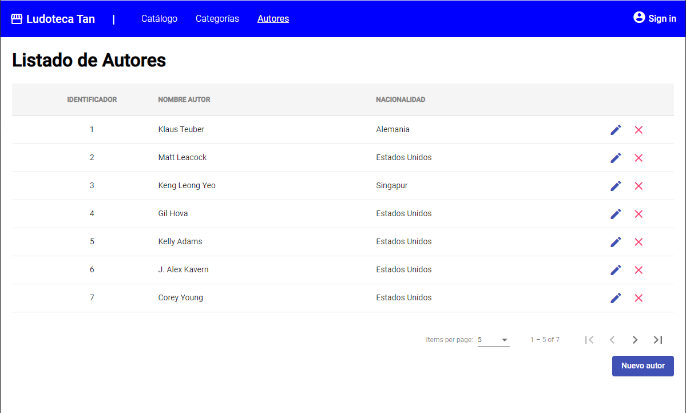
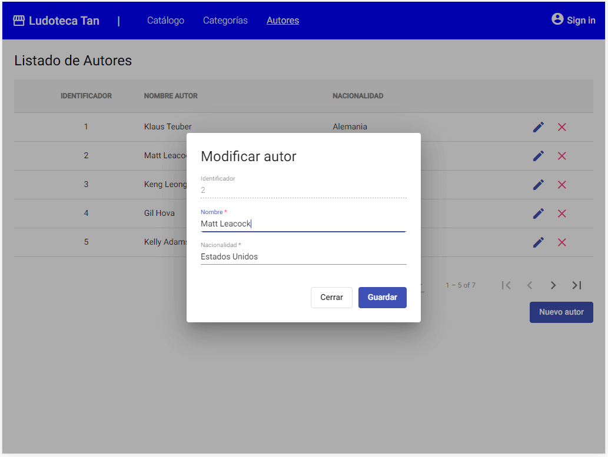

# Listado paginado - Angular

Ya tienes tu primer CRUD desarrollado. ¿Ha sido sencillo, verdad?.

Ahora vamos a implementar un CRUD un poco más complejo, este tiene datos paginados en servidor, esto quiere decir que no nos sirve un array de datos como en el anterior ejemplo. 
Para que un listado paginado en servidor funcione, el cliente debe enviar en cada petición que página está solicitando y cual es el tamaño de la página, para que el servidor devuelva solamente un subconjunto de datos, en lugar de devolver el listado completo.

Como ya conocemos como se debe desarrollar, en este ejemplo vamos a ir más rápidos y nos vamos a centrar únicamente en las novedades.


## Crear modulo y componentes

Vamos a desarrollar el listado de `Autores` así que, debemos crear los componentes:

```
ng generate module author
ng generate component author/author-list
ng generate component author/author-edit

ng generate service author/author
```

Este módulo lo vamos a añadir a la aplicación para que se cargue en el arranque. Abrimos el fichero `app.module.ts` y añadimos el módulo:


=== "app.module.ts" 
    ``` Typescript hl_lines="9 20"
    import { NgModule } from '@angular/core';
    import { BrowserModule } from '@angular/platform-browser';

    import { AppRoutingModule } from './app-routing.module';
    import { AppComponent } from './app.component';
    import { BrowserAnimationsModule } from '@angular/platform-browser/animations';
    import { CoreModule } from './core/core.module';
    import { CategoryModule } from './category/category.module';
    import { AuthorModule } from './author/author.module';

    @NgModule({
    declarations: [
        AppComponent
    ],
    imports: [
        BrowserModule,
        AppRoutingModule,
        CoreModule,
        CategoryModule,
        AuthorModule,
        BrowserAnimationsModule
    ],
    providers: [],
    bootstrap: [AppComponent]
    })
    export class AppModule { }
    ```


## Crear el modelo 

Creamos el modelo en `author/model/Author.ts` con las propiedades necesarias para trabajar con la información de un autor:

=== "Author.ts"
    ``` TypeScript
    export class Author {
        id: number;
        name: string;
        nationality: string;
    }
    ```

## Añadir el punto de entrada

Añadimos la ruta al menú para que podamos acceder a la pantalla:

=== "app-routing.module.ts" 
    ``` Typescript hl_lines="4 8"
    import { NgModule } from '@angular/core';
    import { Routes, RouterModule } from '@angular/router';
    import { CategoryListComponent } from './category/category-list/category-list.component';
    import { AuthorListComponent } from './author/author-list/author-list.component';

    const routes: Routes = [
        { path: 'categories', component: CategoriesComponent },
        { path: 'authors', component: AuthorListComponent },
    ];

    @NgModule({
        imports: [RouterModule.forRoot(routes)],
        exports: [RouterModule]
    })
    export class AppRoutingModule { }
    ```

## Implementar servicio

Y realizamos las diferentes implementaciones. Empezaremos por el servicio. En este caso, hay un cambio sustancial con el anterior ejemplo. Al tratarse de un listado paginado, la operación `getAuthors` necesita información extra acerca de que página de datos debe mostrar, además de que el resultado ya no será un listado sino una página. 

Por defecto el esquema de datos de Spring para la paginación es como el siguiente:

=== "Esquema de datos de paginación"
    ``` JSON
    {
        "content": [ ... <listado con los resultados paginados> ... ],
        "pageable": {
            "pageNumber": <número de página empezando por 0>,
            "pageSize": <tamaño de página>,
            "sort": [
                { 
                    "property": <nombre de la propiedad a ordenar>, 
                    "direction": <dirección de la ordenación ASC / DESC> 
                }
            ]
        },
        "totalElements": <numero total de elementos en la tabla>
    }
    ```

Así que necesitamos poder enviar y recuperar esa información desde Angular, nos hace falta crear esos objetos. Los objetos de paginación al ser comunes a toda la aplicación, vamos a crearlos en `core/model/page`, mientras que la paginación de `AuthorPage.ts` la crearé en su propio model dentro de `author/model`.

=== "SortPage.ts"
    ``` TypeScript
    export class SortPage {
        property: String;
        direction: String;
    }
    ```
=== "Pageable.ts"
    ``` TypeScript
    import { SortPage } from './SortPage';

    export class Pageable {
        pageNumber: number;
        pageSize: number;
        sort: SortPage[];
    }
    ```
=== "AuthorPage.ts"
    ``` TypeScript
    import { Pageable } from "src/app/core/model/page/Pageable";
    import { Author } from "./Author";

    export class AuthorPage {
        content: Author[];
        pageable: Pageable;
        totalElements: number;
    }
    ```

Con estos objetos creados ya podemos implementar el servicio y sus datos mockeados.

=== "mock-authors.ts"
    ``` TypeScript
    import { AuthorPage } from "./AuthorPage";

    export const AUTHOR_DATA: AuthorPage = {
        content: [
            { id: 1, name: 'Klaus Teuber', nationality: 'Alemania' },
            { id: 2, name: 'Matt Leacock', nationality: 'Estados Unidos' },
            { id: 3, name: 'Keng Leong Yeo', nationality: 'Singapur' },
            { id: 4, name: 'Gil Hova', nationality: 'Estados Unidos'},
            { id: 5, name: 'Kelly Adams', nationality: 'Estados Unidos' },
            { id: 6, name: 'J. Alex Kavern', nationality: 'Estados Unidos' },
            { id: 7, name: 'Corey Young', nationality: 'Estados Unidos' },
        ],  
        pageable : {
            pageSize: 5,
            pageNumber: 0,
            sort: [
                {property: "id", direction: "ASC"}
            ]
        },
        totalElements: 7
    }
    ```
=== "author.service.ts"
    ``` TypeScript
    import { Injectable } from '@angular/core';
    import { Observable, of } from 'rxjs';
    import { Pageable } from '../core/model/page/Pageable';
    import { Author } from './model/Author';
    import { AuthorPage } from './model/AuthorPage';
    import { AUTHOR_DATA } from './model/mock-authors';

    @Injectable({
        providedIn: 'root'
    })
    export class AuthorService {

        constructor() { }

        getAuthors(pageable: Pageable): Observable<AuthorPage> {
            return of(AUTHOR_DATA);
        }

        saveAuthor(author: Author): Observable<void> {
            return of(null);
        }

        deleteAuthor(idAuthor : number): Observable<void> {
            return of(null);
        }    
    }
    ```

## Implementar listado

Ya tenemos el servicio con los datos, ahora vamos a por el listado paginado.

=== "author-list.component.html"
    ``` HTML hl_lines="36"
    <div class="container">
        <h1>Listado de Autores</h1>

        <mat-table [dataSource]="dataSource"> 
            <ng-container matColumnDef="id">
                <mat-header-cell *matHeaderCellDef> Identificador </mat-header-cell>
                <mat-cell *matCellDef="let element"> {{element.id}} </mat-cell>
            </ng-container>
            
            <ng-container matColumnDef="name">
                <mat-header-cell *matHeaderCellDef> Nombre autor  </mat-header-cell>
                <mat-cell *matCellDef="let element"> {{element.name}} </mat-cell>
            </ng-container>

            <ng-container matColumnDef="nationality">
                <mat-header-cell *matHeaderCellDef> Nacionalidad  </mat-header-cell>
                <mat-cell *matCellDef="let element"> {{element.nationality}} </mat-cell>
            </ng-container>
            
            <ng-container matColumnDef="action">
                <mat-header-cell *matHeaderCellDef></mat-header-cell>
                <mat-cell *matCellDef="let element">
                    <button mat-icon-button color="primary" (click)="editAuthor(element)">
                        <mat-icon>edit</mat-icon>
                    </button>
                    <button mat-icon-button color="accent" (click)="deleteAuthor(element)">
                        <mat-icon>clear</mat-icon>
                    </button>
                </mat-cell>
            </ng-container>

            <mat-header-row *matHeaderRowDef="displayedColumns; sticky: true"></mat-header-row>
            <mat-row *matRowDef="let row; columns: displayedColumns;"></mat-row>
        </mat-table> 

        <mat-paginator (page)="loadPage($event)" [pageSizeOptions]="[5, 10, 20]" [pageIndex]="pageNumber" [pageSize]="pageSize" [length]="totalElements" showFirstLastButtons></mat-paginator>
    
        <div class="buttons">
            <button mat-flat-button color="primary" (click)="createAuthor()">Nuevo autor</button> 
        </div>   
    </div>
    ```
=== "author-list.component.scss"
    ``` CSS
    .container {
        margin: 20px;
    
        mat-table {
            margin-top: 10px;
            margin-bottom: 20px;
        
            .mat-header-row {
                background-color:#f5f5f5;
        
                .mat-header-cell {
                    text-transform: uppercase;
                    font-weight: bold;
                    color: #838383;
                }      
            }
        
            .mat-column-id {
                flex: 0 0 20%;
                justify-content: center;
            }
        
            .mat-column-action {
                flex: 0 0 10%;
                justify-content: center;
            }
        }
        
        .buttons {
            text-align: right;
        }
    }
    ```
=== "author-list.component.ts"
    ``` TypeScript hl_lines="18-20 34-57"
    import { Component, OnInit } from '@angular/core';
    import { MatDialog } from '@angular/material/dialog';
    import { PageEvent } from '@angular/material/paginator';
    import { MatTableDataSource } from '@angular/material/table';
    import { DialogConfirmationComponent } from 'src/app/core/dialog-confirmation/dialog-confirmation.component';
    import { Pageable } from 'src/app/core/model/page/Pageable';
    import { AuthorEditComponent } from '../author-edit/author-edit.component';
    import { AuthorService } from '../author.service';
    import { Author } from '../model/Author';

    @Component({
    selector: 'app-author-list',
    templateUrl: './author-list.component.html',
    styleUrls: ['./author-list.component.scss']
    })
    export class AuthorListComponent implements OnInit {

        pageNumber: number = 0;
        pageSize: number = 5;
        totalElements: number = 0;

        dataSource = new MatTableDataSource<Author>();
        displayedColumns: string[] = ['id', 'name', 'nationality', 'action'];

        constructor(
            private authorService: AuthorService,
            public dialog: MatDialog,
        ) { }

        ngOnInit(): void {
            this.loadPage();
        }

        loadPage(event?: PageEvent) {

            let pageable : Pageable =  {
                pageNumber: this.pageNumber,
                pageSize: this.pageSize,
                sort: [{
                    property: 'id',
                    direction: 'ASC'
                }]
            }

            if (event != null) {
                pageable.pageSize = event.pageSize
                pageable.pageNumber = event.pageIndex;
            }

            this.authorService.getAuthors(pageable).subscribe(data => {
                this.dataSource.data = data.content;
                this.pageNumber = data.pageable.pageNumber;
                this.pageSize = data.pageable.pageSize;
                this.totalElements = data.totalElements;
            });

        }  

        createAuthor() {      
            const dialogRef = this.dialog.open(AuthorEditComponent, {
                data: {}
            });

            dialogRef.afterClosed().subscribe(result => {
                this.ngOnInit();
            });      
        }  

        editAuthor(author: Author) {    
            const dialogRef = this.dialog.open(AuthorEditComponent, {
                data: { author: author }
            });

            dialogRef.afterClosed().subscribe(result => {
                this.ngOnInit();
            });    
        }

        deleteAuthor(author: Author) {    
            const dialogRef = this.dialog.open(DialogConfirmationComponent, {
                data: { title: "Eliminar autor", description: "Atención si borra el autor se perderán sus datos.<br> ¿Desea eliminar el autor?" }
            });

            dialogRef.afterClosed().subscribe(result => {
                if (result) {
                    this.authorService.deleteAuthor(author.id).subscribe(result =>  {
                        this.ngOnInit();
                    }); 
                }
            });
        }  
    }

    ```

Fíjate como hemos añadido la paginación. 

*   Al HTML le hemos añadido un componente nuevo `mat-paginator`, lo que nos va a obligar a añadirlo al módulo también como dependencia. Ese componente le hemos definido un método `page` que se ejecuta cada vez que la página cambia, y unas propiedades con las que calculará la página, el tamaño y el número total de páginas.
*   Al Typescript le hemos tenido que añadir esas variables y hemos creado un método para cargar datos que lo que hace es construir un objeto `pageable` con los valores actuales del componente paginador y lanza la petición con esos datos en el body. Obviamente al ser un mock no funcionará el cambio de página y demás.

Como siempre, añadimos las dependencias al módulo, vamos a intentar añadir todas las que vamos a necesitar a futuro.

=== "author.module.ts"
    ``` TypeScript
    import { NgModule } from '@angular/core';
    import { CommonModule } from '@angular/common';
    import { AuthorListComponent } from './author-list/author-list.component';
    import { AuthorEditComponent } from './author-edit/author-edit.component';
    import { MatTableModule } from '@angular/material/table';
    import { FormsModule, ReactiveFormsModule } from '@angular/forms';
    import { MatButtonModule } from '@angular/material/button';
    import { MatDialogModule, MAT_DIALOG_DATA } from '@angular/material/dialog';
    import { MatFormFieldModule } from '@angular/material/form-field';
    import { MatIconModule } from '@angular/material/icon';
    import { MatInputModule } from '@angular/material/input';
    import { MatPaginatorModule } from '@angular/material/paginator';


    @NgModule({
    declarations: [
        AuthorListComponent,
        AuthorEditComponent
    ],
    imports: [
        CommonModule,
        MatTableModule,
        MatIconModule, 
        MatButtonModule,
        MatDialogModule,
        MatFormFieldModule,
        MatInputModule,
        FormsModule,
        ReactiveFormsModule,
        MatPaginatorModule,
    ],
    providers: [
        {
            provide: MAT_DIALOG_DATA,
            useValue: {},
        },
    ]
    })
    export class AuthorModule { }
    ```


Debería verse algo similar a esto:



## Implementar dialogo edición

El último paso, es definir la pantalla de dialogo que realizará el alta y modificado de los datos de un `Autor`.

=== "author-edit.component.html"
    ``` HTML
    <div class="container">
        <h1 *ngIf="author.id == null">Crear autor</h1>
        <h1 *ngIf="author.id != null">Modificar autor</h1>

        <form>
            <mat-form-field>
                <mat-label>Identificador</mat-label>
                <input type="text" matInput placeholder="Identificador" [(ngModel)]="author.id" name="id" disabled>
            </mat-form-field>

            <mat-form-field>
                <mat-label>Nombre</mat-label>
                <input type="text" matInput placeholder="Nombre del autor" [(ngModel)]="author.name" name="name" required>
                <mat-error>El nombre no puede estar vacío</mat-error>
            </mat-form-field>

            <mat-form-field>
                <mat-label>Nacionalidad</mat-label>
                <input type="text" matInput placeholder="Nacionalidad del autor" [(ngModel)]="author.nationality" name="nationality" required>
                <mat-error>La nacionalidad no puede estar vacía</mat-error>
            </mat-form-field>
        </form>

        <div class="buttons">
            <button mat-stroked-button (click)="onClose()">Cerrar</button>
            <button mat-flat-button color="primary" (click)="onSave()">Guardar</button>
        </div>
    </div>
    ```
=== "author-edit.component.scss"
    ``` CSS
    .container {
        min-width: 350px;
        max-width: 500px;
        padding: 20px;
    
        form {
            display: flex;
            flex-direction: column;
            margin-bottom:20px;
        }

        .buttons {
        text-align: right;

        button {
            margin-left: 10px;
        }
        }
    }
    ```
=== "author-edit.component.ts"
    ``` TypeScript
    import { Component, Inject, OnInit } from '@angular/core';
    import { MatDialogRef, MAT_DIALOG_DATA } from '@angular/material/dialog';
    import { AuthorService } from '../author.service';
    import { Author } from '../model/Author';

    @Component({
    selector: 'app-author-edit',
    templateUrl: './author-edit.component.html',
    styleUrls: ['./author-edit.component.scss']
    })
    export class AuthorEditComponent implements OnInit {

        author : Author;

        constructor(
            public dialogRef: MatDialogRef<AuthorEditComponent>,
            @Inject(MAT_DIALOG_DATA) public data: any,
            private authorService: AuthorService
        ) { }

        ngOnInit(): void {
            if (this.data.author != null) {
                this.author = Object.assign({}, this.data.author);
            }
            else {
                this.author = new Author();
            }
        }

        onSave() {
            this.authorService.saveAuthor(this.author).subscribe(result =>  {
                this.dialogRef.close();
            }); 
        }  

        onClose() {
            this.dialogRef.close();
        }

    }
    ```

Que debería quedar algo así:




## Conectar con Backend

!!! warning "Antes de seguir"
    Antes de seguir con este punto, debes implementar el código de backend en la tecnología que quieras ([Springboot](springboot.md) o [Nodejs](nodejs.md)). Si has empezado este capítulo implementando el frontend, por favor accede a la sección correspondiente de backend para poder continuar con el tutorial. Una vez tengas implementadas todas las operaciones para este listado, puedes volver a este punto y continuar con Angular.


Una vez implementado front y back, lo que nos queda es modificar el servicio del front para que conecte directamente con las operaciones ofrecidas por el back.

=== "author.service.ts"
    ``` TypeScript hl_lines="14 18 22-25 29"
    import { HttpClient } from '@angular/common/http';
    import { Injectable } from '@angular/core';
    import { Observable, of } from 'rxjs';
    import { Pageable } from '../core/model/page/Pageable';
    import { Author } from './model/Author';
    import { AuthorPage } from './model/AuthorPage';

    @Injectable({
    providedIn: 'root'
    })
    export class AuthorService {

        constructor(
            private http: HttpClient
        ) { }

        getAuthors(pageable: Pageable): Observable<AuthorPage> {
            return this.http.post<AuthorPage>('http://localhost:8080/author', {pageable:pageable});
        }

        saveAuthor(author: Author): Observable<void> {
            let url = 'http://localhost:8080/author';
            if (author.id != null) url += '/'+author.id;

            return this.http.put<void>(url, author);
        }

        deleteAuthor(idAuthor : number): Observable<void> {
            return this.http.delete<void>('http://localhost:8080/author/'+idAuthor);
        }    
    }
    ```

