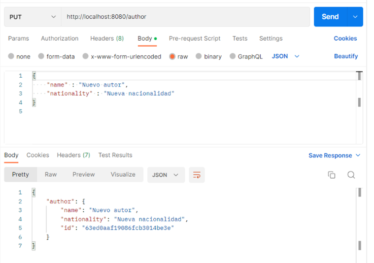

# Listado paginado - Nodejs

Ahora vamos a implementar las operaciones necesarias para ayudar al front a cubrir la funcionalidad del CRUD paginado en servidor. 
Recuerda que para que un listado paginado en servidor funcione, el cliente debe enviar en cada petición que página está solicitando y cual es el tamaño de la página, para que el servidor devuelva solamente un subconjunto de datos, en lugar de devolver el listado completo.

Como ya conocemos como se debe desarrollar, en este ejemplo vamos a ir más rápidos y nos vamos a centrar únicamente en las novedades.

## Crear modelos


Lo primero que vamos a hacer es crear el modelo de author para trabajar con BBDD. En la carpeta schemas creamos el archivo `author.schema.js`:

=== "author.schema.js"
``` Javascript
import mongoose from "mongoose";
import normalize from 'normalize-mongoose';
import mongoosePaginate from 'mongoose-paginate-v2';
const { Schema, model } = mongoose;

const authorSchema = new Schema({
    name: {
        type: String,
        require: true
    },
    nationality: {
        type: String,
        require: true
    }
});
authorSchema.plugin(normalize);
authorSchema.plugin(mongoosePaginate);

const AuthorModel = model('Author', authorSchema);

export default AuthorModel;
```

## Implementar el Service

Creamos el service correspondiente `author.service.js`:

=== "author.service.js"
``` Javascript
import AuthorModel from '../schemas/author.schema.js';

export const getAuthors = async () => {
    try {
        return await AuthorModel.find().sort('id');
    } catch (e) {
        throw Error('Error fetching authors');
    }
}

export const createAuthor = async (data) => {
    const { name, nationality } = data;
    try {
        const author = new AuthorModel({ name, nationality });
        return await author.save();
    } catch (e) {
        throw Error('Error creating author');
    }
}

export const updateAuthor = async (id, data) => {
    try {
        const author = await AuthorModel.findById(id);
        if (!author) {
            throw Error('There is no author with that Id');
        }    
        return await AuthorModel.findByIdAndUpdate(id, data);
    } catch (e) {
        throw Error(e);
    }
}

export const deleteAuthor = async (id) => {
    try {
        const author = await AuthorModel.findById(id);
        if (!author) {
            throw Error('There is no author with that Id');
        }
        return await AuthorModel.findByIdAndDelete(id);
    } catch (e) {
        throw Error(e);
    }
}

export const getAuthorsPageable = async (page, limit, sort) => {
    const sortObj = {
        [sort?.property || 'name']: sort?.direction === 'desc' ? 'desc' : 'asc'
    };
    try {
       const options = {
            page: parseInt(page) + 1,
            limit,
            sort: sortObj
        };

        return await AuthorModel.paginate({}, options);
    } catch (e) {
        throw Error('Error fetching authors page');
    }    
}
```

Como podemos observar es muy parecido al servicio de categorías, pero hemos incluido un nuevo método `getAuthorsPageable`. Este método tendrá como parámetros de entrada la página que queramos mostrar, el tamaño de esta y las propiedades de ordenación. Moongose nos proporciona el método paginate que es muy parecido a find salvo que además podemos pasar las opciones de paginación y el solo realizará todo el trabajo.

## Implementar el Controller

Creamos el controlador `author.controller.js`:

=== "author.controller.js"
``` Javascript
import * as AuthorService from '../services/author.service.js';

export const getAuthors = async (req, res) => {
    try {
        const authors = await AuthorService.getAuthors();
        res.status(200).json(
            authors
        );
    } catch (err) {
        res.status(400).json({
            msg: err.toString()
        });
    }
}

export const createAuthor = async (req, res) => {
    try {
        const author = await AuthorService.createAuthor(req.body);
        res.status(200).json({
            author
        });
    } catch (err) {
        res.status(400).json({
            msg: err.toString()
        });
    }
}

export const updateAuthor = async (req, res) => {
    const authorId = req.params.id;
    try {
        await AuthorService.updateAuthor(authorId, req.body);
        res.status(200).json(1);
    } catch (err) {
        res.status(400).json({
            msg: err.toString()
        });
    }
}

export const deleteAuthor = async (req, res) => {
    const authorId = req.params.id;
    try {
        const deletedAuthor = await AuthorService.deleteAuthor(authorId);
        res.status(200).json({
            author: deletedAuthor
        });
    } catch (err) {
        res.status(400).json({
            msg: err.toString()
        });
    }
}

export const getAuthorsPageable = async (req, res) => {
    const page = req.body.pageable.pageNumber || 0;
    const limit = req.body.pageable.pageSize || 5;
    const sort = req.body.pageable.sort || null;

    try {
        const response = await AuthorService.getAuthorsPageable(page, limit, sort);
        res.status(200).json({
            content: response.docs,
            pageable: {
                pageNumber: response.page - 1,
                pageSize: response.limit
            },
            totalElements: response.totalDocs
        });
    } catch (err) {
        res.status(400).json({
            msg: err.toString()
        });
    }
}
```

Y vemos que el método getAuthorsPageable lee los datos de la request, se los pasa al servicio y por último transforma la response con los datos obtenidos.

## Implementar las Rutas

Creamos nuestro archivo de rutas `author.routes.js`:

=== "author.routes.js"
``` Javascript
import { Router } from 'express';
import { check } from 'express-validator';
import validateFields from '../middlewares/validateFields.js';
import { createAuthor, deleteAuthor, getAuthors, updateAuthor, getAuthorsPageable } from '../controllers/author.controller.js';
const authorRouter = Router();

authorRouter.put('/:id', [
    check('name').not().isEmpty(),
    check('nationality').not().isEmpty(),
    validateFields
], updateAuthor);

authorRouter.put('/', [
    check('name').not().isEmpty(),
    check('nationality').not().isEmpty(),
    validateFields
], createAuthor);

authorRouter.get('/', getAuthors);
authorRouter.delete('/:id', deleteAuthor);

authorRouter.post('/', [
    check('pageable').not().isEmpty(),
    check('pageable.pageSize').not().isEmpty(),
    check('pageable.pageNumber').not().isEmpty(),
    validateFields
], getAuthorsPageable)

export default authorRouter;
```

Podemos observar que si hacemos una petición con get a `/author` nos devolverá todos los autores. Pero si hacemos una petición post con el objeto pageable en el body realizaremos el listado paginado.

Finalmente en nuestro archivo `index.js` vamos a añadir el nuevo router:

=== "index.js"
``` Javascript
...

import authorRouter from './src/routes/author.routes.js';

...

app.use('/author', authorRouter);

...
```

## Probar las operaciones

Y ahora que tenemos todo creado, ya podemos probarlo con Postman:

Por un lado creamos autores con:

** PUT /author ** 

** PUT /author/{id} ** 
``` JSON
{
    "name" : "Nuevo autor",
    "nationality" : "Nueva nacionalidad"
}
```

Nos sirve para insertar `Autores` nuevas (si no tienen el id informado) o para actualizar `Autores` (si tienen el id informado en la URL).  Fíjate que los datos que se envían están en el body como formato JSON (parte izquierda de la imagen). Si no te dará un error.





** DELETE /author/{id} **  nos sirve eliminar `Autores`. Fíjate que el dato del ID que se envía está en el path.


Luego recuperamos los autores con el método `GET` (antes tienes que crear unos cuantos para poder ver un listado):


Y por último listamos los autores paginados:

** POST /author **

``` JSON
{
    "pageable": {
        "pageSize" : 4,
        "pageNumber" : 0,
        "sort" : [
            {
                "property": "name",
                "direction": "asc"
            }
        ]
    }
}
```

_**Importante:** `direction` tiene que ir en minúsculas_


