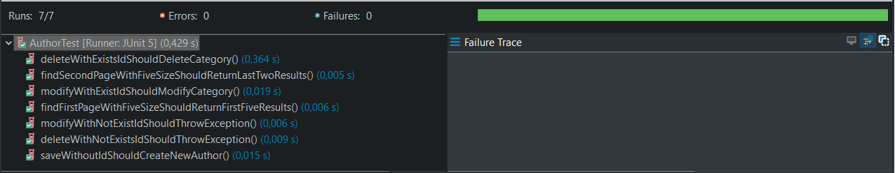
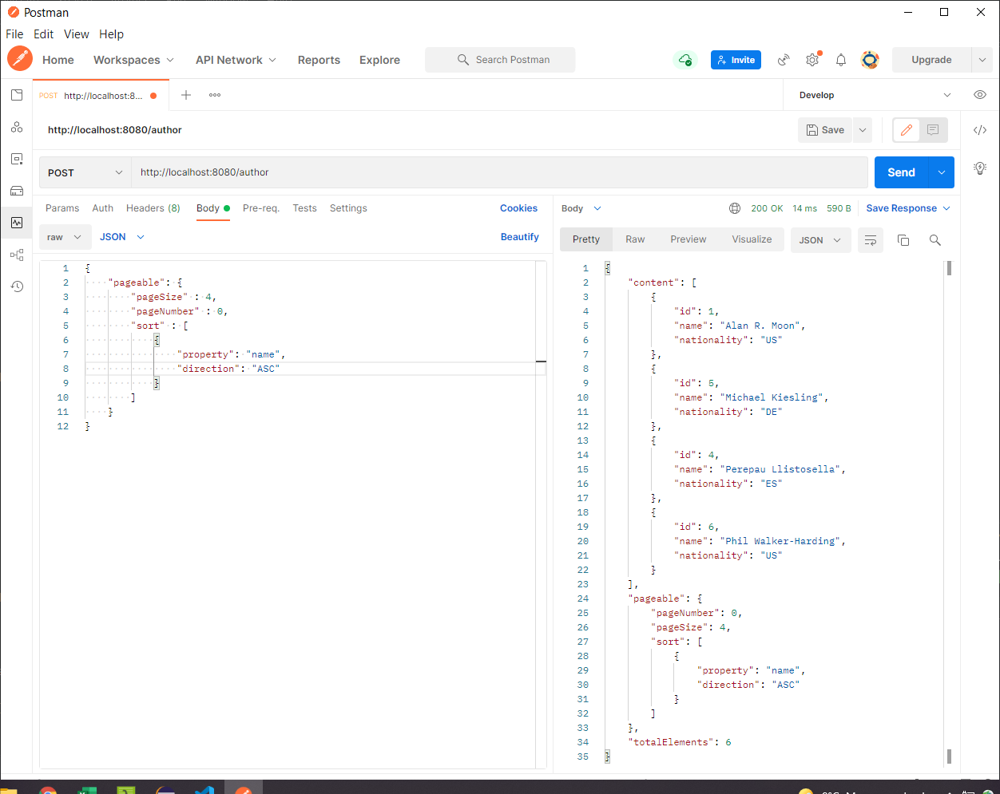
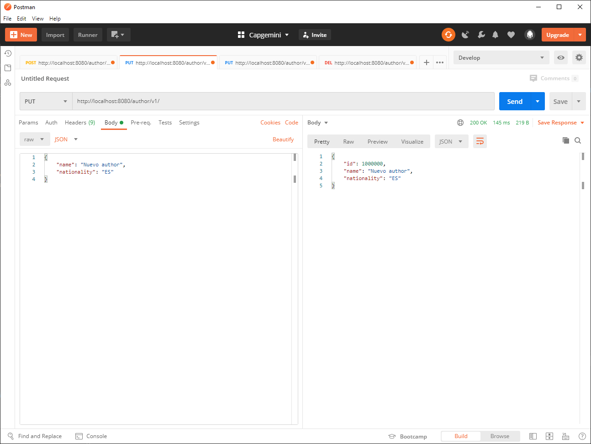
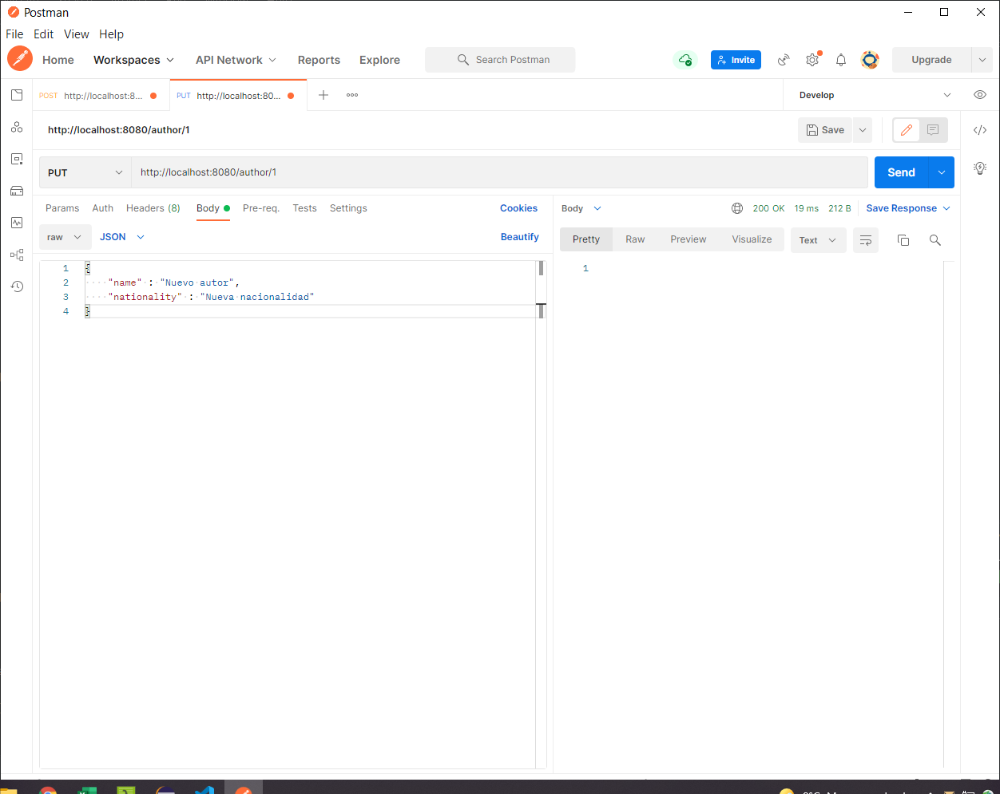
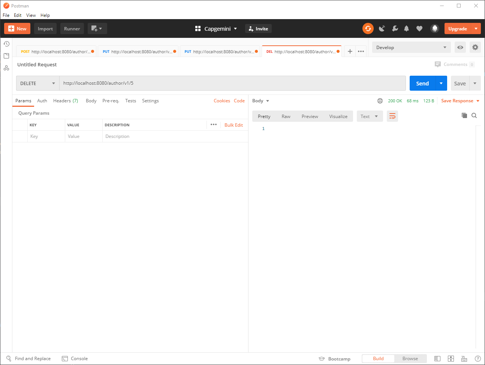

# Desarrollo de un listado paginado

Ya tienes tu primer listado desarrollado, tanto en front como en back. ¿Ha sido sencillo, verdad?.

Ahora vamos a implementar un listado un poco más complejo, este tiene datos paginados en servidor, esto quiere decir que no nos sirve un array de datos como en el anterior ejemplo. 
Para que un listado paginado en servidor funcione, el cliente debe enviar en cada petición que página está solicitando y cual es el tamaño de la página, para que el servidor devuelva solamente un subconjunto de datos, en lugar de devolver el listado completo.

Como ya conocemos como se debe desarrollar, en este ejemplo vamos a ir más rápidos y nos vamos a centrar únicamente en las novedades.

## Desarrollo Angular

### Crear modulo y componentes

Vamos a desarrollar el listado de `Autores` así que, debemos crear los componentes:

```
ng generate module author
ng generate component author/author-list
ng generate component author/author-edit

ng generate service author/author
```

Este módulo lo vamos a añadir a la aplicación para que se cargue en el arranque. Abrimos el fichero `app.module.ts` y añadimos el módulo:


=== "app.module.ts" 
    ``` Typescript hl_lines="9 20"
    import { NgModule } from '@angular/core';
    import { BrowserModule } from '@angular/platform-browser';

    import { AppRoutingModule } from './app-routing.module';
    import { AppComponent } from './app.component';
    import { BrowserAnimationsModule } from '@angular/platform-browser/animations';
    import { CoreModule } from './core/core.module';
    import { CategoryModule } from './category/category.module';
    import { AuthorModule } from './author/author.module';

    @NgModule({
    declarations: [
        AppComponent
    ],
    imports: [
        BrowserModule,
        AppRoutingModule,
        CoreModule,
        CategoryModule,
        AuthorModule,
        BrowserAnimationsModule
    ],
    providers: [],
    bootstrap: [AppComponent]
    })
    export class AppModule { }
    ```


### Crear el modelo 

Creamos el modelo en `author/model/Author.ts` con las propiedades necesarias para trabajar con la información de un autor:

=== "Author.ts"
    ``` TypeScript
    export class Author {
        id: number;
        name: string;
        nationality: string;
    }
    ```

### Añadir el punto de entrada

Añadimos la ruta al menú para que podamos acceder a la pantalla:

=== "app-routing.module.ts" 
    ``` Typescript hl_lines="8"
    import { NgModule } from '@angular/core';
    import { Routes, RouterModule } from '@angular/router';
    import { CategoryListComponent } from './category/category-list/category-list.component';
    import { AuthorListComponent } from './author/author-list/author-list.component';

    const routes: Routes = [
        { path: 'categories', component: CategoriesComponent },
        { path: 'authors', component: AuthorListComponent },
    ];

    @NgModule({
        imports: [RouterModule.forRoot(routes)],
        exports: [RouterModule]
    })
    export class AppRoutingModule { }
    ```

### Implementar servicio

Y realizamos las diferentes implementaciones. Empezaremos por el servicio. En este caso, hay un cambio sustancial con el anterior ejemplo. Al tratarse de un listado paginado, la operación `getAuthors` necesita información extra acerca de que página de datos debe mostrar, además de que el resultado ya no será un listado sino una página. 

Por defecto el esquema de datos de Spring para la paginación es como el siguiente:

=== "Esquema de datos de paginación"
    ``` JSON
    {
        "content": [ ... <listado con los resultados paginados> ... ],
        "pageable": {
            "pageNumber": <número de página empezando por 0>,
            "pageSize": <tamaño de página>,
            "sort": [
                { 
                    "property": <nombre de la propiedad a ordenar>, 
                    "direction": <dirección de la ordenación ASC / DESC> 
                }
            ]
        },
        "totalElements": <numero total de elementos en la tabla>
    }
    ```

Así que necesitamos poder enviar y recuperar esa información desde Angular, nos hace falta crear esos objetos. Los objetos de paginación al ser comunes a toda la aplicación, vamos a crearlos en `core/model/page`, mientras que la paginación de `AuthorPage.ts` la crearé en su propio model dentro de `author/model`.

=== "SortPage.ts"
    ``` TypeScript
    export class SortPage {
        property: String;
        direction: String;
    }
    ```
=== "Pageable.ts"
    ``` TypeScript
    import { SortPage } from './SortPage';

    export class Pageable {
        pageNumber: number;
        pageSize: number;
        sort: SortPage[];
    }
    ```
=== "AuthorPage.ts"
    ``` TypeScript
    import { Pageable } from "src/app/core/model/page/Pageable";
    import { Author } from "./Author";

    export class AuthorPage {
        content: Author[];
        pageable: Pageable;
        totalElements: number;
    }
    ```

Con estos objetos creados ya podemos implementar el servicio y sus datos mockeados.

=== "mock-authors.ts"
    ``` TypeScript
    import { AuthorPage } from "./AuthorPage";

    export const AUTHOR_DATA: AuthorPage = {
        content: [
            { id: 1, name: 'Klaus Teuber', nationality: 'Alemania' },
            { id: 2, name: 'Matt Leacock', nationality: 'Estados Unidos' },
            { id: 3, name: 'Keng Leong Yeo', nationality: 'Singapur' },
            { id: 4, name: 'Gil Hova', nationality: 'Estados Unidos'},
            { id: 5, name: 'Kelly Adams', nationality: 'Estados Unidos' },
            { id: 6, name: 'J. Alex Kavern', nationality: 'Estados Unidos' },
            { id: 7, name: 'Corey Young', nationality: 'Estados Unidos' },
        ],  
        pageable : {
            pageSize: 5,
            pageNumber: 0,
            sort: [
                {property: "id", direction: "ASC"}
            ]
        },
        totalElements: 7
    }
    ```
=== "author.service.ts"
    ``` TypeScript
    import { Injectable } from '@angular/core';
    import { Observable, of } from 'rxjs';
    import { Pageable } from '../core/model/page/Pageable';
    import { Author } from './model/Author';
    import { AuthorPage } from './model/AuthorPage';
    import { AUTHOR_DATA } from './model/mock-authors';

    @Injectable({
        providedIn: 'root'
    })
    export class AuthorService {

        constructor() { }

        getAuthors(pageable: Pageable): Observable<AuthorPage> {
            return of(AUTHOR_DATA);
        }

        saveAuthor(author: Author): Observable<void> {
            return of(null);
        }

        deleteAuthor(idAuthor : number): Observable<void> {
            return of(null);
        }    
    }
    ```

### Implementar listado

Ya tenemos el servicio con los datos, ahora vamos a por el listado paginado.

=== "author-list.component.html"
    ``` HTML hl_lines="36"
    <div class="container">
        <h1>Listado de Autores</h1>

        <mat-table [dataSource]="dataSource"> 
            <ng-container matColumnDef="id">
                <mat-header-cell *matHeaderCellDef> Identificador </mat-header-cell>
                <mat-cell *matCellDef="let element"> {{element.id}} </mat-cell>
            </ng-container>
            
            <ng-container matColumnDef="name">
                <mat-header-cell *matHeaderCellDef> Nombre autor  </mat-header-cell>
                <mat-cell *matCellDef="let element"> {{element.name}} </mat-cell>
            </ng-container>

            <ng-container matColumnDef="nationality">
                <mat-header-cell *matHeaderCellDef> Nacionalidad  </mat-header-cell>
                <mat-cell *matCellDef="let element"> {{element.nationality}} </mat-cell>
            </ng-container>
            
            <ng-container matColumnDef="action">
                <mat-header-cell *matHeaderCellDef></mat-header-cell>
                <mat-cell *matCellDef="let element">
                    <button mat-icon-button color="primary">
                        <mat-icon (click)="editAuthor(element)">edit</mat-icon>
                    </button>
                    <button mat-icon-button color="accent">
                        <mat-icon (click)="deleteAuthor(element)">clear</mat-icon>
                    </button>
                </mat-cell>
            </ng-container>

            <mat-header-row *matHeaderRowDef="displayedColumns; sticky: true"></mat-header-row>
            <mat-row *matRowDef="let row; columns: displayedColumns;"></mat-row>
        </mat-table> 

        <mat-paginator (page)="loadPage($event)" [pageSizeOptions]="[5, 10, 20]" [pageIndex]="pageNumber" [pageSize]="pageSize" [length]="totalElements" showFirstLastButtons></mat-paginator>
    
        <div class="buttons">
            <button mat-flat-button color="primary" (click)="createAuthor()">Nuevo autor</button> 
        </div>   
    </div>
    ```
=== "author-list.component.scss"
    ``` CSS
    .container {
        margin: 20px;
    
        mat-table {
            margin-top: 10px;
            margin-bottom: 20px;
        
            .mat-header-row {
                background-color:#f5f5f5;
        
                .mat-header-cell {
                    text-transform: uppercase;
                    font-weight: bold;
                    color: #838383;
                }      
            }
        
            .mat-column-id {
                flex: 0 0 20%;
                justify-content: center;
            }
        
            .mat-column-action {
                flex: 0 0 10%;
                justify-content: center;
            }
        }
        
        .buttons {
            text-align: right;
        }
    }
    ```
=== "author-list.component.ts"
    ``` TypeScript hl_lines="18-20 34-57"
    import { Component, OnInit } from '@angular/core';
    import { MatDialog } from '@angular/material/dialog';
    import { PageEvent } from '@angular/material/paginator';
    import { MatTableDataSource } from '@angular/material/table';
    import { DialogConfirmationComponent } from 'src/app/core/dialog-confirmation/dialog-confirmation.component';
    import { Pageable } from 'src/app/core/model/page/Pageable';
    import { AuthorEditComponent } from '../author-edit/author-edit.component';
    import { AuthorService } from '../author.service';
    import { Author } from '../model/Author';

    @Component({
    selector: 'app-author-list',
    templateUrl: './author-list.component.html',
    styleUrls: ['./author-list.component.scss']
    })
    export class AuthorListComponent implements OnInit {

        pageNumber: number = 0;
        pageSize: number = 5;
        totalElements: number = 0;

        dataSource = new MatTableDataSource<Author>();
        displayedColumns: string[] = ['id', 'name', 'nationality', 'action'];

        constructor(
            private authorService: AuthorService,
            public dialog: MatDialog,
        ) { }

        ngOnInit(): void {
            this.loadPage();
        }

        loadPage(event?: PageEvent) {

            let pageable : Pageable =  {
                pageNumber: this.pageNumber,
                pageSize: this.pageSize,
                sort: [{
                    property: 'id',
                    direction: 'ASC'
                }]
            }

            if (event != null) {
                pageable.pageSize = event.pageSize
                pageable.pageNumber = event.pageIndex;
            }

            this.authorService.getAuthors(pageable).subscribe(data => {
                this.dataSource.data = data.content;
                this.pageNumber = data.pageable.pageNumber;
                this.pageSize = data.pageable.pageSize;
                this.totalElements = data.totalElements;
            });

        }  

        createAuthor() {      
            const dialogRef = this.dialog.open(AuthorEditComponent, {
                data: {}
            });

            dialogRef.afterClosed().subscribe(result => {
                this.ngOnInit();
            });      
        }  

        editAuthor(author: Author) {    
            const dialogRef = this.dialog.open(AuthorEditComponent, {
                data: { author: author }
            });

            dialogRef.afterClosed().subscribe(result => {
                this.ngOnInit();
            });    
        }

        deleteAuthor(author: Author) {    
            const dialogRef = this.dialog.open(DialogConfirmationComponent, {
                data: { title: "Eliminar autor", description: "Atención si borra el autor se perderán sus datos.<br> ¿Desea eliminar el autor?" }
            });

            dialogRef.afterClosed().subscribe(result => {
                if (result) {
                    this.authorService.deleteAuthor(author.id).subscribe(result =>  {
                        this.ngOnInit();
                    }); 
                }
            });
        }  
    }

    ```

Fíjate como hemos añadido la paginación. 

*   Al HTML le hemos añadido un componente nuevo `mat-paginator`, lo que nos va a obligar a añadirlo al módulo también como dependencia. Ese componente le hemos definido un método `page` que se ejecuta cada vez que la página cambia, y unas propiedades con las que calculará la página, el tamaño y el número total de páginas.
*   Al Typescript le hemos tenido que añadir esas variables y hemos creado un método para cargar datos que lo que hace es construir un objeto `pageable` con los valores actuales del componente paginador y lanza la petición con esos datos en el body. Obviamente al ser un mock no funcionará el cambio de página y demás.

Como siempre, añadimos las dependencias al módulo, vamos a intentar añadir todas las que vamos a necesitar a futuro.

=== "author.module.ts"
    ``` TypeScript
    import { NgModule } from '@angular/core';
    import { CommonModule } from '@angular/common';
    import { AuthorListComponent } from './author-list/author-list.component';
    import { AuthorEditComponent } from './author-edit/author-edit.component';
    import { MatTableModule } from '@angular/material/table';
    import { FormsModule, ReactiveFormsModule } from '@angular/forms';
    import { MatButtonModule } from '@angular/material/button';
    import { MatDialogModule, MAT_DIALOG_DATA } from '@angular/material/dialog';
    import { MatFormFieldModule } from '@angular/material/form-field';
    import { MatIconModule } from '@angular/material/icon';
    import { MatInputModule } from '@angular/material/input';
    import { MatPaginatorModule } from '@angular/material/paginator';


    @NgModule({
    declarations: [
        AuthorListComponent,
        AuthorEditComponent
    ],
    imports: [
        CommonModule,
        MatTableModule,
        MatIconModule, 
        MatButtonModule,
        MatDialogModule,
        MatFormFieldModule,
        MatInputModule,
        FormsModule,
        ReactiveFormsModule,
        MatPaginatorModule,
    ],
    providers: [
        {
            provide: MAT_DIALOG_DATA,
            useValue: {},
        },
    ]
    })
    export class AuthorModule { }
    ```


Debería verse algo similar a esto:


### Implementar dialogo edición

El último paso, es definir la pantalla de dialogo que realizará el alta y modificado de los datos de un `Autor`.

=== "author-edit.component.html"
    ``` HTML
    <div class="container">
        <h1 *ngIf="author.id == null">Crear autor</h1>
        <h1 *ngIf="author.id != null">Modificar autor</h1>

        <form>
            <mat-form-field>
                <mat-label>Identificador</mat-label>
                <input type="number" matInput placeholder="Identificador" [(ngModel)]="author.id" name="id" disabled>
            </mat-form-field>

            <mat-form-field>
                <mat-label>Nombre</mat-label>
                <input type="text" matInput placeholder="Nombre del autor" [(ngModel)]="author.name" name="name" required>
                <mat-error>El nombre no puede estar vacío</mat-error>
            </mat-form-field>

            <mat-form-field>
                <mat-label>Nacionalidad</mat-label>
                <input type="text" matInput placeholder="Nacionalidad del autor" [(ngModel)]="author.nationality" name="nationality" required>
                <mat-error>La nacionalidad no puede estar vacía</mat-error>
            </mat-form-field>
        </form>

        <div class="buttons">
            <button mat-stroked-button (click)="onClose()">Cerrar</button>
            <button mat-flat-button color="primary" (click)="onSave()">Guardar</button>
        </div>
    </div>
    ```
=== "author-edit.component.scss"
    ``` CSS
    .container {
        min-width: 350px;
        max-width: 500px;
        width: 100%;
    
        form {
            display: flex;
            flex-direction: column;
            margin-bottom:20px;
        }

        .buttons {
        text-align: right;

        button {
            margin-left: 10px;
        }
        }
    }
    ```
=== "author-edit.component.ts"
    ``` TypeScript
    import { Component, Inject, OnInit } from '@angular/core';
    import { MatDialogRef, MAT_DIALOG_DATA } from '@angular/material/dialog';
    import { AuthorService } from '../author.service';
    import { Author } from '../model/Author';

    @Component({
    selector: 'app-author-edit',
    templateUrl: './author-edit.component.html',
    styleUrls: ['./author-edit.component.scss']
    })
    export class AuthorEditComponent implements OnInit {

        author : Author;

        constructor(
            public dialogRef: MatDialogRef<AuthorEditComponent>,
            @Inject(MAT_DIALOG_DATA) public data: any,
            private authorService: AuthorService
        ) { }

        ngOnInit(): void {
            if (this.data.author != null) {
                this.author = Object.assign({}, this.data.author);
            }
            else {
                this.author = new Author();
            }
        }

        onSave() {
            this.authorService.saveAuthor(this.author).subscribe(result =>  {
                this.dialogRef.close();
            }); 
        }  

        onClose() {
            this.dialogRef.close();
        }

    }
    ```

Que debería quedar algo así:


## Desarrollo Springboot

### Modelos

Lo primero que vamos a hacer es crear los modelos para trabajar con BBDD y con peticiones hacia el front. Además, también tenemos que añadir datos al script de inicialización de BBDD.

=== "schema.sql"
    ``` SQL hl_lines="9-15"
    DROP TABLE IF EXISTS CATEGORY;

    CREATE TABLE CATEGORY (
        id BIGINT IDENTITY NOT NULL PRIMARY KEY,
        name VARCHAR(250) NOT NULL
    );


    DROP TABLE IF EXISTS AUTHOR;

    CREATE TABLE AUTHOR (
        id BIGINT IDENTITY NOT NULL PRIMARY KEY,
        name VARCHAR(400) NOT NULL,
        nationality VARCHAR(250) NOT NULL
    );
    ```
=== "data.sql"
    ``` SQL hl_lines="5 6 7 8 9 10"
    INSERT INTO CATEGORY(id, name) VALUES (1, 'Eurogames');
    INSERT INTO CATEGORY(id, name) VALUES (2, 'Ameritrash');
    INSERT INTO CATEGORY(id, name) VALUES (3, 'Familiar');

    INSERT INTO AUTHOR(id, name, nationality) VALUES (1, 'Alan R. Moon', 'US');
    INSERT INTO AUTHOR(id, name, nationality) VALUES (2, 'Vital Lacerda', 'PT');
    INSERT INTO AUTHOR(id, name, nationality) VALUES (3, 'Simone Luciani', 'IT');
    INSERT INTO AUTHOR(id, name, nationality) VALUES (4, 'Perepau Llistosella', 'ES');
    INSERT INTO AUTHOR(id, name, nationality) VALUES (5, 'Michael Kiesling', 'DE');
    INSERT INTO AUTHOR(id, name, nationality) VALUES (6, 'Phil Walker-Harding', 'US');
    ```
=== "Author.java"
    ``` Java
    package com.capgemini.ccsw.tutorial.author.model;

    import javax.persistence.Column;
    import javax.persistence.Entity;
    import javax.persistence.GeneratedValue;
    import javax.persistence.GenerationType;
    import javax.persistence.Id;
    import javax.persistence.Table;

    /**
    * @author ccsw
    */
    @Entity
    @Table(name = "Author")
    public class Author {

        @Id
        @GeneratedValue(strategy = GenerationType.IDENTITY)
        @Column(name = "id", nullable = false)
        private Long id;

        @Column(name = "name", nullable = false)
        private String name;

        @Column(name = "nationality")
        private String nationality;

        /**
        * @return id
        */
        public Long getId() {

            return this.id;
        }

        /**
        * @param id new value of {@link #getid}.
        */
        public void setId(Long id) {

            this.id = id;
        }

        /**
        * @return name
        */
        public String getName() {

            return this.name;
        }

        /**
        * @param name new value of {@link #getname}.
        */
        public void setName(String name) {

            this.name = name;
        }

        /**
        * @return nationality
        */
        public String getNationality() {

            return this.nationality;
        }

        /**
        * @param nationality new value of {@link #getnationality}.
        */
        public void setNationality(String nationality) {

            this.nationality = nationality;
        }

    }
    ```
=== "AuthorDto.java"
    ``` Java
    package com.capgemini.ccsw.tutorial.author.model;

    /**
    * @author ccsw
    */
    public class AuthorDto {

        private Long id;

        private String name;

        private String nationality;

        /**
        * @return id
        */
        public Long getId() {

            return this.id;
        }

        /**
        * @param id new value of {@link #getid}.
        */
        public void setId(Long id) {

            this.id = id;
        }

        /**
        * @return name
        */
        public String getName() {

            return this.name;
        }

        /**
        * @param name new value of {@link #getname}.
        */
        public void setName(String name) {

            this.name = name;
        }

        /**
        * @return nationality
        */
        public String getNationality() {

            return this.nationality;
        }

        /**
        * @param nationality new value of {@link #getnationality}.
        */
        public void setNationality(String nationality) {

            this.nationality = nationality;
        }

    }
    ```

### TDD - Pruebas

Para desarrollar todas las operaciones, empezaremos primero diseñando las pruebas y luego implementando el código necesario que haga funcionar correctamente esas pruebas. Para ir más rápido vamos a poner todas las pruebas de golpe, pero realmente se deberían crear una a una e ir implementando el código necesario para esa prueba. Para evitar tantas iteraciones en el tutorial las haremos todas de golpe.

Vamos a pararnos a pensar un poco que necesitamos en la pantalla. Ahora mismo nos sirve con:

* Una consulta paginada, que reciba datos de la página a consultar y devuelva los datos paginados
* Una operación de guardado y modificación
* Una operación de borrado

Para la primera prueba necesitaremos que hemos descrito (consulta paginada) se necesita un objeto que contenga los datos de la página a consultar. Así que crearemos una clase `AuthorSearchDto` para utilizarlo como 'paginador'. 

!!! tip "Paginación en Springframework"
    Cuando utilicemos paginación en Springframework, debemos recordar que ya vienen implementados algunos objetos que podemos utilizar y que nos facilitan la vida. Es el caso de `Pageable` y `Page`.

    * El objeto `Pageable` no es más que una interface que le permite a Spring JPA saber que página se quiere buscar, cual es el tamaño de página y cuales son las propiedades de ordenación que se debe lanzar en la consulta.
    * El objeto `PageRequest` es una utilidad que permite crear objetos de tipo `Pageable` de forma sencilla. Se utiliza mucho para codificación de test.
    * El objeto `Page` no es más que un contenedor que engloba la información básica de la página que se está consultando (número de página, tamaño de página, número total de resultados) y el conjunto de datos de la BBDD que contiene esa página una vez han sido buscados y ordenados.


También crearemos una clase `AuthorController` dentro del package de `com.capgemini.ccsw.tutorial.author` con la implementación de los métodos vacíos, para que no falle la compilación.

¡Vamos a implementar test!


=== "AuthorSearchDto.java"
    ``` Java
    package com.capgemini.ccsw.tutorial.author.model;

    import org.springframework.data.domain.Pageable;

    /**
    * @author ccsw
    */
    public class AuthorSearchDto {

        private Pageable pageable;

        /**
        * @return pageable
        */
        public Pageable getPageable() {

            return this.pageable;
        }

        /**
        * @param pageable new value of {@link #getPageable}.
        */
        public void setPageable(Pageable pageable) {

            this.pageable = pageable;
        }

    }
    ```
=== "AuthorController.java"
    ``` Java
    package com.capgemini.ccsw.tutorial.author;

    import org.springframework.data.domain.Page;
    
    import com.capgemini.ccsw.tutorial.author.model.AuthorDto;
    import com.capgemini.ccsw.tutorial.author.model.AuthorSearchDto;

    /**
    * @author ccsw
    */
    public class AuthorController {

        /**
        * Método para recuperar un listado paginado de {@link com.capgemini.ccsw.tutorial.author.model.Author}
        * @param dto
        * @return
        */
        public Page<AuthorDto> findPage(AuthorSearchDto dto) {

            return null;

        }

        /**
        * Método para crear o actualizar un {@link com.capgemini.ccsw.tutorial.author.model.Author}
        * @param id
        * @param data datos de la entidad 
        */
        public void save(Long id, AuthorDto data) {

        }

        /**
        * Método para crear o actualizar un {@link com.capgemini.ccsw.tutorial.author.model.Author}
        * @param id PK de la entidad
        */
        public void delete(Long id) {

        }
    }
    ```
=== "AuthorIT.java"
    ``` Java
    package com.capgemini.ccsw.tutorial.author;
    
    import com.capgemini.ccsw.tutorial.author.model.AuthorDto;
    import com.capgemini.ccsw.tutorial.author.model.AuthorSearchDto;
    import org.junit.jupiter.api.Test;
    import org.springframework.beans.factory.annotation.Autowired;
    import org.springframework.boot.test.context.SpringBootTest;
    import org.springframework.boot.test.web.client.TestRestTemplate;
    import org.springframework.boot.web.server.LocalServerPort;
    import org.springframework.core.ParameterizedTypeReference;
    import org.springframework.data.domain.Page;
    import org.springframework.data.domain.PageRequest;
    import org.springframework.http.HttpEntity;
    import org.springframework.http.HttpMethod;
    import org.springframework.http.HttpStatus;
    import org.springframework.http.ResponseEntity;
    import org.springframework.test.annotation.DirtiesContext;
    
    import static org.junit.jupiter.api.Assertions.*;
    
    @SpringBootTest(webEnvironment = SpringBootTest.WebEnvironment.RANDOM_PORT)
    @DirtiesContext(classMode = DirtiesContext.ClassMode.BEFORE_EACH_TEST_METHOD)
    public class AuthorIT {
    
        public static final String LOCALHOST = "http://localhost:";
        public static final String SERVICE_PATH = "/author/";
        
        public static final Long DELETE_AUTHOR_ID = 6L;
        public static final Long MODIFY_AUTHOR_ID = 3L;
        public static final String NEW_AUTHOR_NAME = "Nuevo Autor";
        public static final String NEW_NATIONALITY = "Nueva Nacionalidad";
        
        private static final int TOTAL_AUTHORS = 6;
        private static final int PAGE_SIZE = 5;
        
        @LocalServerPort
        private int port;
        
        @Autowired
        private TestRestTemplate restTemplate;
        
        ParameterizedTypeReference<Page<AuthorDto>> responseTypePage = new ParameterizedTypeReference<Page<AuthorDto>>(){};
        
        @Test
        public void findFirstPageWithFiveSizeShouldReturnFirstFiveResults() {
        
              AuthorSearchDto searchDto = new AuthorSearchDto();
              searchDto.setPageable(PageRequest.of(0, PAGE_SIZE));
        
              ResponseEntity<Page<AuthorDto>> response = restTemplate.exchange(LOCALHOST + port + SERVICE_PATH, HttpMethod.POST, new HttpEntity<>(searchDto), responseTypePage);
        
              assertNotNull(response);
              assertEquals(TOTAL_AUTHORS, response.getBody().getTotalElements());
              assertEquals(PAGE_SIZE, response.getBody().getContent().size());
        }
        
        @Test
        public void findSecondPageWithFiveSizeShouldReturnLastResult() {
        
              int elementsCount = TOTAL_AUTHORS - PAGE_SIZE;
        
              AuthorSearchDto searchDto = new AuthorSearchDto();
              searchDto.setPageable(PageRequest.of(1, PAGE_SIZE));
        
              ResponseEntity<Page<AuthorDto>> response = restTemplate.exchange(LOCALHOST + port + SERVICE_PATH, HttpMethod.POST, new HttpEntity<>(searchDto), responseTypePage);
        
              assertNotNull(response);
              assertEquals(TOTAL_AUTHORS, response.getBody().getTotalElements());
              assertEquals(elementsCount, response.getBody().getContent().size());
        }
        
        @Test
        public void saveWithoutIdShouldCreateNewAuthor() {
        
              long newAuthorId = TOTAL_AUTHORS + 1;
              long newAuthorSize = TOTAL_AUTHORS + 1;
        
              AuthorDto dto = new AuthorDto();
              dto.setName(NEW_AUTHOR_NAME);
              dto.setNationality(NEW_NATIONALITY);
        
              restTemplate.exchange(LOCALHOST + port + SERVICE_PATH, HttpMethod.PUT, new HttpEntity<>(dto), Void.class);
        
              AuthorSearchDto searchDto = new AuthorSearchDto();
              searchDto.setPageable(PageRequest.of(0, (int) newAuthorSize));
        
              ResponseEntity<Page<AuthorDto>> response = restTemplate.exchange(LOCALHOST + port + SERVICE_PATH, HttpMethod.POST, new HttpEntity<>(searchDto), responseTypePage);
        
              assertNotNull(response);
              assertEquals(newAuthorSize, response.getBody().getTotalElements());
        
              AuthorDto author = response.getBody().getContent().stream().filter(item -> item.getId().equals(newAuthorId)).findFirst().orElse(null);
              assertNotNull(author);
              assertEquals(NEW_AUTHOR_NAME, author.getName());
        
        }
        
        @Test
        public void modifyWithExistIdShouldModifyAuthor() {
        
              AuthorDto dto = new AuthorDto();
              dto.setName(NEW_AUTHOR_NAME);
              dto.setNationality(NEW_NATIONALITY);
        
              restTemplate.exchange(LOCALHOST + port + SERVICE_PATH + MODIFY_AUTHOR_ID, HttpMethod.PUT, new HttpEntity<>(dto), Void.class);
        
              AuthorSearchDto searchDto = new AuthorSearchDto();
              searchDto.setPageable(PageRequest.of(0, PAGE_SIZE));
        
              ResponseEntity<Page<AuthorDto>> response = restTemplate.exchange(LOCALHOST + port + SERVICE_PATH, HttpMethod.POST, new HttpEntity<>(searchDto), responseTypePage);
        
              assertNotNull(response);
              assertEquals(TOTAL_AUTHORS, response.getBody().getTotalElements());
        
              AuthorDto author = response.getBody().getContent().stream().filter(item -> item.getId().equals(MODIFY_AUTHOR_ID)).findFirst().orElse(null);
              assertNotNull(author);
              assertEquals(NEW_AUTHOR_NAME, author.getName());
              assertEquals(NEW_NATIONALITY, author.getNationality());
        
        }
        
        @Test
        public void modifyWithNotExistIdShouldThrowException() {
        
              long authorId = TOTAL_AUTHORS + 1;
        
              AuthorDto dto = new AuthorDto();
              dto.setName(NEW_AUTHOR_NAME);
        
              ResponseEntity<?> response = restTemplate.exchange(LOCALHOST + port + SERVICE_PATH + authorId, HttpMethod.PUT, new HttpEntity<>(dto), Void.class);
        
              assertEquals(HttpStatus.INTERNAL_SERVER_ERROR, response.getStatusCode());
        }
        
        @Test
        public void deleteWithExistsIdShouldDeleteCategory() {
        
              long newAuthorsSize = TOTAL_AUTHORS - 1;
        
              restTemplate.exchange(LOCALHOST + port + SERVICE_PATH + DELETE_AUTHOR_ID, HttpMethod.DELETE, null, Void.class);
        
              AuthorSearchDto searchDto = new AuthorSearchDto();
              searchDto.setPageable(PageRequest.of(0, TOTAL_AUTHORS));
        
              ResponseEntity<Page<AuthorDto>> response = restTemplate.exchange(LOCALHOST + port + SERVICE_PATH, HttpMethod.POST, new HttpEntity<>(searchDto), responseTypePage);
        
              assertNotNull(response);
              assertEquals(newAuthorsSize, response.getBody().getTotalElements());
        
        }
        
        @Test
        public void deleteWithNotExistsIdShouldThrowException() {
        
              long deleteAuthorId = TOTAL_AUTHORS + 1;
        
              ResponseEntity<?> response = restTemplate.exchange(LOCALHOST + port + SERVICE_PATH + deleteAuthorId, HttpMethod.DELETE, null, Void.class);
        
              assertEquals(HttpStatus.INTERNAL_SERVER_ERROR, response.getStatusCode());
        }
    }
    ```

!!! info "Cuidado con las clases de Test"
    Recuerda que el código de aplicación debe ir en `src/main/java`, mientras que las clases de test deben ir en `src/test/java` para que no se mezclen unas con otras y se empaquete todo en el artefacto final. En este caso `AuthorTest.java` va en el directorio de test `src/test/java`.


Si ejecutamos los test, el resultado será 7 maravillosos test que fallan su ejecución. Es normal, puesto que no hemos implementado nada de código de aplicación para corresponder esos test.


### Controller

Si recuerdas, esta capa de `Controller` es la que tiene los endpoints de entrada a la aplicación. Nosotros ya tenemos definidas 3 operaciones, que hemos diseñado directamente desde los tests. Ahora vamos a implementar esos métodos con el código necesario para que los test funcionen correctamente, y teniendo en mente que debemos apoyarnos en las capas inferiores `Service` y `Repository` para repartir lógica de negocio y acceso a datos.

=== "AuthorController.java"
    ``` Java hl_lines="24 25"
    package com.capgemini.ccsw.tutorial.author;

    import org.springframework.beans.factory.annotation.Autowired;
    import org.springframework.data.domain.Page;
    import org.springframework.web.bind.annotation.CrossOrigin;
    import org.springframework.web.bind.annotation.PathVariable;
    import org.springframework.web.bind.annotation.RequestBody;
    import org.springframework.web.bind.annotation.RequestMapping;
    import org.springframework.web.bind.annotation.RequestMethod;
    import org.springframework.web.bind.annotation.RestController;

    import com.capgemini.ccsw.tutorial.author.model.AuthorDto;
    import com.capgemini.ccsw.tutorial.author.model.AuthorSearchDto;
    import com.capgemini.ccsw.tutorial.config.mapper.BeanMapper;

    /**
    * @author ccsw
    */
    @RequestMapping(value = "/author")
    @RestController
    @CrossOrigin(origins = "*")
    public class AuthorController {

        @Autowired
        AuthorService authorService;

        @Autowired
        BeanMapper beanMapper;

        /**
        * Método para recuperar un listado paginado de {@link com.capgemini.ccsw.tutorial.author.model.Author}
        * @param dto
        * @return
        */
        @RequestMapping(path = "", method = RequestMethod.POST)
        public Page<AuthorDto> findPage(@RequestBody AuthorSearchDto dto) {

            return this.beanMapper.mapPage(this.authorService.findPage(dto), AuthorDto.class);
        }

        /**
        * Método para crear o actualizar un {@link com.capgemini.ccsw.tutorial.author.model.Author}
        * @param id
        * @param data datos de la entidad 
        */
        @RequestMapping(path = { "", "/{id}" }, method = RequestMethod.PUT)
        public void save(@PathVariable(name = "id", required = false) Long id, @RequestBody AuthorDto data) {

            this.authorService.save(id, data);
        }

        /**
        * Método para crear o actualizar un {@link com.capgemini.ccsw.tutorial.author.model.Author}
        * @param id PK de la entidad
        */
        @RequestMapping(path = "/{id}", method = RequestMethod.DELETE)
        public void delete(@PathVariable("id") Long id) {

            this.authorService.delete(id);
        }
    }
    ```
=== "AuthorService.java"
    ``` Java
    package com.capgemini.ccsw.tutorial.author;

    import org.springframework.data.domain.Page;

    import com.capgemini.ccsw.tutorial.author.model.Author;
    import com.capgemini.ccsw.tutorial.author.model.AuthorDto;
    import com.capgemini.ccsw.tutorial.author.model.AuthorSearchDto;

    /**
    * @author ccsw
    */
    public interface AuthorService {

        /**
        * Método para recuperar un listado paginado de {@link com.capgemini.ccsw.tutorial.author.model.Author}
        * @param dto
        * @return
        */
        Page<Author> findPage(AuthorSearchDto dto);

        /**
        * Método para crear o actualizar un {@link com.capgemini.ccsw.tutorial.author.model.Author}
        * @param id
        * @param data
        */
        void save(Long id, AuthorDto data);

        /**
        * Método para crear o actualizar un {@link com.capgemini.ccsw.tutorial.author.model.Author}
        * @param id
        */
        void delete(Long id);

    }
    ```

Si te fijas, hemos trasladado toda la lógica a llamadas al `AuthorService` que hemos inyectado, y para que no falle la compilación hemos creado una interface con los métodos necesarios.


En la clase `AuthorController` es donde se hacen las conversiones de cara al cliente, pasaremos de un `Page<Author>` (modelo entidad) a un `Page<AuthorDto>` (modelo DTO) con la ayuda del beanMapper. Recuerda que al cliente no le deben llegar modelos entidades sino DTOs.

Además, el método de carga `findPage` ya no es un método de tipo `GET`, ahora es de tipo `POST` porque le tenemos que enviar los datos de la paginación para que Spring JPA pueda hacer su magia.


Ahora debemos implementar la siguiente capa.


### Service

La siguiente capa que vamos a implementar es justamente la capa que contiene toda la lógica de negocio, hace uso del `Repository` para acceder a los datos, y recibe llamadas generalmente de los `Controller`.

=== "AuthorServiceImpl.java"
    ``` Java hl_lines="21 22 45"
    package com.capgemini.ccsw.tutorial.author;

    import javax.transaction.Transactional;

    import org.springframework.beans.BeanUtils;
    import org.springframework.beans.factory.annotation.Autowired;
    import org.springframework.data.domain.Page;
    import org.springframework.stereotype.Service;

    import com.capgemini.ccsw.tutorial.author.model.Author;
    import com.capgemini.ccsw.tutorial.author.model.AuthorDto;
    import com.capgemini.ccsw.tutorial.author.model.AuthorSearchDto;

    /**
    * @author ccsw
    */
    @Service
    @Transactional
    public class AuthorServiceImpl implements AuthorService {

        @Autowired
        AuthorRepository authorRepository;

        /**
        * {@inheritDoc}
        */
        @Override
        public Page<Author> findPage(AuthorSearchDto dto) {

            return this.authorRepository.findAll(dto.getPageable());
        }

        /**
        * {@inheritDoc}
        */
        @Override
        public void save(Long id, AuthorDto data) {

            Author author = null;
            if (id != null)
                author = this.authorRepository.findById(id).orElse(null);
            else
                author = new Author();

            BeanUtils.copyProperties(data, author, "id");

            this.authorRepository.save(author);
        }

        /**
        * {@inheritDoc}
        */
        @Override
        public void delete(Long id) {

            this.authorRepository.deleteById(id);

        }

    }
    ```
=== "AuthorRepository.java"
    ``` Java hl_lines="12"
    package com.capgemini.ccsw.tutorial.author;

    import org.springframework.data.domain.Page;
    import org.springframework.data.domain.Pageable;
    import org.springframework.data.repository.CrudRepository;

    import com.capgemini.ccsw.tutorial.author.model.Author;

    /**
    * @author ccsw
    */
    public interface AuthorRepository extends CrudRepository<Author, Long> {

        /**
        * Método para recuperar un listado paginado de {@link com.capgemini.ccsw.tutorial.author.model.Author}
        * @param page
        * @return
        */
        Page<Author> findAll(Pageable pageable);

    }
    ```
    
De nuevo pasa lo mismo que con la capa anterior, aquí delegamos muchas operaciones de consulta y guardado de datos en `AuthorRepository`. Hemos tenido que crearlo como interface para que no falle la compilación. Recuerda que cuando creamos un `Repository` es de gran ayuda hacerlo extender de `CrudRepository<T, ID>` ya que tiene muchos métodos implementados de base que nos pueden servir, como el `delete` o el `save`.

Fíjate también que cuando queremos copiar más de un dato de una clase a otra, tenemos una utilidad llamada `BeanUtils` que nos permite realizar esa copia (siempre que las propiedades de ambas clases se llamen igual). Además, en nuestro ejemplo hemos ignorado el 'id' para que no nos copie un null a la clase destino.

### Repository

Y llegamos a la última capa, la que está más cerca de los datos finales. Tenemos la siguiente interface:

=== "AuthorRepository.java"
    ``` Java
    package com.capgemini.ccsw.tutorial.author;

    import org.springframework.data.domain.Page;
    import org.springframework.data.domain.Pageable;
    import org.springframework.data.repository.CrudRepository;

    import com.capgemini.ccsw.tutorial.author.model.Author;

    /**
    * @author ccsw
    */
    public interface AuthorRepository extends CrudRepository<Author, Long> {

        /**
        * Método para recuperar un listado paginado de {@link com.capgemini.ccsw.tutorial.author.model.Author}
        * @param page
        * @return
        */
        Page<Author> findAll(Pageable pageable);

    }
    ```

    
Si te fijas, este `Repository` ya no está vacío como el anterior, no nos sirve con las operaciones básicas del `CrudRepository` en este caso hemos tenido que añadir un método nuevo al que pasandole un objeto de tipo `Pageable` nos devuelva una `Page`.

Pues bien, resulta que la mágina de Spring JPA en este caso hará su trabajo y nosotros no necesitamos implementar ninguna query, Spring ya entiende que un `findAll` significa que debe recuperar todos los datos de la tabla `Author` (que es la tabla que tiene como `generico` en `CrudRepository`) y además deben estar paginados ya que el método devuelve un objeto tipo `Page`. Nos ahorra tener que generar una sql para buscar una página concreta de datos y hacer un `count` de la tabla para obtener el total de resultados. Para ver otros ejemplos y más información, visita la página de [QueryMethods](https://www.baeldung.com/spring-data-derived-queries). Realmente se puede hacer muchísimas cosas con solo escribir el nombre del método, sin tener que pensar ni teclear ninguna sql.

Con esto ya lo tendríamos todo. 


### Prueba de las operaciones

Si ahora ejecutamos los test jUnit, veremos que todos funcionan y están en verde. Hemos implementado todas nuestras pruebas y la aplicación es correcta.



Aun así, debemos realizar pruebas con el postman para ver los resultados que nos ofrece el back. Para ello, tienes que levantar la aplición y ejecutar las siguientes operaciones:

** POST /author ** 
```
{
    "pageable": {
        "pageSize" : 4,
        "pageNumber" : 0,
        "sort" : [
            {
                "property": "name",
                "direction": "ASC"
            }
        ]
    }
}
```
Nos devuelve un listado paginado de `Autores`. Fíjate que los datos que se envían están en el body como formato JSON (parte izquierda de la imagen). Si no envías datos con formato `Pageable`, te dará un error. También fíjate que la respuesta es de tipo `Page`. Prueba a jugar con los datos de paginación e incluso de ordenación. No hemos programado ninguna SQL pero Spring hace su magia.




** PUT /author ** 

** PUT /author/{id} ** 
```
{
    "name" : "Nuevo autor",
    "nationality" : "Nueva nacionalidad"
}
```
Nos sirve para insertar `Autores` nuevas (si no tienen el id informado) o para actualizar `Autores` (si tienen el id informado en la URL).  Fíjate que los datos que se envían están en el body como formato JSON (parte izquierda de la imagen). Si no te dará un error.




** DELETE /author/{id} **  nos sirve eliminar `Autores`. Fíjate que el dato del ID que se envía está en el path.




## Conectar front con back

Una vez implementado front y back, lo que nos queda es modificar el servicio del front para que conecte directamente con las operaciones ofrecidas por el back.

=== "author.service.ts"
    ``` TypeScript hl_lines="14 18 22-25 29"
    import { HttpClient } from '@angular/common/http';
    import { Injectable } from '@angular/core';
    import { Observable, of } from 'rxjs';
    import { Pageable } from '../core/model/page/Pageable';
    import { Author } from './model/Author';
    import { AuthorPage } from './model/AuthorPage';

    @Injectable({
    providedIn: 'root'
    })
    export class AuthorService {

        constructor(
            private http: HttpClient
        ) { }

        getAuthors(pageable: Pageable): Observable<AuthorPage> {
            return this.http.post<AuthorPage>('http://localhost:8080/author', {pageable:pageable});
        }

        saveAuthor(author: Author): Observable<void> {
            let url = 'http://localhost:8080/author';
            if (author.id != null) url += '/'+author.id;

            return this.http.put<void>(url, author);
        }

        deleteAuthor(idAuthor : number): Observable<void> {
            return this.http.delete<void>('http://localhost:8080/author/'+idAuthor);
        }    
    }
    ```

