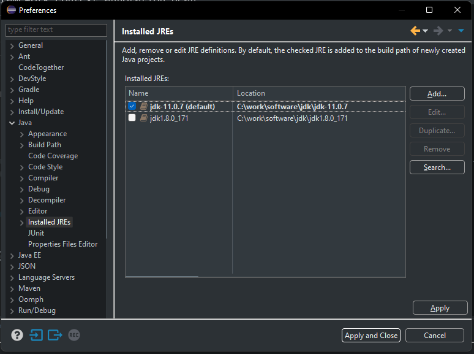
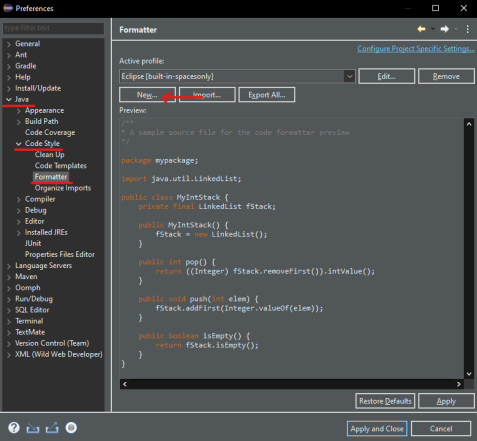
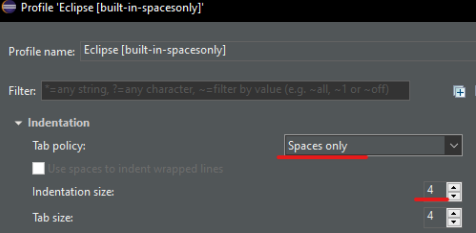

# Entorno de desarrollo

## Herramientas que utilizaremos
Las herramientas básicas que vamos a utilizar para el desarrollo del tutorial son:

* Para el desarrollo Back
    * [Eclide IDE](https://www.eclipse.org/downloads/)
    * [Java 8](https://www.oracle.com/java/technologies/downloads/#java8-windows)
    * Maven *(viene por defecto con Eclipse IDE)*
    * [Postman](https://www.postman.com/)
* Para el desarrollo Front
    * Visual Studio Code
    * Node
    * Angular CLI


## Instalación de herramientas para desarrollo Back

Necesitamos instalar un IDE de desarrollo, en nuestro caso será Eclipse IDE y la máquina virtual de java necesaria para ejecutar el código. Recomendamos Java8, que es la versión con la que está desarrollado el tutorial, aunque puedes instalar cualquier otra versión superior.

Para instalar el IDE deberás acceder a [Eclide IDE](https://www.eclipse.org/downloads/) y descargarte la última versión del instalador. Una vez lo ejecutes te pedirá el tipo de instalación que deseas instalar. Por lo general con la de "Eclipse IDE for Java Developers" es suficiente. Con esta versión ya tiene integrado los plugins de Maven y Git.

En la siguiente pantalla te pedirá que elijas la versión de Java para instalar. Os recomendamos realizar el tutorial con la versión [8 de java](https://www.oracle.com/java/technologies/downloads/#java8-windows), para versiones superiores no está probado y podría dar algún fallo.

Una vez instalado eclipse, debes asegurarte que está usando por defecto la versión de Java 8. Para ello, abre el menú `Window -> Preferences` y dentro de la opción `Java - Installed JREs` verifica que es correcto. Si no fuera así, añade la versión correcta y márcala como `default`.



Ademas, a fin de crear código homogéneo y mantenible, vamos a configurar el formateador de código automático.

Para ello nos dirigiremos a las preferencias de Eclipse.


Seleccionamos la sección `Formatter` de Java.



Aquí crearemos un nuevo perfil heredando la configuración por defecto.


En el nuevo perfil configuramos que se use espacios en vez de tabuladores con sangrado de 4 caracteres.



Una vez cofigurado el nuevo formateador debemos activar que se aplique en el guardado. Para ello volvemos acceder a las preferencias de Eclipse y nos dirigimos a la sub sección `Save Actions` del la sección `Editor` nuevamente de Java.


Aquí aplicamos la configuración deseada.


## Instalación de herramientas para desarrollo Front

Ahora necesitamos instalar las herramientas para el desarrollo front.

* Instalaremos un IDE de desarrollo, a nosotros nos gusta mucho [Visual Studio Code](https://code.visualstudio.com/). Puedes entrar en su página y descargarte la versión estable.

* Instalaremos [Nodejs](https://nodejs.org/es/). Entrando en la página de descargas e instalando la última versión estable.

* Por último tendremos que instalar el CLI de Angular para desarrollar y compilar la aplicación. Para poder instalarlo, tan solo hay que abrir una consola de msdos y ejecutar el comando:

```
npm install -g @angular/cli
```

Nodejs ya hará el resto. 

Y con esto ya tendremos todo instalado, listo para empezar a crear los proyectos.