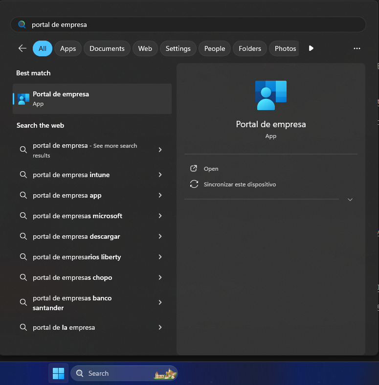
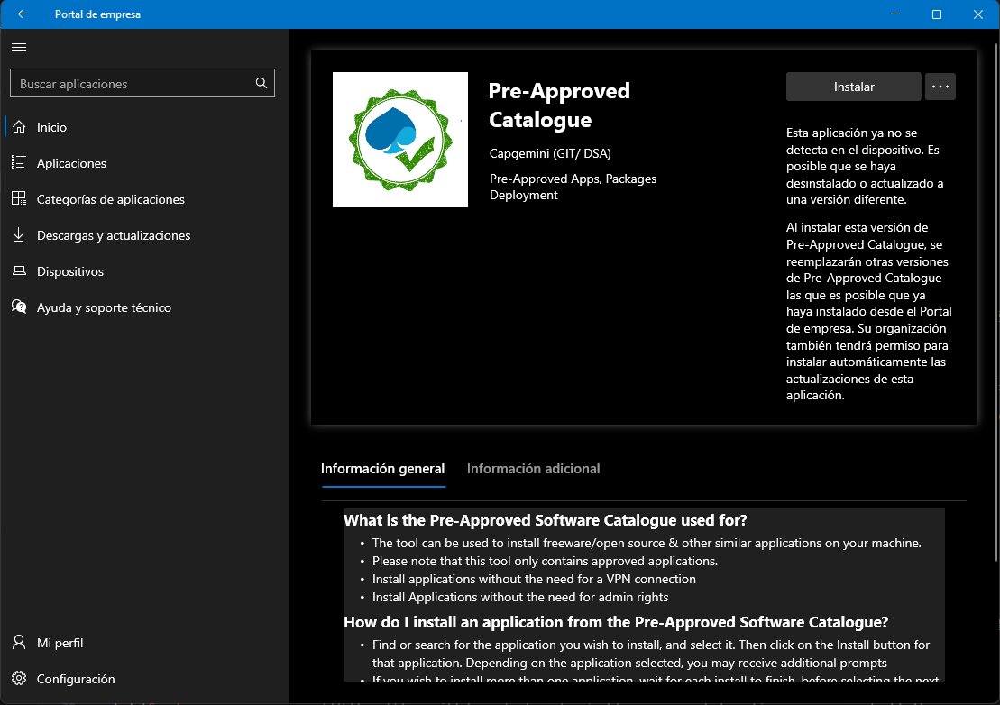
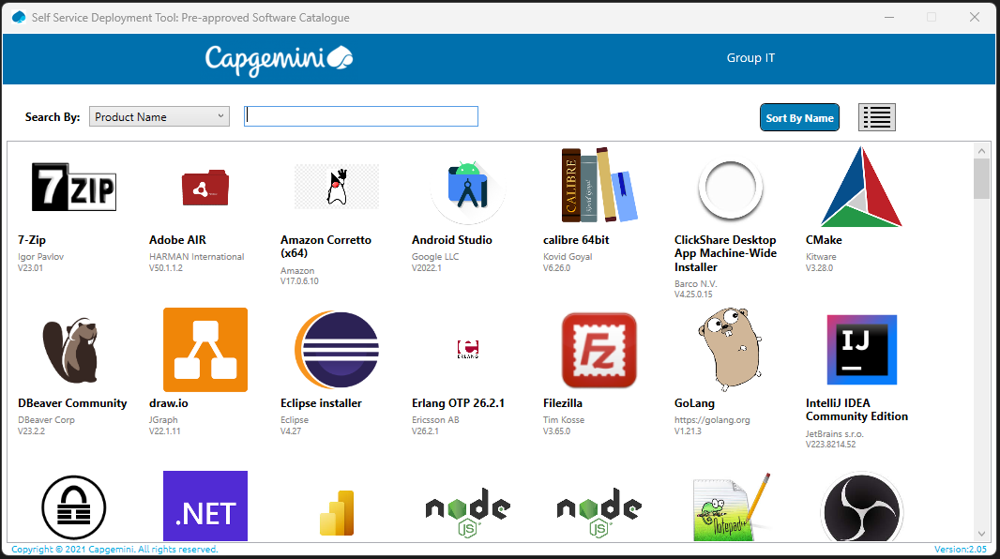

# Entorno de desarrollo - Angular

## Instalación de herramientas
Las herramientas básicas que vamos a utilizar para esta tecnología son:

* [Visual Studio Code](https://code.visualstudio.com/)
* [Scoop.sh](https://scoop.sh/)
* Nodejs
* Angular CLI


### Visual Studio Code

Lo primero de todo es instalar el IDE para el desarrollo front.

Te recomiendo utilizar [Visual Studio Code](https://code.visualstudio.com/), en un IDE que a nosotros nos gusta mucho y tiene muchos plugins configurables. Puedes entrar en su página y descargarte la versión estable.

Si no tuvieras permisos para instalar la herramienta por restricciones en el portátil existe una alternativa para poder instalarlo, a través del "Portal de Empresa" que tenemos instalado en nuestro portátil. Para ello teclea en el buscador de Windows (o en el menú de inicio) el texto "Portal de empresa". Debería aparecerte una app instalada en tu ordenador, tan solo tendrás que hacer click en ella:




Una vez dentro del portal de empresa, verás una aplicación que se llama "Pre-Approved Catalogue". Deberás instalarla, de hecho cada vez que quieras acceder a ella, tendrás que instalarla para que se descargue el nuevo catálogo.




Después de unos minutos de instalación, entrarás en un listado de las aplicaciones que están pre-aprobadas por la empresa. Solo tendrás que buscar "Visual Studio Code" e instalarla.



Pasados unos minutos, ya tendrás instalado el IDE en tu portátil.


### Scoop.sh

Muchas de las herramientas que necesitarás a lo largo de tu estancia en los proyectos, no podrás instalarlas por temas de permisos de seguridad en nuestros portátiles. Una forma de evitar estos permisos de seguridad y poder instalar herramientas (sobre todo a nivel de consola), es utilizando a [Scoop.sh](https://scoop.sh/).

Para instalar *scoop.sh* tan solo necesitas abrir un termina de PowerShell (**OJO que es PowerShell y no una consola de msdos**) y ejecutar los siguientes comandos:

```
Set-ExecutionPolicy -ExecutionPolicy RemoteSigned -Scope CurrentUser
Invoke-RestMethod -Uri https://get.scoop.sh | Invoke-Expression
```

Esto nos instalará *scoop.sh* en nuestros portátiles. Además de la instalación, y debido a las restricciones de seguridad que tenemos, necesitaremos activar el *lessmsi* para que las aplicaciones que necesitemos instalar no intenten ejecutar los .exe de instalación, sino que descompriman el zip. Para ello deberemos ejecutar el comando:

```
scoop config use_lessmsi true
```

A partir de este punto, ya tenemos listo el portátil para instalar herramientas y aplicaciones.


### Nodejs

El siguiente paso será instalar el motor de Nodejs. Para esto vamos a usar *scoop.sh* ya que lo tenemos instalado, y vamos a pedirle que nos instalé el motor de Nodejs. Abriremos una consola de msdos y ejecutaremos el comando:

```
scoop install main/nodejs
```

Con esto, scoop ya nos instalará todo lo necesario.


### Angular CLI

El siguiente pasó será instalar una capa de gestión por encima de Nodejs que nos ayudará en concreto con la funcionalidad de Angular. Si no indicamos nada se instalará la última versión del CLI, pero si queremos podemos elegir una versión en concreto añadiendo '@' y el número de la versión correspondiente. Para poder instalarlo, tan solo hay que abrir una consola de msdos y ejecutar el comando y Nodejs ya hará el resto:

```
npm install -g @angular/cli

npm install -g @angular/cli@16
```

Y con esto ya tendremos todo instalado, listo para empezar a crear los proyectos.

!!! note "Aviso para navegantes corporativos"
    
    Si tienes algún problema para ejecutar el comando `ng ...` puede deberse a que no se ha podido añadir al PATH.

    Pero ¡¡no te preocupes!! te explicamos cómo puedes instalártelo paso a paso:

1. Asegúrate de que tienes instalado `Git Bash`, ¿cómo?
    1. Clic derecho en una carpeta – la que sea
    2. "Más opciones" / "More options"
    3. Si no te aparece, deberás instalártelo desde el Portal de Empresa
3. Elige una carpeta sobre la que tengas permisos como destino de la instalación
    - `npm install @angular/cli ` <- no ponemos `-g`
4. Ahora viene lo confuso, pero te guiamos. Tienes que crear el siguiente alias
    - `echo alias ng=\'node RUTA_EN_LA_QUE_ESTAS/node_modules/@angular/cli/bin/ng.js\' >> .bashrc` <- esto creará el alias
    - `source ~/.bashrc` <- esto actualizará el perfil (resetea el diccionario con los alias disponibles)
5. Ahora ya deberías poder ejecutar `ng` desde `Git bash`

¿Tienes algún problema en la instalación? Contáctanos y te ayudaremos en la medida de lo que podamos


## Creación de proyecto

La mayoría de los proyectos con Angular en los que trabajamos normalmente, suelen ser proyectos web usando las librerías mas comunes de angular, como Angular Material.

Crear un proyecto de Angular es muy sencillo si tienes instalado el CLI de Angular. Lo primero abrir una consola de msdos y posicionarte en el directorio raiz donde quieres crear tu proyecto Angular, y ejecutamos lo siguiente:

```
ng new tutorial --strict=false
```

El propio CLI nos irá realizando una serie de preguntas que pueden cambiar dependiendo de la versión.

> Would you like to add Angular routing? (y/N)

>  `Preferiblemente: y`

> Which stylesheet format would you like to use?

>  `Preferiblemente: SCSS`

> Do you want to enable Server-Side Rendering (SSR)

>  `Preferiblemente: N`

En el caso del tutorial como vamos a tener dos proyectos para nuestra aplicación (front y back), para poder seguir correctamente las explicaciones, voy a renombrar la carpeta para poder diferenciarla del otro proyecto. A partir de ahora se llamará `client`.

!!! info "Info"
    Si durante el desarrollo del proyecto necesitas añadir nuevos módulos al proyecto Angular, será necesario resolver las dependencias antes de arrancar el servidor. Esto se puede realizar mediante el gestor de dependencias de Nodejs, directamente en consola ejecuta el comando `npm update` y descargará e instalará las nuevas dependencias.


## Arrancar el proyecto

Para arrancar el proyecto, tan solo necesitamos ejecutar en consola el siguiente comando siempre dentro del directorio creado por Angular CLI:

    ng serve

Angular compilará el código fuente, levantará un servidor local al que podremos acceder por defecto mediante la URL: [http://localhost:4200/](http://localhost:4200/)

Y ya podemos empezar a trabajar con Angular.

!!! info "Info"
    Cuando se trata de un proyecto nuevo recien descargado de un repositorio, recuerda que será necesario resolver las dependencias antes de arrancar el servidor. Esto se puede realizar mediante el gestor de dependencias de Nodejs, directamente en consola ejecuta el comando `npm update` y descargará e instalará las nuevas dependencias.

!!! tip "Comandos de Angular CLI"
    Si necesitas más información sobre los comandos que ofrece Angular CLI para poder crear aplicaciones, componentes, servicios, etc. los tienes disponibles en:
    [https://angular.io/cli#command-overview](https://angular.io/cli#command-overview)


## Angular 17+

Con la llegada de Angular 17, se han introducido importantes novedades que impactan la manera en que se desarrollan aplicaciones web. A diferencia de las versiones anteriores, Angular 17 trae mejoras enfocadas en la simplicidad, el rendimiento y la flexibilidad del desarrollo. En este tutorial, te guiaremos a través de estas nuevas características, permitiéndote elegir si deseas enfocarte en las versiones más recientes o adaptarlo a versiones anteriores.

Las principales diferencias entre Angular 17+ y sus versiones anteriores incluyen:

### Componentes standalone por defecto

Una de las novedades más importantes de Angular 17 es el uso de componentes standalone de forma predeterminada. En versiones anteriores, los módulos (NgModules) eran el núcleo de la estructura de una aplicación Angular. Ahora, con los componentes standalone, puedes crear y usar componentes sin necesidad de definir un módulo explícito, lo que simplifica significativamente la configuración inicial y mejora la modularidad. Esto facilita la creación de aplicaciones más ligeras y modulares.


### Directivas Simplificadas

En Angular 17, algunas de las directivas más utilizadas han sido actualizadas para simplificar su uso y mejorar la legibilidad del código. Una de las principales mejoras es la introducción de @if, que reemplaza la tradicional *ngIf. Esta nueva sintaxis hace que las condiciones sean más claras y fáciles de aplicar en las plantillas. Del mismo modo, la directiva *ngFor, utilizada para iterar sobre listas, también ha sido optimizada, ofreciendo una experiencia más fluida y mejor manejo de colecciones dinámicas.

Además, se ha reducido la complejidad en el uso de otras directivas estructurales como ngSwitch y ngClass, haciendo más intuitivo el control del comportamiento y la apariencia de los elementos en las vistas. Con estas mejoras, Angular 17 ofrece una sintaxis más limpia y directa, permitiendo a los desarrolladores concentrarse en la lógica de su aplicación sin la sobrecarga de código innecesario.

### Bloques de carga deferred

Los bloques de carga deferred (carga diferida) son una de las características más esperadas en Angular 17. Esta funcionalidad permite retrasar la carga de ciertas partes de la aplicación hasta que realmente sean necesarias, lo que optimiza el rendimiento al reducir el tamaño inicial del paquete que se descarga al navegador. Con esta técnica, es posible mejorar el tiempo de respuesta inicial de las aplicaciones y cargar los módulos o componentes bajo demanda, favoreciendo una mejor experiencia de usuario.


### ESBuild y Vite

Otra de las mejoras clave de Angular 17 es la integración de ESBuild y Vite como opciones de construcción (build). Estos dos motores de compilación permiten una construcción mucho más rápida y eficiente de aplicaciones, mejorando significativamente los tiempos de desarrollo y compilación. ESBuild es un bundler de JavaScript que se enfoca en la velocidad, mientras que Vite proporciona una experiencia de desarrollo más ágil con recarga en caliente y un flujo de trabajo optimizado. Ambas herramientas ofrecen una alternativa moderna y rápida a Webpack, especialmente para proyectos grandes o aplicaciones en tiempo real.