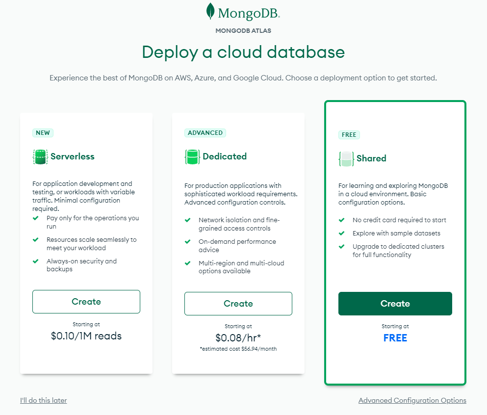

# Entorno de desarrollo - Nodejs

## Instalación de herramientas
Las herramientas básicas que vamos a utilizar para esta tecnología son:

* [Visual Studio Code](https://code.visualstudio.com/)
* [Nodejs](https://nodejs.org/es/)
* [MongoDB Atlas](https://www.mongodb.com/atlas/database)
* [Postman](https://www.postman.com/)

### Visual Studio Code

Lo primero de todo es instalar el IDE para el desarrollo en node si no lo has hecho previamente.

Te recomiendo utilizar [Visual Studio Code](https://code.visualstudio.com/), en un IDE que a nosotros nos gusta mucho y tiene muchos plugins configurables. Puedes entrar en su página y descargarte la versión estable.

### Nodejs

El siguiente paso será instalar el motor de [Nodejs](https://nodejs.org/es/). Entrando en la página de descargas e instalando la última versión estable. Con esta herramienta podremos compilar y ejecutar aplicaciones basadas en Javascript y Typescript, e instalar y gestionar las dependencias de las aplicaciones.

### MongoDB Atlas

También necesitaremos crear una cuenta de [MongoDB Atlas](https://www.mongodb.com/atlas/database) para crear nuestra base de datos MongoDB en la nube.

Accede a la [URL](https://www.mongodb.com/atlas/database), registrate grátis con cualquier cuenta de correo y elige el tipo de cuenta gratuita:

Configura el cluster a tu gusto y ya tendrías una BBDD en cloud para hacer pruebas.

## Creación de proyecto

## Arrancar el proyecto
