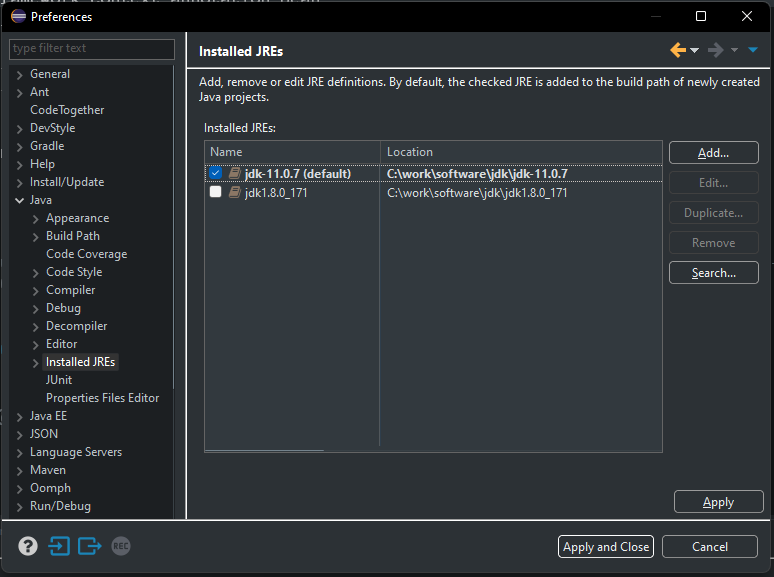
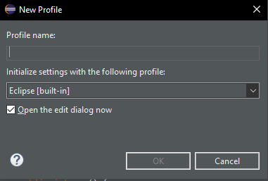
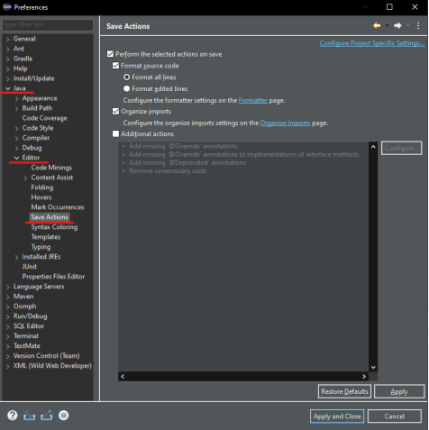

# Entorno de desarrollo - Springboot

## Instalación de herramientas
Las herramientas básicas que vamos a utilizar para esta tecnología son:

* [Eclide IDE](https://www.eclipse.org/downloads/)
* Maven *(viene por defecto con Eclipse IDE)*
* [Java 11](https://www.oracle.com/java/technologies/downloads/#java11-windows)
* [Postman](https://www.postman.com/)


### Instalación de IDE - Eclipse

Necesitamos instalar un IDE de desarrollo, en nuestro caso será Eclipse IDE y la máquina virtual de java necesaria para ejecutar el código. Recomendamos Java11, que es la versión con la que está desarrollado y probado el tutorial. 

!!! tip "Atención"
    Si se utiliza otra versión de Java diferente a la 8 o la 11, las dependencias utilizadas por Springboot en este tutorial **NO** funcionarán y dará un fallo al arrancar. Por favor, utiliza la versión de Java 8 o la versión de Java 11.


Para instalar el IDE deberás acceder a [Eclide IDE](https://www.eclipse.org/downloads/) y descargarte la última versión del instalador. Una vez lo ejecutes te pedirá el tipo de instalación que deseas instalar. Por lo general con la de "Eclipse IDE for Java Developers" es suficiente. Con esta versión ya tiene integrado los plugins de Maven y Git.

Una vez instalado eclipse, debes asegurarte que está usando por defecto la versión de Java 11 y para ello deberás instalarla. Descargala del siguiente [enlace](https://www.oracle.com/java/technologies/downloads/#java11-windows). Es posible que te pida un registro de correo, utiliza el email que quieras. Revisa bien el enlace para buscar y descargar la versión 11 para Windows: 


Ya solo queda añadir Java al Eclipse. Para ello, abre el menú `Window -> Preferences`:


y dentro de la sección `Java - Installed JREs` añade la versión que acabas de descargar, buscando el directorio `home` de la instalación de Java. Además, la debes marcar como `default`.




### Configuración de IDE - Eclipse

Como complemento al Eclipse, con el fin de crear código homogéneo y mantenible, vamos a configurar el formateador de código automático.

Para ello de nuevo abrimos el menú `Window -> Preferences`, nos vamos a la sección `Formatter` de Java:


Aquí crearemos un nuevo perfil heredando la configuración por defecto.



En el nuevo perfil configuramos que se use espacios en vez de tabuladores con sangrado de 4 caracteres.


Una vez cofigurado el nuevo formateador debemos activar que se aplique en el guardado. Para ello volvemos acceder a las preferencias de Eclipse y nos dirigimos a la sub sección `Save Actions` del la sección `Editor` nuevamente de Java.



Aquí aplicamos la configuración deseada.


### Herramientas para pruebas

Para poder probar las operaciones de negocio que vamos a crear, lo mejor es utilizar una herramienta que permita realizar llamadas a API Rest. Para ello te propongo utilizar [Postman](https://www.postman.com/), en su versión web o en su versión desktop, cualquiera de las dos sirve.

Con esta herramienta se puede generar peticiones GET, POST, PUT, DELETE contra el servidor y pasarle parámetros de forma muy sencilla y visual. Lo usaremos durante el tutorial.


## Creación de proyecto

La mayoría de los proyectos Springboot en los que trabajamos normalmente, suelen ser proyectos web sencillos con pocas dependencias de terceros o incluso proyectos basados en microservicios que ejecutan pocas acciones. Ahora tienes dos formas de preparar el proyecto Springboot, descritas a continuación. Escoge una de ellas, la que más te guste.

### (Rápido) - Uso de plantilla base

Puedes descargarte una [plantilla ya construida](../assets/project-template.zip), con un proyecto generado a partir de Sprint Initializr y configurada con los pasos detallados en los puntos siguientes y así te ahorras tiempo.

#### Importar en eclipse

El siguiente paso, ovbiamente es descomprimir el proyecto generado e importarlo como proyecto Maven. Abrimos el eclipse, pulsamos en File → Import y seleccionamos `Existing Maven Projects`. Buscamos el proyecto y le damos a importar. Con esto ya tendríamos todo configurado.

### (Detallado) - Crear con Initilizr

Si has hecho el punto anterior, no es necesario que leas esto. Salta directamente al último punto de `Arrancar el proyecto`.
Si sigues leyendo verás como configurar paso a paso un proyecto de cero, con las librerías que vamos a utilizar en el tutorial.

#### ¿Como usarlo?

Spring ha creado una página interactiva que permite crear y configurar proyectos en diferentes lenguajes, con diferentes versiones de Spring Boot y añadiendole los módulos que nosotros queramos.

Esta página está disponible desde [Spring Initializr](https://start.spring.io/). Para seguir el ejemplo del tutorial, entraremos en la web y seleccionaremos los siguientes datos:

* Tipo de proyecto: Maven
* Lenguage: Java
* Versión Spring boot: 2.6.x
* Group: com.ccsw
* ArtifactId: tutorial
* Versión Java: 11
* Dependencias: Spring Web, Spring Data JPA, H2 Database

!!! tip "Atención"
    La versión de SpringFramework debe ser una versión inferior a 3.0.0. Para versiones superiores hay métodos de las librerías (por ejemplo de acceso a BBDD) que están deprecados y no funcionará el tutorial. Elige una versión 2.6.x o 2.7.x. Si no existe esa versión en el generador, puedes descargarte cualquiera que sea 2.x y luego modificar el fichero `pom.xml` cambiando la línea de la versión de springboot por la 2.6.6.


Esto nos generará un proyecto que ya vendrá configurado con Spring Web, JPA y H2 para crear una BBDD en memoria de ejemplo con la que trabajaremos durante el tutorial.


#### Importar en eclipse

El siguiente paso, ovbiamente es descomprimir el proyecto generado e importarlo como proyecto Maven. Abrimos el eclipse, pulsamos en File → Import y seleccionamos `Existing Maven Projects`. Buscamos el proyecto y le damos a importar.

#### Configurar las dependencias

Lo primero que vamos a hacer es añadir las dependencias a librerías de devonfw. Abriremos el fichero `pom.xml` que nos ha generado el Spring Initilizr y añadiremos las siguientes líneas:

=== "pom.xml"
    ``` xml hl_lines="21 24 25 26 27 28 29 30 31 32 33 34 35 38 39 40 41 42 44 45 46 47 48 50 51 52 53 54"
    <?xml version="1.0" encoding="UTF-8"?>
    <project xmlns="http://maven.apache.org/POM/4.0.0" xmlns:xsi="http://www.w3.org/2001/XMLSchema-instance"
      xsi:schemaLocation="http://maven.apache.org/POM/4.0.0 https://maven.apache.org/xsd/maven-4.0.0.xsd">
      <modelVersion>4.0.0</modelVersion>

      <parent>
        <groupId>org.springframework.boot</groupId>
        <artifactId>spring-boot-starter-parent</artifactId>
        <version>2.4.4</version>
        <relativePath/> <!-- lookup parent from repository -->
      </parent>

      <groupId>com.ccsw</groupId>
      <artifactId>tutorial</artifactId>
      <version>0.0.1-SNAPSHOT</version>
      <name>tutorial</name>
      <description>Demo project for Spring Boot</description>

      <properties>
        <java.version>1.8</java.version>
        <devon4j.version>2021.04.003</devon4j.version>
      </properties>

      <dependencyManagement>
        <dependencies>
          <!-- BOM of devon4j -->
          <dependency>
            <groupId>com.devonfw.java.boms</groupId>
            <artifactId>devon4j-bom</artifactId>
            <version>${devon4j.version}</version>
            <type>pom</type>
            <scope>import</scope>
          </dependency>
        </dependencies>
      </dependencyManagement>

      <dependencies>
        <!-- Bean-Mapping for conversion from TO to Entity and vice versa -->
        <dependency>
          <groupId>com.devonfw.java.modules</groupId>
          <artifactId>devon4j-beanmapping-orika</artifactId>
        </dependency>
      
        <!-- Rest Mappers -->
        <dependency>
          <groupId>com.devonfw.java.modules</groupId>
          <artifactId>devon4j-rest</artifactId>
        </dependency>
        
        <!-- JPA -->
        <dependency>
          <groupId>com.devonfw.java.starters</groupId>
          <artifactId>devon4j-starter-spring-data-jpa</artifactId>
        </dependency>

        <dependency>
          <groupId>org.springframework.boot</groupId>
          <artifactId>spring-boot-starter-web</artifactId>
        </dependency>

        <dependency>
          <groupId>com.h2database</groupId>
          <artifactId>h2</artifactId>
          <scope>runtime</scope>
        </dependency>

        <dependency>
          <groupId>org.springframework.boot</groupId>
          <artifactId>spring-boot-starter-test</artifactId>
          <scope>test</scope>
          <exclusions>
            <exclusion>
              <groupId>org.junit.vintage</groupId>
              <artifactId>junit-vintage-engine</artifactId>
            </exclusion>
          </exclusions>
        </dependency>
      </dependencies>

      <build>
        <plugins>
          <plugin>
            <groupId>org.springframework.boot</groupId>
            <artifactId>spring-boot-maven-plugin</artifactId>
          </plugin>
        </plugins>
      </build>

    </project>
    ```

Hemos añadido las dependencias de Devonfw-JPA ya que nos permite utilizar más funcionalidades extendidas sobre repositorios JPA. Además de esa dependencia, hemos añadido una utilidad para hacer mapeos entre objetos y para configurar los servicios Rest.

!!! tip "Uso de defonfw"
    Vamos a utilizar algunas librerías de devonfw que nos facilitan la vida a la hora de desarrollar una aplicación. Podríamos hacerlo directamente con los módulos de Spring pero hay ciertas utilidades que nos interesa usar de devonfw. Para más información puedes consultar su [Web Oficial](https://devonfw.com/)


#### Configurar librerias devonfw

El siguiente punto es crear las clases de configuración para las librerías que hemos añadido. Para ello vamos a crear un package de configuración general de la aplicación `com.ccsw.tutorial.config` donde crearemos tres clases (dos de ellas dentro del subpaquete `mapper`).

=== "BeansOrikaConfig.java"
    ``` Java
    package com.ccsw.tutorial.config;

    import org.springframework.context.annotation.Bean;
    import org.springframework.context.annotation.Configuration;

    import com.ccsw.tutorial.config.mapper.BeanMapper;
    import com.ccsw.tutorial.config.mapper.BeanMapperImpl;
    import com.devonfw.module.beanmapping.common.base.BaseOrikaConfig;
    import com.devonfw.module.json.common.base.ObjectMapperFactory;
    import com.fasterxml.jackson.databind.Module;

    import ma.glasnost.orika.MapperFactory;

    /**
    * Java bean configuration for Orika. The method {@link #configureCustomMapping(MapperFactory)} from
    * {@link BaseOrikaConfig} can be overridden as per requirements.
    * @author ccsw
    */
    @Configuration
    public class BeansOrikaConfig extends BaseOrikaConfig {

      /**
      * @return the {@link BeanMapper} implementation.
      */
      @Override
      @Bean
      public BeanMapper getBeanMapper() {

        return new BeanMapperImpl();
      }

      @Bean
      public Module configureObjectMapper() {

        ObjectMapperFactory objectMapper = new ObjectMapperFactory();
        return objectMapper.getExtensionModule();

      }

    }
    ```
=== "mapper/BeanMapper.java"
    ``` Java
    package com.ccsw.tutorial.config.mapper;

    import org.springframework.data.domain.Page;

    /**
    * @author ccsw
    */
    public interface BeanMapper extends com.devonfw.module.beanmapping.common.api.BeanMapper {

      /**
      * Mapea el genérico de un Page en otro tipo de genérico
      * @param <T>
      * @param source
      * @param targetClass
      * @return
      */
      <T> Page<T> mapPage(Page<?> source, Class<T> targetClass);

    }
    ```
=== "mapper/BeanMapperImpl.java"
    ``` Java
    package com.ccsw.tutorial.config.mapper;

    import java.util.List;

    import org.springframework.data.domain.Page;
    import org.springframework.data.domain.PageImpl;

    import com.devonfw.module.beanmapping.common.impl.orika.BeanMapperImplOrika;

    /**
    * @author ccsw
    */
    public class BeanMapperImpl extends BeanMapperImplOrika implements BeanMapper {

      /**
      * {@inheritDoc}
      */
      public <T> Page<T> mapPage(Page<?> source, Class<T> targetClass) {

        if (source == null) {
          return null;
        }

        List<T> list = mapList(source.getContent(), targetClass);

        return new PageImpl<>(list, source.getPageable(), source.getTotalElements());
      }

    }
    ```

Listo, ya podemos empezar a desarrollar nuestros servicios.

#### Configurar la BBDD

Por último, vamos a dejar configurada la BBDD en memoria. Para ello crearemos dos ficheros, de momento en blanco, dentro de `src/main/resources/`:

* schema.sql → Será el fichero que utilizaremos para crear el esquema de BBDD
* data.sql → Será el fichero que utilizaremos para rellenar con datos iniciales el esquema de BBDD

Estos ficheros no pueden estar vacíos ya que si no dará un error al arrancar. Puedes añadirle la siguiente query (que no hace nada) para que pueda arrancar el proyecto.

```select 1 from dual;```

Y ahora le vamos a decir a Springboot que la BBDD será en memoria, que use un motor similar al de MySQL y que no la cree automáticamente sino que utilice los ficheros `schema.sql` y `data.sql`. Para ello hay que configurar el fichero `application.properties` que está dentro de `src/main/resources/`:

=== "application.properties"
  ``` properties
  #Database
  spring.jpa.hibernate.ddl-auto=none
  spring.datasource.driver-class-name=org.h2.Driver
  spring.datasource.url=jdbc:h2:mem:test;mode=mysql
  spring.datasource.username=sa
  spring.datasource.password=sa
  spring.jpa.database-platform=org.hibernate.dialect.H2Dialect

  spring.jpa.show-sql=true
  ```


### Arrancar el proyecto

Por último ya solo nos queda arrancar el proyecto creado. Para ello buscaremos la clase `TutorialApplication.java` (o la clase principal del proyecto) y con el botón derecho seleccionaremos Run As → Java Application. La aplicación al estar basada en Springboot arrancará internamente un Tomcat embebido donde se despliegará el proyecto. Si habéis seguido el tutorial la aplicación estará disponible en [http://localhost:8080](http://localhost:8080), aunque de momento aun no tenemos nada accesible.