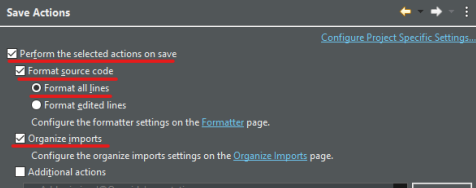

# Entorno de desarrollo - Spring Boot

## Instalación de herramientas
Las herramientas básicas que vamos a utilizar para esta tecnología son:

* [Eclipse IDE](https://www.eclipse.org/downloads/)
* Maven *(viene por defecto con Eclipse IDE)*
* [Java 19](https://www.oracle.com/java/technologies/downloads/#jdk19-windows)
* [Postman](https://www.postman.com/)


### Instalación de IDE - Eclipse

Necesitamos instalar un IDE de desarrollo, en nuestro caso será Eclipse IDE y la máquina virtual de java necesaria para ejecutar el código. Recomendamos Java 19, que es la versión con la que está desarrollado y probado el tutorial. 

Para instalar el IDE deberás acceder a la web de [Eclipse IDE](https://www.eclipse.org/downloads/) y descargarte la última versión del instalador. Una vez lo ejecutes te pedirá el tipo de instalación que deseas instalar. Por lo general con la de "Eclipse IDE for Java Developers" es suficiente. Con esta versión ya tiene integrado los plugins de Maven y Git.


### Instalación de Java

Una vez instalado eclipse, debes asegurarte que está usando por defecto la versión de Java 19 y para ello deberás instalarla. Descárgala del siguiente [enlace](https://www.oracle.com/java/technologies/downloads/#jdk19-windows). Es posible que te pida un registro de correo, utiliza el email que quieras (corporativo o personal). Revisa bien el enlace para buscar y descargar la versión 19 para Windows: 


Ya solo queda añadir Java al Eclipse. Para ello, abre el menú `Window -> Preferences`:


y dentro de la sección `Java - Installed JREs` añade la versión que acabas de descargar, siempre pulsando el botón `Add...` y buscando el directorio `home` de la instalación de Java. Además, la debes marcar como `default`.


### Configuración de IDE - Eclipse

Como complemento al Eclipse, con el fin de crear código homogéneo y mantenible, vamos a configurar el formateador de código automático.

Para ello de nuevo abrimos el menú `Window -> Preferences`, nos vamos a la sección `Formatter` de Java:


Aquí crearemos un nuevo perfil heredando la configuración por defecto.


En el nuevo perfil configuramos que se use espacios en vez de tabuladores con sangrado de 4 caracteres.


Una vez cofigurado el nuevo formateador debemos activar que se aplique en el guardado. Para ello volvemos acceder a las preferencias de Eclipse y nos dirigimos a la sub sección `Save Actions` del la sección `Editor` nuevamente de Java.


Aquí aplicamos la configuración deseada.




### Herramientas para pruebas

Para poder probar las operaciones de negocio que vamos a crear, lo mejor es utilizar una herramienta que permita realizar llamadas a API Rest. Para ello te propongo utilizar [Postman](https://www.postman.com/), en su versión web o en su versión desktop, cualquiera de las dos sirve.

Con esta herramienta se puede generar peticiones GET, POST, PUT, DELETE contra el servidor y pasarle parámetros de forma muy sencilla y visual. Lo usaremos durante el tutorial.


## Creación de proyecto

La mayoría de los proyectos Spring Boot en los que trabajamos normalmente, suelen ser proyectos web sencillos con pocas dependencias de terceros o incluso proyectos basados en micro-servicios que ejecutan pocas acciones. Ahora tienes que preparar el proyecto SpringBoot,

### Crear con Initilizr

Vamos a ver como configurar paso a paso un proyecto de cero, con las librerías que vamos a utilizar en el tutorial.

#### ¿Como usarlo?

Spring ha creado una página interactiva que permite crear y configurar proyectos en diferentes lenguajes, con diferentes versiones de Spring Boot y añadiéndole los módulos que nosotros queramos.

Esta página está disponible desde [Spring Initializr](https://start.spring.io/). Para seguir el ejemplo del tutorial, entraremos en la web y seleccionaremos los siguientes datos:

* Tipo de proyecto: Maven
* Lenguage: Java
* Versión Spring boot: 3.0.4 (o alguna similar)
* Group: com.ccsw
* ArtifactId: tutorial
* Versión Java: 19
* Dependencias: Spring Web, Spring Data JPA, H2 Database


Esto nos generará un proyecto que ya vendrá configurado con Spring Web, JPA y H2 para crear una BBDD en memoria de ejemplo con la que trabajaremos durante el tutorial.

#### Importar en eclipse

El siguiente paso, es descomprimir el proyecto generado e importarlo como proyecto Maven. Abrimos el eclipse, pulsamos en File → Import y seleccionamos `Existing Maven Projects`. Buscamos el proyecto y le damos a importar.

#### Configurar las dependencias

Lo primero que vamos a hacer es añadir las dependencias a algunas librerías que vamos a utilizar. Abriremos el fichero `pom.xml` que nos ha generado el Spring Initilizr y añadiremos las siguientes líneas:

=== "pom.xml"
    ``` xml hl_lines="33 34 35 36 37 39 40 41 42 43 45 46 47 48 49"
    <?xml version="1.0" encoding="UTF-8"?>
    <project xmlns="http://maven.apache.org/POM/4.0.0" xmlns:xsi="http://www.w3.org/2001/XMLSchema-instance"
    xsi:schemaLocation="http://maven.apache.org/POM/4.0.0 https://maven.apache.org/xsd/maven-4.0.0.xsd">
    <modelVersion>4.0.0</modelVersion>
    
        <parent>
            <groupId>org.springframework.boot</groupId>
            <artifactId>spring-boot-starter-parent</artifactId>
            <version>3.0.4</version>
            <relativePath/> <!-- lookup parent from repository -->
        </parent>
        
        <groupId>com.ccsw</groupId>
        <artifactId>tutorial</artifactId>
        <version>0.0.1-SNAPSHOT</version>
        <name>tutorial</name>
        <description>Tutorial project for Spring Boot</description>
        
        <properties>
            <java.version>19</java.version>
        </properties>
        
        <dependencies>
            <dependency>
                <groupId>org.springframework.boot</groupId>
                <artifactId>spring-boot-starter-data-jpa</artifactId>
            </dependency>
            <dependency>
                <groupId>org.springframework.boot</groupId>
                <artifactId>spring-boot-starter-web</artifactId>
            </dependency>
    
            <dependency>
                <groupId>org.springdoc</groupId>
                <artifactId>springdoc-openapi-starter-webmvc-ui</artifactId>
                <version>2.0.3</version>
            </dependency>
    
            <dependency>
                <groupId>org.hibernate</groupId>
                <artifactId>hibernate-validator</artifactId>
                <version>8.0.0.Final</version>
            </dependency>
    
            <dependency>
                <groupId>org.modelmapper</groupId>
                <artifactId>modelmapper</artifactId>
                <version>3.1.1</version>
            </dependency>
    
            <dependency>
                <groupId>com.h2database</groupId>
                <artifactId>h2</artifactId>
                <scope>runtime</scope>
            </dependency>
            <dependency>
                <groupId>org.springframework.boot</groupId>
                <artifactId>spring-boot-starter-test</artifactId>
                <scope>test</scope>
            </dependency>
        </dependencies>
    
        <build>
            <plugins>
                <plugin>
                    <groupId>org.springframework.boot</groupId>
                    <artifactId>spring-boot-maven-plugin</artifactId>
                </plugin>
            </plugins>
        </build>
    
    </project>
    ```

Hemos añadido las dependencias de que nos permite utilizar Open API para documentar nuestras APIs. Además de esa dependencia, hemos añadido una utilidad para hacer mapeos entre objetos y para configurar los servicios Rest. Más adelante veremos como se utilizan.

#### Configurar librerías

El siguiente punto es crear las clases de configuración para las librerías que hemos añadido. Para ello vamos a crear un package de configuración general de la aplicación `com.ccsw.tutorial.config` donde crearemos una clase que llamaremos `ModelMapperConfig` y usaremos para configurar el bean de ModelMapper.

=== "ModelMapperConfig.java"
    ``` Java
    package com.ccsw.tutorial.config;
    
    import org.modelmapper.ModelMapper;
    import org.springframework.context.annotation.Bean;
    import org.springframework.context.annotation.Configuration;
    
    /**
     * @author ccsw
     *
     */
    @Configuration
    public class ModelMapperConfig {
    
        @Bean
        public ModelMapper getModelMapper() {
    
            return new ModelMapper();
        }
    
    }
    ```

Esta configuración nos permitirá luego hacer transformaciones entre objetos de forma muy sencilla. Ya lo iremos viendo más adelante.
Listo, ya podemos empezar a desarrollar nuestros servicios.

#### Configurar la BBDD

Por último, vamos a dejar configurada la BBDD en memoria. Para ello crearemos un fichero, de momento en blanco, dentro de `src/main/resources/`:

* data.sql → Será el fichero que utilizaremos para rellenar con datos iniciales el esquema de BBDD

Este fichero no puede estar vacío, ya que si no dará un error al arrancar. Puedes añadirle la siguiente query (que no hace nada) para que pueda arrancar el proyecto.

```select 1 from dual;```

Y ahora le vamos a decir a Spring Boot que la BBDD será en memoria, que use un motor de H2 y que la cree automáticamente desde el modelo y que utilice el fichero `data.sql` (por defecto) para cargar datos en esta. Para ello hay que configurar el fichero `application.properties` que está dentro de `src/main/resources/`:

=== "application.properties"
  ``` properties
    #Database
    spring.datasource.url=jdbc:h2:mem:testdb
    spring.datasource.username=sa
    spring.datasource.password=sa
    spring.datasource.driver-class-name=org.h2.Driver
    
    spring.jpa.database-platform=org.hibernate.dialect.H2Dialect
    spring.jpa.defer-datasource-initialization=true
    spring.jpa.show-sql=true
    
    spring.h2.console.enabled=true
  ```


### Arrancar el proyecto

Por último ya solo nos queda arrancar el proyecto creado. Para ello buscaremos la clase `TutorialApplication.java` (o la clase principal del proyecto) y con el botón derecho seleccionaremos Run As → Java Application. La aplicación al estar basada en Spring Boot arrancará internamente un Tomcat embebido donde se despliega el proyecto. 

Si habéis seguido el tutorial la aplicación estará disponible en [http://localhost:8080](http://localhost:8080), aunque de momento aún no tenemos nada accesible y nos dará una página de error `Whitelabel Error Page`, error 404. Eso significa que el Tomcat embedido nos ha contestado pero no sabe que devolvernos porque no hemos implementado todavía nada.