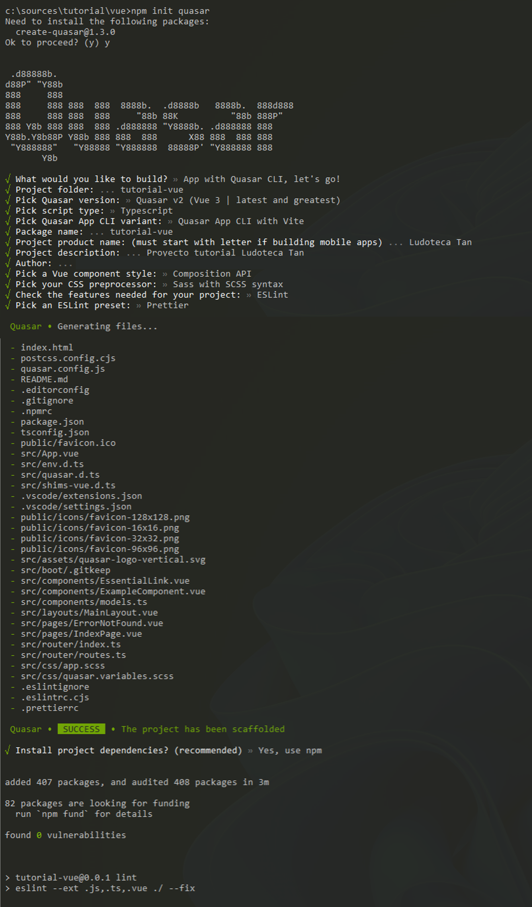

# Entorno de desarrollo - Vue.js

## Instalación de herramientas
Las herramientas básicas que vamos a utilizar para esta tecnología son:

* [Visual Studio Code](https://code.visualstudio.com/)
* [Nodejs](https://nodejs.org/es/)


### Visual Studio Code

Lo primero de todo es instalar el IDE para el desarrollo front.

Te recomiendo utilizar [Visual Studio Code](https://code.visualstudio.com/), en un IDE que a nosotros nos gusta mucho y tiene muchos plugins configurables. Puedes entrar en su página y descargarte la versión estable.


### Nodejs

El siguiente paso será instalar el motor de [Nodejs](https://nodejs.org/es/). Entrando en la página de descargas e instalando la última versión estable. Con esta herramienta podremos compilar y ejecutar aplicaciones basadas en Javascript y Typescript, e instalar y gestionar las dependencias de las aplicaciones.


## Creación de proyecto

### Preparar versiones 

Lo primero tienes que estar seguro de tener tu versión de node actualizada para poder instalar Vue, para saber la versión de Node que tenemos actualmente nos iremos a la consola y escribiremos:

```
node -v
```

Nos debería salir algo como esto:




Donde el `v16.17.0` es nuestra versión de node, una vez sabemos esto podemos ir a  [Nodejs](https://nodejs.org/es/) y ver la versión de node recomendada:


En el momento de escribir este tutorial, seria la `18.16.0` por lo que no estaría de mas actualizarla.

### Crear scaffold 

Una vez esta parte la tenemos y comprobamos que hemos subido bien la versión de node con `node -v`, ya podemos hacer el `scaffold` de la aplicacion.

Hacer el `scaffold` de una aplicación es un término que se utiliza en el desarrollo de software para describir el proceso de generar automáticamente la estructura básica de una aplicación, incluyendo archivos y directorios, modelos de datos, controladores y vistas.

El objetivo del proceso de `scaffolding` es ayudar a los desarrolladores a poner en marcha rápidamente una nueva aplicación, proporcionándoles una base sólida sobre la que puedan construir el resto de la aplicación.

En muchos casos, los desarrolladores pueden personalizar fácilmente la estructura generada por el `scaffold` para adaptarla a sus necesidades específicas.


Crear un proyecto de Vue.js o hacer el scaffold es muy sencillo. Lo primero abrir una consola de msdos y posicionarte en el directorio raiz donde quieres crear tu proyecto Vue, y ejecutamos lo siguiente:

```
npm init vue@latest
```

Este comando instalará y ejecutará `create-vue`, la herramienta oficial de scaffolding de Vue. Se presentarán indicaciones para varias funciones opcionales, como TypeScript o Testing, algo similar a esto:


Y tendremos que elegir lo siguiente:

> Project name:

> `El nombre que te gustaría darle al proyecto`

> Add TypeScript? (y/N)

> `Yes`

> Add JSX Support (y/N)

> `No`

> Add Vue.js Router for Single Page Application development? (y/N)

> `Yes`

> Add Pinia for state management? (y/N)

> `No`

> Add Vitest for Unit testing? (y/N)

> `No`

> Add an End-to-End Testing Solution?

> `No`

> Add ESLint for code quality? (y/N)

> `Yes`

> Add Prettier for code formatting?

> `Yes`

Y ahora la explicación de cada uno de los puntos anteriormente vistos.

> Add JSX Support (y/N)

JSX es una extensión de sintaxis para JavaScript que permite escribir una marca similar a HTML dentro de un archivo de JavaScript. Básicamente, JSX es una función de renderizado de JavaScript que te ayuda a insertar tu HTML directamente en tu código de JavaScript.
Sintaxis de plantillas: Una sintaxis de plantilla basada en HTML que te permite enlazar declarativamente el DOM renderizado con los datos de la instancia del componente subyacente.

El uso de las plantillas Vue.js es similar al uso de JSX, ya que ambas se crean utilizando JavaScript. La principal diferencia es que las plantillas Vue.js son sintácticamente HTML válido que puede ser analizado por navegadores y analizadores de HTML compatibles con las especificaciones.

**¿Qué significa esto?**
Las funciones JSX nunca se usan en el archivo HTML real, mientras que las plantillas Vue.js sí.

**¿Cuál es la diferencia? ¿Cuál es mejor usar?**
Según la documentación de Vue.js, compila las plantillas en código JavaScript altamente optimizado. Pero si estás familiarizado con los conceptos de Virtual DOM y prefieres la potencia de JavaScript, también puedes escribir directamente funciones de renderizado en lugar de plantillas, con soporte opcional para JSX.

Sin embargo, debes tener en cuenta que no disfrutan del mismo nivel de optimizaciones en tiempo de compilación que las plantillas.
Por lo tanto, podemos concluir que escribir la sintaxis de plantillas con Vue.js es más optimizado y por lo tanto la respuesta seria no añadir jsx


> Add Vue.js Router for Single Page Application development? (y/N)

Cuando estamos trabajando en una aplicación y vamos a hacer uso de las rutas deberemos indicar que sí queremos añadir el router. 

Si la idea es solo meter en un div algo de Vue.js y no vamos a tener enrutado no.

> Add Pinia for state management? (y/N)

Uffff, la maquina de estados, de momento le decimos que no y mas adelante seguro que algún día nos tocara pelearnos con ella.

> Add Vitest for Unit testing? (y/N)

Vitest es una librería de testing desarrollada sobre vite, la alternativa a webpack que usa VUE. Si vamos ha hacer test unitarios en la aplicación es una muy buena alternativa por lo que seria un yes, si no estamos seguros podemos añadirla luego sin ningún problema.

> Add an End-to-End Testing Solution?

Lo mismo que antes, la podemos instalar luego, en principio diremos que no aunque los test en todos los proyectos son muy necesarios.

> Add ESLint for code quality? (y/N)
> Add Prettier for code formatting?

Ambas dos nos sirve para mejorar la calidad de nuestro código. En conjunto dejan un código muy bonito si se saben configurar bien, Vue.js ya lo trae con las opciones básicas configuradas, luego tu puedes variarlas tanto en prettier como en ESLint para adaptarlas a tus necesidades.

## Arrancar el proyecto

Cuando todo ha terminado el propio scaffolding te dice lo que tienes que hacer para poner el proyecto en marcha y ver lo que te ha generado, solo tienes que seguir esos pasos:


* Con `npm install` instalamos todos los paquetes node que necesitamos para el proyecto.
* Con `npm run format` ejecutaremos Prettier en el directorio `src/` y sobrescribirá los archivos de código fuente existentes con el nuevo formato.
* Con `npm run dev` podremos en marcha la aplicación y al ponerse en marcha nos aparecerá esto:


Lo que quiere decir que si en el navegador nos vamos a `http://localhost:5173/` podremos ver nuestra aplicación Vue.js funcionando.

!!! info "Info"
    Si durante el desarrollo del proyecto necesitas añadir nuevos módulos al proyecto Vue.js, será necesario resolver las dependencias antes de arrancar el servidor. Esto se puede realizar mediante el gestor de dependencias de Nodejs, directamente en consola ejecuta el comando npm install y descargará e instalará las nuevas dependencias..

!!! info "Proyecto descargado"
    Cuando se trata de un proyecto nuevo recien descargado de un repositorio, recuerda que será necesario resolver las dependencias antes de arrancar el servidor. Esto se puede realizar mediante el gestor de dependencias de Nodejs, directamente en consola ejecuta el comando npm install y descargará e instalará las nuevas dependencias. 


!!! tip "Comandos de consola"
    Si necesitas más información sobre, por ejemplo, usar Vue.js desde el CDN puedes acceder a la información oficial en: [https://vuejs.org/guide/quick-start.html](https://vuejs.org/guide/quick-start.html)