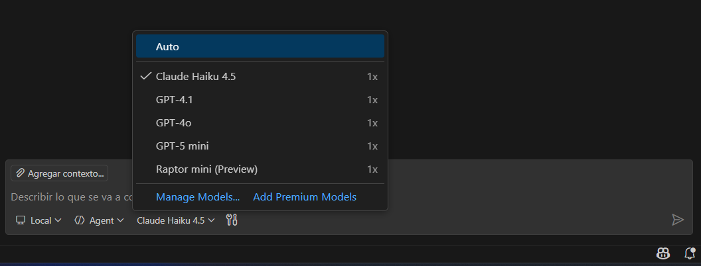
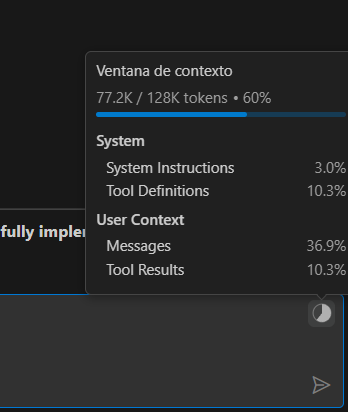
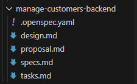

# Gestión de clientes (modelo gratuito)

!!! warning Atención
    Esta sección se encuentra en desarrollo 🚧.  
    **NO se recomienda realizarla** a menos que te lo hayan indicado expresamente.

## Punto de partida

Si has llegado hasta aquí, entiendo que ya has leído tanto la introducción como la instalación del entorno. A partir de ahora voy a dar por hecho que partimos todos desde el mismo punto.

Recuerda que trabajaremos desde el estado inicial del ejercicio **“Ahora hazlo tú!”**. Si no tienes el código exactamente en ese punto, no pasa nada: puedes **descargarlo desde aquí**:
[https://github.com/ccsw-csd/tutorial-proyectos](https://github.com/ccsw-csd/tutorial-proyectos)

Una vez descargado, elige el **backend** y el **frontend** que prefieras. En este tutorial, por motivos didácticos, yo utilizaré:

- ``server-springboot``
- ``client-angular17``

## Estructura inicial del proyecto

Crearemos un directorio general que contendrá ambos proyectos. Para simplificar el tutorial, durante todo el documento los llamaremos:

- **``backend``**
- **``frontend``**

La estructura debería ser similar a esta:


Desde consola (o desde el terminal de tu IDE), nos situamos en el **directorio raíz** y lanzamos el inicializador de Open Spec.

```
openspec init
```

Seleccionamos **``GitHub Copilot``**, pulsamos **``Enter``** para añadirlo y después **``Tab``** para validar la selección.


Esto instalará las plantillas necesarias para poder trabajar con **Open Spec + GitHub Copilot**.

## Consejos antes de empezar

Vamos a trabajar con un **modelo gratuito**, así que es importante tener claras sus limitaciones:

- El contexto es **muy limitado**
- El número de operaciones mensuales también lo es

Para compensar esto, vamos a:

- Dividir el trabajo en tareas pequeñas
- Ser muy explícitos en los prompts
- Dar más contexto “artificial” al modelo

> Con un modelo de pago podríamos plantear el ejercicio de forma más generalista y con menos fragmentación.

El modelo que utilizaremos será **``Claude Haiku``**. Para ello debes:

1. Hacer login con tu cuenta de GitHub
2. Activar GitHub Copilot
3. En el chat, abrir el tercer desplegable
4. Seleccionar el modelo **Claude Haiku**



En cualquier momento puedes ver el consumo mensual de tu cuenta pulsando el icono de la rana 🐸 en la esquina inferior derecha. El contador **se reinicia cada mes**.


## Estrategia de trabajo

Vamos a dividir el ejercicio en **dos grandes bloques**:

1. Primero trabajaremos únicamente con el **``backend``**
2. Después abordaremos el **``frontend``**

De esta forma limitamos el contexto a un solo proyecto y facilitamos el trabajo al modelo.

Además, recuerda que el comportamiento del modelo **no es determinista**. Si a ti te genera algo diferente a lo que ves aquí, probablemente seguirá siendo válido. No te frustres y ajusta los prompts si es necesario.

## Generación de backend

Seguiremos el ciclo completo de Open Spec:

```
1. Explore
2. Propose
3. Apply
4. Archive
```

### Explore

El objetivo de esta fase es **analizar el sistema existente**, sin modificar nada.

Buscamos:

- Entender la estructura actual
- Identificar patrones reutilizables
- Comprender cómo se comunican frontend y backend

Aspectos a revisar:

**Organización por dominios**

- Estructura de carpetas
- Dominios existentes

**Angular**

- Componentes
- Servicios
- Modelos
- Routing

**Spring Boot**

- Controller
- Service
- Repository
- Entity
- DTO

**Patrón CRUD**

- Listados
- Creación / edición
- Borrado

**Conexión frontend-backend**

- Endpoints
- URLs
- DTOs

**Reutilización**

- Código común
- Patrones repetidos

⚠️ En esta fase:

- **NO** se escribe código
- **NO** se diseña la solución
- **NO** se inventan estructuras nuevas

Solo se analiza el **sistema actual**.

**📜 Prompt**

Lo que haremos será escribir en el chat de ``Visual Studio Code`` el comando y las instrucciones que queramos darle. ``Recuerda haber elegido Claude Haiku``.

```
/opsx:explore

Analiza el proyecto actual que está en el directorio 'backend', es una aplicación Spring Boot. Una vez analizado, responde:

1. ¿Cómo están implementados los CRUD existentes?
- Controller
- Service
- Repository

2. ¿Qué estructura siguen los dominios?

3. ¿Cómo se implementan las operaciones?
- Listado
- Creación/edición
- Borrado

4. ¿Qué formato tienen los endpoints y que relación tiene con los métodos HTTP?

5. ¿Qué patrones o estructuras comunes se repiten en los CRUD existentes?
- Clases reutilizables
- Lógica repetida
- Estructuras comunes entre dominios

6. ¿Existen test unitarios y de integración? ¿Cómo están implementados? ¿Utiliza algo especial al arrancar o al mockear?

Analiza únicamente la parte de backend (Spring Boot)
NO propongas soluciones.
NO diseñes nuevas funcionalidades.
Solo analiza el sistema actual.
Escríbe el resultado del contexto dentro del fichero backend-explore.md en el directorio de las specs para poder utilizarlo en siguientes fases.

```

**📄 backend-explore.md**

Este comando realizará un análisis exhaustivo de tu sistema y lo dejará escrito dentro de la carpeta ``specs`` en un fichero llamado ``backend-explore.md``. Al final te mostrará un texto con el resumen del sistema y además escribirá el fichero de explore. 

!!! tip "Sobre los permisos"
    Es posible que durante el análisis te pida permiso para hacer ciertas tareas. Le puedes ir dando permiso una a una o darle permiso en todo el workspace, eso lo dejamos a tu elección.


En cualquier momento puedes ver el consumo de la ventana de contexto para saber si todo el conocimiento del sistema está en memoria o no. En el icono de la gráfica de pastel que está dentro del chat en la parte superior derecha.




### Propose

En esta fase definimos **qué vamos a construir**, basándonos estrictamente en el resultado del Explore.

Durante esta fase debes especificar.

**Descripción funcional**

-	Qué hace la funcionalidad
-	Qué problema resuelve

**Reglas de negocio**

-	Validaciones
-	Restricciones
-	Comportamientos esperados

**Diseño backend**

-	Endpoints necesarios
-	Estructura del dominio (Entity, DTO, Service, Repository)
-	Tipo de operaciones (listado, creación, edición, borrado)

**Diseño frontend**

-	Componentes necesarios
-	Flujo de usuario (listado, abrir modal, guardar, borrar)
-	Servicios Angular

**Decisiones técnicas**

-	Qué patrones existentes se reutilizan
-	Qué se mantiene igual que en otros dominios
-	Qué diferencias introduce esta funcionalidad

**Plan de implementación**

-	Tareas ordenadas
-	Separación backend / frontend

Aquí dejamos claro:

- Qué funcionalidad se va a añadir
- Qué reglas de negocio existen
- Qué piezas del sistema se ven afectadas
- Qué tareas habrá que ejecutar

⚠️ En esta fase:

- **NO** se implementa código
- **NO** se redefine el sistema

**📜 Prompt**

Para nuestro ejemplo, lo que haremos será escribir en el chat de ``Visual Studio Code`` el siguiente prompt:

```

/opsx:propose manage-customers-backend

Define la funcionalidad de gestión de clientes basándote en el sistema actual y en los patrones identificados en la fase Explore, tienes el resultado en el fichero "backend-explore.md".

Nos han pedido esta nueva funcionalidad.

Por un lado necesita poder tener una base de datos de sus clientes. Para ello nos ha pedido que si podemos crearle una pantalla de CRUD sencilla, al igual que hicimos con las categorías donde él pueda dar de alta a sus clientes.

Nos ha pasado un esquema muy sencillo de lo que quiere, tan solo quiere guardar un listado de los nombres de sus clientes para tenerlos fichados, y nos ha hecho un par de pantallas sencillas muy similares a Categorías.

Un listado sin filtros de ningún tipo ni paginación.

Un formulario de edición / alta, cuyo único dato editable sea el nombre. Además, la única restricción que nos ha pedido es que NO podamos dar de alta a un cliente con el mismo nombre que otro existente. Así que deberemos comprobar el nombre, antes de guardar el cliente.

Para empezar te daré unos consejos:
- Recuerda crear la tabla de la BBDD y sus datos
- Intenta primero hacer el listado completo, en el orden que más te guste: frontend o backend.
- Completa el listado conectando ambas capas.
- Termina el caso de uso haciendo las funcionalidades de edición, nuevo y borrado. Presta atención a la validación a la hora de guardar un cliente, NO se puede guardar si el nombre ya existe.


Te voy a dar otras directrices que pienso que te pueden servir:
- Se necesita un CRUD de clientes
- Un cliente solo tiene: id, name
- El listado será simple, sin filtros ni paginación
- Existirá un formulario de alta / edición en modal
- El único campo editable será el nombre
- No se puede crear un cliente con un nombre ya existente, será una validación obligatoria que deberemos cumplir en el guardado


Necesito que definas:

1. Descripción de la funcionalidad

2. Reglas de negocio

3. Diseño backend:
- Endpoints necesarios
- Estructura del dominio (Entity, DTO, Service, Repository)

4. Decisiones técnicas:
- Qué patrones del sistema actual se reutilizan


NO implementes código.
NO analices de nuevo el proyecto.
Basa la propuesta en los patrones detectados en la fase Explore.
Haz la propuesta únicamente de backend.
Como última tarea añade al fichero de tasks generar un resumen del cambio realizado, con el contrato de los endpoints y la información necesaria para que luego el frontend pueda implementar sus llamadas de forma sencilla.

Tendrás que escribir los ficheros de proposal, design, spec y tasks en la propuesta correspondiente.

```

De nuevo al ser un modelo gratuito tenemos que delimitarle mucho las tareas y recordarle que debe generar los ficheros de ``proposal``, ``design``, ``spec`` y ``tasks``, además de basarse en el fichero de ``backend-explore``. También debemos centrarle para que **SOLO** genere la parte de backend.
Por último si te fijas en el prompt hay una tarea que le indica claramente que genere un fichero con los contratos de los endpoints para poder implementar, en un futuro, la parte frontend. Esto es solamente una idea de generar un resumen para que el frontend sepa como comunicarse con el backend.

Este comando debería generar un directorio dentro de ``changes`` con el nombre que le hayamos puesto a la propuesta y dentro los 4 ficheros solicitados:



Además en el chat también hará un pequeño resumen de lo que ha propuesto como cambios. 

Veamos lo que contiene cada uno de esos ficheros.


**📄 proposal.md**

Define la funcionalidad a alto nivel.

Incluye:

- El problema que se quiere resolver (Why) 
- Qué cambios se van a introducir (What Changes) 
- El alcance funcional 
- El impacto en la aplicación

Responde a: ¿Qué se va a construir y por qué?

**📄 design.md**

Describe el diseño técnico de la solución.

Incluye:

- Contexto del sistema actual 
- Objetivos (Goals / Non-Goals) 
- Decisiones técnicas y su justificación 
- Alternativas consideradas 
- Riesgos y trade-offs 

Responde a: ¿Cómo se va a construir y por qué se ha elegido este enfoque?

**📄 spec.md**

Define el comportamiento funcional esperado.

Incluye:

- Requisitos funcionales
- Casos de uso expresados como escenarios (WHEN / THEN) 
- Reglas de negocio 
- Validaciones y restricciones 

Responde a: ¿Qué debe hacer el sistema?

**📄 tasks.md**

Descompone la implementación en tareas ejecutables. Quizá es el fichero más importante.

Incluye:

- Lista ordenada de tareas 
- Pasos concretos para implementar la funcionalidad 

Responde a: ¿Cómo se implementa paso a paso?

**Relación entre los artefactos**

Cada uno de los ficheros generados cumple un rol específico dentro del flujo de Open Spec:

- **spec.md** → define el comportamiento esperado (*qué debe hacer el sistema*)
- **design.md** → define la solución técnica (*cómo se va a construir*)
- **proposal.md** → aporta contexto y alcance (*por qué se construye*)
- **tasks.md** → guía la ejecución paso a paso (*cómo se implementa*)

Esta separación de responsabilidades permite:

- Evitar mezclar requisitos con implementación
- Revisar cada nivel de forma independiente
- Detectar errores e inconsistencias antes de escribir código

Estos artefactos constituyen la base para la siguiente fase: **Apply**, donde se ejecutará la implementación siguiendo las tareas definidas.

!!! tip "Responsabilidades como developer IA"
    En este punto la IA te ha hecho una propuesta que puede ser correcta o no, recordemos que se trata de un modelo matemático-probabilístico. Si hay algo de lo propuesto que no te encaja o es erróneo deberías comentarlo mediante el chat o corregirlo de forma manual en el fichero que corresponda. Por ejemplo si quieres añadir una tarea porqué se te ha olvidado incluirla en el prompt original, deberías decirle al modelo que te incluya la nueva tarea.

Una vez estemos de acuerdo con la propuesta que nos ha hecho la IA, podemos pasar al siguiente punto.


### Apply

Una vez validada la propuesta, ejecutamos la implementación:

El objetivo de esta fase es transformar los artefactos generados  
(`proposal.md`, `design.md`, `spec.md`, `tasks.md`) en **código funcional**, asegurando que:

- Se respetan los requisitos funcionales definidos en `spec.md`
- Se siguen las decisiones técnicas establecidas en `design.md`
- Se ejecutan las tareas en el orden definido en `tasks.md`

**📜 Prompt**

Esto es tan fácil como escribir en el chat de ``Visual Studio Code`` el siguiente prompt:

```

/opsx:apply

```

El agente empezará a realizar un montón de tareas y pedirnos permisos. Es posible que algunas de esas tareas fallen y él mismo lo reintente de otra forma. El resultado debería ser el código generado e implementado dentro de la carpeta de ``backend`` y un resumen de todas las tareas realizadas y checkeadas por la IA.

### Pruebas del backend

Un paso que no pertenece a Open Spec pero que es altamente recomendable es probar los cambios realizados. 
Arranca el backend y verifica:

- Que el servidor levanta
- Que los endpoints existen y funcionan
- Que los tests pasan

!!! warning "Ojo no te fies"
    Ojo no te fies de todo lo que construya la IA. Tu estás al mando, tu debes decidir si el sistema está correctamente implementado o no. Es tu responsabilidad.

Si **NO** estás a gusto con la implementación o se ha dejado algo por hacer, es el momento de escribirlo por el chat indicándole exactamente que es lo que falta. Cuanto más preciso y conciso seas, mejor implementará la IA.


### Archive
Y llegamos a la última etapa que nos define Open Spec, el último paso es archivar el cambio.

El objetivo de esta fase es marcar la funcionalidad como completada, consolidar todos los artefactos generados durante el proceso y dejar el sistema en un estado estable, coherente y preparado para nuevas evoluciones.

En esta fase se asegura que:

-	La funcionalidad ha sido correctamente implementada y validada
-	No existen incidencias críticas pendientes 
-	La documentación asociada al cambio está completa y actualizada
-	Existe una trazabilidad entre requisitos, diseño e implementación

Aunque parezca mentira, este paso es muy importante ya que nos servirá para actualizar el contexto del sistema y archivar todos los cambios para futuras consultas.


**📜 Prompt**

De nuevo nos vamos al chat de ``Visual Studio Code`` el siguiente prompt:

```

/opsx:archive

```

En ese caso, el sistema solicita confirmación para sincronizar los requisitos antes de archivar el cambio.

**¿Qué significa sincronizar?**

Al seleccionar la opción de sincronización:

- Se integran los nuevos requisitos definidos en spec.md 
- Se crea o actualiza el spec definitivo
- Los requisitos pasan a formar parte oficial del sistema 

Es decir, los requisitos pasan de ser un cambio temporal a formar parte permanente del sistema.

**¿Qué ocurre si no se sincroniza?**

Si se decide no sincronizar:

- El código permanece implementado
- Los requisitos no se registran en los specs principales

Esto puede provocar:

- Pérdida de trazabilidad 
- Dificultad para futuras evoluciones 
- Desalineación entre código y documentación

**Tras completar el proceso de Archive:**

- La funcionalidad queda documentada como completada
- El cambio deja de formar parte de los cambios activos
- Los requisitos quedan integrados definitivamente en el sistema (si se ha sincronizado)


**📜 Actualización del contexto**


Además, para forzar al ``modelo gratuito`` y dejarlo todo listo, es recomendable lanzar un último prompt que nos actualice el fichero de `backend-explore.md`

```

Actualiza el fichero de backend-explore con los nuevos datos implementados

```


## Generación de frontend

Bueno, pues ahora que ya tenemos el backend implementado, realizaremos de nuevo un ciclo completo de Open Spec pero está vez para frontend:

```
1. Explore
2. Propose
3. Apply
4. Archive
```

### Explore

De nuevo el objetivo de esta fase es analizar el sistema existente, sin modificar nada, pero esta vez nos centraremos en el frontend.

**📜 Prompt**

Vamos al chat de ``Visual Studio Code`` y escribimos el comando:

```
opsx:explore

Analiza el proyecto actual que está en el directorio "frontend", es una aplicación Angular. Ojo no escanees la carpeta de "node_modules" no tiene sentido. Una vez analizado, responde:

1. ¿Cómo están implementados los CRUD existentes?
- Componentes
- Servicios
- Modelos

2. ¿Qué estructura siguen los dominios?

3. ¿Cómo se implementan las operaciones?
- Listado
- Creación/edición
- Borrado
- Cómo funcionan las ventanas de creación y edición (modales)

4. ¿Como se comunican frontend con backend?
- Servicios en Angular
- Construcción de URLs

5. ¿Qué patrones o estructuras comunes se repiten en los CRUD existentes?
- Clases reutilizables
- Lógica repetida
- Estructuras comunes entre dominios


Analiza únicamente la parte de frontend (Angular)
NO propongas soluciones.
NO diseñes nuevas funcionalidades.
Solo analiza el sistema actual.
Escríbe el resultado del contexto dentro del fichero frontend-explore.md en el directorio de las specs para poder utilizarlo en siguientes fases.

```

Este comando realizará un análisis exhaustivo de tu sistema y lo dejará escrito dentro de la carpeta ``specs`` en un fichero llamado ``frontend-explore.md``. Al final te mostrará un texto con el resumen del sistema y además escribirá el fichero de explore. Este análisis estará más centrado en el frontend y debes pedirle que compruebe como se comunica con el backend para que lo tenga en cuenta.


### Propose

Una vez definido el análisis inicial, lo siguiente es pedirle una propuesta de lo que queremos construir. 

**📜 Prompt**

De nuevo en el chat de ``Visual Studio Code`` escribimos el comando:

```
/opsx:propose manage-customers-frontend

Define la funcionalidad de gestión de clientes basándote en el sistema actual y en los patrones identificados en la fase Explore, tienes el resultado en el fichero "frontend-explore.md". Además tendrás que ver el cambio realizado en la spec de "manage-customers-backend", sobre todo los endpoints generados que lo tienes definido en "FRONTEND_API_CONTRACT.md"

Nos han pedido esta nueva funcionalidad.

Por un lado necesita poder tener una base de datos de sus clientes. Para ello nos ha pedido que si podemos crearle una pantalla de CRUD sencilla, al igual que hicimos con las categorías donde él pueda dar de alta a sus clientes.

Nos ha pasado un esquema muy sencillo de lo que quiere, tan solo quiere guardar un listado de los nombres de sus clientes para tenerlos fichados, y nos ha hecho un par de pantallas sencillas muy similares a Categorías.

Un listado sin filtros de ningún tipo ni paginación.

Un formulario de edición / alta, cuyo único dato editable sea el nombre. Además, la única restricción que nos ha pedido es que NO podamos dar de alta a un cliente con el mismo nombre que otro existente. Así que deberemos comprobar el nombre, antes de guardar el cliente.

Para empezar te daré unos consejos:
- Recuerda crear la tabla de la BBDD y sus datos
- Intenta primero hacer el listado completo, en el orden que más te guste: frontend o backend.
- Completa el listado conectando ambas capas.
- Termina el caso de uso haciendo las funcionalidades de edición, nuevo y borrado. Presta atención a la validación a la hora de guardar un cliente, NO se puede guardar si el nombre ya existe.


Te voy a dar otras directrices que pienso que te pueden servir:
- Se necesita un CRUD de clientes
- Un cliente solo tiene: id, name
- El listado será simple, sin filtros ni paginación
- Existirá un formulario de alta / edición en modal
- El único campo editable será el nombre
- No se puede crear un cliente con un nombre ya existente, será una validación obligatoria que deberemos cumplir en el guardado


Necesito que definas:

1. Descripción de la funcionalidad

2. Reglas de negocio

3. Diseño frontend:
- Componentes necesarios
- Flujos de interacción (listado, abrir modal, guardar borrar)

4. Uso de endpoints para llamar a backend

5. Decisiones técnicas:
- Qué patrones del sistema actual se reutilizan


NO implementes código.
NO analices de nuevo el proyecto.
Basa la propuesta en los patrones detectados en la fase Explore.
Haz la propuesta únicamente de frontend.
Olvídate de los test, en frontend no tenemos tests.
Añade el nuevo punto de menú en el header para que se pueda acceder.
No te inventes estilos, respeta los estilos de las pantallas (anchuras, alturas, colores, disposición de las tablas).
Utiliza los alert dialog de Angular Material para las alertas, no uses la opción alert() del navegador.

Tendrás que escribir los ficheros de proposal, design, spec y tasks en la propuesta correspondiente.
```

Puntos a destacar de este prompt:

- Además del contexto inicial le hemos pedido que busque el fichero de `FRONTEND_API_CONTRACT.md` que es el fichero que generamos junto con el backend y que tiene las reglas de los endpoints del backend. Esto lo tenemos que hacer así ya que el modelo es gratuito y tiene limitaciones, no puede analizar frontend y backend a la vez en el mismo contexto.
- También le hemos pedido que **NO** invente estilos y que se fije en las pantallas existentes, además de decirle que utilice componentes de Angular Material. A veces los modelos gratuitos tienden a inventar mucho, por falta de contexto. De nuevo cuanto más concretos y precisos seamos, mejor implementará.


### Apply

Cuando estemos de acuerdo con la propuesta que nos ha hecho la IA y sobre todo con las tasks que propone realizar, lanzamos la fase de implementación.

**📜 Prompt**

Esto es tan fácil como escribir en el chat de ``Visual Studio Code`` el siguiente prompt:

```

/opsx:apply

```

El agente empezará a realizar un montón de tareas y pedirnos permisos. Es posible que algunas de esas tareas fallen y él mismo lo reintente de otra forma. El resultado debería ser el código generado e implementado dentro de la carpeta de ``frontend`` y un resumen de todas las tareas realizadas y checkeadas por la IA.


### Pruebas del frontend

Ahora sí, prueba de 🔥 fuego 🔥. Es hora de levantar el sistema completo, ``frontend`` y ``backend``, navegar por la aplicación y comprobar que todo funciona.

Si algo no encaja, es buen momento para conversarlo con la IA y que realice los cambios necesarios hasta conseguir que todo funcione perfectamente.


### Archive

Una vez tengamos todo funcionando y perfectamente implementado, pasamos a la última etapa para archivar y sincronizar nuestro cambio.

**📜 Prompt**

De nuevo nos vamos al chat de ``Visual Studio Code`` el siguiente prompt:

```
/opsx:archive
```

En ese caso, el sistema solicita confirmación para sincronizar los requisitos antes de archivar el cambio.


**📜 Actualización del contexto**


Y por último forzamos una actualización del contexto inicial.

```
Actualiza el fichero de frontend-explore con los nuevos datos implementados
```


