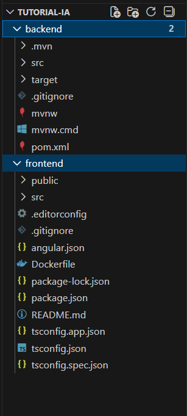
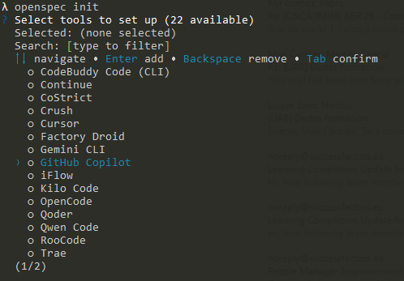
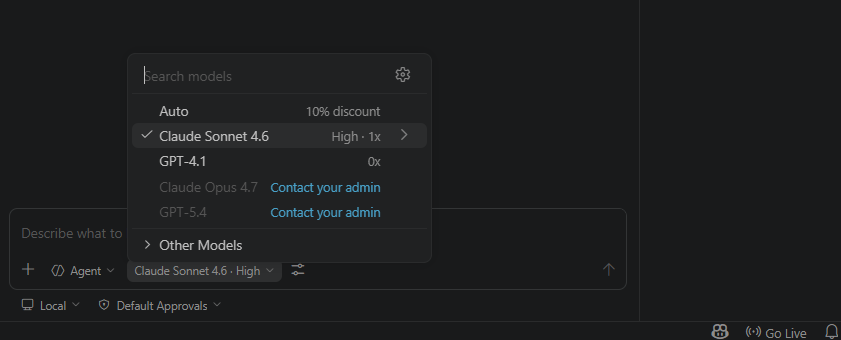
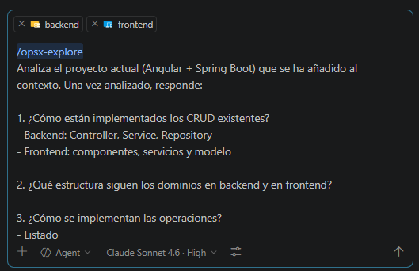
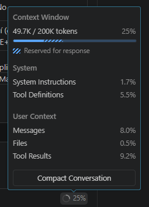
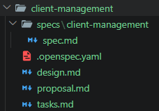

# Gestión de clientes (modelo con licencia)

!!! warning Atención
    Esta sección se encuentra en desarrollo 🚧.  
    **NO se recomienda realizarla** a menos que te lo hayan indicado expresamente.

## Punto de partida

Si has llegado hasta aquí, entiendo que ya has leído tanto la introducción como la instalación del entorno. A partir de ahora voy a dar por hecho que partimos todos desde el mismo punto.

Recuerda que trabajaremos desde el estado inicial del ejercicio **“Ahora hazlo tú!”**. Si no tienes el código exactamente en ese punto, no pasa nada: puedes **descargarlo desde aquí**:
[https://github.com/ccsw-csd/tutorial-proyectos](https://github.com/ccsw-csd/tutorial-proyectos)

Una vez descargado, elige el **backend** y el **frontend** que prefieras. En este tutorial, por motivos didácticos, yo utilizaré:

- ``server-springboot``
- ``client-angular17``

## Estructura inicial del proyecto

Crearemos un directorio general que contendrá ambos proyectos. Para simplificar el tutorial, durante todo el documento los llamaremos:

- **``backend``**
- **``frontend``**

La estructura debería ser similar a esta:



Desde consola (o desde el terminal de tu IDE), nos situamos en el **directorio raíz** y lanzamos el inicializador de Open Spec.

```
openspec init
```

Seleccionamos **``GitHub Copilot``**, pulsamos **``Enter``** para añadirlo y después **``Tab``** para validar la selección.



Esto instalará las plantillas necesarias para poder trabajar con **Open Spec + GitHub Copilot**.

## Consejos antes de empezar

Vamos a trabajar con un **modelo de pago**, por lo que es importante entender qué ventajas nos ofrece frente al modelo gratuito.

En este caso podremos:

- Trabajar con **mayor contexto**
- Analizar **frontend y backend simultáneamente**
- Reducir la fragmentación de tareas
- Obtener propuestas e implementaciones más completas y robustas

El modelo que utilizaremos será **``Claude Sonnet 4.6``**. Para ello debes:

1. Tener una **cuenta premium con acceso a modelos de pago**
2. Hacer login con tu cuenta de GitHub
3. Activar GitHub Copilot
4. En el chat, abrir el tercer desplegable
5. Seleccionar el modelo **Claude Sonnet 4.6**



En cualquier momento puedes ver el consumo mensual de tu cuenta pulsando el icono de la rana 🐸 en la esquina inferior derecha. El contador **se reinicia cada mes**.

## Estrategia de trabajo

Vamos a abordar el ejercicio como un **único bloque de trabajo**, analizando y construyendo la funcionalidad de forma **simultánea en backend y frontend**.

De esta manera aprovechamos el **mayor contexto** del modelo de pago, permitiendo:

1. Analizar **``backend`` y ``frontend`` al mismo tiempo**
2. Diseñar la funcionalidad de forma coherente en ambas capas desde el inicio

Esto nos permite mantener una visión global del sistema durante todo el proceso y reducir la necesidad de dividir artificialmente el trabajo en fases independientes por capa.

Además, recuerda que el comportamiento del modelo **no es determinista**. Si a ti te genera algo diferente a lo que ves aquí, probablemente seguirá siendo válido. No te frustres y ajusta los prompts si es necesario.

## Desarrollo de la funcionalidad

Seguiremos el ciclo completo de Open Spec:

```
1. Explore
2. Propose
3. Apply
4. Archive
```

### Explore

El objetivo de esta fase es **analizar el sistema existente**, sin modificar nada.

Buscamos:

- Entender la estructura actual de la aplicación
- Identificar patrones y estructuras reutilizables
- Comprender cómo se comunican frontend y backend

Aspectos a revisar:

**Organización por dominios**

- Cómo están estructurados los dominios existentes (category, author, game…)
- Qué carpetas existen en frontend y backend
- Cómo se relacionan los dominios entre capas

**Angular**

- Componentes
- Servicios
- Modelos
- Routing

**Spring Boot**

- Controller
- Service
- Repository
- Entity
- DTO

**Patrón CRUD**

- Cómo se implementan los listados
- Cómo se implementan las operaciones de creación, edición y borrado
- Cómo funcionan las ventanas de creación y edición (modales)

**Conexión frontend-backend**

- Cómo Angular llama a los endpoints
- Cómo se construyen las URLs
- Qué DTOs se utilizan en la comunicación

**Reutilización**

- Código común entre dominios
- Patrones repetidos
- Estructuras compartidas entre diferentes funcionalidades

⚠️ En esta fase:

- **NO** se escribe código
- **NO** se diseña la solución
- **NO** se inventan estructuras nuevas

Solo se analiza el **sistema actual**.

---

**📜 Prompt**

Lo que haremos será escribir en el chat de ``Visual Studio Code`` el comando y las instrucciones que queramos darle. ``Recuerda haber elegido Claude Sonnet 4.6 y estar trabajando en modo Agent``.

En este caso, hemos añadido las carpetas del proyecto **``frontend`` y ``backend`` al contexto**, por lo que el análisis se realizará sobre **el sistema completo**.

Para ello, desde el propio Chat de Copilot, pulsando el botón **“+”**, puedes seleccionar y añadir tanto **archivos individuales** como **directorios completos** del proyecto. También es posible añadirlos **arrastrándolos directamente al chat**.



```
/opsx:explore

Analiza el proyecto actual (Angular 17 + Spring Boot) que se ha añadido al contexto. Una vez analizado, responde:

1. ¿Cómo están implementados los CRUD existentes?
- Backend: Controller, Service, Repository
- Frontend: componentes, servicios y modelo

2. ¿Qué estructura siguen los dominios en backend y en frontend?

3. ¿Cómo se implementan las operaciones?
- Listado
- Creación/edición
- Borrado
- Cómo funcionan las ventanas de creación y edición (modales)

4. ¿Cómo se comunican frontend y backend?
- Servicios Angular
- Construcción de URLs

5. ¿Qué patrones o estructuras comunes se repiten en los CRUD existentes?
- Clases reutilizables
- Lógica repetida
- Estructuras comunes entre dominios

NO propongas soluciones.
NO diseñes nuevas funcionalidades.
Solo analiza el sistema actual.
```

Este comando realizará un análisis exhaustivo de tu sistema que servirá como base para definir la nueva funcionalidad en la siguiente fase.

!!! tip "Sobre los permisos"
    Es posible que durante el análisis te pida permiso para hacer ciertas tareas. Le puedes ir dando permiso una a una o darle permiso en todo el workspace, eso lo dejamos a tu elección.

En cualquier momento puedes ver el consumo de la ventana de contexto para saber si todo el conocimiento del sistema está en memoria o no. En el icono de la gráfica circular que está situada en la parte inferior derecha del chat.



### Propose

Una vez analizado el sistema en la fase Explore, el siguiente paso es definir de forma clara y estructurada **la nueva funcionalidad a implementar**.

En esta fase establecemos **qué vamos a construir**, basándonos estrictamente en el resultado del Explore y aprovechando que el modelo dispone de una **visión completa del sistema** (frontend y backend).

Esta fase actúa como puente entre el análisis y la implementación, permitiendo diseñar la solución antes de escribir código y reduciendo el riesgo de errores durante el desarrollo.

Durante esta fase debes especificar:

**Descripción funcional**

- Qué hace la funcionalidad
- Qué problema resuelve

**Reglas de negocio**

- Validaciones
- Restricciones
- Comportamientos esperados

**Diseño backend**

- Endpoints necesarios
- Estructura del dominio (Entity, DTO, Service, Repository)
- Tipo de operaciones (listado, creación, edición, borrado)

**Diseño frontend**

- Componentes necesarios
- Flujo de usuario (listado, abrir modal, guardar, borrar)
- Servicios Angular 

**Decisiones técnicas**

-	Qué patrones existentes se reutilizan
-	Qué se mantiene igual que en otros dominios
-	Qué diferencias introduce esta funcionalidad

**Plan de implementación**

- Tareas ordenadas
- Separación backend / frontend

Aquí dejamos claro:

- Qué funcionalidad se va a añadir
- Qué reglas de negocio existen
- Qué piezas del sistema se ven afectadas
- Qué tareas habrá que ejecutar
  
⚠️ En esta fase:

- **NO** se implementa código
- **NO** se redefine el sistema

**📜 Prompt**

Recuerda que seguimos trabajando en **modo Agent**, con las carpetas del proyecto **``frontend`` y ``backend`` añadidas al contexto**.

Para nuestro ejemplo, lo que haremos será escribir en el chat de ``Visual Studio Code`` el siguiente prompt:

```
/opsx:propose client

Define la funcionalidad de gestión de clientes basándote en el sistema actual (Angular 17 + Spring Boot) y en los patrones identificados en la fase Explore.

Requisitos funcionales:
- Se necesita un CRUD de clientes
- Un cliente solo tiene: id, name
- El listado será simple, sin filtros ni paginación
- Existirá un formulario de alta / edición en modal
- El único campo editable será el nombre
- No se puede crear un cliente con un nombre ya existente (validación obligatoria)

Define:

1. Descripción de la funcionalidad

2. Reglas de negocio

3. Diseño backend:
- Endpoints necesarios
- Estructura del dominio (Entity, DTO, Service, Repository)

4. Diseño frontend:
- Componentes necesarios
- Flujo de interacción (listado, abrir modal, guardar, borrar)

5. Decisiones técnicas:
- Qué patrones del sistema actual se reutilizan

NO implementes código.
NO analices de nuevo el proyecto.
Basa la propuesta en los patrones detectados en la fase Explore.
```

Este comando debería generar un directorio dentro de ``changes`` con el nombre que le hayamos puesto a la propuesta y dentro los 4 ficheros solicitados:



Además en el chat también hará un pequeño resumen de lo que ha propuesto como cambios. 

Veamos lo que contiene cada uno de esos ficheros.

**📄 proposal.md**

Define la funcionalidad a alto nivel.

Incluye:

- El problema que se quiere resolver (Why) 
- Qué cambios se van a introducir (What Changes) 
- El alcance funcional 
- El impacto en la aplicación

Responde a: ¿Qué se va a construir y por qué?

**📄 design.md**

Describe el diseño técnico de la solución.

Incluye:

- Contexto del sistema actual 
- Objetivos (Goals / Non-Goals) 
- Decisiones técnicas y su justificación 
- Alternativas consideradas 
- Riesgos y trade-offs 

Responde a: ¿Cómo se va a construir y por qué se ha elegido este enfoque?

**📄 spec.md**

Define el comportamiento funcional esperado.

Incluye:

- Requisitos funcionales
- Casos de uso expresados como escenarios (WHEN / THEN) 
- Reglas de negocio 
- Validaciones y restricciones 

Responde a: ¿Qué debe hacer el sistema?

**📄 tasks.md**

Descompone la implementación en tareas ejecutables. Quizá es el fichero más importante.

Incluye:

- Lista ordenada de tareas 
- Pasos concretos para implementar la funcionalidad 

Responde a: ¿Cómo se implementa paso a paso?

**Relación entre los artefactos**

Cada uno de los ficheros generados cumple un rol específico dentro del flujo de Open Spec:

- **spec.md** → define el comportamiento esperado (*qué debe hacer el sistema*)
- **design.md** → define la solución técnica (*cómo se va a construir*)
- **proposal.md** → aporta contexto y alcance (*por qué se construye*)
- **tasks.md** → guía la ejecución paso a paso (*cómo se implementa*)

Esta separación de responsabilidades permite:

- Evitar mezclar requisitos con implementación
- Revisar cada nivel de forma independiente
- Detectar errores e inconsistencias antes de escribir código

Estos artefactos constituyen la base para la siguiente fase: **Apply**, donde se ejecutará la implementación siguiendo las tareas definidas.

!!! tip "Responsabilidades como developer IA"
    En este punto la IA te ha hecho una propuesta que puede ser correcta o no, recordemos que se trata de un modelo matemático-probabilístico. Si hay algo de lo propuesto que no te encaja o es erróneo deberías comentarlo mediante el chat o corregirlo de forma manual en el fichero que corresponda. Por ejemplo si quieres añadir una tarea porqué se te ha olvidado incluirla en el prompt original, deberías decirle al modelo que te incluya la nueva tarea.

Una vez estemos de acuerdo con la propuesta que nos ha hecho la IA, podemos pasar al siguiente punto.

### Apply

Una vez validada la propuesta, ejecutamos la implementación:

El objetivo de esta fase es transformar los artefactos generados  
(`proposal.md`, `design.md`, `spec.md`, `tasks.md`) en **código funcional**, asegurando que:

- Se respetan los requisitos funcionales definidos en `spec.md`
- Se siguen las decisiones técnicas establecidas en `design.md`
- Se ejecutan las tareas en el orden definido en `tasks.md`

**📜 Prompt**

Esto es tan fácil como escribir en el chat de ``Visual Studio Code`` el siguiente prompt:

```
/opsx:apply
```

El agente empezará a realizar un montón de tareas y pedirnos permisos. Es posible que algunas de esas tareas fallen y él mismo lo reintente de otra forma. El resultado debería ser el código generado e implementado tanto en la carpeta ``backend`` como en la carpeta ``frontend`` y un resumen de todas las tareas realizadas y checkeadas por la IA.

## Pruebas

Un paso que no pertenece a Open Spec pero que es altamente recomendable es probar los cambios realizados. 

Arranca el **backend** y el **frontend** y verifica:

- La aplicación levanta correctamente
- Las nuevas funcionalidades añadidas están accesibles
- Los flujos principales definidos en `spec.md` funcionan como se espera

!!! warning "Ojo no te fies"
    Ojo no te fies de todo lo que construya la IA. Tu estás al mando, tu debes decidir si el sistema está correctamente implementado o no. Es tu responsabilidad.

Si **NO** estás a gusto con la implementación o se ha dejado algo por hacer, es el momento de escribirlo por el chat indicándole exactamente que es lo que falta. Cuanto más preciso y conciso seas, mejor implementará la IA.


### Archive
Y llegamos a la última etapa que nos define Open Spec, el último paso es archivar el cambio.

El objetivo de esta fase es marcar la funcionalidad como completada, consolidar todos los artefactos generados durante el proceso y dejar el sistema en un estado estable, coherente y preparado para nuevas evoluciones.

En esta fase se asegura que:

-	La funcionalidad ha sido correctamente implementada y validada
-	No existen incidencias críticas pendientes 
-	La documentación asociada al cambio está completa y actualizada
-	Existe una trazabilidad entre requisitos, diseño e implementación

Aunque parezca mentira, este paso es muy importante ya que nos servirá para actualizar el contexto del sistema y archivar todos los cambios para futuras consultas.


**📜 Prompt**

De nuevo nos vamos al chat de ``Visual Studio Code`` el siguiente prompt:

```
/opsx:archive
```

En ese caso, el sistema solicita confirmación para sincronizar los requisitos antes de archivar el cambio.

**¿Qué significa sincronizar?**

Al seleccionar la opción de sincronización:

- Se integran los nuevos requisitos definidos en spec.md 
- Se crea o actualiza el spec definitivo
- Los requisitos pasan a formar parte oficial del sistema 

Es decir, los requisitos pasan de ser un cambio temporal a formar parte permanente del sistema.

**¿Qué ocurre si no se sincroniza?**

Si se decide no sincronizar:

- El código permanece implementado
- Los requisitos no se registran en los specs principales

Esto puede provocar:

- Pérdida de trazabilidad 
- Dificultad para futuras evoluciones 
- Desalineación entre código y documentación

**Tras completar el proceso de Archive:**

- La funcionalidad queda documentada como completada
- El cambio deja de formar parte de los cambios activos
- Los requisitos quedan integrados definitivamente en el sistema (si se ha sincronizado)