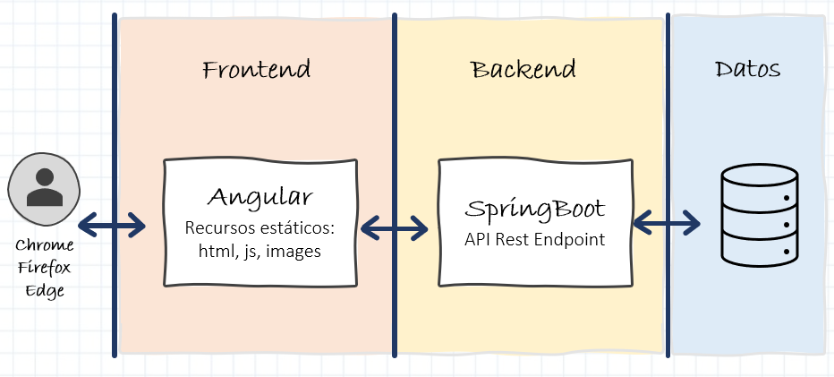
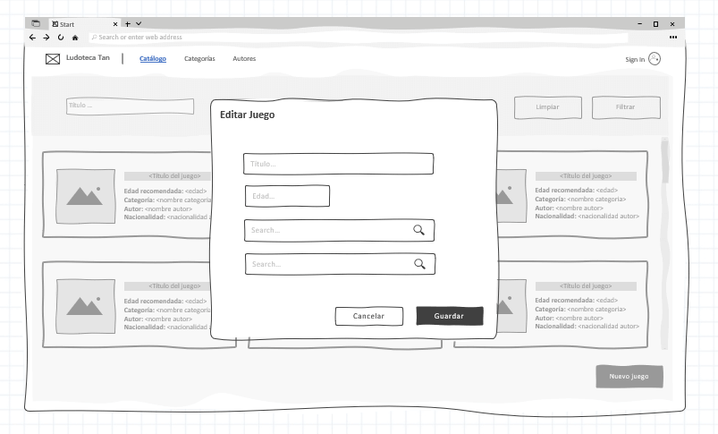

# Contexto de la aplicación

## ** Introducción **

Nuestro amigo *Ernesto Esvida* es muy aficionado a los juegos de mesa y desde muy pequeño ha ido coleccionando muchos juegos. Hasta tal punto que ha decidido regentar una Ludoteca.

Como la colección de juegos era suya personal, toda la información del catálogo de juegos la tenía perfectamente clasificado en fichas de cartón. Pero ahora que va abrir su propio negocio, necesita digitalizar esa información y hacerla más accesible.

Como es un buen amigo de la infancia, hemos decidido ayudar a Ernesto y colaborar haciendo una pequeña aplicación web que le sirva de catálogo de juegos. Es más o menos el mismo sistema que estaba utilizando, pero esta vez en digital.

Por cierto, la Ludoteca al final se va a llamar *Ludoteca Tán*.

!!! info "Info"
    Las imágenes que aparecen a continuación son mockups o diseños de alambre de las pantallas que vamos a desarrollar durante el tutorial. No quiere decir que el estilo final de las pantallas deba ser así, ni mucho menos. Es simplemente una forma sencilla de ejemplificar como debe quedar más o menos una pantalla.

### Estructura de un proyecto Web

En todas las aplicaciones web modernas y los proyectos en los que trabajamos se pueden diferenciar, de forma general, tres grandes *bloques funcionales*, como se muestra en la imagen inferior.

El funcionamiento es muy sencillo y difiere de las aplicaciones instalables que se ejecuta todo en una misma máquina o servidor.

* Con esta estructura, el usuario accede a la aplicación mediante un navegador web instalado en su máquina local.
* Este navegador solicita información mediante una URL a un servidor de recursos estáticos. Esto es lo que denominaremos un servidor frontend. Para programar servidores frontend se pueden usar muchas tecnologías, en este tutorial lo desarrollaremos en Angular o en React.
Este código frontend se descarga y se ejecuta dentro del navegador, y contiene la representación visual de las pantallas y ciertos comportamientos y navegación entre componentes. Sin embargo, por lo general, no tiene datos ni ejecuta lógica de negocio.
* Para estas labores de obtener datos o ejecutar lógica de negocio, el código frontend necesita invocar endpoints de la *segunda capa*, el backend. Al igual que antes, el backend, puede estar desarrollado en muchas tecnologías, en este tutorial se puede elegir entre Java-Springboot o Nodejs. Lo importante de esta capa es que es necesario exponer unos endpoints que sean invocados por la capa de frontend. Típicamente estos endpoints son operaciones API Rest que veremos más adelante.
* Por último, el servidor backend / capa backend, necesitará leer y guardar datos de algún sitio. Esto se hace utilizando la *tercera capa*, la capa de datos. Normalmente esta capa de datos será una BBDD instalada en algún servidor externo, aunque a veces como es el caso del tutorial de Springboot, podemos embeber el servidor en memoria de backend. Pero por norma general, esta capa es externa.

Así pues el flujo normal de una aplicación sería el siguiente:

* El usuario abre el navegador y solicita una web mediante una URL
* El servidor frontend, le sirve los recursos (páginas web, javascript, imágenes, ...) y se cargan en el navegador
* El navegador renderiza las páginas web, ejecuta los procesos javascript y realiza las navegaciones
* Si en algún momento se requiere invocar una operación, el navegador lanzará una petición contra una URL del backend
* El backend estará escuchando las peticiones y las ejecutará en el momento que le invoquen devulviendo un resultado al navegador
* Si hiciera falta leer o guardar datos, el backend lo realizará lanzando consultas SQL contra la BBDD

Dicho esto, por lo general necesitaremos un mínimo de dos proyectos para desarrollar una aplicación: 

* Por un lado tendremos un proyecto Frontend que se ejecutará en un servidor web de ficheros estáticos, tipo Apache. Este proyecto será código javascript, css y html, que se renderizará en el navegador Web y que realizará ciertas operaciones sencillas y validaciones en local y llamadas a nuestro servidor backend para ejecutar las operaciones de negocio.

* Por otro lado tendremos un proyecto Backend que se ejecutará en un servidor de aplicaciones, tipo Tomcat o Node. Este proyecto tendrá la lógica de negocio de las operaciones, el acceso a los datos de la BBDD y cualquier integración con servicios de terceros. La forma de exponer estas operaciones de negocio será mediante endpoints de acceso, en concreto llamadas tipo REST.

Pueden haber otros tipos de proyectos dentro de la aplicación, sobretodo si están basados en microservicios o tienen componentes batch, pero estos proyectos no vamos a verlos en el tutorial.

A partir de ahora, para que sea más sencillo acceder al tutorial, diferenciaremos las tecnologías en el menú mediante los siguientes colores:

* 🔵 Frontend
* 🟢 Backend

!!! tip "Consejo"
    Como norma cada uno de los proyectos que componen la aplicación, debería estar conectado a un repositorio de código diferente para poder evolucionar y trabajar con cada uno de ellos de forma aislada sin afectar a los demás. Así además podemos tener equipos aislados que trabajen con cada uno de los proyectos por separado.

!!! info "Info"
    Durante todo el tutorial, voy a intentar separar la construcción del proyecto Frontend de la construcción del proyecto Backend. Elige una tecnología para cada una de las capas y utiliza siempre la misma en todos los apartados del tutorial.

## ** Diseño de BD **

Para el proyecto que vamos a crear vamos a modelizar y gestionar 3 entidades: `CATEGORY`, `AUTHOR` y `GAME`.

La entidad `CATEGORY` estará compuesta por los siguientes campos:

*  id (lo mismo que en `GAME`)
*  name

La entidad `AUTHOR` estará compuesta por los siguientes campos:

*  id (lo mismo que en `GAME`)
*  name
*  nationality

Para la entidad `GAME`, Ernesto nos ha comentado que la información que está guardando en sus fichas es la siguiente:

*  id (este dato no estaba originalmente en las fichas pero nos será muy util para indexar y realizar búsquedas)
*  title
*  age
*  category
*  author

Comenzaremos con un caso básico que cumpla las siguientes premisas: un juego pertenece a una categoría y ha sido creado por un único autor. 

Modelando este contexto quedaría algo similar a esto:

## ** Diseño de pantallas **

Deberíamos construir tres pantallas de mantenimiento CRUD (Create, Read, Update, Delete) y una pantalla de Login general para activar las acciones de administrador. Más o menos las pantallas deberían quedar así:

### Listado de categorías

### Edición de categoría

### Listado de autores

### Edición de autor

### Listado de juegos

### Edición de juego

## ** Diseño funcional **

Por último vamos a definir un poco la funcionalidad básica que Ernesto necesita para iniciar su negocio.

### Aspectos generales

* El sistema tan solo tendrá dos roles:
  ** `usuario básico` es el usuario anónimo que accede a la web sin registrar. Solo tiene permisos para mostrar listados
  ** `usuario administrador` es el usuario que se registra en la aplicación. Puede realizar las operaciones de alta, edición y borrado

Por defecto cuando entras en la aplicación tendrás los privilegios de un `usuario básico` hasta que el usuario haga un login correcto con el usuario / password `admin` / `admin`. En ese momento pasara a ser un `usuario administrador` y podrá realizar operaciones de alta, baja y modificación.

La estructura general de la aplicación será:

* Una cabecerá superior que contendrá:
  * el logo y el nombre de la tienda
  * un enlace a cada uno de los CRUD del sistema
  * un botón de `Sign in`
* Zona de trabajo, donde cargaremos las pantallas que el usuario vaya abriendo

Al pulsar sobre la funcionalidad de `Sign in` aparecerá una ventana modal que preguntará usuario y password. Esto realizará una llamada al backend, donde se validará si el usuario es correcto. 

* En caso de ser correcto, devolverá un token jwt de acceso, que el cliente web deberá guardar en `sessionStorage` para futuras peticiones
* En caso de no ser correcto, devolverá un error de *Usuario y/o password incorrectos*

Todas las operaciones del backend que permitan crear, modificar o borrar datos, deberán estar securizadas para que no puedan ser accedidas sin haberse autenticado previamente.

### CRUD de Categorías

Al acceder a esta pantalla se mostrará un listado de las categorías que tenemos en la BD.
La tabla no tiene filtros, puesto que tiene muy pocos registros. Tampoco estará paginada.

En la tabla debe aparecer:

* identificador de la categoría
* nombre de la categoría
* botón de editar (solo en el caso de que el usuario tenga permisos)
* botón de borrar (solo en el caso de que el usuario tenga permisos)

Debajo de la tabla aparecerá un botón para crear nuevas categorías (solo en el caso de que el usuario tenga permisos).

**Crear**

Al pulsar el botón de crear se deberá abrir una ventana modal con dos inputs:

* Identificador. Este input deberá ser de solo lectura y deberá aparecer vacío, sin ningún valor. Con el placeholder de `Identificador`
* Nombre. Este input es obligatorio, será de escritura y deberá aparecer vacío, sin ningún valor. Con el placeholder de `Nombre`

Todos los datos obligatorios se deberán comprobar que son válidos antes de guardarlo en BD.
Dos botones en la parte inferior de la ventana permitirán al usuario cerrar la ventana o guardar los datos en la BD.

**Editar**

Al pulsar el icono de editar se deberá abrir una ventana modal utilizando el mismo componente que la ventana de `Crear` pero con los dos campos rellenados con los datos de BD.

**Borrar**

Si el usuario pulsa el botón de borrar, se deberá comprobar si esa categoría tiene algún `Juego` asociado. En caso de tenerlo se le informará al usuario de que dicha categoría no se puede eliminar por tener asociado un juego.
En caso de no estar asociada, se le preguntará al usuario mediante un mensaje de confirmación si desea eliminar la categoría. Solo en caso de que la respuesta sea afirmativa, se lanzará el borrado físico de la categoría en BD.

### CRUD de Autores

Al acceder a esta pantalla se mostrará un listado de los autores que tenemos en la BD.
La tabla no tiene filtros pero deberá estar paginada en servidor.

En la tabla debe aparecer:

* identificador del autor
* nombre del autor
* nacionalidad del autor
* botón de editar (solo en el caso de que el usuario tenga permisos)
* botón de borrar (solo en el caso de que el usuario tenga permisos)

Debajo de la tabla aparecerá un botón para crear nuevos autores (solo en el caso de que el usuario tenga permisos).

**Crear**

Al pulsar el botón de crear se deberá abrir una ventana modal con tres inputs:

* Identificador. Este input deberá ser de solo lectura y deberá aparecer vacío, sin ningún valor. Con el placeholder de `Identificador`
* Nombre. Este input es obligatorio, será de escritura y deberá aparecer vacío, sin ningún valor. Con el placeholder de `Nombre`
* Nacionalidad. Este input es obligatorio, será de escritura y deberá aparecer vacío, sin ningún valor. Con el placeholder de `Nacionalidad`

Todos los datos obligatorios se deberán comprobar que son válidos antes de guardarlo en BD.
Dos botones en la parte inferior de la ventana permitirán al usuario cerrar la ventana o guardar los datos en la BD. 

**Editar**

Al pulsar el icono de editar se deberá abrir una ventana modal utilizando el mismo componente que la ventana de `Crear` pero con los tres campos rellenados con los datos de BD.

**Borrar**

Si el usuario pulsa el botón de borrar, se deberá comprobar si ese autor tiene algún `Juego` asociado. En caso de tenerlo se le informará al usuario de que dicho autor no se puede eliminar por tener asociado un juego.
En caso de no estar asociado, se le preguntará al usuario mediante un mensaje de confirmación si desea eliminar el autor. Solo en caso de que la respuesta sea afirmativa, se lanzará el borrado físico de la categoría en BD.

### CRUD de Juegos

Al acceder a esta pantalla se mostrará un listado de los juegos disponibles en el catálogo de la BD.
Esta tabla debe contener filtros en la parte superior, pero no debe estar paginada.

Se debe poder filtrar por:

* nombre del juego. Donde el usuario podrá poner cualquier texto y el filtrado será todos aquellos juegos que `contengan` el texto buscado
* categoría del juego. Donde aparecerá un desplegable que el usuario seleccionar de entre todas las categorías de juego que existan en la BD.

Dos botones permitirán realizar el filtrado de juegos (lanzando una nueva consulta a BD) o limpiar los filtros seleccionados (lanzando una consulta con los filtros vacíos).

En la tabla debe aparecer a modo de fichas. No hace falta que sea exactamente igual a la maqueta, no es un requisito determinar un ancho general de ficha por lo que pueden caber 2,3 o x fichas en una misma fila, dependerá del programador. Pero todas las fichas deben tener el mismo ancho:

- Un espacio destinado a una foto (de momento no pondremos nada en ese espacio)
- Una columna con la siguiente información:
    - Título del juego, resaltado de alguna forma
    - Edad recomendada
    - Categoría del juego, mostraremos su nombre
    - Autor del juego, mostraremos su nombre
    - Nacionalidad del juego, mostraremos la nacionalidad del autor del juego

Los juegos no se pueden eliminar, pero si se puede editar si el usuario pulsa en alguna de las fichas (solo en el caso de que el usuario tenga permisos).

Debajo de la tabla aparecerá un botón para crear nuevos juegos (solo en el caso de que el usuario tenga permisos).

**Crear**

Al pulsar el botón de crear se deberá abrir una ventana modal con cinco inputs:

* Identificador. Este input deberá ser de solo lectura y deberá aparecer vacío, sin ningún valor. Con el placeholder de `Identificador`
* Título. Este input es obligatorio, será de escritura y deberá aparecer vacío, sin ningún valor. Con el placeholder de `Título`
* Edad. Este input es obligatorio, es de tipo numérico de 0 a 99, será de escritura y deberá aparecer vacío, sin ningún valor. Con el placeholder de `Edad`
* Categoría. Este input es obligatorio, será un campo seleccionable donde aparecerán todas las categorías de la BD, aparecerá vacío por defecto. Con el placeholder de `Categoría`
* Autor. Este input es obligatorio, será un campo seleccionable donde aparecerán todos los autores de la BD, aparecerá vacío por defecto. Con el placeholder de `Autor`

Todos los datos obligatorios se deberán comprobar que son válidos antes de guardarlo en BD.
Dos botones en la parte inferior de la ventana permitirán al usuario cerrar la ventana o guardar los datos en la BD. 

**Editar**

Al pulsar en una de las fichas con un click simple, se deberá abrir una ventana modal utilizando el mismo componente que la ventana de `Crear` pero con los cinco campos rellenados con los datos de BD.